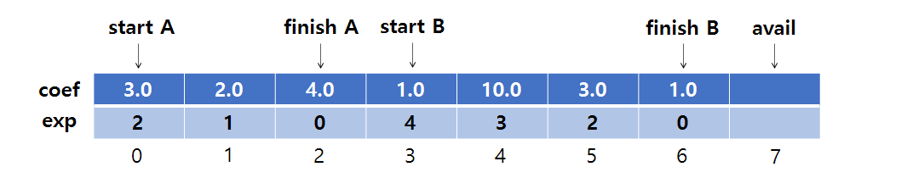
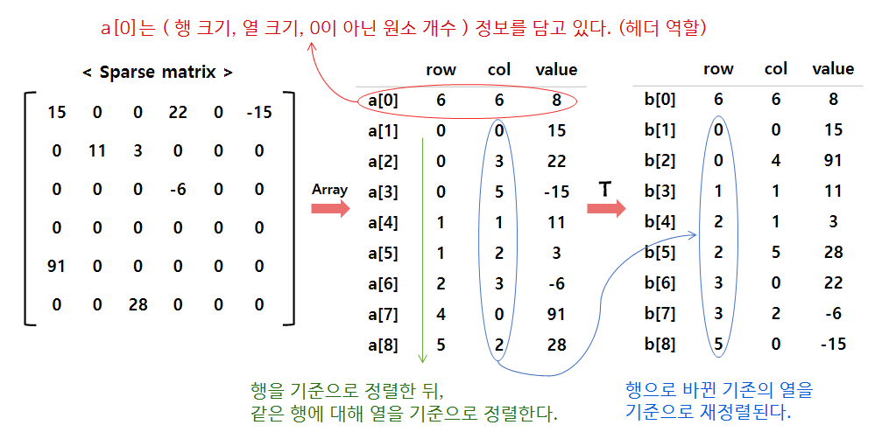
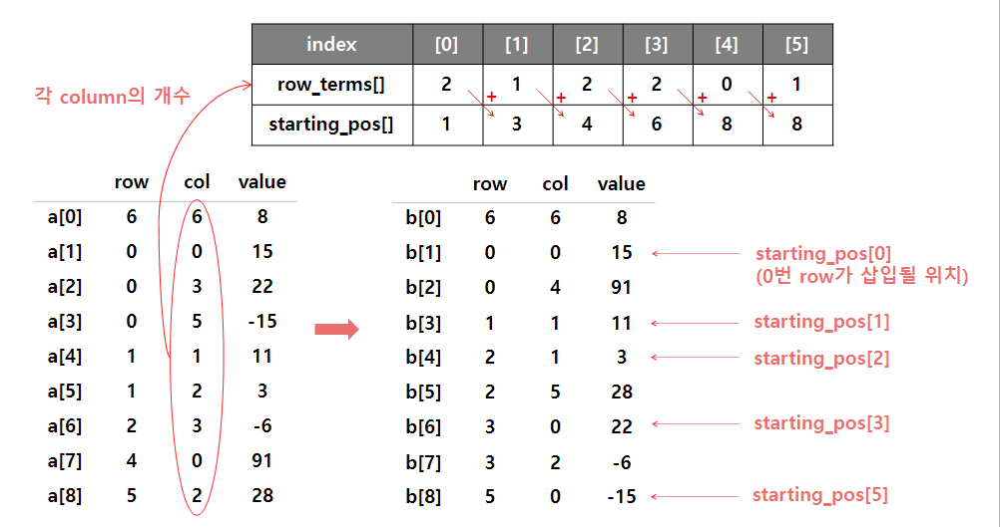
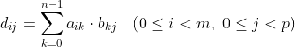
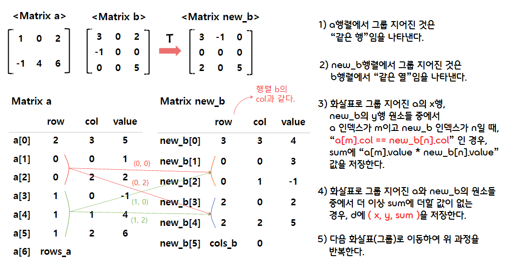
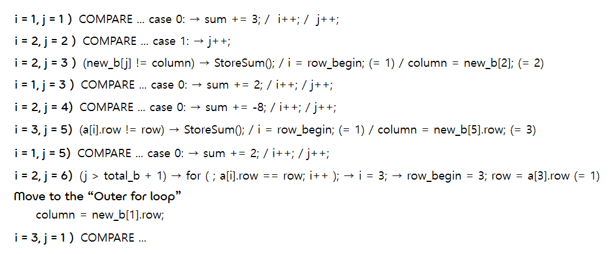
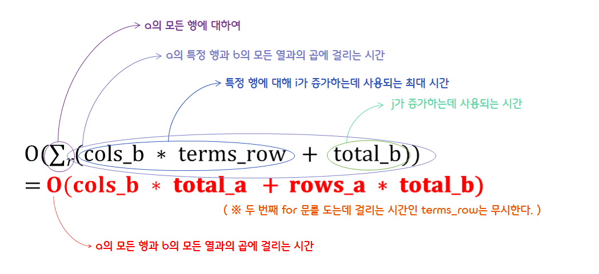

0.Practice
===  

## ✔️ 1. The Polynomials  

<p align="center"></p>  

- Polynomial ADT를 구현하기 위해 배열(Array)를 사용한다.
- 다항식을 나타내기 위해 다음과 같은 2가지 방법을 생각해볼 수 있다.  

    - (1) 계수 전체를 배열에 저장하는 방법  
        ```c
        #define MAX_DEGREE 101  // x^100 ~ x^0 까지 표현할 수 있다.
        
        typedef struct {
            int degree;             // 최고차항의 차수
            float coef[MAX_DEGREE]  // 계수를 담을 배열
        } polynomial;
        ```

    - (2) 차수와 계수 데이터를 갖는 구조체를 배열에 저장하는 방법  
        ```c
        #define MAX_TERMS 100  // 최대 100개의 항이 들어갈 수 있다.

        typedef struct {
            float coef;
            int expon;
        } polynomial;

        polynomial terms[MAX_TERMS]  // polynomial 구조체 배열
        int avail = 0;               // 추가될 항의 위치를 가리키는 인덱스 변수
        ```  

### - Polynomial Representation 1 (계수 전체를 배열로 저장하는 경우)  

```c
#include <stdio.h>
#include <stdlib.h>
#include <string.h>

#define MAX_DEGREE 101
/* a와 b 중에서 더 큰 값을 반환한다. */
#define MAX(a, b) (((a) > (b)) ? (a) : (b))  
/* a와 b의 대소 관계를 비교한다. */
#define COMPARE(a, b) (((a) > (b)) ? 1 : ((a) == (b)) ? 0 : -1)
/* 다항식 a의 차수가 0보다 작으면, a에 더 이상 남은 항이 없다고 판단한다. */
#define IsZero(a) ((a.degree < 0) ? 1 : 0)   


typedef struct polynomial {
    int degree;
    float coef[MAX_DEGREE];
} polynomial;


/* 최고차항의 차수와 계수가 모두 0으로 초기화된 polynomial 구조체를 반환한다. */
struct polynomial Zero() {
    struct polynomial a = { .degree = 0, .coef = { 0, } };
    return a;
}


/* 최고차항을 그 다음 항으로 변경한 후 반환한다. (= 삭제) */
polynomial Remove(polynomial a, int deg) {
    do {
        deg--;
        if (deg < 0) { break; }  // 남은 항이 없는 경우 종료한다.
    } while (a.coef[deg] == 0);  // 계수가 0이 아닌 항이 나올 때까지 반복한다.
    a.degree = deg;              // 다항식 a의 최고차항의 차수를 변경한다.
    return a;
}


/* 최고차항의 차수를 반환한다. */
int Lead_Exp(struct polynomial a) {
    return a.degree;
}


/* 차수가 deg인 항의 계수를 반환한다. */
float Coef(polynomial a, int deg) {
    return a.coef[deg];
}


/* 다항식 a에 계수가 coef이고, 차수가 deg인 단항식을 더해준다. */
polynomial Attach(polynomial a, float coef, int deg) {
    if (a.degree == 0)   // 항이 없는 경우 (최고차항의 차수가 0인 경우)
        a.degree = deg;  // 최고차항으로 설정한다.
    a.coef[deg] = coef;
    return a;
}


/* 다항식을 시각화한다. */
void Poly_show(polynomial a) {
    for (int i = a.degree; i >= 0; i--)
    {
        if (i == a.degree && a.coef[i] != 0)   // 최고차항이 존재하는 경우
            printf("%.1fx^%d", a.coef[i], i);
        else if (a.coef[i] != 0)               // 계수가 0이 아닌 경우
        {
            if (i == 0)                        // 상수항인 경우
                printf(" + %.1f", a.coef[i]);
            else
                printf(" + %.1fx^%d", a.coef[i], i);
        }
    }
    printf("\n");
}


// 다항식 a와 b를 더해 만든 다항식을 반환한다.
polynomial Poly_add(polynomial a, polynomial b) {
    polynomial c = Zero();

    while (!IsZero(a) && !IsZero(b))
    {
        switch ( COMPARE(Lead_Exp(a), Lead_Exp(b)) )
        {
            case -1:  // a의 차수 < b의 차수
            {
                c = Attach(c, Coef(b, Lead_Exp(b)), Lead_Exp(b));  // c에 b의 최고차항을 더해준다.
                b = Remove(b, Lead_Exp(b));                        // b의 최고차항을 삭제한다.
                break;
            }
            case 0:  // a의 차수 == b의 차수
            {
                float coef_sum = Coef(a, Lead_Exp(a)) + Coef(b, Lead_Exp(b));  
                if (coef_sum)  // 두 항의 계수의 합이 0이 아닌 경우
                    c = Attach(c, coef_sum, Lead_Exp(a));
                a = Remove(a, Lead_Exp(a));
                b = Remove(b, Lead_Exp(b));
                break;
            }
            case 1:  // a의 차수 > b의 차수
            {
                c = Attach(c, Coef(a, Lead_Exp(a)), Lead_Exp(a));
                a = Remove(a, Lead_Exp(a));                        
                break;
            }
        }
    }
    
    // 다항식 a와 b에서 아직 남아있는 항 추가
    while(!IsZero(a)) 
    {
        c = Attach(c, Coef(a, Lead_Exp(a)), Lead_Exp(a));
        a = Remove(a, Lead_Exp(a));
    }
    while(!IsZero(b))
    {
        c = Attach(c, Coef(b, Lead_Exp(b)), Lead_Exp(b));
        b = Remove(b, Lead_Exp(b));
    }

    return c;
}


int main() {
    // 다항식 초기화
    struct polynomial a = Zero();
    struct polynomial b = Zero();
    struct polynomial c = Zero();

    // 다항식 a, b 설정
    a.degree = 2;
    b.degree = 4;
    a.coef[2] = 3.0f;
    a.coef[1] = 2.0f;
    a.coef[0] = 4.0f;
    b.coef[4] = 1.0f;
    b.coef[3] = 10.0f;
    b.coef[2] = 3.0f;
    b.coef[0] = 1.0f;

    c = Poly_add(a, b);

    printf("A(x) : ");
    Poly_show(a);
    printf("B(x) : ");
    Poly_show(b);
    printf("C(x) : ");
    Poly_show(c);

    return 0;
}
```  

```bash
A(x) : 3.0x^2 + 2.0x^1 + 4.0
B(x) : 1.0x^4 + 10.0x^3 + 3.0x^2 + 1.0
C(x) : 1.0x^4 + 10.0x^3 + 6.0x^2 + 2.0x^1 + 5.0
```  

### - Polynomial Representation 2 (polynomial 구조체를 배열에 저장하는 방법)  

<p align="center"></p>  

```c
#include <stdio.h>
#include <stdlib.h>
#include <string.h>

#define MAX_TERMS 100
#define COMPARE(a, b) (((a) > (b)) ? 1 : ((a) == (b)) ? 0 : -1)


typedef struct polynomial {
    float coef;
    int expon;
} polynomial;


/* start가 가리키는 위치부터 end까지 저장된 다항식을 시각화한다. */
void Poly_show(polynomial terms[], int start, int end) {
    for (int i = start; i < end; i++)   // 마지막 항은 출력하지 않는다.
        printf("%.1fx^%d + ", terms[i].coef, terms[i].expon);
    if (terms[end].expon == 0)          // 마지막 항이 상수항인 경우
        printf("%.1f\n", terms[end].coef);
    else                                // 상수항이 아닌 경우
        printf("%.1fx^%d\n", terms[end].coef, terms[end].expon);
}


/* 계수가 coef이고, 차수가 expon인 단항식을 avail이 가리키는 위치에 저장한다. */
void Attach(polynomial* terms, float coef, int expon, int* avail) {
    if (*avail > MAX_TERMS)  // 배열에 남는 공간이 없는 경우
    {
        fprintf(stderr, "항 개수가 많음");
        exit(1);
    }
    terms[*avail].coef = coef;
    terms[*avail].expon = expon;
    (*avail)++;  // ※ 괄호 사용을 주의한다.
}


/* 다항식 a와 b를 더해 만든 다항식을 avail이 가리키는 위치부터 저장한다. */
void Padd(polynomial* terms, int startA, int finishA, int startB, int finishB, int* startC, int* finishC, int* avail) {
    float coefficient;
    *startC = *avail;

    while (startA <= finishA && startB <= finishB)
    {
        switch (COMPARE(terms[startA].expon, terms[startB].expon))
        {
            case -1:
            {
                Attach(terms, terms[startB].coef, terms[finishB].coef, avail);
                startB++;
                break;
            }
            case 0:
            {
                coefficient = terms[startA].coef + terms[startB].coef;
                if (coefficient)
                    Attach(terms, coefficient, terms[startA].expon, avail);
                startA++;
                startB++;
                break;
            }
            case 1:
            {
                Attach(terms, terms[startA].coef, terms[startA].expon, avail);
                startA++;
                break;
            }
        }
    }

    // 다항식 a와 b에서 아직 남아있는 항 추가
    for ( ; startA <= finishA; startA++)
        Attach(terms, coefficient, terms[startA].expon, avail);

    for ( ; startB <= finishB; startB++)
        Attach(terms, coefficient, terms[startA].expon, avail);
    
    *finishC = *avail - 1;  // 다항식 c가 정의된 마지막 위치를 저장한다.
}


int main() {
    // terms가 항의 배열로, 각 항이 {coef, exp} 형태
    polynomial terms[MAX_TERMS] = { {3,2}, {2,1}, {4,0}, {1,4}, {10,3}, {3,2}, {1,0} };
    int avail = 7;  // 추가될 항의 위치를 가리키는 인덱스 변수
    int startA = 0, finishA = 2, startB = 3, finishB = 6, startC, finishC;

    Padd(terms, 0, 2, 3, 6, &startC, &finishC, &avail);

    printf("A(x) : ");
    Poly_show(terms, startA, finishA);
    printf("B(x) : ");
    Poly_show(terms, startB, finishB);
    printf("C(x) : ");
    Poly_show(terms, startC, finishC);

    return 0;
}
```  

```bash
A(x) : 3.0x^2 + 2.0x^1 + 4.0
B(x) : 1.0x^4 + 10.0x^3 + 3.0x^2 + 1.0
C(x) : 1.0x^4 + 10.0x^3 + 6.0x^2 + 2.0x^1 + 5.0
```  

## ✔️2. Sparse matrix(희소행렬)
- 희소행렬은 행렬의 값이 대부분 0인 경우를 가리키는 표현이다.
- 희소행렬은 <row, col, value> 값을 멤버로 갖는 구조체 배열로 나타낼 수 있다.
- 우선적으로 행을 기준으로 정렬하고, 그 다음으로 열을 기준으로 정렬한다.
    - 구조체 멤버 row를 기준으로 하여 원소들이 오름차순으로 정렬되어 있다.
    - 이때 row가 같은 원소들은 column을 기준으로 오름차순으로 정렬되어 있다.  

- 코드 구현  

    ```c
    #define MAX_TERMS 101  // 0번째 요소는 헤더이므로, 최대 100개의 데이터를 저장할 수 있다.

    /* <col, row, value> 데이터을 저장하는 구조체. 
    희소행렬 배열의 element로 들어간다. */
    typedef struct {
        int col;
        int row;
        int value;
    } term;

    term a[MAX_TERMS];  // 희소행렬 a
    term b[MAX_TERMS];  // 희소행렬 b
    ```

<p align="center"></p>  

### - Transposing a matrix (1)  
- a행렬(배열)의 Transpose를 구하는 방법
    - (1) a배열을 선형 탐색하며 column이 0인 원소들을 찾아 b배열의 1번 인덱스부터 차례대로 넣는다.
    - (2) 이때 a의 column은 b의 row로, a의 row는 b의 column이 되도록 서로 바꾸어 넣는다.
    - (3) (col - 1)번째 column까지 위 과정을 반복한다.  

- Transpose 결과
    - 위 방법에 의해 a의 0부터 (col - 1)번째 column이 순서대로 b의 row가 되었기 때문에, b의 row는 오름차순으로 정렬된다. 
    - a에서 column이 같을 때, row가 오름차순으로 정렬되어 있었기 때문에, b에서도 같은 row에 대해 column이 오름차순으로 정렬된다.  

- 코드 구현

    ```c
    /* a의 전치행렬을 b에 저장한다. */
    void Transpose(term a[], term b[])
    {
        int n, i, j, current_b;  // current_b : b행렬에 데이터가 저장될 위치
        n = a[0].value;
        b[0].row = a[0].col;
        b[0].col = a[0].row;
        b[0].value = n;

        if (n > 0) {
            current_b = 1;
            for (i = 0; i < a[0].col; i++)
            {
                for (j = 1; j <= n; j++)
                {
                    if (a[j].col == i)
                    {
                        b[current_b].col = a[j].row;
                        b[current_b].row = a[j].col;
                        b[current_b].value = a[j].value;
                        current_b++;
                    }  
                }
            }
        }
    }
    ```  

- Analysis of Transposing
    - ※ 위 알고리즘은 "O(terms * columns)"의 시간복잡도를 갖는다.  
    (최대 : terms = rows * columns)  

### - Transposing a matrix (2) - FastTranspose  

<p align="center"></p>  

- 각 column의 개수를 기억했다가, 이를 Transpose 이후 데이터를 넣을 위치 인덱스로 사용한다.  

- 코드 구현

    ```c
    /* Transpose를 더 작은 시간복잡도로 처리하는 함수 */
    void FastTranspose(term a[], term b[])
    {
        int row_terms[MAX_COL];     // row의 개수를 원소로 갖는 배열
        int starting_pos[MAX_COL];  // element가 추가될 위치 인덱스를 원소로 갖는 배열
        int i, j, num_cols = a[0].col, num_terms = a[0].value;
        
        b[0].row = num_cols;
        b[0].col = a[0].row;
        b[0].value = num_terms;

        if (num_terms > 0)
        {
            for (i = 0; i < num_cols; i++)  // 0으로 초기화한다.
                row_terms[i] = 0;

            // a배열을 선형 탐색하며 나온 i 번째 column의 개수를 row_terms배열에 저장한다.
            for (i = 1; i <= num_terms; i++)  
                row_terms[a[i].col]++;

            // i 번째 row를 배열에 넣을 때의 시작 인덱스를 starting_pos배열에 저장한다.
            starting_pos[0] = 1;
            for (i = 1; i < num_cols; i++)
                starting_pos[i] = starting_pos[i - 1] + row_terms[i - 1];

            // Transpose를 진행하며 위치 인덱스에 알맞게 원소를 배열에 넣는다.
            for (i = 1; i <= num_terms; i++) {
                j = starting_pos[a[i].col]++;
                b[j].row = a[i].col;
                b[j].col = a[i].row;
                b[j].value = a[i].value;
            }
        }
    }
    ```

- Analysis of FastTransposing
    - 위 알고리즘은 "O(terms + columns)"의 시간복잡도를 갖는다.  
    (최대 : terms = rows * columns)  

### - Matrix multiplication
- 정의 : 행렬 a[m x n]와 행렬 b[n x p]에 대해 product matrix d는 m x p의 차원을 갖고,  
그 원소 <i, j>의 값은 다음과 같다.  

<p align="center"></p>  

- 일반적인 행렬의 곱셈 연산은 다음과 같은 알고리즘으로 구현한다.
    ```c
    for (i = 0; i < rows_a; i++)
        for (j = 0; j < cols_b; j++)
        {
            sum = 0;
            for (k = 0; k < cols_a; k++)
                sum += a[i][k] * b[k][j];
            d[i][j] = sum;
        }
    ```  

- Sparse matrix의 경우, 위와 같은 방법을 사용하는 것은 비효율적이므로,  
아래와 같이 행렬의 곱셈 연산을 구현한다.

    ```c
    #include <stdio.h>
    #include <stdlib.h>

    #define COMPARE(x, y) (((x) > (y)) ? 1 : ((x) == (y)) ? 0 : -1)
    #define MAX_TERMS 101
    #define MAX_COL 101
    #define EXIT_FAILURE 1


    typedef struct {
        int col;
        int row;
        int value;
    } term;

    term a[MAX_TERMS]; 
    term b[MAX_TERMS]; 
    term d[MAX_TERMS];  // a와 b의 multiplication 결과를 d에 저장한다.


    / * Transpose 함수 */
    void FastTranspose(term a[], term b[])
    {
        // a를 transpose하여 b에 저장한다.
    }


    /* d행렬에 <row, col, sum> 데이터를 저장한 뒤, sum을 0으로 초기화한다. */
    void StoreSum(term d[], int *total_d, int row, int column, int* sum) {
        
        // *sum 값이 0이 아니면, (*total_d + 1)번째 인덱스에 데이터를 저장한다.
        if (*sum)
        {
            if (*total_d < MAX_TERMS)
            {
                d[++*total_d].row = row;
                d[*total_d].col = column;
                d[*total_d].value = *sum;
                *sum = 0;
            }
            else
            {
                fprintf(stderr, "Numbers of terms in product exceeds %d\n", MAX_TERMS);
                exit(EXIT_FAILURE);
            }
        }
    }


    /* a, b 행렬의 곱으로 행렬 d를 만든다. */
    void MMult(term a[], term b[], term d[])
    {
        // 변수가 헷갈려서 구구절절 적어보았다..
        int i, j;       

        int sum = 0;         // a행렬의 특정 행과 b행렬의 특정 열을 곱했을 때의 value의 누적 합
        int row_begin = 1;   // a행렬에서 반복문이 시작될 row 인덱스
        int row = a[1].row;  // a행렬에서 기존 row 값 (row값이 바뀌었는지 비교할 때 사용)

        // int new_b[MAX_TERMS][3]; ← 책에 적혀있던 코드
        term new_b[MAX_TERMS];  // b의 전치 행렬 (위의 코드 수정)
        int column;             // new_b행렬에서 기존 row 값 (b행렬의 col에 해당)

        int total_d = 0;     // 행렬 d의 0이 아닌 원소 개수 (데이터를 저장할 때 인덱스로 사용)
        
        // 행 개수, 열 개수, 0이 아닌 원소의 개수
        int rows_a = a[0].row, cols_a = a[0].col, total_a = a[0].value;
        int rows_b = b[0].row, cols_b = b[0].col, total_b = b[0].value;

        // a행렬의 열의 개수와 b행렬의 행의 개수가 일치하지 않는 경우
        if (cols_a != b[0].row)
        {
            fprintf(stderr, "Incompatible matrices");
            exit(EXIT_FAILURE);
        }

        FastTranspose(b, new_b);

        // set boundary condition (경계조건)
        a[total_a + 1].row = rows_a;
        new_b[total_b + 1].row = cols_b;
        new_b[total_b + 1].col = 0;

        for (i = 1; i < total_a; )
        {
            column = new_b[1].row;
            for (j = 1; j <= total_b + 1; )
            {
                // a행렬에서 row값이 기존 row값과 달라진 경우
                if (a[i].row != row)              
                {
                    StoreSum(d, &total_d, row, column, &sum);
                    i = row_begin;
                    for (; new_b[j].row == column; j++)
                        ;
                    column = new_b[j].row;
                }
                // new_b행렬에서 row값이 기존 row값과 달라진 경우 (b행렬의 col)
                else if (new_b[j].row != column)  
                {
                    StoreSum(d, &total_d, row, column, &sum);
                    i = row_begin;
                    column = new_b[j].row;
                }
                else 
                {   // a와 new_b의 col 값을 비교한다.
                    switch (COMPARE(a[i].col, new_b[j].col))
                    {
                        case -1: // new_b가 더 큰 경우
                            i++; break;
                        case 0:  // 서로 같은 경우
                            sum += ( a[i++].value * new_b[j++].value ); break;
                        case 1:  // a가 더 큰 경우
                            j++;
                    }

                }
            }
            // 기존 row와 다른 row값이 나올 때까지 반복한다.
            for (; a[i].row == row; i++)
                ;
            // 반복문의 시작될 row 인덱스를 i로 변경하고, 기존 row값을 새로운 row값으로 변경한다.
            row_begin = i; row = a[i].row;
        }
        // d[0]에 d행렬의 <행 개수, 열 개수, 0이 아닌 원소 개수> 데이터를 넣는다.
        d[0].row = rows_a;
        d[0].col = cols_b;
        d[0].value = total_d;
    }
    ```

<p align="center"></p> 

- 반복문에서 i와 j에 따른 코드의 흐름은 아래와 같다.

<p align="center"></p> 

- Analysis of Multiplication  
    - 위 알고리즘은 "*O(cols_b * total_a + rows_a * total_b)"의 시간복잡도를 갖는다.  
        ※ terms_row : a행렬에서 현재 행에 포함되는 element 개수 (ex) 위의 경우 0행 2개, 1행 3개
    
    <p align="center"></p> 
        

