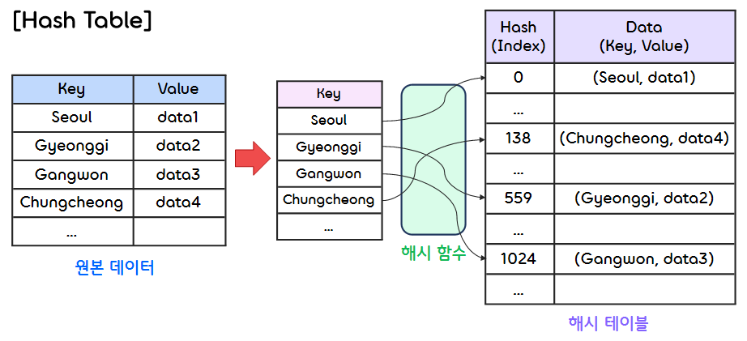
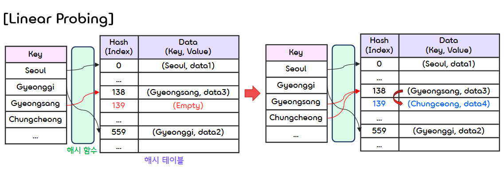
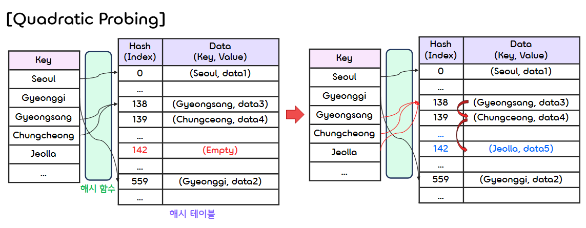
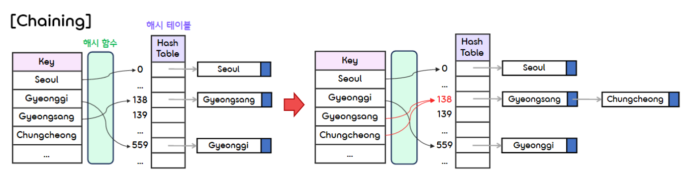

10.Hashing
===

## < _Contents_ >

- [1. Hashing](#%EF%B8%8F-1-hashing)

---

## ✔️ 1. **Hashing**

### 1) **Definitions**
- (1) **Hashing(해싱)**
    - **해싱(Hashing)** 이란 **키(Key)** 값을 **해시 함수(Hash Function)** 라는 수식에 대입시켜 계산한 결과인 **해시(Hash)** 를 테이블의 주소로 사용하여, 값에 바로 접근하게 할 수 있는 방법을 말한다.
    - 이론적으로, 해싱을 사용하면 딕셔너리(Dictionary)의 탐색(search), 삽입(insert), 삭제(delete) 연산을 $O(1)$에 할 수 있다.  

</br>

- (2) **Key(키)**
    - **키(Key)** 는 데이터의 탐색, 삽입, 삭제를 위한 입력 데이터를 말한다.
    - 키는 해시 함수에 대입되어 해시 코드로 계산된다. (실제 테이블에 저장되는 데이터는 별개!)  

</br>

- (3) **Hash Function(해시 함수)**
    - **해시 함수(Hash Function)** 는 임의의 길이의 데이터를 고정된 길이의 데이터로 **매핑(Mapping)** 하는 함수이다.  
    - 해시 함수에 입력하는 데이터가 같으면, 이에 대응되는 출력값(해시, Hash)은 무조건 같다.  
    - 이때, 해시 함수에 입력하는 데이터가 달라도 출력되는 값은 같을 수 있다. (해시 충돌, Hash collision)  
    - 대표적으로 Division Method, Digit Folding, Multiplication Method, Universal Hashing 등의 방법이 있다.  

</br>

- (4) **Hash(해시)**
    - 해시(Hash) 란 임의의 길이를 가진 데이터를 고정된 길이를 가진 데이터로 매핑(Mapping)한 값이다.
    - 어떤 값들을 해시로 변환하면 기존의 값을 알아볼 수 없게 되는데, 이러한 특성 때문에 암호화에 매우 유용하게 사용된다.  
    (ex SHA(Secure Hash Algorithm) 암호화 알고리즘)

</br>

- (5) **Hash Table(해시 테이블)**
    - **해시 테이블(Hash Table)** 이란 해시 함수를 사용하여 키(Key)를 해시(Hash)로 매핑하고, 이 해시를 인덱스(Index) 혹은 주소 삼아 데이터의 값(value)을 키와 함께 저장하는 자료구조이다.
    - 해시 테이블을 사용하면 직접 주소 테이블(Direct Address Table)의 공간 낭비 문제를 해결할 수 있다.
    - 해시 테이블의 기본 연산으로는 탐색(Search), 삽입(Insert), 삭제(Delete)가 있다.  
    (이론적으로 위 연산들은 $O(1)$에 가능하다!)
    - 키 값들이 해시 테이블에 저장될 때 위치가 겹치는 경우(Collision), 여러 방법으로 이를 해결할 수 있다.  
    <p align="center"></p>  

</br>

### 2) **Hash Collision**
- **해시 충돌(Hash Collision)** 이란 해시 함수가 서로 다른 입력값(Key)들에 대해 동일한 출력값(Hash)을 내는 상황을 말한다.
- 해시 함수가 무한한 가짓수의 입력값을 받아 유한한 가짓수의 출력값을 생성하는 경우, 비둘기집 원리(Pigeonhole Principle)에 의해 해시 충돌은 항상 존재하게 된다.
- 해시 충돌은 해시 함수를 이용한 자료구조나 알고리즘의 효율성을 떨어뜨리며, 따라서 해시 함수는 해시 충돌이 자주 발생하지 않도록 구성되어야 한다.
- 해시 충돌이 발생하면, 해시 테이블의 버킷(Bucket)의 크기를 넘어서는 데이터를 저장해야 하는 상황이 생기는데, 이를 **버킷 오버플로우(Bucket Overflow)** 라고 한다.
- 이러한 오버플로우 문제를 해결하기 위해선 아래와 같은 방법들을 사용한다. 

</br>  

### 3) **Open Addressing**
- **개방 주소법(Open Addressing)** 이란 현재 사용되고 있지 않은 빈 공간(버킷)을 찾아 데이터를 저장하는 방법을 말한다.
- 이때, 해시 빈 공간을 찾는 방법으로는 **선형 조사법(Linear Probing)** , **이차 조사법(Quadratic Probing)** , **이중 해싱법(Double Hashing)** 등이 있다.  

</br>

- (1) **Linear Probing(선형 조사법)**
    - **선형 조사법(Linear Probing)** 이란, 해시 충돌이 발생했을 때, 그 옆자리(버킷)가 비었는지 살펴보고, 비어 있을 경우 그 자리에 대신 데이터를 저장하는 방식을 말한다.
    - 계산이 단순하다는 장점이 있지만, 검색에 시간이 많이 소요되고, 테이블 내에 데이터들이 일정한 키 값으로 모이는 군집화 현상이 발생하게 된다.  
    - 조사 위치 : $(\text{ }h(k)\text{ }+\text{ }i\text{ })\text{ }mod\text{ }M \quad (i = 0, 1, 2, ...)$
    <p align="center"></p> 

</br>

- (2) **Quadratic Probing(이차 조사법)**
    - **이차 조사법(Quadratic Probing)** 은 선형 조사법과 유사하지만, 조사 위치를 구하는 식에 약간의 변형을 주어 군집화를 완화시킨 방법이다.
    - 조사 위치 : $(\text{ }h(k)\text{ }+\text{ }i*i\text{ })\text{ }mod\text{ }M \quad (i = 0, 1, 2, ...)$ 
    <p align="center"></p>  

</br>

- (3) **Doubly Hashing(이중 해싱법)**
    - 이차 조사법은 선형 조사법의 문제점을 어느 정도 해결했지만, 여전히 해시 충돌 시 빈 버킷을 찾기 위해 접근하는 위치가 늘 동일하다는 문제점을 갖는다.
    - **이중 해싱법(Doubly Hashing)** 은 이 빈 공간 탐색을 좀 더 불규칙하게 만들기 위한 조사 방법이다.  
    - 이중 해싱법은 데이터를 저장할 다음 위치를 결정할 때, 원래 해시 함수와 다른 별개의 해시 함수를 이용한다.
        - ① 1차 해시 함수는 키를 근거로 저장 위치를 결정하기 위해 사용된다.
        - ② 2차 해시 함수는 충돌 발생 시 몇 칸 뒤의 버킷을 살필지 결정하기 위해 사용된다.
    - 조사 위치 : $(\text{ }h(k)\text{ }+\text{ }step*i\text{ })\text{ }mod\text{ }M \quad (i = 0, 1, 2, ...)$
    - step (2차 해시 함수) : $C\text{ }-\text{ }(\text{ }k\text{ }mod\text{ }C\text{ })$  
        - 여기서 $C$는 보통 테이블의 크기인 $M$보다 약간 작은 소수이다.
        - 소수를 사용하는 이유는, 통계적으로 소수를 사용했을 때 충돌 확률이 작다고 알려져 있기 때문이다.
    - 같은 해시 값과 같은 탐색 순서를 갖는 요소들이 거의 없기 때문에, 이중 해싱법을 사용할 경우 집중 현상은 매우 드물게 나타나게 된다.  

</br>  

- 연습 코드 (Linear Probing)
    ```c
    #include <stdio.h>
    #include <stdlib.h>
    #include <string.h>

    #define KEY_SIZE 10
    #define TABLE_SIZE 13
    #define empty(e) (strlen(e.key) == 0)
    #define equal(e1, e2) (!strcmp(e1.key, e2.key))


    /* ListNode에 저장되는 데이터 */
    typedef struct Element {
        char key[KEY_SIZE];
        // 값(value)은 여기에 추가
    } Element;

    Element hashTable[TABLE_SIZE];
    void initTable(Element ht[]);
    int transform(char *key);
    int hashFunction(char *key);
    void addHashTable(Element item, Element ht[]);
    void hashSearch(Element item, Element ht[]);
    void printHashTable(Element ht[]);
    ```
    ```c
    int main()
    {
        Element temp;
        int op;

        while (1) {
            printf("연산 입력 (0: 추가, 1: 탐색, 2: 출력, 3: 종료) = ");
            scanf("%d", &op);

            if (op == 3) break;
            if (op == 2) printHashTable(hashTable);
            else {
                printf("키 입력: ");
                scanf("%s", temp.key);

                if (op == 0)
                    addHashTable(temp, hashTable);
                else if (op == 1)
                    hashSearch(temp, hashTable);
            }
        }

        return 0;
    }
    ```
    ```c
    /* 해시 테이블을 초기화 하는 함수 */
    void initTable(Element ht[])
    {
        int i;
        for (i = 0; i < TABLE_SIZE; i++)
            ht[i].key[0] = '0';
    }
    ```
    ```c
    /* 입력 받은 문자열에서 각 문자의 아스키 코드값을 합하여 반환하는 함수 */
    int transform(char *key) {
        int i;
        int number =  0;
        int size = strlen(key);

        // 문자열에서 각 문자의 아스키 코드값의 합
        for (i = 0; i < size; i++)
            number = number + key[i];
        return number;
    }


    /* 입력 받은 키 값을 해시로 변환하여 반환하는 함수 */
    int hashFunction(char *key)
    {
        return transform(key) % TABLE_SIZE;
    }
    ```
    ```c
    /* 해당 키 값을 갖는 새로운 데이터를 해시 테이블에 추가하는 함수 */
    void addHashTable(Element item, Element ht[])
    {
        int i, hashValue;
        i = hashValue = hashFunction(item.key);

        while (!empty(ht[i])) {
            if (equal(ht[i], item)) {
                printf("중복 삽입 에러\n");
                return;
            }
            // 해시 충돌 시, 해당 버킷이 가득 차 있으면 다음 버킷으로 이동한다.
            else
                i = (i + 1) % TABLE_SIZE;

            if (i == hashValue) {
                printf("배열이 가득 찼습니다.");
                return;
            }
        }
        ht[i] = item;
    }
    ```
    ```c
    /* 해당 키 값을 갖는 데이터가 해시 테이블에 존재하는지 탐색하는 함수 */
    void hashSearch(Element item, Element ht[])
    {
        int i, hashValue;
        i = hashValue = hashFunction(item.key);

        while (!empty(ht[i]))
        {
            if (equal(ht[i], item)) {
                printf("탐색 성공 (%s)\n", item.key);
                return;
            }
            else i = (i + 1) % TABLE_SIZE;
            
            if (i == hashValue || empty(ht[i])) {
                printf("탐색 실패 (%s)\n", item.key);
                return;
            }
        }
    }
    ```
    ```c
    /* 해시 테이블에 있는 모든 데이터를 출력하는 함수 */
    void printHashTable(Element ht[])
    {
        int i;
        for (i = 0; i < TABLE_SIZE; i++)
        {
            printf("[%2d]    %s\n", i, ht[i].key);
        }
    }
    ```  
    ```
    연산 입력 (0: 추가, 1: 탐색, 2: 출력, 3: 종료) = 0
    키 입력: do
    연산 입력 (0: 추가, 1: 탐색, 2: 출력, 3: 종료) = 0
    키 입력: for
    연산 입력 (0: 추가, 1: 탐색, 2: 출력, 3: 종료) = 0
    키 입력: if
    연산 입력 (0: 추가, 1: 탐색, 2: 출력, 3: 종료) = 0
    키 입력: case
    연산 입력 (0: 추가, 1: 탐색, 2: 출력, 3: 종료) = 0
    키 입력: else
    연산 입력 (0: 추가, 1: 탐색, 2: 출력, 3: 종료) = 0
    키 입력: return
    연산 입력 (0: 추가, 1: 탐색, 2: 출력, 3: 종료) = 0
    키 입력: function
    연산 입력 (0: 추가, 1: 탐색, 2: 출력, 3: 종료) = 0
    키 입력: key
    연산 입력 (0: 추가, 1: 탐색, 2: 출력, 3: 종료) = 0
    키 입력: value
    연산 입력 (0: 추가, 1: 탐색, 2: 출력, 3: 종료) = 2
    [ 0]    function
    [ 1]
    [ 2]    for
    [ 3]    do
    [ 4]    key
    [ 5]
    [ 6]
    [ 7]
    [ 8]    value
    [ 9]    case
    [10]    else
    [11]    return
    [12]    if
    연산 입력 (0: 추가, 1: 탐색, 2: 출력, 3: 종료) = 1
    키 입력: else
    탐색 성공 (else)
    연산 입력 (0: 추가, 1: 탐색, 2: 출력, 3: 종료) = 1
    키 입력: switch
    탐색 실패 (switch)
    연산 입력 (0: 추가, 1: 탐색, 2: 출력, 3: 종료) = 3
    ```  

</br>

- (4) **Rehashing(재해싱)**
    - 해시 테이블에 저장되는 데이터가 많아지면, 해시 충돌이 자주 발생하게 되어 해시 테이블의 성능이 떨어지게 된다.
    - 이러한 경우, **재해싱(Rehashing)** 을 통해 해시 테이블의 크기를 늘리고, 새로운 해시 테이블의 크기에 맞추어 다시 모든 데이터를 새롭게 해싱해 주어야 한다.  
    (이 과정에서 많은 (시간적) 비용이 발생할 수 있다.)  

</br>

### 4) **Chaining**
- 개방 주소법의 경우, 해시 충돌 발생 시, 버킷에 모든 슬롯이 가득 차 있으면 비어 있는 다른 버킷을 찾아가야 한다.
- **체이닝(Chaining)** 은 비어 있는 다른 버킷을 찾아가지 않고, 어떻게든 해당 버킷에 데이터를 추가하는 방식이다.
- 해시 테이블 자체는 포인터 배열로 만들고, 같은 버킷에 해당하는 데이터들은 연결 리스트(Linked List)를 사용하여 체인 형식으로 만들어 연결한다.
    <p align="center"></p> 

</br>

- 연습 코드 (Chaining)
    ```c
    #include <stdio.h>
    #include <stdlib.h>
    #include <string.h>

    #define KEY_SIZE 10
    #define VALUE_SIZE 10
    #define TABLE_SIZE 5
    #define equal(e1, e2) (!strcmp(e1.key, e2.key))


    /* ListNode에 저장되는 데이터(키, 값) */
    typedef struct Element {
        char key[KEY_SIZE];
        char value[VALUE_SIZE];
    } Element;

    /* 해시테이블의 버킷에 체인 형태로 연결되는 노드 */
    typedef struct ListNode {
        Element item;
        struct ListNode *link;
    } ListNode;

    ListNode *hashTable[TABLE_SIZE];
    void initTable(ListNode* ht[]);
    int transform(char *key);
    int hashFunction(char *key);
    void addHashTable(Element item, ListNode *ht[]);
    void searchHashTable(Element item, ListNode *ht[]);
    void printHashTable(ListNode *ht[]);
    ```
    ```c
    int main()
    {
        Element temp;
        int op;

        while(1) {
            printf("연산 입력 (0: 추가, 1: 탐색, 2: 출력, 3: 종료) = ");
            scanf("%d", &op);

            if (op == 3) break;
            if (op == 2) printHashTable(hashTable);
            else {
                printf("키(Key) 입력 : ");
                scanf("%s", temp.key);
                
                if (op == 0) {
                    printf("값(Value) 입력 : ");
                    scanf("%s", temp.value);

                    addHashTable(temp, hashTable);
                }
                else if (op == 1) 
                    searchHashTable(temp, hashTable);
            }
        }

        return 0;
    }
    ```
    ```c
    /* 해시 테이블을 초기화 하는 함수 */
    void initTable(ListNode* ht[])
    {
        int i;
        for (i = 0; i < TABLE_SIZE; i++)
            ht[i] = NULL;
    }
    ```
    ```c
    /* 입력 받은 문자열에서 각 문자의 아스키 코드값을 합하여 반환하는 함수 */
    int transform(char *key) 
    {
        int i;
        int sum =  0;
        int size = strlen(key);

        // 문자열에서 각 문자의 아스키 코드값의 합
        for (i = 0; i < size; i++)
            sum = sum + key[i];
        return sum;
    }


    /* 입력 받은 키 값을 해시로 변환하여 반환하는 함수 */
    int hashFunction(char *key) 
    {
        return transform(key) % TABLE_SIZE;
    }
    ```
    ```c
    /* 해당 키 값을 갖는 새로운 데이터를 해시 테이블에 추가하는 함수 */
    void addHashTable(Element item, ListNode *ht[]) 
    {
        int hashValue = hashFunction(item.key);
        ListNode* ptr;
        ListNode* node = ht[hashValue];

        // 중복되는 키 값이 존재하는지 확인한다.
        for (; node; node = node->link)
        {
            if (equal(node->item, item)) {
                printf("중복 삽입 에러\n");
                return;
            }
        }

        // 새로운 노드를 해당 주소에 있는 연결 리스트 체인의 맨 앞에 추가한다.
        ptr = (ListNode*)malloc(sizeof(ListNode));
        ptr->item = item;
        ptr->link = ht[hashValue];
        ht[hashValue] = ptr;
    }
    ```
    ```c
    /* 해당 키 값을 갖는 데이터가 해시 테이블에 존재하는지 탐색하는 함수 */
    void searchHashTable(Element item, ListNode* ht[])
    {
        ListNode* node;
        int hashValue = hashFunction(item.key);
        for (node = ht[hashValue]; node; node = node->link)
        {
            if (equal(node->item, item)) {
                printf("탐색 성공 (%s, %s)\n", node->item.key, node->item.value);
                return;
            }
        }
        printf("탐색 실패 (%s)\n", item.key);
    }
    ```
    ```c
    /* 해시 테이블에 있는 모든 데이터를 출력하는 함수 */
    void printHashTable(ListNode* ht[]) 
    {
        int i, isFirstNode;
        ListNode* temp;

        for (i = 0; i < TABLE_SIZE; i++)
        {
            isFirstNode = 0;
            for (temp = ht[i]; temp; temp = temp->link) {
                if (isFirstNode == 0) {
                    printf("(%s, %s)", temp->item.key, temp->item.value);
                    isFirstNode++;
                } else {
                    printf(" -> (%s, %s)", temp->item.key, temp->item.value);
                }
            }
            printf("\n");
        }
    }
    ```  
    ```
    연산 입력 (0: 추가, 1: 탐색, 2: 출력, 3: 종료) = 0
    키(Key) 입력 : do
    값(Value) 입력 : 1
    연산 입력 (0: 추가, 1: 탐색, 2: 출력, 3: 종료) = 0
    키(Key) 입력 : for
    값(Value) 입력 : 2
    연산 입력 (0: 추가, 1: 탐색, 2: 출력, 3: 종료) = 0
    키(Key) 입력 : if
    값(Value) 입력 : 3
    연산 입력 (0: 추가, 1: 탐색, 2: 출력, 3: 종료) = 0
    키(Key) 입력 : case
    값(Value) 입력 : 4
    연산 입력 (0: 추가, 1: 탐색, 2: 출력, 3: 종료) = 0
    키(Key) 입력 : else
    값(Value) 입력 : 5
    연산 입력 (0: 추가, 1: 탐색, 2: 출력, 3: 종료) = 0
    키(Key) 입력 : return
    값(Value) 입력 : 6
    연산 입력 (0: 추가, 1: 탐색, 2: 출력, 3: 종료) = 0
    키(Key) 입력 : function
    값(Value) 입력 : 7
    연산 입력 (0: 추가, 1: 탐색, 2: 출력, 3: 종료) = 0
    키(Key) 입력 : key
    값(Value) 입력 : 8
    연산 입력 (0: 추가, 1: 탐색, 2: 출력, 3: 종료) = 0
    키(Key) 입력 : value
    값(Value) 입력 : 9
    연산 입력 (0: 추가, 1: 탐색, 2: 출력, 3: 종료) = 2
    (function, 7) -> (else, 5)
    (value, 9) -> (do, 1)
    (return, 6) -> (case, 4) -> (if, 3) -> (for, 2)

    (key, 8)
    연산 입력 (0: 추가, 1: 탐색, 2: 출력, 3: 종료) = 1
    키(Key) 입력 : if
    탐색 성공 (if, 3)
    연산 입력 (0: 추가, 1: 탐색, 2: 출력, 3: 종료) = 1
    키(Key) 입력 : switch
    탐색 실패 (switch)
    연산 입력 (0: 추가, 1: 탐색, 2: 출력, 3: 종료) = 3
    ```  

</br>
