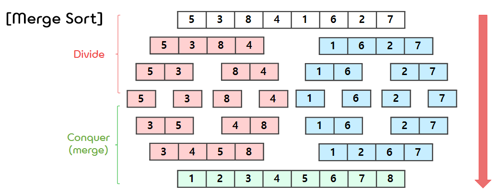
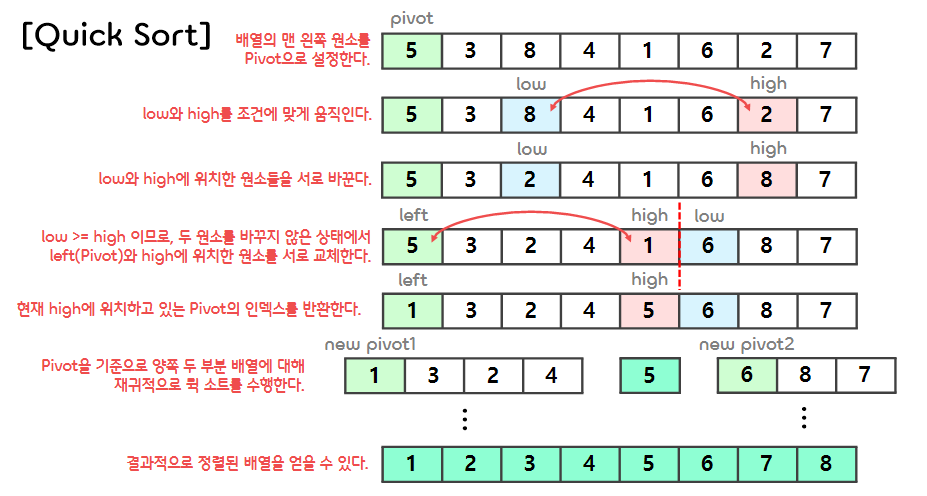
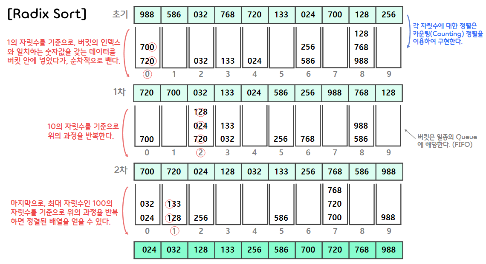

11.Sorting
===

## < _Contents_ >

- [1. Merge Sort](#%EF%B8%8F-1-merge-sort)
- [2. Quick Sort](#%EF%B8%8F-2-quick-sort)
- [3. Heap Sort](#%EF%B8%8F-3-heap-sort)
- [4. Radix Sort](#%EF%B8%8F-4-radix-sort)
- [5. Time Complexity](#%EF%B8%8F-5-time-complexity)  

---

## ✔️ 1. **Merge Sort**

### 1) **About Merge Sort**
- **합병 정렬(Merge Sort)** 은 **분할 정복(Divide and Conquer)** 알고리즘을 사용하는 정렬로, 주어진 배열을 최소 단위(1개의 요소를 갖는 배열은 이미 정렬된 배열로 본다.)까지 나누어 놓은 다음(분할), 다시 그들을 하나의 배열로 합치면서 정렬(정복)하는 방법이다.
- 합병 정렬은 같은 값의 초기 순서가 정렬 이후에도 유지되는 **안정 정렬**에 속한다.
    <p align="center"></p>


</br>  

### 2) 코드 구현
- (1) Preparation  
    ```c
    #include <stdio.h>
    #include <stdlib.h>

    #define ElementType int


    void mergeSort(ElementType a[],int len);
    void mSort(ElementType a[], ElementType tmpArray[], int left, int right );
    void merge(ElementType a[], ElementType tmpArray[], int lPos, int rPos, int rEnd);


    int main() 
    {
        ElementType arr[8] = { 5, 3, 8, 4, 1, 6, 2, 7 };
        int len = sizeof(arr) / sizeof(ElementType);

        mergeSort(arr, len);

        for (int i = 0; i < sizeof(arr) / sizeof(ElementType); i++)
            printf("%d ", arr[i]);

        return 0;
    }
    ```  
- (2) mergeSort 함수 (mSort 함수의 argument를 단순화하기 위한 일종의 Wrapper 함수)  
    ```c
    void mergeSort(ElementType a[], int len) 
    {
        ElementType* tmpArr = malloc(sizeof(ElementType) * len);
        mSort(a, tmpArr, 0, len - 1);
    }
    ```  
- (3) mSort 함수 (배열을 재귀적으로 합병 정렬하는 함수)  
    ```c
    void mSort(ElementType a[], ElementType tmpArray[], int left, int right ) 
    {
        int center;
        if (left < right) {
            center = (left + right) / 2;
            mSort(a, tmpArray, left, center);
            mSort(a, tmpArray, center + 1, right);
            merge(a, tmpArray, left, center + 1, right);
        }
    }
    ```  
- (4) merge 함수 (분할된 두 부분 배열을 정렬하며 하나의 배열로 병합하는 함수)  
    ```c
    void merge(ElementType a[], ElementType tmpArray[], int lPos, int rPos, int rEnd)
    {
        int i, lEnd, numOfElements, tmpPos;
        lEnd = rPos - 1;
        tmpPos = lPos;
        numOfElements = rEnd - lPos + 1;

        // 어떤 한 부분 배열에 있는 element들이 모두 사용(정렬)될 때까지 반복한다.
        while (lPos <= lEnd && rPos <= rEnd)
        {
            // 두 부분 배열에서 더 작은 값을 갖는 element를 tmpArray 배열에 넣는다.
            if (a[lPos] <= a[rPos])
                tmpArray[tmpPos++] = a[lPos++];
            else
                tmpArray[tmpPos++] = a[rPos++];
        }

        // 남아있는 element들을 tmpArray 배열에 채워 넣는다.
        while (lPos <= lEnd)
            tmpArray[tmpPos++] = a[lPos++];
        while (rPos <= rEnd)
            tmpArray[tmpPos++] = a[rPos++];
        
        // tmpArray 배열에 정렬된 element들을 a 배열으로 옮긴다.
        for (i = 0; i < numOfElements; i++, rEnd--)
            a[rEnd] = tmpArray[rEnd];
    }
    ```  
- (5) 출력 결과
    ```
    1 2 3 4 5 6 7 8
    ```  

</br>

## ✔️ 2. **Quick Sort**  

### 1) **About Quick Sort**  
- **퀵 소트(Quick Sort)** 는 **분할 정복(Divide and Conquer)** 알고리즘을 사용하는 정렬로, 전체 배열을 **Pivot(피벗)** 을 기준으로 2개의 부분 배열로 분할하고, 각각의 부분 배열을 다시 퀵 소트로 분할하여 정렬해나가는 방법이다.  
- 퀵 소트는 합병 정렬과 달리 Pivot을 기준으로 주어진 배열을 비균등하게 분할한다.
    - ① 배열의 원소들 가운데서 하나의 원소(Pivot)을 고른다.
    - ② Pivot 앞에는 Pivot보다 값이 작은 모든 원소들이 위치하고, 뒤에는 더 큰 값을 갖는 모든 원소들이 위치한다.
    - ③ Pivot을 기준으로 왼쪽 부분 배열과 오른쪽 부분 배열에 대하여 재귀적으로 퀵 소트를 수행한다.  
    (이때 재귀는 배열의 크기가 0이나 1이 될 때까지 반복한다.)
- 퀵 소트는 원소들 중에 같은 값이 있는 경우, 같은 값들의 정렬 이후 순서가 초기 순서와 달라질 수 있는 **불안정 정렬** 에 속한다.  
    <p align="center"></p>

</br>

### 2) 코드 구현
- (1) Preparation
    ```c
    #include <stdio.h>
    #include <stdlib.h>

    #define ElementType int
    #define SWAP(a, b) do { \
        ElementType temp = *a; \
        *a = *b; \
        *b = temp; \
    } while (0)


    void quickSort(ElementType arr[], int len);
    void qSort(ElementType arr[], int left, int right);
    int partition(ElementType arr[], int left, int right);


    int main()
    {
        ElementType arr[8] = { 5, 3, 8, 4, 1, 6, 2, 7 };
        int len = sizeof(arr) / sizeof(ElementType);

        quickSort(arr, len);

        for (int i = 0; i < sizeof(arr) / sizeof(ElementType); i++)
            printf("%d ", arr[i]);

        return 0;
    }
    ```  
- (2) quickSort 함수 (qSort 함수의 argument를 단순화하기 위한 일종의 Wrapper 함수)
    ```c
    void quickSort(ElementType arr[], int len) {
        qSort(arr, 0, len - 1);
    }
    ```  
- (3) qSort 함수 (배열을 재귀적으로 퀵 정렬하는 함수)  
    ```c
    void qSort(ElementType arr[], int left, int right)
    {
        if (left < right) {
            // Partition을 통해 Pivot의 인덱스를 구하고, Pivot을 기준으로 하는 두 부분 배열을 만든다.
            int q = partition(arr, left, right);  
            // 두 부분 배열에 대해 재귀적으로 퀵 소트를 진행한다.
            qSort(arr, left, q - 1);
            qSort(arr, q + 1, right);
        }
    }
    ```  
- (4) partition 함수 (Pivot(배열의 가장 왼쪽 원소)을 기준으로 양쪽에 두 부분 배열을 구한 다음, Pivot의 인덱스를 반환하는 함수)  
    ```c
    int partition(ElementType arr[], int left, int right)
    {
        int pivot, low, high;
        low = left;
        high = right + 1;
        pivot = arr[left];

        // low가 high보다 크거나 같아질 때까지 반복한다.
        do {
            // low를 조건에 맞게 우측(+1)으로 이동시킨다.
            do {  
                low++;
            } while (low <= right && arr[low] < pivot);

            // high를 조건에 맞게 좌측(-1)으로 이동시킨다.
            do {
                high--;
            } while (high >= left && arr[high] > pivot);

            // low보다 high가 더 큰 경우, 배열에서 해당 두 인덱스에 위치한 원소들을 서로 바꿔준다.
            if (low < high) { SWAP(&arr[low], &arr[high]); }
        } while (low < high);

        // 배열에서 left와 high 인덱스에 위치한 두 원소들을 서로 바꿔준다.
        SWAP(&arr[left], &arr[high]);

        return high;
    }
    ```  
- (5) 출력 결과
    ```
    1 2 3 4 5 6 7 8
    ```  

</br>

## ✔️ 3. **Heap Sort**  
- **힙 정렬(Heap Sort)** 은 **최대 힙** 트리나 **최소 힙** 트리를 구성하여 정렬을 하는 방법으로, 내림차순 정렬을 위해서는 최소 힙을 구성하고, 오름차순 정렬을 위해서는 최대 힙을 구성한다.
- ※ 참고 : [7.Binary_Tree_Heap.md](https://github.com/LaonCoder/memory-storage-center/blob/main/C/7.Binary_Tree_Heap.md)  

</br>

## ✔️ 4. **Radix Sort**  
### 1) **About Radix Sort**
- **기수 정렬(Radix Sort)** 은 비교 연산을 수행하지 않고 기수(ex. 자릿수) 별로 데이터를 정렬하는 알고리즘이다.
- 기수 정렬은 비교 연산을 하지 않기 때문에 정렬 속도가 매우 빠른 편이지만, **버킷(Bucket)** 이라는 추가적인 메모리 공간을 필요로 하고, 데이터가 많을 때 버킷에 데이터를 담고 빼는 과정에서 무시할 수 없는 오버헤드(Overhead)가 발생하는 단점이 있다.  
- 기수 정렬은 다음과 같은 방법으로 데이터를 정렬한다.
    - ① 1의 자릿수를 보면서 각각의 버킷에 알맞게 담아준다. 버킷에서 순차적으로 뺀다면 1의 자릿수에 맞게 정렬된다.
    - ② (1)번 과정에 의해 정렬된 배열에서 10의 자릿수를 비교하여 버킷에 담고, 순차적으로 빼주면 10의 자릿수에 맞게 정렬된다.
    - ③ (2)번 과정에 의해 정렬된 배열에서 100의 자릿수를 비교하여 버킷에 담고, 다시 빼주면 100의 자릿수에 맞게 정렬된다.
    - ④ 위 과정을 최대 자릿수까지 계속해서 반복한다.  
- 기수 정렬에서 각 자릿수별 정렬은  **카운팅 정렬(Counting Sort)** 을 사용하여 구현된다.  
- ※ 참고 : [Stranger's LAB - '자바JAVA - 카운팅 정렬(Counting Sort / 계수정렬)'](https://st-lab.tistory.com/104)
    <p align="center"></p>
<br>

### 2) 코드 구현
- (1) Preparation
    ```c
    #include <stdio.h>
    #include <stdlib.h>


    int getMax(int arr[], int len);
    void radixSort(int arr[], int len);
    void countSort(int arr[], int len, int exp);


    int main() 
    {
        int arr[10] = {988, 586, 32, 768, 720, 133, 24, 700, 128, 256};
        int len = sizeof(arr) / sizeof(int);

        radixSort(arr, len);

        for (int i = 0; i < len; i++)
            printf("%d ", arr[i]);
    }
    ```  
- (2) getMax 함수 (배열의 최댓값을 반환하는 함수)
    ```c
    int getMax(int arr[], int len) {
        int max = arr[0];
        for ( int i = 0; i < len; i++ ) {
            if (max < arr[i]) { max = arr[i]; }
        }
        return max;
    }
    ```  
- (3) radixSort 함수 (각 자릿수 별로 카운팅 정렬을 수행하여 기수 정렬하는 함수)
    ```c
    void radixSort(int arr[], int len)
    {
        int max = getMax(arr, len);

        // 각 자릿수 별로 카운팅 정렬(Counting Sort)을 수행한다.
        for ( int exp = 1; max / exp > 0; exp *= 10 ) {
            countSort(arr, len, exp);
        }
    }
    ```  
- (4) countSort 함수 (카운팅 정렬을 수행하는 함수)
    ```c
    void countSort(int arr[], int len, int exp) {
        int output[len];  // Output 배열
        int i, count[10] = { 0, };

        // 배열을 순회하면서 각 숫자 값이 나올 때마다 해당 값을 인덱스로 하는 count 배열의 값을 1씩 증가시킨다.
        for (i = 0; i < len; i++)
            count[(arr[i] / exp) % 10]++; 
        
        // count 배열의 각 값을 누적합으로 변환시킨다. (이는 해당 숫자값을 갖는 데이터가 들어갈 시작점을 나타낸다.)
        for (i = 1; i < 10; i++)
            count[i] += count[i - 1];

        // 위에서 지정한 시작점을 기준으로, 각 숫자 값에 대응되는 데이터를 Output 배열에 저장한다.
        for (i = len - 1; i >= 0; i--) {
            output[count[(arr[i] / exp) % 10] - 1] = arr[i];
            count[(arr[i] / exp) % 10]--;
        }

        // Output 배열에 있는 데이터를 arr 배열로 옮긴다.
        for (i = 0; i < len; i++)
            arr[i] = output[i];
    }
    ```  
- (5) 출력 결과
    ```
    24 32 128 133 256 586 700 720 768 988
    ```  

</br>

## ✔️ 5. **Time Complexity**  
- 위의 4개의 정렬 알고리즘이 갖는 시간복잡도는 다음과 같다.  

    ||Worst|Average|
    |:--------:|:---------:|:---------:|
    |Merge sort|$O(n\log{n})$|$O(n\log{n})$|
    |Quick sort|$O(n^2)$|$O(n\log{n})$|
    |Heap sort|$O(n\log{n})$|$O(n\log{n})$|
    |Radix sort $\newline$(radix-r, d passes)|$O(d(n+r))$|$O(d(n+r))$|  

