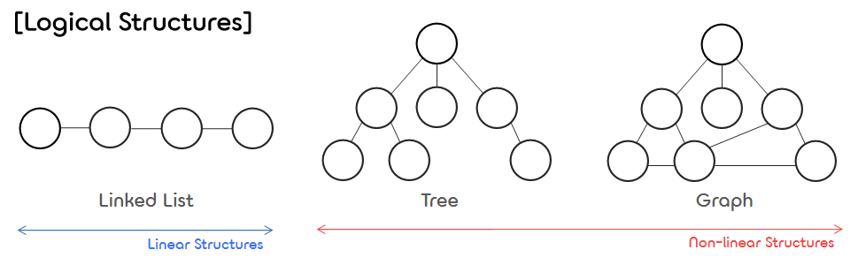
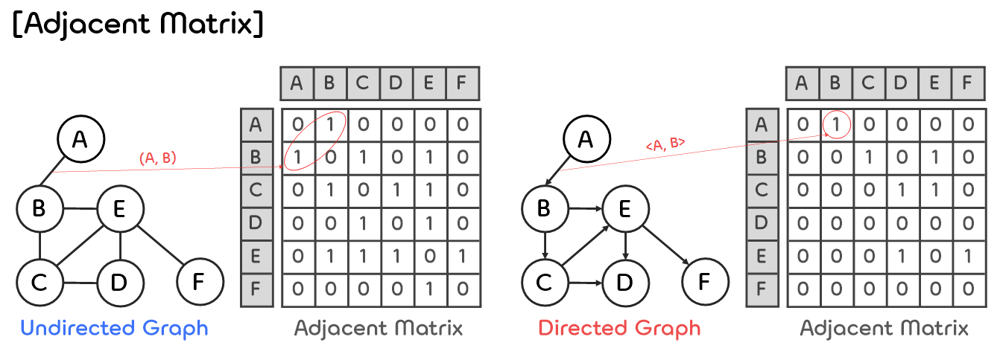
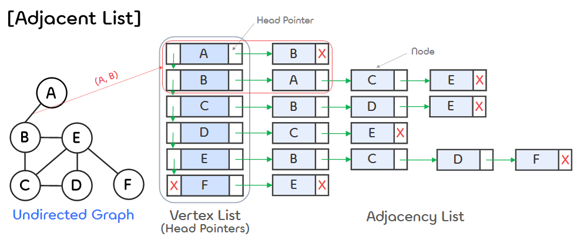
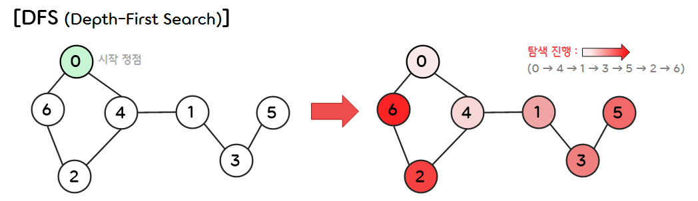
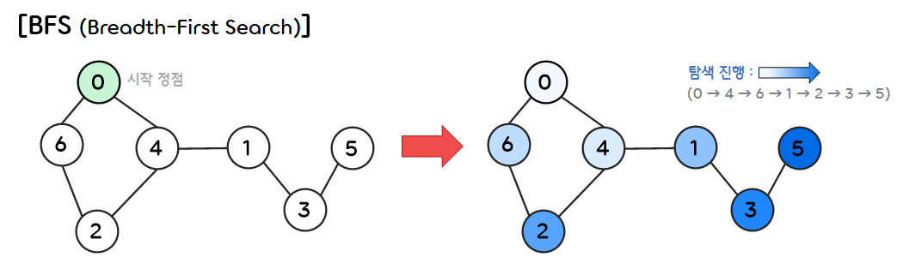
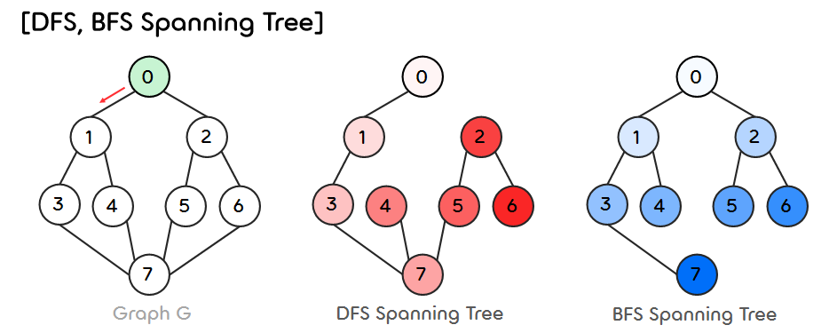

12.Graph
===

## < _Contents_ >

- [1. About Graph](#%EF%B8%8F-1-about-graph)
- [2. BFS and DFS](#%EF%B8%8F-2-bfs-and-dfs)
- [3. Spanning Tree Algorithms](#%EF%B8%8F-3-spanning-tree-algorithms)

---

## ✔️ 1. **About Graph**
### 1) **Definition**
<p align="center"></p>  

- **그래프(Graph)** 란 하나의 이상의 **정점(Vertex, Node)** 들의 집합(V)과 두 node의 쌍으로 구성된 **간선(Edge)** 들의 집합(E)로 이루어진 자료구조이다.
- 그래프에서는 A 노드에서 B 노드까지의 경로가 유일하지 않을 수 있다. (트리는 유일하다.)
- 트리는 그래프의 특수한 경우에 해당한다. (Tree ⊂ Graph)  

</br>

- (1) **Set of Vertices and Edges**
    - $V(G)$ : 그래프 $G$에 존재하는 **정점(Vertex)** 들의 집합
    - $E(G)$ : 그래프 $G$에 존재하는 **간선(Edge)** 들이 집합
    - ※ $G = (V, E)$   

</br>

- (2) **Types of Graphs**  
    - **Undirected Graph(무향 그래프)**
        - 간선의 방향성이 없는 그래프로, 두 정점 사이를 양 방향으로 연결한 것과 같은 의미이다.
        - $(u, v)$와 $(v, u)$는 모두 동일한 간선을 의미한다.
    - **Directed Graph(유향 그래프)**  
        - 간선의 방향성이 있는 그래프로, 시작 정점에서 끝 정점 쪽으로 한 쪽 방향으로만 연결한 것과 같은 의미이다.  
        - <$u, v$>가 하나의 간선을 나타낸다. ($u$ : tail, $v$ : head of an edge)
    - **Weighted Graph(가중치 그래프)**
        - 각 간선들에 가중치가 부여된 그래프로, 이는 정점 사이에 연결된 간선들의 길이가 서로 다르다는 것과 같은 의미이다.  

    </br>

    - **Complete Graph(완전 그래프)**
        - 간선을 최대한으로 갖는 그래프로, 정점이 $n$개 있을 때 $\frac{n(n-1)}{2}$개의 간선을 갖는 그래프를 말한다.
        - 즉, 모든 정점들이 **Adjacent**  하게 연결되어 있는 것을 의미한다.
    - **Sub Graph(부분 그래프)**
        - 어떤 그래프의 정점과 간선의 일부로 이루어진 그래프로, 그래프 $G$의 부분 그래프를 $G^{'}$라고 할 때 $V(G^{'}) \leq V(G),\quad E(G^{'}) \leq E(G)$를 만족한다.  

</br>

- (3) **Path**
    - **Simple path** : 처음과 끝이 확실하게 정해져 있는 경로를 말한다.
    - **Cycle** : Simple path에서 처음과 끝이 일치하는 경로를 말한다.  

    </br>

    - 그래프 $G$에서 정점 $u$에서 정점 $v$까지 가는 경로가 존재할 경우, $u$와 $v$는 **connected** 되어 있다고 한다.
    - 무향 그래프에서 정점들끼리 서로 연결되어 있는 (부분)그래프를 가리켜 **Connect Component** 라고 한다.
    - 유향 그래프에서 정점들끼리 서로 연결되어 있고, <$u, v$>가 존재할 때 <$v, u$> 또한 존재하는 (부분)그래프를 가리켜 **Strongly Connected Component** 라고 한다.  

</br>

- (4) **Degree**
    - $G$가 무향 그래프일 때 **차수(Degree)** 는 하나의 정점에 연결된 간선의 개수를 의미한다.
    - $G$가 유향 그래프일 경우,
        - ① **In-degree** 는 정점을 기준으로 들어오는 간선의 개수를 의미한다.
        - ② **Out-degree** 는 정점을 기준으로 밖으로 나가는 간선의 개수를 의미한다.  

</br>

### 2) **Graph Representation**
- 그래프를 구현하는 방법으로는 대표적으로 **인접 행렬(Adjacency Matrix)** 과 **인접 리스트(Adjacency List)** 가 있다.  

</br>

- (1) **Adjacency Matrix(인접 행렬)**  
    <p align="center"></p>   

    - $G = (V, E)$일 때, 인접 행렬 $M$은 아래와 같은 규칙에 따라 그래프 $G$를 메모리에 표현할 수 있다.  
        ```javascript
        if ( Edge (u, v) in E(G) )
            M[u][v] = 1;  // 유향 그래프일 경우 M[v][u] = 1; 포함
        else
            M[u][v] = 0;  // 유향 그래프일 경우 M[v][u] = 0; 포함
        ```  
    - 이러한 표현 방법은 정점의 개수를 $n$이라고 할 때, 기본적으로 $O(n^2)$ 만큼의 공간복잡도를 갖기 때문에 그래프에 간선이 많이 존재하는 밀집 그래프(Dense Graph)를 표현하는 경우에 적합하다.  
    - 또한 행렬(Matrix)이기 때문에, 두 정점을 연결하는 간선의 존재 여부를 $O(1)$ 시간 안에 즉시 알 수 있다.  
    - 그리고, 특정 정점의 차수(Degree)는 $O(n)$ 시간 안에 알 수 있고, 그래프 내부의 모든 정점의 차수는 $O(n^2)$ 시간 안에 알 수 있다.

</br>

- (2) **Adjacency List(인접 리스트)**  
    <p align="center"></p>   

    - **인접 리스트(Adjacency List)** 는 각각의 정점에 인접한 정점들을 연결 리스트로 표현한 것이다.  
    - 각 연결 리스트는 헤드 포인터를 갖고 있고, 이 헤드 포인터들은 배열로 구성되어 있다.
    - 이때, 정점의 번호만 알면 배열의 인덱스처럼 접근하여 정점의 연결리스트에 접근할 수 있다.
    - 무방향 그래프에서 정점의 개수가 $n$이고, 간선의 개수가 $e$인 경우, $n$개의 연결 리스트와 헤드 포인터가 필요하며, 연결 리스트에 속한 노드는 $2e$개가 필요하다. (중복되는 노드 때문)  
    - 인접 행렬로 표현했을 때 메모리의 크기가 전체 정점의 개수에 의해 좌우되었다면, 인접 리스트는 간선의 개수에 의해 좌우된다.  
    - 따라서 인접 리스트는 간선이 적은 희소 그래프(Sparse Graph)를 표현하는 경우에 적합하다.  

</br>

## ✔️ 2. **BFS and DFS**    

### 1) **Searching**
- 그래프에서 **탐색(Search)** 은 하나의 정점으로부터 시작하여 차례대로 모든 정점들을 한 번씩 방문하는 것을 의미한다.
- 주로 시작 점부터 끝 점까지 연결된 경로를 찾거나, 혹은 최단 경로를 찾기 위해 그래프에서 탐색을 수행한다.
- 그래프의 간선들에 가중치(Weight)가 없을 때(혹은 다 같을 때), 그래프를 탐색하는 대표적인 방법은 **DFS** 와 **BFS** 가 있다.

</br>

### 2) **DFS(깊이 우선 탐색)**  
<p align="center"></p>  

- **DFS(깊이 우선 탐색)** 란 루트 노드(혹은 다른 임의의 노드)에서 시작해서 다음 분기(branch)로 넘어가기 전에 해당 분기를 완벽하게 탐색하는 방법을 말한다.  
(한 루트로 탐색하다가 특정 상황에서 최대한 깊숙하게 들어가서 확인한 뒤, 다시 돌아가 다른 루트로 탐색하는 방식)
    - ① 시작 정점과 연결되어 있고, 아직 탐색하지 않은 정점들 중 임의로 하나를 선택하여 탐색한다.  
    - ② 선택된 정점을 기준으로 연결되어 있고, 아직 탐색하지 않은 정점들이 존재할 경우 위 과정을 반복한다.  
    - ③ 연결된 정점이 존재하지 않거나 이미 다 탐색한 정점인 경우, 이전 정점으로 돌아가서 다시 탐색한다.  

</br>

- 코드 구현 1 (재귀를 이용한 DFS 구현)
    ```c
    #include <stdio.h>
    #include <stdlib.h>

    #define MAX_VERTICES 10
    #define TRUE 1
    #define FALSE 0

    // -----------------------------------------------------------------

    /* 그래프에서 정점을 방문했는지의 여부를 저장하는 배열 */
    int visited[MAX_VERTICES];

    /* 그래프 구조체 */
    typedef struct Graph {
        int adjMatrix[MAX_VERTICES][MAX_VERTICES];
        int n;
    } Graph;

    // -----------------------------------------------------------------

    void init(Graph *g);
    void insertVertex(Graph *g, int v);
    void insertEdge(Graph *g, int u, int v);
    void dfs(Graph *g, int startVertex);

    // -----------------------------------------------------------------

    int main()
    {
        int i;
        Graph g;

        init(&g);
        for (i = 0; i < MAX_VERTICES; i++) visited[i] = FALSE;
        for (i = 0; i < 7; i++) insertVertex(&g, i);
        insertEdge(&g, 0, 4);
        insertEdge(&g, 0, 6);
        insertEdge(&g, 1, 3);
        insertEdge(&g, 3, 5);
        insertEdge(&g, 4, 1);
        insertEdge(&g, 4, 2);
        insertEdge(&g, 6, 2);

        dfs(&g, 0);
    }

    // -----------------------------------------------------------------

    /* 그래프를 초기화하는 메소드 */
    void init(Graph *g)
    {
        int i, j;
        g->n = 0;

        for (i = 0; i < MAX_VERTICES; i++)
        {
            for (j = 0; j < MAX_VERTICES; j++)
            {
                g->adjMatrix[i][j] = 0;
            }
        }
    }


    /* 그래프에 정점을 하나 추가하는 메소드 */
    void insertVertex(Graph *g, int v)
    {
        if (g->n == MAX_VERTICES)
        {
            printf("vertex 개수가 너무 많습니다. 노드 삽입 불가\n");
            return;
        }
        g->n++;
    }


    /* 그래프에 간선을 하나 추가하는 메소드 */
    void insertEdge(Graph *g, int u, int v)
    {
        if (u >= g->n || v >= g->n) 
        {
            printf("정점 번호가 잘못됨. 정점 번호는 0-N-1 \n");
            return;
        }

        g->adjMatrix[u][v] = 1;
        g->adjMatrix[v][u] = 1;
    }


    /* 그래프를 DFS로 탐색하는 메소드 */
    void dfs(Graph *g, int v)
    {
        int w;
        visited[v] = TRUE;
        printf("%d ", v);

        for (w = 0; w < g->n; w++)
        {
            if (g->adjMatrix[v][w] == 1 && visited[w] == FALSE)
                dfs(g, w);
        }
    }
    ```  
    ```
    0 4 1 3 5 2 6
    ```

</br>

- DFS은 일반적으로 재귀 호출을 사용하여 구현하지만, **스택(Stack)** 을 사용하여 구현하기도 한다.  
    - ① 시작 정점을 기준으로 연결되어 있고, 아직 탐색하지 않은 정점들을 스택에 저장한다.
    - ② 더 이상 연결되어 있고, 탐색하지 않은 정점들이 없을 경우, 스택에서 저장된 정점들을 하나씩 꺼내 (1)번 과정을 반복한다.
    - ③ 스택이 완전히 비워지면 탐색을 종료한다.  

</br>

- 코드 구현 2 (Stack을 이용한 DFS 구현)  
    ```c
    #include <stdio.h>
    #include <stdlib.h>

    #define MAX_VERTICES 10
    #define TRUE 1
    #define FALSE 0

    // -----------------------------------------------------------------

    /* 스택 노드 */
    typedef struct StackNode {
        int data;
        struct StackNode* next;
    } StackNode;

    /* 그래프에서 정점을 방문했는지의 여부를 저장하는 배열 */
    int visited[MAX_VERTICES]; 

    /* 그래프 구조체 */
    typedef struct Graph {
        int adjMatrix[MAX_VERTICES][MAX_VERTICES];
        int n;
    } Graph;

    // -----------------------------------------------------------------

    /* 스택 관련 메소드 */
    int isEmpty(StackNode* top);
    void pushLinkedStack(StackNode** top, int data);
    StackNode* popLinkedStack(StackNode** top);
    void deleteLinkedStack(StackNode** top);

    /* 그래프, DFS 관련 메소드 */
    void init(Graph *g);
    void insertVertex(Graph *g, int v);
    void insertEdge(Graph *g, int u, int v);
    void dfs(Graph *g, int startVertex);

    // -----------------------------------------------------------------

    int main()
    {
        int i;
        Graph g;

        init(&g);
        for (i = 0; i < MAX_VERTICES; i++) visited[i] = FALSE;
        for (i = 0; i < 7; i++) insertVertex(&g, i);
        insertEdge(&g, 0, 4);
        insertEdge(&g, 0, 6);
        insertEdge(&g, 1, 3);
        insertEdge(&g, 3, 5);
        insertEdge(&g, 4, 1);
        insertEdge(&g, 4, 2);
        insertEdge(&g, 6, 2);

        dfs(&g, 0);
    }

    // -----------------------------------------------------------------

    /* 그래프를 초기화하는 메소드 */
    void init(Graph *g)
    {
        int i, j;
        g->n = 0;  // 초기 정점의 개수를 0개로 설정한다.

        // 배열의 모든 요소를 0으로 설정한다.
        for (i = 0; i < MAX_VERTICES; i++)
        {
            for (j = 0; j < MAX_VERTICES; j++)
            {
                g->adjMatrix[i][j] = 0;
            }
        }
    }


    /* 그래프에 정점을 하나 추가하는 메소드 */
    void insertVertex(Graph *g, int v)
    {
        if (g->n == MAX_VERTICES) {
            printf("vertex 개수가 너무 많습니다. (노드 삽입 불가)\n");
            return;
        }
        g->n++;
    }


    /* 그래프에 간선을 하나 추가하는 메소드 */
    void insertEdge(Graph *g, int u, int v)
    {
        if (u >= g->n || v >= g->n) 
        {
            printf("정점 번호가 잘못되었습니다. (정점 번호는 0-N-1)\n");
            return;
        }

        g->adjMatrix[u][v] = 1;
        g->adjMatrix[v][u] = 1;
    }


    /* 그래프를 DFS로 탐색하는 메소드 */
    void dfs(Graph *g, int startVertex)
    {
        int w;
        StackNode* top = NULL;  // Stack
        StackNode* pNode;

        // 스택에 시작 정점을 넣고(push), 방문 여부를 TRUE로 만든다.
        pushLinkedStack(&top, startVertex);
        visited[startVertex] = TRUE;

        // 스택에 더 이상 남은 정점(노드)이 없을 때까지 반복한다.
        while (!isEmpty(top))
        {
            // 스택에서 맨 위에 있는 정점을 꺼내(pop) 출력한다.
            pNode = popLinkedStack(&top);
            printf("%d ", pNode->data);

            // 꺼낸 정점과 연결(인접)되어 있고, 아직 방문하지 않은 정점들을 찾아
            // 스택 안에 넣은(push) 후, 방문 여부를 TRUE로 만든다. 
            for (w = g->n - 1; w >= 0; w--) {
                if (g->adjMatrix[pNode->data][w] == 1 && visited[w] == FALSE) {
                    visited[w] = TRUE;
                    pushLinkedStack(&top, w);
                }
            }
        }

        // DFS가 끝났으면 스택에 할당된 메모리를 해제한다.
        deleteLinkedStack(&top);
    }

    // -----------------------------------------------------------------

    /* 스택이 비어있는지를 확인하는 메소드 */
    int isEmpty(StackNode* top)
    {
        if (top == NULL)
            return TRUE;
        else
            return FALSE;
    }


    /* 스택에 data 값을 갖는 노드를 하나 추가하는 메소드 */
    void pushLinkedStack(StackNode** top, int data)
    {
        StackNode* pNode = NULL;

        pNode = (StackNode*)malloc(sizeof(StackNode));
        pNode->data = data;
        pNode->next = NULL;

        if (*top == NULL) {
            *top = pNode;
        } else {
            pNode->next = *top;
            *top = pNode;
        }
    }


    /* 스택의 맨 위에 있는 노드를 하나 제거하는 메소드 */
    StackNode* popLinkedStack(StackNode** top)
    {
        StackNode* pNode = NULL;

        if (isEmpty(*top)) {
            printf("The Stack is empty\n");
            return NULL;
        }

        pNode = *top;
        *top = pNode->next;
        return pNode;
    }


    /* 스택에 할당된 메모리를 모두 해제하는 메소드 */
    void deleteLinkedStack(StackNode** top)
    {
        StackNode *pNode = NULL, *pDelNode = NULL;
        pNode = *top;

        while (pNode != NULL) {
            pDelNode = pNode;
            pNode = pNode->next;
            free(pDelNode);
        }

        *top = NULL;
    }
    ```
    ```
    0 4 1 3 5 2 6
    ```

</br>

### 3) **BFS(너비 우선 탐색)**  
<p align="center"></p>  

- **BFS(너비 우선 탐색)** 란 루트 노드(혹은 다른 임의의 노드)와 연결된 모든 노드들을 우선적으로 탐색한 뒤, 그 중에 하나를 선택하여 또 다시 그와 연결된 모든 노드들을 탐색하는 방식으로 진행되는 탐색 방법을 말한다.  
- BFS는 **큐(Queue)** 를 사용하여 구현할 수 있다.
    - ① 시작 정점을 기준으로 연결되어 있고, 아직 탐색하지 않은 정점들을 큐에 저장한다.
    - ② 더 이상 연결되어 있고, 탐색하지 않은 정점들이 없을 경우, 큐에서 저장된 정점들을 하나씩 꺼내 (1)번 과정을 반복한다.
    - ③ 큐가 완전히 비워지면 탐색을 종료한다.  

</br>

- 코드 구현 (Queue을 이용한 BFS 구현)
    ```c
    #include <stdio.h>
    #include <stdlib.h>

    #define MAX_SIZE 1000
    #define TRUE 1
    #define FALSE 0
    #define MAX_VERTICES 10

    // -----------------------------------------------------------------

    /* 큐 노드 */
    typedef struct Queue {
        int queue[MAX_SIZE + 1];
        int rear;
        int front;
    } Queue;

    int visited[MAX_VERTICES];

    typedef struct Graph {
        int adjMatrix[MAX_VERTICES][MAX_VERTICES];
        int n;
    } Graph;

    // -----------------------------------------------------------------

    /* 큐 관련 메소드 */
    void initQueue(Queue* q);
    int isFull(Queue* q);
    int isEmpty(Queue* q);
    void enqueue(Queue* q, int data);
    int dequeue(Queue* q);

    /* 그래프, BFS 관련 메소드 */
    void init(Graph *g);
    void insertVertex(Graph *g, int v);
    void insertEdge(Graph *g, int u, int v);
    void bfs(Graph *g, int v);

    // -----------------------------------------------------------------

    void main() {

        int i;
        Graph g;

        init(&g);
        for (i = 0; i < MAX_VERTICES; i++) visited[i] = FALSE;
        for (i = 0; i < 7; i++) insertVertex(&g, i);
        insertEdge(&g, 0, 4);
        insertEdge(&g, 0, 6);
        insertEdge(&g, 1, 3);
        insertEdge(&g, 3, 5);
        insertEdge(&g, 4, 1);
        insertEdge(&g, 4, 2);
        insertEdge(&g, 6, 2);

        bfs(&g, 0);
    }

    // -----------------------------------------------------------------

    /* 그래프를 초기화하는 메소드 */
    void init(Graph *g) {
        int i, j;
        g->n = 0;

        for (i = 0; i < MAX_VERTICES; i++)
        {
            for (j = 0; j < MAX_VERTICES; j++)
            {
                g->adjMatrix[i][j] = 0;
            }
        }
    }


    /* 그래프에 정점 하나를 추가하는 메소드 */
    void insertVertex(Graph *g, int v) {
        if (g->n == MAX_VERTICES)
        {
            printf("vertex 개수가 너무 많습니다. (노드 삽입 불가)\n");
            return;
        }
        g->n++;
    }


    /* 그래프에 간선 하나를 추가하는 메소드 */
    void insertEdge(Graph *g, int u, int v) {
        if (u >= g->n || v >= g->n) 
        {
            printf("정점 번호가 잘못되었습니다. (정점 번호는 0-N-1)\n");
            return;
        }

        g->adjMatrix[u][v] = 1;
        g->adjMatrix[v][u] = 1;
    }


    /* 그래프를 BFS로 탐색하는 메소드 */
    void bfs(Graph *g, int v) {
        int w, search_v;
        Queue q;

        initQueue(&q);
        visited[v] = TRUE;
        enqueue(&q, v);

        while (!isEmpty(&q))
        {
            search_v = dequeue(&q);
            printf("%d ", search_v);

            for (w = 0; w < MAX_VERTICES; w++)
            {
                if (g->adjMatrix[search_v][w] == 1 && visited[w] == FALSE)
                {
                    visited[w] = TRUE;
                    enqueue(&q, w);
                }        
            }
        }
    }

    // -----------------------------------------------------------------

    /* 큐를 초기화하는 메소드 */
    void initQueue(Queue* q) {
        q->front = 0;
        q->rear = 0;
    }


    /* 큐가 가득 차 있는지를 확인하는 메소드 */
    int isFull(Queue* q) {
        if ((q->rear + 1) % MAX_SIZE == q->front)
            return 1;
        else
            return 0;
    }


    /* 큐가 비어 있는지를 확인하는 메소드 */
    int isEmpty(Queue* q) {
        if (q->front == q->rear)
            return 1;
        else
            return 0;
    }


    /* 큐에 data 값을 갖는 데이터를 추가하는 메소드 */
    void enqueue(Queue* q, int data) {
        if (isFull(q))
            printf("큐가 가득 찼습니다.\n");
        else {
            q->queue[q->rear] = data;
            q->rear = (q->rear + 1) % MAX_SIZE;
        }
    }


    /* 큐에 있는 데이터를 하나를 뺀 후, 출력하는 메소드 */
    int dequeue(Queue* q) {
        int tmp = -1;

        if (isEmpty(q))
            printf("큐가 비어 있습니다.\n");
        else {
            tmp = q->queue[q->front];
            q->front = (q->front + 1) % MAX_SIZE;
        }
        return tmp;
    }
    ```  
    ```
    0 4 6 1 2 3 5 
    ```

</br>

## ✔️ 3. **Spanning Tree Algorithms**   
### 1) **Minimum Spanning Tree**
- **신장 트리(Spanning Tree)** 란 그래프 내의 모든 정점을 포함하는 트리를 말한다.
- 이때, 모든 정점을 연결하기 위해 최소한의 간선만을 사용하는 신장 트리를 **최소 신장 트리(Minimum Spanning Tree)** 라고 한다.
- 즉, 최소 신장 트리(MST)는 어떤 그래프의 **최소 연결(간선의 수가 가장 적은) 부분 그래프** 를 말하여, 다음과 같은 성질을 갖는다.  
    - ① 그래프의 모든 정점(노드)들은 서로 연결되어 있다.
    - ② 어떤 그래프가 $n$개의 정점을 가질 때, 해당 그래프의 MST는 $n$개의 정점과 $n - 1$개의 간선을 갖는다.  
    - ③ Cycle이 존재하지 않는다.  

</br>

- 그래프 $G$에 대한 DFS Spanning Tree, BFS Spanning Tree는 다음과 같다.
    <p align="center"></p>  

</br>

### 2) **Minimum Cost Spanning Tree**
- 무향 가중치 그래프에서 각 간선의 가중치의 합이 최소가 되는 MST를 **최소 비용 신장 트리(Minimum Cost Spanning Tree)** 라고 한다.  
- 그래프 내 모든 정점들을 가장 적은 비용으로 연결하는 최소 비용 신장 트리를 구하기 위한  알고리즘으로는 **크루스칼 알고리즘(Kruskal's Algorithm)** , **프림 알고리즘(Prim's Algorithm)** , **솔린 알고리즘(Sollin's Algorithm)** 등이 있다.  

</br>

### 3) **Kruskal's Algorithm**  
- **크루스칼 알고리즘(Kruskal's Algorithm)** 은 **그리디 알고리즘(Greedy Algorithm)** 의 일종으로, 가중치가 가장 작은 간선부터 차례대로 선택하여 최소 비용 신장 트리를 구하는 알고리즘이다.  
- 만약 차례대로 간선을 선택하다가 사이클(Cycle)이 형성되면, 해당 간선을 사용하지 않고 그 다음으로 큰 가중치를 갖는 간선을 선택한다.  
- 사이클을 형성하지 않는 $n - 1$개의 간선을 모두 선택하고 나면, 결과적으로 해당 그래프의 최소 비용 신장 트리를 얻게 된다.  

</br>

### 4) **Prim's Algorithm**
- **프림 알고리즘(Prim's Algorithm)** 도 마찬가지로 그리디 알고리즘의 일종으로, 현재 Vertex Set과 인접한 정점들 중 간선의 가중치가 작은 정점을 Vertex Set에 추가하여 확장해나가면서 최소 비용 신장 트리를 구하는 알고리즘이다.  

</br>

### 5) **Sollin's Algorithm**
- **솔린 알고리즘(Sollin's Algorithm)** 은 크루스칼 알고리즘, 프림 알고리즘처럼 간선을 하나씩 선택하는 것이 아닌, 동시에 여러 개의 간선을 선택하여 최소 비용 신장 트리를 구하는 알고리즘이다.  
- 우선 모든 정점에 대해 가중치가 가장 작은 간선을 하나 선택하여 하나 이상의 Vertex Set을 형성한다.
- 이렇게 구한 Vertex Set에서 다시 가장 작은 가중치를 갖는 간선을 하나 선택하여 Vertex Set을 확장시켜 나간다.
- 이때 사이클을 형성시키거나 중복되는 간선은 무시하고, 그 다음으로 작은 가중치를 갖는 간선을 선택한다.
- 위 과정을 반복하다가 모든 정점들이 연결되고 나면, 결과적으로 해당 그래프의 최소 비용 신장 트리를 얻을 수 있다.  

</br>