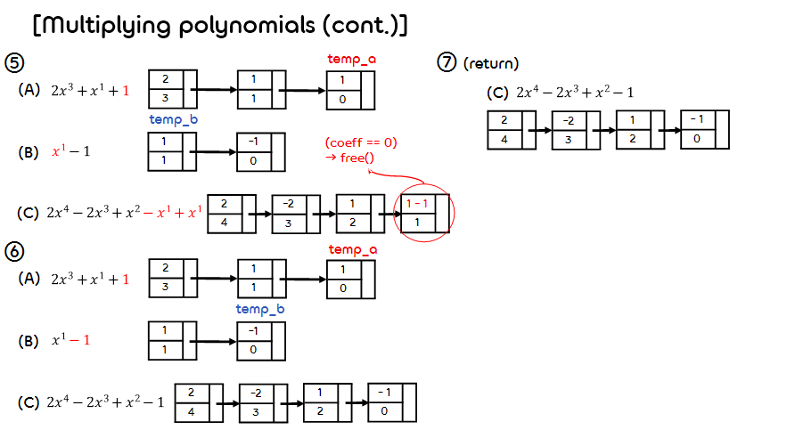

2.List
===
## < *Contents* >
- [1. Array List(배열 리스트)](#%EF%B8%8F-1-array-list배열-리스트)
- [2. Linked List(연결 리스트)](#%EF%B8%8F-2-linked-list연결-리스트)
- [3. 연결 리스트로 Polynomial ADT 구현하기](#%EF%B8%8F-3-연결-리스트로-polynomial-adt-구현하기)
- [4. 추가적인 연결 리스트 연산](#%EF%B8%8F-4-추가적인-연결-리스트-연산)

---

## ✔️ 1. **Array List(배열 리스트)**
- 배열(Array)를 통해 구현한 리스트이다.  
- 데이터가 메모리 상에 순차적으로 저장된다. (논리적 순서와 물리적 순서가 동일하다.)  
- Access(접근)에 유리하다. (  )
- Insertion(삽입)과 Deletion(삭제)에 불리하다. (  )

<p align="center"></p>  
</br>  

- 코드 구현 (간단하게 삽입과 삭제 연산만 나타내었다.)  
    ```c
    /* Array List 구조체 */
    typedef struct ListArray
    {
        int Array[MAX_SIZE];  // 배열의 크기
        int length;            // 배열의 길이
    } ListArray;

    // ...(중략)...


    /* Array List의 특정 위치에 데이터를 삽입한다. */
    void Add(ListArray *L, int value, int position)
    {
        if (L->length >= MAX_SIZE)  // 배열이 가득 차 있는지 검사한다.
        {
            printf("List is full.");
            return;
        }
        if (L->length < position)
        {
            Add_Last(L, Value);  // 배열의 마지막에 데이터를 저장한다.
            return;
        }
        for (int i = L->length; i > position; i--)
        {
            L->Array[i] = L->Array[i - 1];  // 특정 위치부터 한 칸씩 뒤로 밀어준다.
        }
        L->Array[position] = value;
        L->length += 1;
    }
    

    /* Array List의 특정 위치의 데이터를 삭제한다. */
    void Erase(ListArray *L, int position)
    {
        if (L->length == 0)
        {
            printf("List is empty.\n");
            return;
        }
        if (position > L->length)
        {
            printf("there is no data.\n");
            return;
        }
        for (int i = position - 1; i < L->length - 1; i++)
        {
            L->Array[i] = L->Array[i + 1];
        }
        L->length -= 1;
    }

</br>

## ✔️ 2. **Linked List(연결 리스트)**  
- 각 노드가 데이터와 포인터(link)를 가지고 한 줄로 연결되어 있는 방식으로 데이터를 저장하는 자료구조이다.  
(데이터가 더 이상 Sequential order로 저장되지는 않는다.)
- Structure(구조체)와 Pointer(포인터)를 이용하여 구현한다.  
- Access(접근)에 불리하다. (  )
- Insertion(삽입)과 Deletion(삭제)에 유리하다. (  )  
(사실 "특정" 노드에 "접근"하여 노드를 삭제하거나 삽입해야 하는 경우, 시간복잡도가 이 된다.)
<p align="center"></p>  
</br>  

### 1) **Singly Linked List(단일 연결 리스트)** 
- 데이터와 다음 노드를 가리키는 포인터(Next)를 갖는 노드로 구성된 연결 리스트이다.  
(위의 그림이 단일 연결 리스트를 표현한 것이다.)  

- 코드 구현
    ```c
    #include <stdio.h>
    #include <stdlib.h>

    #define ElementType int

    #ifndef _List_H

    struct Node;
    typedef struct Node *PtrToNode;
    typedef PtrToNode List;
    typedef PtrToNode Position;
    int IsEmpty( List L );
    int IsLast( Position P, List L );
    Position Find( ElementType X, List L );
    Position FindPrevious( ElementType X, List L );
    void Delete( ElementType X, List L );
    Position Insert( ElementType X, List L, Position P );
    Position InsertLast( ElementType X, List L );
    void PrintList( List L );
    void FreeList( List L );

    #endif /* _List_H */


    /* 단일 연결 리스트의 노드 구조체 */
    struct Node
    {
        ElementType Element;
        Position Next;
    };


    /* 연결 리스트가 비어 있으면 true를 리턴한다. */
    int IsEmpty(List L)
    {
        return L->Next == NULL;
    }


    /* P가 가리키는 노드가 마지막 노드이면 true를 리턴한다. */
    int IsLast(Position P, List L)
    {
        return P->Next == NULL;
    }


    /* 연결 리스트에서 데이터가 X인 노드를 찾아 리턴한다. */
    Position Find(ElementType X, List L)
    {
        Position P;

        P = L->Next;
        while(P != NULL && P->Element != X)
            P = P->Next;
        
        return P;  // 데이터로 X를 갖는 노드가 없으면 NULL을 반환한다.
    }


    /* 연결 리스트에서 데이터가 X인 노드의 이전 노드를 찾아 리턴한다. */
    Position FindPrevious(ElementType X, List L)
    {
        Position P;

        P = L;
        while(P->Next != NULL && P->Next->Element != X)
            P = P->Next;
        return P;  // 데이터로 X를 갖는 노드가 없으면 마지막 노드를 반환한다.
    }
    ```
- 연결 리스트 (노드) 삭제
    <p align="center"></p>  

    ```c
    /* 연결 리스트에서 데이터가 X인 노드를 찾아 삭제한다. */
    void Delete(ElementType X, List L)
    {
        Position P, TmpCell;
        
        P = FindPrevious(X, L);  

        if( !IsLast(P, L) )  // P가 헤더 노드를 가리킬 때를 고려
        {
            TmpCell = P->Next;
            // 이전 노드의 다음 노드로 삭제하려는 노드의 다음 노드 설정
            P->Next = TmpCell->Next;  
            free(TmpCell);
        }
    }
    ```
- 연결 리스트 (노드) 삽입
    <p align="center"></p>  

    ```c
    /* 연결 리스트에서 데이터가 X인 노드를 P가 가리키는 위치 다음에 삽입한다. */
    Position Insert(ElementType X, List L, Position P)
    {
        Position TmpCell;
        TmpCell = malloc(sizeof(struct Node));

        if (TmpCell == NULL)
        {
            printf("Out of space!!!");
            exit(1);
        }

        TmpCell->Element = X;
        TmpCell->Next = P->Next;
        P->Next = TmpCell;

        return TmpCell;
    }


    /* 데이터가 X인 노드를 연결 리스트의 맨 끝에 삽입한다. */
    Position InsertLast( ElementType X, List L )
    {
        Position P, TmpCell;

        TmpCell = malloc(sizeof(struct Node));

        if (TmpCell == NULL)
        {
            printf("Out of space!!!");
            exit(1);
        }

        TmpCell->Element = X;

        P = L;

        if (P->Next == NULL)  // 연결 리스트가 비어있는 경우
        {
            TmpCell->Next = NULL;
            P->Next = TmpCell;
            return NULL;
        }
        // 맨 마지막 노드로 접근한다. (Tail 노드로 접근하면 불필요)
        while (P->Next != NULL) 
            P = P->Next;
        TmpCell->Next = NULL;
        P->Next = TmpCell;

        return TmpCell;
    }
    ```
    ```c
    /* 연결 리스트 안에 있는 데이터를 순차적으로 출력한다. */
    void PrintList(List L) 
    {
        if ( !IsEmpty(L) )
        {
            Position P;
            P = L->Next;

            while( P->Next != NULL )
            {
                printf("%d -> ", P->Element);
                P = P->Next;
            }
            printf("%d\n", P->Element);
        }
        else
        {
            printf("List is Empty.");
        }
    }


    /* 연결 리스트 안에 있는 모든 노드에 할당된 메모리를 해제한다. */
    void FreeList(List L)
    {
        Position P, TmpCell;
        P = L->Next;

        while(P != NULL)
        {
            TmpCell = P;
            P = P->Next;
            free(TmpCell);
        }

        L->Next = NULL;
    }


    int main()
    {
        // 헤더 노드 생성
        List header = malloc(sizeof(struct Node));

        // 연결 리스트 안의 노드 설정
        struct Node* node_1 = malloc(sizeof(struct Node));
        node_1->Element = 10;
        header->Next = node_1;

        struct Node* node_2 = malloc(sizeof(struct Node));
        node_2->Element = 20;
        node_1->Next = node_2;

        struct Node* node_3 = malloc(sizeof(struct Node));
        node_3->Element = 30;
        node_2->Next = node_3;
        node_3->Next = NULL;

        PrintList(header);  

        // 50을 데이터로 갖는 노드를 마지막에 추가
        Position node_4 = InsertLast(50, header);
        PrintList(header);

        // 40을 데이터로 갖는 노드를 node_3 다음 위치에 추가
        Position node_5 = Insert(40, header, node_3);
        PrintList(header);

        // 30을 데이터로 갖는 노드 삭제
        Delete(30, header);
        PrintList(header);

        // 연결 리스트 안의 모드 노드 및 헤더 노드 메모리 해제
        FreeList(header);
        free(header);
        
        return 0;
    }

    ```
    ```bash
    10 -> 20 -> 30
    10 -> 20 -> 30 -> 50
    10 -> 20 -> 30 -> 40 -> 50
    10 -> 20 -> 40 -> 50
    ```  
    <br/>

### 2) **Doubly Linked List(이중 연결 리스트)** 
- 각 노드가 선행 노드(Prev)와 후속 노드(Next)에 대한 포인터(link)를 갖는 연결 리스트이다.
- 이전 노드로 접근하기 위한 FindPrevious() 함수가 필요없다.  
(특정 노드의 위치를 알고 있으면, 그 노드의 이전 노드로의 접근이 에 가능해진다.)  
<p align="center"></p>   

- 코드 구현 (간단하게 표현하였다.)  
    ```c
    /* 이중 연결 리스트의 노드 구조체 */
    struct Node
    {
        ElementType Element;
        Position Next;
        Position Prev;  // 선행 노드를 가리키는 포인터
    }
    ```  
- 이중 연결 리스트 (노드) 삽입  
    <p align="center"></p> 

    ```c
    void Insert(ElementType X, List, Position P)
    {
        Position TmpCell;

        TmpCell = malloc(sizeof(struct Node));

        if (TmpCell == NULL)
        {
            printf("Out of space!!!");
            exit(1);
        }

        TmpCell->Element = X;

        // P가 가리키는 노드와 후속 노드 사이에 TmpCell 노드 삽입
        TmpCell->Next = P->Next;
        P->Next->Prev = TmpCell;
        TmpCell->Prev = P;
        P->Next = TmpCell;
    }  
    ```
- 이중 연결 리스트 (노드) 삭제
    <p align="center"></p>  

    ```c
    void Delete(ElementType X, List L)
    {
        Position P;
        P = Find(X, L);

        P->Prev->Next = P->Next;
        P->Next->Prev = P->Prev;
        free(P);
    }
    ```  
    </br>

### 3) **Circular Linked List(원형 연결 리스트)** 
- 연결 리스트의 마지막(Tail) 노드와 제일 처음(Head) 노드가 연결된 원형의 연결 리스트이다.  
- 하나의 노드에서 모든 노드로의 접근이 가능해진다. (Prev 포인터가 없어도 된다.)
- 리스트의 두 가지 종류 )
    - **Circular list** : 마지막 노드가 다시 리스트의 처음 노드를 가리킨다.
    - **Chain** : 마지막 노드가 NULL을 가리킨다.

<p align="center"></p>   
</br>

## ✔️ 3. **연결 리스트로 Polynomial ADT 구현하기**
- 배열을 사용하여 구현한 Polynomial ADT보다, 항의 추가가 비교적 자유롭다.  
(항을 추가하기 위해 사용할 메모리를 미리 할당할 필요 X)  

<p align="center"></p>

- 코드 구현 (1) - 단일 연결 리스트 이용
    ```c
    #include <stdio.h>
    #include <stdlib.h>
    #include <string.h>

    #define BUFFSIZE 1024
    /* a와 b의 대소 관계를 비교한다. */
    #define COMPARE(a, b) (((a) > (b)) ? 1 : ((a) == (b)) ? 0 : -1)


    typedef struct Node {
        int coeff;  // 계수
        int exp;    // 차수(지수)
        struct Node* next;
    } Node;


    typedef struct Poly {
        Node* head;  // 헤더 노드
        // 필요 시 다항식이 몇 개의 항을 갖는지를 구하기 위한 count 변수를 정의한다.
    } poly;


    /* 선언부 */
    void initPoly(poly* A);
    void clearPoly(poly* A);
    void printPoly_impl(poly A, char* buffer);
    void printPoly(poly A);
    void Attach(float coeff, int exp, Node** A);
    poly addPoly(poly A, poly B);
    void addTerm(poly* A, int exp, int coeff);
    poly multiPoly(poly A, poly B);
    ```
- main() 함수
    ```c
    int main() 
    {
        poly A, B, C, D;
        
        // poly A, B 초기화
        initPoly(&A);
        initPoly(&B);

        // poly A에 다항식 2x^3 + 1x^1 + 1x^0 저장
        addTerm(&A, 3, 2);
        addTerm(&A, 1, 1);
        addTerm(&A, 0, 1);

        printf("poly A: ");
        printPoly(A);
        printf("\n");

        // poly A에 다항식 1x^1 - 1x^0 저장 
        addTerm(&B, 1, 1);
        addTerm(&B, 0, -1);

        printf("poly B: ");
        printPoly(B);
        printf("\n");

        // poly A, B을 더하여 C에 저장
        C = addPoly(A, B);

        printf("A + B: ");
        printPoly(C);
        printf("\n");

        // poly A, B를 곱하여 D에 저장
        D = multiPoly(A, B);

        printf("A * B: ");
        printPoly(multiPoly(A, B));
        printf("\n");

        // poly의 모든 노드에 할당된 메모리 해제
        clearPoly(&A);
        clearPoly(&B);
        clearPoly(&C);
        clearPoly(&D);

        return 0;
    }
    ```  
    ```c
    /* 다항식 초기 설정 함수 (헤더 노드 생성) */
    void initPoly(poly* A)
    {
        A->head = (Node*)malloc(sizeof(Node));
        A->head->coeff = 0;
        A->head->exp = -1;
        A->head->next = NULL;
    }

    /* 다항식 초기화 함수 (항의 개수를 0개로 만든다.) */
    void clearPoly(poly* A)
    {
        int i;
        Node *temp_node, *dummy_node;

        if (A->head->next != NULL)     // 다항식이 비어있는 경우 실행하지 않는다.
        {
            temp_node = A->head->next;

            while (temp_node != NULL)  // 다항식이 비어있는 경우 실행하지 않는다.
            {
                dummy_node = temp_node;
                temp_node = temp_node->next;
                free(dummy_node);
            }
            A->head->next = NULL;
        }
    }


    /* 다항식의 출력문자열을 문자열 버퍼에 저장하는 함수 */
    void printPoly_impl(poly A, char* buffer) 
    {
        int is_first = 1;
        Node *temp_cell;

        if (A.head->next != NULL)  // 다항식이 비어있지 않은 경우
        {
            temp_cell = A.head->next;

            while (temp_cell != NULL)  // 남은 항이 없을 때까지 반복한다.
            {
                char buffTemp[BUFFSIZE] = "";
                
                 // 맨 처음 항이거나 항의 계수가 음수일 때
                if (is_first == 1 || temp_cell->coeff < 0)  
                {
                    sprintf(buffTemp, "%dx^%d", temp_cell->coeff, temp_cell->exp);
                    strcat(buffer, buffTemp);
                    is_first = 0;
                }
                else if (temp_cell->coeff > 0)  // 항의 계수가 양수일 때
                {
                    sprintf(buffTemp, "+%dx^%d", temp_cell->coeff, temp_cell->exp);
                    strcat(buffer, buffTemp);
                }
                temp_cell = temp_cell->next;  // 다음 항으로 이동한다.
            }
        }
        else
        {
            sprintf(buffer, "0");
        }
    }


    /* 문자열 버퍼에 저장된 다항식을 출력한다. */
    void printPoly(poly A) 
    {
        char buffer[BUFFSIZE] = "";
        printPoly_impl(A, buffer);
        printf(buffer);
    }
    ```
- 다항식 덧셈 연산(Adding Polynomials)  
( 다항식 A와 B의 항의 개수가 각각 m, n이라고 할 때 덧셈 연산의 시간복잡도는  )
    <p align="center"></p>

    ```c
    /* 다항식의 맨 뒤에 항을 붙이는 함수 */
    void Attach(float coeff, int exp, Node** A)
    {
        Node *temp_node;
        temp_node = (Node*)malloc(sizeof(Node));
        temp_node->coeff = coeff;
        temp_node->exp = exp;
        temp_node->next = NULL;
        (*A)->next = temp_node;
        *A = temp_node;  // 재할당 (A가 가리키는 위치가 뒤로 한 칸 이동)
    }


    /* 다항식 A와 B를 더해 다항식 C를 반환하는 함수 */
    poly addPoly(poly A, poly B)
    {
        int sum;
        poly C;
        Node *temp_a, *temp_b, *temp_c;

        initPoly(&C);

        temp_a = A.head->next;
        temp_b = B.head->next;
        temp_c = C.head;

        // 다항식 A 또는 B가 비어있게 되는 경우까지 반복한다.
        while (temp_a != NULL && temp_b != NULL)
        {
            switch ( COMPARE(temp_a->exp, temp_b->exp) ) {
                case -1:  // 다항식 B의 항의 차수가 더 큰 경우
                {
                    Attach(temp_b->coeff, temp_b->exp, &temp_c);
                    temp_b = temp_b->next;
                    break;
                }
                case 0:  // 다항식 A와 B의 항의 차수가 같은 경우
                {
                    sum = temp_a->coeff + temp_b->coeff;

                    if (sum != 0)
                        Attach(sum, temp_a->exp, &temp_c);
                    temp_a = temp_a->next;
                    temp_b = temp_b->next;
                    break;
                }
                case 1:  // 다항식 A의 항의 차수가 더 큰 경우
                {
                    Attach(temp_a->coeff, temp_a->exp, &temp_c);
                    temp_a = temp_a->next;
                    break;
                }
            }
        }

        /* 다항식 A와 B에서 아직 남아있는 항을 다항식 C에 붙인다. */
        for (; temp_a != NULL; temp_a = temp_a->next) { Attach(temp_a->coeff, temp_a->exp, &temp_c); }
        for (; temp_b != NULL; temp_b = temp_b->next) { Attach(temp_b->coeff, temp_b->exp, &temp_c); }

        return C;
    }
    ```
- 다항식 곱셈 연산(Multiplying Polynomials)
    <p align="center"></p>  
    <p align="center"></p>  

    ```c
    /* 다항식에 항을 추가하는 함수 
    (이미 존재하는 차수의 항이면 기존의 항에 입력 항을 더한다.) */
    void addTerm(poly* A, int exp, int coeff) 
    {
        Node *prev_node, *temp_node;
        
        prev_node = A->head;
        temp_node = NULL;

        if (coeff != 0)  // 계수가 0이면 실행하지 않는다.
        {
            if (A->head->next == NULL)  // 다항식이 비어있는 경우
            {
                A->head->next = (Node*)malloc(sizeof(Node));
                A->head->next->coeff = coeff;
                A->head->next->exp = exp;

                A->head->next->next = NULL;
            }
            else  // 다항식이 비어있지 않은 경우
            {
                // prev_node가 마지막 노드가 아닐 때까지 반복하며 후속노드로 이동한다.
                while (prev_node->next != NULL)
                {
                    //  이전 노드의 후속노드의 차수보다 exp가 크거나 같으면 마친다.
                    if(exp >= prev_node->next->exp)
                        break;
                    prev_node = prev_node->next;
                }

                if (prev_node->next == NULL)  // prev_node가 마지막 노드인 경우
                {
                    temp_node = (Node*)malloc(sizeof(Node));
                    temp_node->coeff = coeff;
                    temp_node->exp = exp;

                    temp_node->next = NULL;
                    prev_node->next = temp_node;
                }
                // 다항식 내에 이미 더하려는 항과 차수가 같은 항이 있는 경우
                else if (prev_node->next->exp == exp)  
                {
                    prev_node->next->coeff += coeff;  // 계수만 더해준다.

                    // 계수끼리 더했을 때 합이 0이 된 경우
                    if (prev_node->next->coeff == 0)  
                    {
                        // 계수가 0이 된 항을 삭제한다. (메모리 해제)
                        temp_node = prev_node->next;
                        prev_node->next = temp_node->next;
                        free(temp_node); 
                        return;
                    }
                }
                // 다항식 내에 추가하려는 항과 차수가 같은 항이 없는 경우
                else if (prev_node->next->exp != exp)  
                {
                    temp_node = (Node*)malloc(sizeof(Node));
                    temp_node->coeff = coeff;
                    temp_node->exp = exp;

                    temp_node->next = prev_node->next;
                    prev_node->next = temp_node;
                }
            }
        }
    }


    /* 다항식 A와 B를 곱해 다항식 C를 반환하는 함수 */
    poly multiPoly(poly A, poly B) 
    {
        Node *temp_1, *temp_2;
        poly C;

        initPoly(&C);

        temp_1 = A.head->next;
        temp_2 = B.head->next;

         // 다항식 A에 더 이상 남은 노드가 없을 때까지 반복한다.
        while (temp_1 != NULL) 
        {
            // 다항식 B에 더 이상 남은 노드가 없을 때까지 반복한다.
            while (temp_2 != NULL)  
            {
                // 다항식 A와 B의 특정 항을 곱한 결과를 다항식 C에 더해준다.
                addTerm(&C, temp_1->exp + temp_2->exp, (temp_1->coeff)*(temp_2->coeff));
                temp_2 = temp_2->next;
            }

            // 다항식 A는 다음 노드(항)로, 다항식 B는 다시 처음 노드(항)로 이동시킨다.
            temp_1 = temp_1->next;
            temp_2 = B.head->next;
        }
        
        return C;
    }
    ```  
    </br>  

- 코드 구현 (2) - 원형(Circular) 연결 리스트 이용  
    - 가용한 노드를 pool에서 관리하고, 필요할 때마다 가져다 사용한다.
    ```c
    /* pool에서 가용한 노드를 가져온다. */
    polyPointer getNode(void)
    {
        polyPointer node;
        if (avail) {
            node = avail;
            avail = avail -> link;
        }
        else
            node = malloc(sizeof(*node));
            return node;
    }
    ```  
    ```c
    /* 노드를 pool에 반납한다. */
    void retNode(polyPointer node)
    {
        node -> link = avail
        avail = node;
    }
    ```
    ```c
    /* 원형 연결 리스트의 모든 노드를 pool에 반납한다. */
    voi cErase(polyPointer *ptr)
    {
        polyPointer temp;
        if (*ptr)
        {
            temp = (*ptr)->link;
            (*ptr)->link = avail;
            avail = temp;
            *ptr = NULL;
        }
    }
    ```
    ```c
    /* 두 개의 다항식을 더한다. */
    polyPointer cpadd(polyPointer a, polyPointer b)
    {
        polyPointer startA, c, lastC;
        int sum, done = FALSE;
        startA = a;
        a = a->link;
        b = b->link;
        c = getNode();
        c->expon = -1; lastC = c;
        do
        {
            switch (COMPARE(a->expon, b->expon))
            {
                case -1:
                {
                    attach(b->coef, b->expon, &lastC);
                    b = b->link;
                    break;
                }
                case 0:
                {
                    if (startA == a)
                        done = TRUE;
                    else
                    {
                        sum = a->coef + b->coef
                        if (sum) attach(sum, a->expon, &lastC);
                        a = a->link;
                        b = b->link;
                    }
                    break;
                }
                case 1:
                {
                    attach(a->coef, e->expon, &lastC);
                    a = a->link;
                }
            } while (!done);
            lastC->link = c;
            return c;
        }
    }
    ```  
</br>

## ✔️ 4. **추가적인 연결 리스트 연산**  

### 1) **Inverting Single Linked List(연결 리스트 뒤집기)**    
- 코드 구현
    ```c
    /* 연결 리스트 노드 구조체 */
    typedef struct listNode *listPointer;
    typedef struct listNode {
        char data;
        listPointer link;
    };
    ```
    ```c
    /* 연결 리스트를 뒤집는다. */
    listPointer invert (listPointer)
    {
        listPointer middle, trail;
        middle = NULL;
        
        while (lead)
        {
            trail = middle;
        }
    }
    ```
- 참고 이미지
    <p align="center"></p>  
</br>

### 2) **Concatenating Two Lists(두 연결 리스트 붙이기)**
- 코드 구현  
    ```c
    listPointer concatenate(listPointer ptr1, listPointer ptr2)
    {
        // 비어 있는 연결 리스트가 있는 경우
        if (!ptr1) return ptr2;
        if (!ptr2) return ptr1;

        // 첫 번째 연결 리스트의 마지막 노드로 이동한다.
        for (temp = ptr1; temp->link; temp = temp->link);

        // 마지막 노드의 다음 노드로 두 번째 연결 리스트의 첫 번째 노드를 연결한다.
        temp->link = ptr2;
    }
    ```  
</br>

### 3) **Operations for Circular Linked List(원형 연결 리스트의 추가적인 연산)**
- (1) 원형 연결 리스트의 맨 앞에 노드 삽입
    - 코드 구현
        ```c
        void insertFront(listPointer *last, listPointer node)
        {
            if (!(*last))  // 원형 연결 리스트가 비어 있는 경우
            {
                *last = node;
                node->link = node;
            }
            else
            {
                node->list = (*last)->link;
                (*last)->link = node;
            }
        }
        ```
    - 참고 이미지
        <p align="center"></p> 
</br>

- (2) 원형 연결 리스트의 길이 계산
    - 코드 구현
        ```c
        int length(listPointer last)
        {
            listPointer temp;
            int count = 0;
            if (last) {
                temp = last;
                do {
                    count++;
                    temp = temp->link;
                } while (temp != last);
            }
            return count;
        }
        ```