3.Stack and Queue
===
## < *Contents* >
- [1. Stack(스택)](#%EF%B8%8F-1-stack스택)
- [2. Queue(큐)](#%EF%B8%8F-2-queue큐)

---  

## ✔️ 1. **Stack(스택)**
- 리스트의 한쪽 끝에서 데이터의 삽입(Push)과 삭제(Pop)가 이루어진다.
- 가장 나중에 들어온 데이터가 가장 먼저 나간다는 특징으로 인해 **LIFO(후입선출)** 구조를 지닌다고 한다.  
    <p align="center">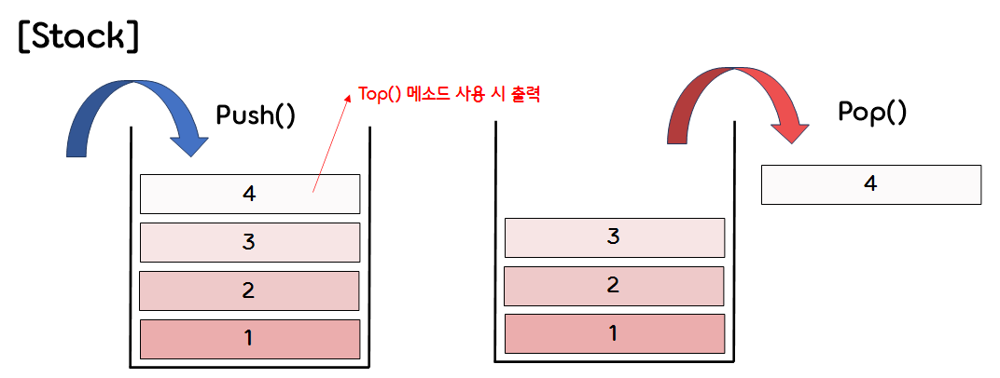</p>  
    </br>

### 1) **Stack ADT : Linked List implementation(링크드 리스트로 구현한 스택)**
- 코드 구현  
    ```c
    #include <stdio.h>
    #include <stdlib.h>

    #define ElementType int


    struct Node;
    typedef struct Node *PtrToNode;
    typedef PtrToNode Stack;

    Stack CreateStack(void);
    int IsEmpty(Stack S);
    void MakeEmpty(Stack S);
    void Push(ElementType X, Stack S);
    void Pop(Stack S);
    ElementType Top(Stack S);
    void PrintStack(Stack S);


    /* 스택 노드 구조체 */
    struct Node {
        ElementType element;
        PtrToNode next;
    };
    ```  
    ```c
    int main()
    {
        Stack S = CreateStack();

        Push(1, S);
        Push(2, S);
        Push(3, S);
        Push(4, S);
        PrintStack(S);

        printf("Current Top : %d\n", Top(S));
        
        Pop(S);
        PrintStack(S);

        MakeEmpty(S);
        PrintStack(S);

        free(S);

        return 0;
    }
    ```  
    ```c
    /* 비어 있는 스택을 생성한다. */
    Stack CreateStack(void)
    {
        Stack S;
        S = malloc(sizeof(struct Node));
        S->next = NULL;

        if (S == NULL) {
            printf("Out of space!!!\n");
            exit(1);
        }

        MakeEmpty(S);

        return S;
    }


    /* 스택이 비어 있는지 확인한다. */
    int IsEmpty(Stack S)
    {
        if (S->next == NULL)
            return 1;
        return 0;
    }


    /* 스택에 있는 모든 노드를 삭제(pop)한다. (비어 있는 스택을 만든다.)*/
    void MakeEmpty(Stack S)
    {
        if (S == NULL)
            printf("Must use CreateStack first.\n");
        else
        {
            while(!IsEmpty(S))
                Pop(S);
        }
    }
    ```
- 스택 Push 메소드
    <p align="center">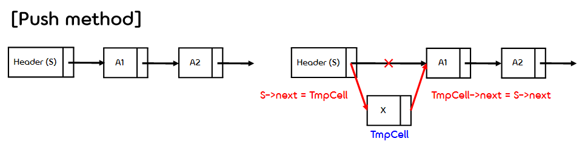</p>  

    ```c  
    /* 스택의 최상단에 노드를 삽입한다. */
    void Push(ElementType X, Stack S)
    {
        PtrToNode TmpCell;
        TmpCell = malloc(sizeof(struct Node));

        if (TmpCell == NULL)
        {
            printf("Out of space!!!\n");
            exit(1);
        }
        else
        {
            TmpCell->element = X;
            TmpCell->next = S->next;
            S->next = TmpCell;
        }
    }
    ```  
- 스택 Pop 메소드
    <p align="center">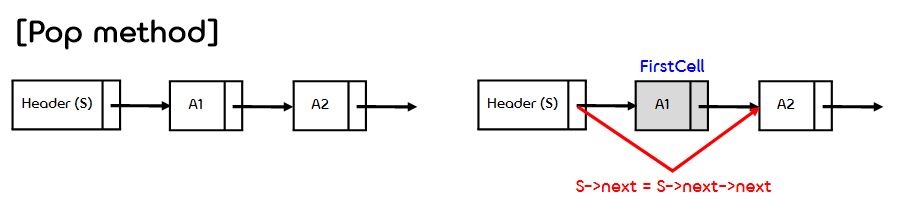</p>  

    ```c
    /* 스택의 최상단에 있는 노드를 반환(데이터) 및 제거한다. */
    void Pop(Stack S)
    {
        PtrToNode FirstCell;

        if (IsEmpty(S))
        {
            fprintf(stderr, "Empty stack.\n");
            exit(1);
        }
        else
        {
            FirstCell = S->next;
            S->next = S->next->next;
            free(FirstCell);
        }
    }
    ```  
    ```c
    /* 스택의 최상단(노드)에 있는 데이터를 반환한다. */
    ElementType Top(Stack S) {
        if(!IsEmpty(S))
            return S->next->element;
        fprintf(stderr, "Empty stack.\n");
        return 0;
    }


    /* 스택의 최상단 노드에 있는 데이터부터 순차적으로 출력한다. */
    void PrintStack(Stack S)
    {
        PtrToNode TmpCell;

        if (IsEmpty(S))
        {
            fprintf(stderr, "Empty stack.\n");
            return;
        }
        else
        {
            TmpCell = S->next;

            printf("===========Show Stack==========\n");
            while (TmpCell)
            {
                printf("[%d]\n", TmpCell->element);
                TmpCell = TmpCell->next;
            }
            printf("===============================\n");
        }
    }
    ```  
    ```
    ===========Show Stack==========
    [4]
    [3]
    [2]
    [1]
    ===============================
    Current Top : 4
    ===========Show Stack==========
    [3]
    [2]
    [1]
    ===============================
    Empty stack.
    ```
    </br>

### 2) **Stack ADT : Array implementation(배열로 구현한 스택)**  
- 코드 구현
    ```c
    #include <stdio.h>
    #include <stdlib.h>

    #define EmptyTOS (-1)
    #define MinStackSize (5)
    #define ElementType int


    struct StackRecord;
    typedef struct StackRecord* Stack;

    Stack CreateStack(int MaxElements);
    int IsEmpty(Stack S);
    int IsFull(Stack S);
    void MakeEmpty(Stack S);
    void Push(ElementType X, Stack S);
    ElementType Top(Stack S);
    ElementType Pop(Stack S);
    void PrintStack(Stack S);


    /* 스택 구조체 */
    struct StackRecord
    {
        int capacity;
        int topOfStack;      // 스택 배열에 데이터가 들어갈 위치(인덱스)를 결정한다.
        ElementType *array;  // 스택 배열
    };
    ```  
    ```c
    int main()
    {
        Stack S = CreateStack(10);
        Push(1, S);
        Push(2, S);
        Push(3, S);
        Push(4, S);
        PrintStack(S);

        printf("Current Top : %d\n", Top(S));

        Pop(S);
        PrintStack(S);

        MakeEmpty(S);
        PrintStack(S);

        free(S->array);
        free(S);
    }
    ```  
    ```c
    /* 비어 있는 스택을 생성한다. */
    Stack CreateStack(int MaxElements)
    {
        Stack S;

        // 배열의 최소 크기(5)보다 작은 값을 지정한 경우
        if (MaxElements < MinStackSize)
        {
            fprintf(stderr, "Stack size is too small.\n");
            exit(1);
        }

        S = malloc(sizeof(struct StackRecord));
        if (S == NULL)
        {
            fprintf(stderr, "Out of space!!!\n");
            exit(1);
        }

        S->array = malloc(sizeof(ElementType) * MaxElements);
        if (S->array == NULL)
        {
            fprintf(stderr, "Out of space!!!\n");
            exit(1);
        }

        S->capacity = MaxElements;
        MakeEmpty(S);

        return S;
    }


    /* 스택이 비어 있는지 확인한다. */
    int IsEmpty(Stack S)
    {
        if (S->topOfStack == -1)
            return 1;
        return 0;
    }


    /* 스택이 가득 찼는지 확인한다. */
    int IsFull(Stack S)
    {
        if (S->topOfStack == S->capacity - 1)
            return 1;
        return 0;
    }


    /* 스택에 있는 모든 데이터를 삭제한다. (사실상 인덱스만 수정한다.)*/
    void MakeEmpty(Stack S)
    {
        // topOfStack을 -1로 만들어준다. (다시 Push할 때 0번째 인덱스부터 시작)
        S->topOfStack = EmptyTOS;
    }


    /* 스택의 최상단에 데이터를 삽입한다. */
    void Push(ElementType X, Stack S)
    {
        if (IsFull(S))
        {
            fprintf(stderr, "Out of space!!!\n");
            return;
        }
        else
            S->array[++S->topOfStack] = X;
    }


    /* 스택의 최상단에 있는 데이터를 반환한다. */
    ElementType Top(Stack S)
    {
        if (!IsEmpty(S))
            return S->array[S->topOfStack];
        else
        {
            fprintf(stderr, "Empty Stack.\n");
            return 0;
        }
    }


    /* 스택의 최상단에 위치해 있는 데이터를 반환 및 삭제한다. */
    ElementType Pop(Stack S)
    {
        if(IsEmpty(S))
        {
            fprintf(stderr, "Empty Stack.\n");
            return 0;
        }
        else
        {
            int temp = S->topOfStack;
            S->topOfStack--;
            return temp;
        }
    }


    /* 스택의 최상단 데이터부터 순차적으로 출력한다. */
    void PrintStack(Stack S)
    {
        if (IsEmpty(S))
        {
            fprintf(stderr, "Empty stack.\n");
            return;
        }
        else
        {
            int temp = S->topOfStack;
            printf("===========Show Stack==========\n");
            while (temp >= 0)
            {
                printf("[%d]\n", S->array[temp]);
                temp--;
            }
            printf("===============================\n");
        }
    }
    ```
    ```
    ===========Show Stack==========
    [4]
    [3]
    [2]
    [1]
    ===============================
    Current Top : 4
    ===========Show Stack==========
    [3]
    [2]
    [1]
    ===============================
    Empty stack.
    ```
    </br>

### 3) **Parentheses Matching(괄호 매칭)**

- 왼쪽에서 오른쪽으로 expression을 스캔한다.
- 왼쪽 괄호(u, left parenthesis)를 만나면, 왼쪽 괄호의 위치 인덱스를 스택에 삽입한다.
- 오른쪽 괄호(v, right parenthesis)를 만나면, 스택에서 가장 최근에 추가된 왼쪽 괄호  
(스택의 최상단 데이터)를 Pop하여 가져온 후, 서로의 인덱스를 괄호 쌍으로 매칭시킨다.
- 매칭된 괄호 쌍 (u, v)를 출력한다.  

    <p align="center">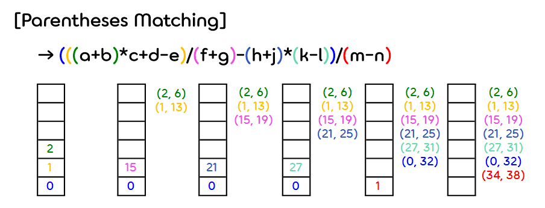</p>  
</br>


### 4) **Prefix, Infix, Postfix Notation(전위, 중위, 후위 표기법)**  

<p align="center">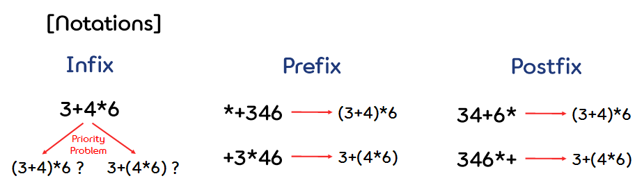</p>
 
- (1) **Infix Notation(중위 표기법)**
    - 중위 표기법은 연산자를 두 피연산자 사이에 표기하는 방법이다.  
    (우리가 일반적으로 사용하는 표기법이다.) 
    - 우리는 중위 표기법을 사용할 때 연산자의 우선순위를 자연스럽게 고려하기 때문에,  
    괄호가 없어도 쉽게 계산이 가능하다.
    - 하지만 컴퓨터에선 이런 우선순위를 계산하는 과정이 까다롭기 때문에, 다른 표기법을 채택한다.  
    </br>

- (2) **prefix Notation(전위 표기법)**
    - 전위 표기법은 연산자를 피연산자 앞에 표기하는 방법이다.  
    - 연산 순서가 쉽게 결정된다. (괄호가 불필요하다.)  
    </br>

- (3) **Postfix Notation(후위 표기법)**
    - 연산자를 피연산자 뒤에 표기하는 방법이다.
    - 수식의 처음부터 끝까지 그대로 읽어가면서 처리할 수 있다.  
    (마찬가지로 괄호가 불필요하다.)
    - 후위 표기법은 컴파일러가 사용하는 표기법이기도 하다.  
    </br>  

- (4) **Stack ADT : Postfix expression**  
    - 참고 이미지
        <p align="center">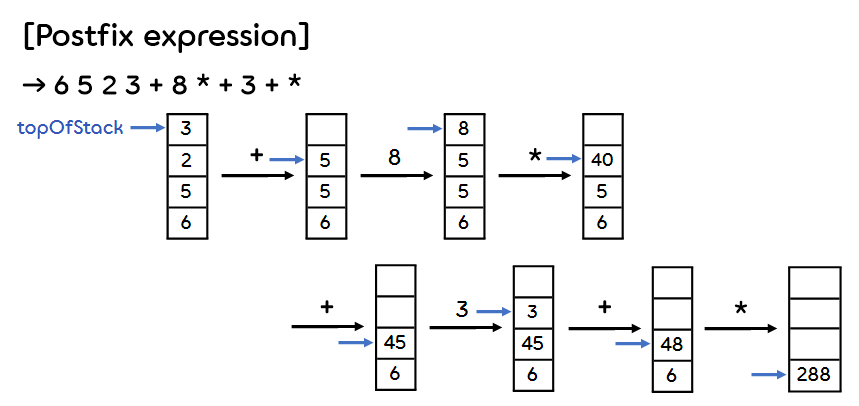</p>  
    </br>

    - 코드 구현  
        ```c
        // Stack에 관한 함수들이 이미 정의되어 있다고 가정한다.
        void postfix(Stack S);

        int main()
        {
            Stack S = CreateStack(10);
            
            postfix(S);

            free(S->array);
            free(S);  
        }

        /* Postfix expression을 받아 연산한 결과를 출력한다. (한 자리 숫자만 가능) */
        void postfix(Stack S)
        {
            int idx, tIdx;
            char expression[100];
            char word;

            idx = 0;

            printf("Postfix 수식을 입력하세요 : ");
            scanf("%s", expression);

            word = expression[0];

            while (word != '\0')
            {
                switch (word)
                {
                    case '0':
                    case '1':
                    case '2':
                    case '3':
                    case '4':
                    case '5':
                    case '6':
                    case '7':
                    case '8':
                    case '9':
                    {
                        int n = word - 48;
                        Push(n, S);
                        break;
                    }
                    case '+':
                    {
                        tIdx = S->topOfStack;
                        S->array[tIdx - 1] = S->array[tIdx - 1] + S->array[tIdx];
                        S->topOfStack--;
                        break;
                    }
                    case '-':
                    {
                        tIdx = S->topOfStack;
                        S->array[tIdx - 1] = S->array[tIdx - 1] - S->array[tIdx];
                        S->topOfStack--;
                        break;
                    }
                    case '*':
                    {
                        tIdx = S->topOfStack;
                        S->array[tIdx - 1] = S->array[tIdx - 1] * S->array[tIdx];
                        S->topOfStack--;
                        break;
                    }
                    case '/':
                    {
                        tIdx = S->topOfStack;
                        S->array[tIdx - 1] = S->array[tIdx - 1] / S->array[tIdx];
                        S->topOfStack--;
                        break;
                    }
                    default:
                    {
                        fprintf(stderr, "Wrong expression");
                        exit(1);
                    }
                }
                idx++;
                word = expression[idx];
            }
            // 연산 후 topOfStack이 0이 아니면 정상적인 expression이 아니다.
            if (S->topOfStack != 0)
            {
                fprintf(stderr, "Wrong expression");
                exit(1);
            }
            printf("Answer : %d\n", S->array[0]);
        }
        ```
        ```
        Postfix 수식을 입력하세요 : 6523+8*+3+*
        Answer : 288
        ```  
</br>

- (5) **Stack ADT : Infix to Postfix**
    - Algorithm for producing postfix from infix
        - ① 먼저 expression에 가능한 모든 괄호를 매칭한다.
        - ② 모든 연산자를 자신이 속한 괄호의 오른쪽으로 이동시킨다.
        - ③ 모든 괄호를 제거한다.  
    </br>

    - 참고 이미지(1)
        <p align="center">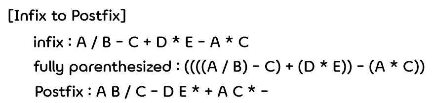</p>  

        </br>
    
    - **Stacking Rule (Priority Rule)**
        - Stack에 있는 연산자를 Stacking / UnStacking할 때, 우선 순위 규칙이 적용된다.
        - 기존의 Stack에 있던 연산자들의 Numerical한 우선순위가 새로운(in-coming) 연산자보다  
        크거나 같을 경우, 이 연산자들을 Stack에서 꺼내 Output에 넣고, 새로운 연산자를 Stack에 삽입한다.
        - 새로운 연산자의 우선순위가 더 크면, 새로운 연산자를 Stack에 삽입한다.
        - ※ 더 이상 input이 없으면, Stack에 있는 연산자들을 모두 Output에 넣는다. 
        - ※ Priority는 Isp (in-stack priority)와 Icp (in-comping priority)로 나뉜다.  
        ( Isp('(') = 0, Icp('(') = 20 / Isp(')') = 19 )  
        </br>

        - Priority Table
            |Priority|Operator|
            |:------:|:------:|
            |0       |(       |
            |19      |)       |
            |12      |+       |
            |12      |-       |
            |13      |*       |
            |13      |/       |
            |13      |%       |
            |0       |eos     |  
            </br>


    - 참고 이미지(2)
        <p align="center">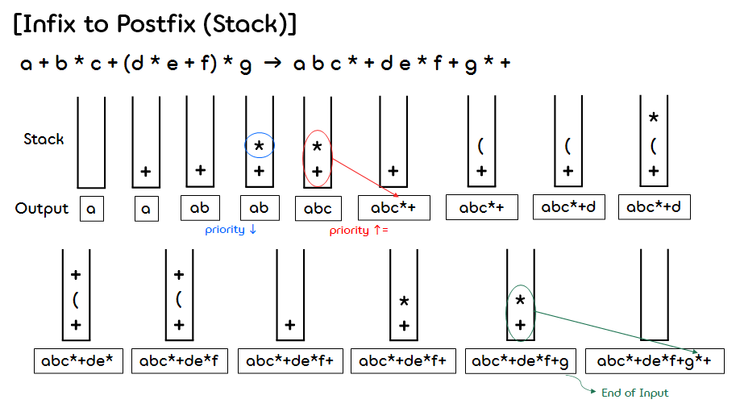</p>  
    
        </br>

    - 코드 구현
        ```c
        void postfix(void)
        {
            char symbol;
            precedence token;
            int n = 0;
            int top = 0;
            stack[0] = eos;

            for (token = getToken(&symbol, &n); token != eos; token = getToken(&symbol, &n))
            {
                if (token == operand)
                    printf("%c", symbol);
                else if (token == rparen) 
                {
                    while (stack[top] != lparen)
                        print_token(pop());
                    pop();                
                }
                else
                {
                    while (isp[stack[top]] >= icp[token])
                        print_token(delete(&top));
                    add(&top, token);
                }
            }
            while ((token = delete(&top)) != eos)
                print_token(token);
            print("\n");
        }
        ```
</br>

## ✔️ 2. **Queue(큐)**
- 리스트의 한쪽 끝에서 데이터의 삽입(Enqueue)이, 반대쪽 끝에서 삭제(Dequeue)가 이루어진다.
- 가장 먼저 들어온 데이터가 가장 먼저 나간다는 특징으로 인해 **FIFO(선입선출)** 구조를 지닌다고 한다.  
    <p align="center">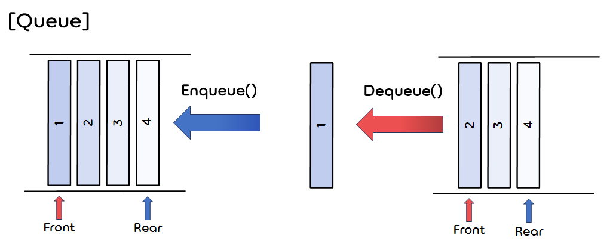</p>  
    </br>

### 1) **Queue ADT : Array Implementation(배열로 구현한 큐)**  
- 참고 이미지  
    <p align="center">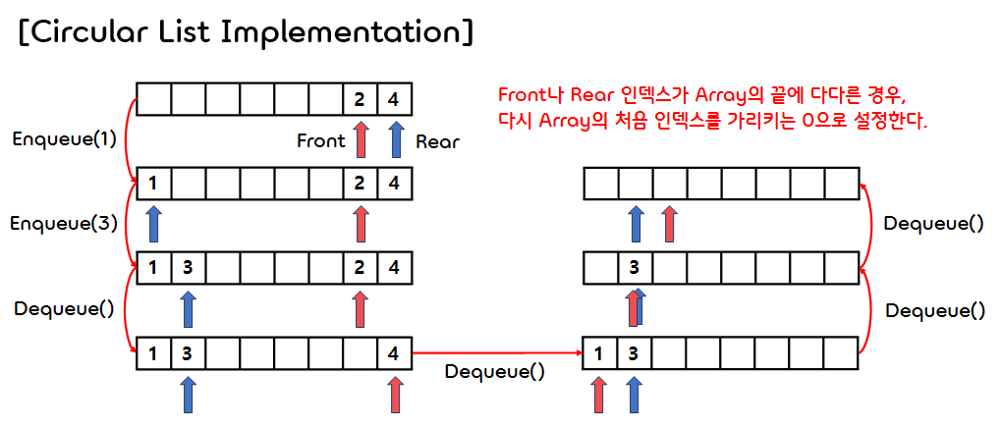</p>  
    </br>
    
- 코드 구현
    ```c
    #include <stdio.h>
    #include <stdlib.h>

    #define ElementType int
    #define TRUE 1
    #define FALSE 0


    typedef struct queueRecord cQueue;

    cQueue* CreateCircularQueue();
    void Enqueue(cQueue* cQueue, int X);
    int IsFull(cQueue* cQueue);
    void ShowQueue(cQueue* cQueue);
    int IsEmpty(cQueue* cQueue);
    void Dequeue(cQueue* cQueue);
    void MakeEmpty(cQueue* cQueue);


    /* 큐 구조체 */
    typedef struct queueRecord {
        int capacity;             // 배열 크기
        int front;     
        int rear;
        int size;                 // 배열에 들어있는 데이터의 개수
        ElementType *array;
    } cQueue;
    ```  
    ```c
    int main()
    {
        cQueue* cQueue;

        cQueue = CreateCircularQueue();

        printf("size: %d, front:%d , rear:%d\n", cQueue->size, cQueue->front, cQueue->rear);

        printf("Enqueue data 10\n");
        printf("Enqueue data 20\n");
        printf("Enqueue data 30\n");

        Enqueue(cQueue, 10);
        Enqueue(cQueue, 20);
        Enqueue(cQueue, 30);
        ShowQueue(cQueue);
        printf("size: %d, front: %d, rear:%d\n", cQueue->size, cQueue->front, cQueue->rear);

        printf("Dequeue\n");
        printf("Dequeue\n");
        Dequeue(cQueue);
        Dequeue(cQueue);
        ShowQueue(cQueue);
        printf("size: %d, front: %d, rear:%d\n", cQueue->size, cQueue->front, cQueue->rear);

        printf("Enqueue data 40\n");
        Enqueue(cQueue, 40);
        printf("size: %d, front: %d, rear:%d\n", cQueue->size, cQueue->front, cQueue->rear);

        printf("Enqueue data 50\n");
        Enqueue(cQueue, 50);
        printf("size: %d, front: %d, rear:%d\n", cQueue->size, cQueue->front, cQueue->rear);

        printf("Enqueue data 60\n");
        Enqueue(cQueue, 60);

        printf("Enqueue data 70\n");
        Enqueue(cQueue, 70);
        ShowQueue(cQueue);

        printf("Enqueue data 80\n");
        Enqueue(cQueue, 80);

        printf("Make queue empty.\n");
        MakeEmpty(cQueue);
        printf("size: %d, front: %d, rear:%d\n", cQueue->size, cQueue->front, cQueue->rear);

        free(cQueue->array);
        free(cQueue);

        return 0;
    }
    ```
    ```c
    /* 비어 있는 큐를 생성한다. */
    cQueue* CreateCircularQueue()
    {
        cQueue* pCQueue = NULL;

        pCQueue = (cQueue*)malloc(sizeof(cQueue));
        if (!pCQueue)
        {
            fprintf(stderr, "Out of Space!!!\n");
            exit(1);
        }

        pCQueue->capacity = 5;
        pCQueue->front = 1;
        pCQueue->rear = 0;
        pCQueue->size = 0;

        pCQueue->array = malloc(sizeof(ElementType) * pCQueue->capacity);
        if (!pCQueue->array)
        {
            fprintf(stderr, "Out of Space!!!\n");
            exit(1);
        }

        return pCQueue;
    }


    /* 큐의 front부터 rear에 있는 데이터까지 순차적으로 출력한다. */
    void ShowQueue(cQueue* cQueue)
    {
        int i;
        if (IsEmpty(cQueue) == TRUE)
        {
            printf("Circular Queue is Empty!\n");
            return;
        }
        printf("=========show queue=========\n");
        for (int i = cQueue->front; i != cQueue->rear; i = (i + 1) % cQueue->capacity)
            printf("[%d]\n", cQueue->array[i]);
        printf("[%d]\n", cQueue->array[cQueue->rear]);
        printf("============================\n");
    }


    /* 큐의 rear에 데이터를 삽입한다. */
    void Enqueue(cQueue* cQueue, ElementType X)
    {
        if (IsFull(cQueue))
        {
            fprintf(stderr, "Circular Queue is full!\n");
            return;
        }
        cQueue->size++;
        cQueue->rear = (cQueue->rear + 1) % cQueue->capacity;
        cQueue->array[cQueue->rear] = X;
    }


    /* 큐의 front에 있는 데이터를 삭제한다. */
    void Dequeue(cQueue* cQueue)
    {
        if (IsEmpty(cQueue) == TRUE)
        {
            fprintf(stderr, "Circular Queue is Empty!\n");
            return; 
        }
        cQueue->size--;
        cQueue->front = (cQueue->front + 1) % cQueue->capacity;
    }


    /* 큐가 가득 찼는지 확인한다. */
    int IsFull(cQueue* cQueue)
    {
        // 조건식을 다음과 같이 설정해도 된다. (cQueue->capacity == cQueue->size) 
        if (((cQueue->rear + 1) % cQueue->capacity == cQueue->front) && cQueue->size != 0)
            return TRUE;
        else
            return FALSE;
    }


    /* 큐가 비어 있는지 확인한다. */
    int IsEmpty(cQueue* cQueue)
    {
        if (cQueue->size == 0)
            return TRUE;
        else 
            return FALSE;
    }


    /* 큐에 있는 모든 데이터를 삭제한다. (사실상 인덱스만 수정한다.)*/
    void MakeEmpty(cQueue* cQueue)
    {
        cQueue->size = 0;
        cQueue->front = 1;
        cQueue->rear = 0;
    }
    ```
    ```
    size: 0, front:1 , rear:0
    Enqueue data 10
    Enqueue data 20
    Enqueue data 30
    =========show queue=========
    [10]
    [20]
    [30]
    ============================
    size: 3, front: 1, rear:3
    Dequeue
    Dequeue
    =========show queue=========
    [30]
    ============================
    size: 1, front: 3, rear:3
    Enqueue data 40
    size: 2, front: 3, rear:4
    Enqueue data 50
    size: 3, front: 3, rear:0
    Enqueue data 60
    Enqueue data 70
    =========show queue=========
    [30]
    [40]
    [50]
    [60]
    [70]
    ============================
    Enqueue data 80
    Circular Queue is full!
    Make queue empty.
    size: 0, front: 1, rear:0
    ```  
- 위와 같은 경우, 배열의 capacity가 초기화된 이후로 변하지 않기 때문에 capacity를 넘어가는 수의 데이터를 큐에 저장할 수 없다.  
- 이러한 문제를 해결하기 위해 동적배열(Dynamic Array)를 사용하여 큐를 구현한다.  
</br>

### 2) **Queue ADT : Dynamic Array Implementation(동적배열로 구현한 큐)**
- 큐의 배열이 가득 찬 상태에서 데이터를 추가하려는 경우, Doubling을 통해 배열의 크기를 2배로 늘린 후 데이터를 추가한다.  
(배열의 크기를 늘릴 때, 기존의 배열에 있던 데이터를 새로운 배열에 복사하는 과정이 필요하다.)  
</br>

- 참고 이미지  
    <p align="center">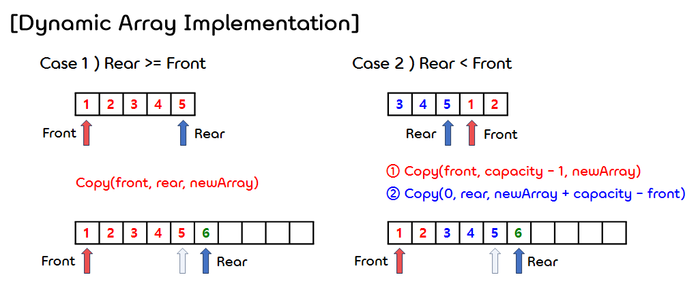</p>  
    </br>

- 코드 구현
    ```c
    // Queue에 관한 함수들이 이미 정의되어 있다고 가정한다.
    void DynamicEnqueue(cQueue* cQueue, int X);
    void copy(ElementType* start, ElementType* end, ElementType* newStart);
    void DoubleCapacity(cQueue* cQueue);  


    int main()
    {
        cQueue* cQueue;

        cQueue = CreateCircularQueue();

        printf("capacity : %d, size : %d, ", cQueue->capacity, cQueue->size);
        printf("front: %d, rear: %d\n", cQueue->front, cQueue->rear);

        printf("Enqueue data 10\n");
        Enqueue(cQueue, 10);
        printf("Enqueue data 20\n");
        Enqueue(cQueue, 20);
        printf("Enqueue data 30\n");
        Enqueue(cQueue, 30);
        printf("Enqueue data 40\n");
        Enqueue(cQueue, 40);
        printf("Enqueue data 50\n");
        Enqueue(cQueue, 50);
        printf("Enqueue data 60\n");
        Enqueue(cQueue, 60);

        printf("capacity : %d, size : %d, ", cQueue->capacity, cQueue->size);
        printf("front: %d, rear: %d\n", cQueue->front, cQueue->rear);
        ShowQueue(cQueue);

        printf("(Dynamic)Enqueue data 60\n");
        DynamicEnqueue(cQueue, 60);

        printf("capacity : %d, size : %d, ", cQueue->capacity, cQueue->size);
        printf("front: %d, rear: %d\n", cQueue->front, cQueue->rear);

        printf("Enqueue data 70\n");
        Enqueue(cQueue, 70);
        printf("Enqueue data 80\n");
        Enqueue(cQueue, 80);
        printf("Enqueue data 90\n");
        Enqueue(cQueue, 90);
        printf("Enqueue data 100\n");
        Enqueue(cQueue, 100);

        printf("(Dynamic)Enqueue data 110\n");
        DynamicEnqueue(cQueue, 110);

        printf("capacity : %d, size : %d, ", cQueue->capacity, cQueue->size);
        printf("front: %d, rear: %d\n", cQueue->front, cQueue->rear);
        ShowQueue(cQueue);
        
        free(cQueue->array);
        free(cQueue);

        return 0;
    }


    /* 큐의 rear에 데이터를 삽입한다. (동적 배열 이용) */ 
    void DynamicEnqueue(cQueue* cQueue, int X)
    {
        if (IsFull(cQueue))
        {
            // 큐가 가득 찼다면, capacity를 2배로 늘려준다.(Doubling) 
            DoubleCapacity(cQueue);
        }

        // 기존의 Enqueue 메소드와 동일하다.
        cQueue->size++;
        cQueue->rear = (cQueue->rear + 1) % cQueue->capacity;
        cQueue->array[cQueue->rear] = X;
    }


    /* start부터 end 위치까지에 있는 모든 데이터를 newStart 위치에 순차적으로 복사한다. */
    void copy(ElementType* start, ElementType* end, ElementType* newStart)
    {
        int iterCount = end - start;
        // 0부터 end - start 번 인덱스까지 반복한다.
        for (int i = 0; i <= iterCount; i++)
            newStart[i] = start[i];  
    }


    /* 기존 배열의 2배의 크기를 갖는 배열을 새로 만들어 재할당한다. */
    void DoubleCapacity(cQueue* cQueue)
    {
        // 기존 배열의 2배의 크기를 갖는 배열을 만든다.
        ElementType* newArray = NULL;
        newArray = malloc(sizeof(ElementType) * cQueue->capacity * 2);

        if (!newArray)
        {
            fprintf(stderr, "Out of Space!!!\n");
            exit(1);
        }

        // rear가 front보다 더 앞에 있거나 같은(1개의 data) 경우 (전체를 복사한다.)
        if (cQueue->rear >= cQueue->front)
        {
            copy(cQueue->array + cQueue->front, cQueue->array + cQueue->rear, newArray);
        }
        // front가 rear보다 더 앞에 있는 경우 (구간별로 나누어 복사한 뒤 합친다.)
        else
        {
            copy(cQueue->array + cQueue->front, cQueue->array + cQueue->capacity - 1, newArray);
            copy(cQueue->array, cQueue->array + cQueue->rear, newArray + cQueue->capacity - cQueue->front);
        }
        // front를 0번 인덱스로 설정한다.
        cQueue->front = 0;                    
        // rear를 가장 마지막 데이터가 위치한 인덱스로 설정한다.
        cQueue->rear = cQueue->capacity - 1;  
        // 기존 큐의 capacity를 2배로 만든다.
        cQueue->capacity = cQueue->capacity * 2;

        // 기존 배열의 메모리는 해제하고, 새로운 배열을 할당한다.
        free(cQueue->array);
        cQueue->array = newArray;
    }
    ```  
    ```
    capacity : 5, size : 0, front: 1, rear: 0
    Enqueue data 10
    Enqueue data 20
    Enqueue data 30
    Enqueue data 40
    Enqueue data 50
    Enqueue data 60
    Circular Queue is full!
    capacity : 5, size : 5, front: 1, rear: 0
    =========show queue=========
    [10]
    [20]
    [30]
    [40]
    [50]
    ============================
    (Dynamic)Enqueue data 60
    capacity : 10, size : 6, front: 0, rear: 5
    Enqueue data 70
    Enqueue data 80
    Enqueue data 90
    Enqueue data 100
    (Dynamic)Enqueue data 110
    capacity : 20, size : 11, front: 0, rear: 10
    =========show queue=========
    [10]
    [20]
    [30]
    [40]
    [50]
    [60]
    [70]
    [80]
    [90]
    [100]
    [110]
    ============================
    ```


