4.Skip List 
===
## < *Contents* >  
- [1. Skip List(스킵 리스트)](#%EF%B8%8F-1-skip-list스킵-리스트)
- [2. Equivalence Class(동치류)](#%EF%B8%8F-2-equivalence-class동치류)
- [3. Sparse Matrix Implementation(연결 리스트로 구현한 희소행렬)](#%EF%B8%8F-3-sparse-matrix-implementation연결-리스트로-구현한-희소행렬)

---  


## ✔️ 1. **Skip List(스킵 리스트)**
- 정렬된 연결 리스트에 이분검색 이론을 접합시킨 유사 연결 리스트이다.
- 모든 노드를 확인하면서 데이터를 탐색하는 것이 아니라, 몇몇 노드를 스킵하면서 탐색을 진행한다.  
    - 여러 계층(레벨)의 연결 리스트를 사용하여 구현한다.
    - 가장 높은 레벨부터 가장 낮은 레벨의 연결 리스트까지 순차적으로 탐색을 진행한다.
- 탐색/삽입/삭제 연산이 모두 평균적으로  정도 걸린다.  
- "Randomized Data Structure(랜덤화 자료구조)"이다.  
(입력되는 키 값과 상관없이, 난수에 의해 평균적인 성능이 달라진다.)  
</br>

### 1) **Perfect Skip List(완전 스킵 리스트)**
<p align="center">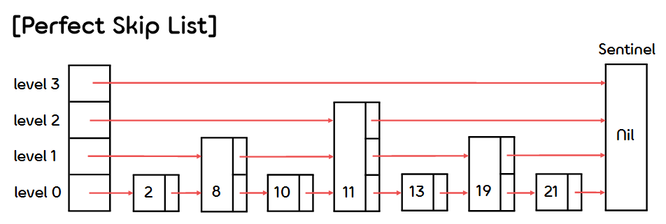</p>  

- i 레벨의 연결 리스트가 (i - 1) 레벨의 연결 리스트보다 1/2배 만큼 적은 수의 노드를 갖는다.  
(이때, i 레벨의 연속된 두 노드 사이에는 (i - 1) 레벨의 노드가 단 하나만 존재한다. - 규칙성)
- 탐색 연산은 으로 효율적이지만, 삽입/삭제 시 규칙성을 위해 Restructuring 을 거쳐야 하므로 비효율적이다.
- 스킵 리스트는 Randomization을 통해 어느정도 불균형을 주어 이러한 문제점을 보완한다.  
</br>

### 2) **Skip List(스킵 리스트)**
<p align="center">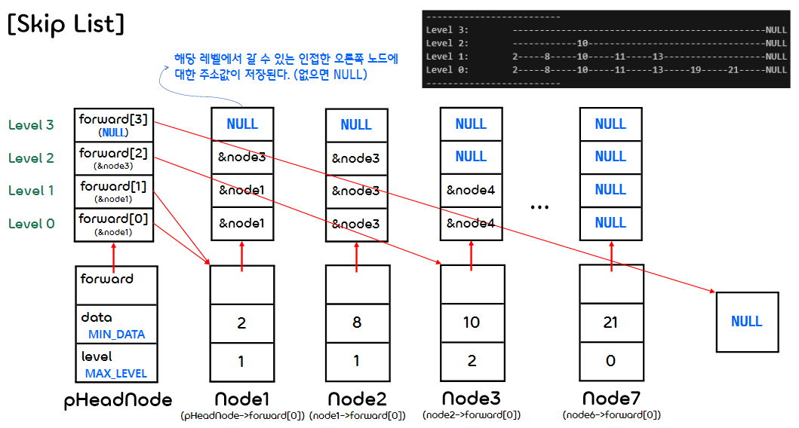</p>  

- 삽입되는 각각의 노드들은 의 확률로 상위 레벨을 가질 기회가 주어진다.  
    - 노드가 Level  를 가질 확률은  이다. (Level 0 에는 모든 노드가 포함된다.)  
    - 확률적으로 노드 레벨이 분포하게 된다.  
</br>

- 코드 구현
    ```c
    #include <stdio.h>
    #include <stdlib.h>
    #include <time.h>
    #include <limits.h>
    #include <math.h>

    #define MAX_LEVEL 3
    #define MIN_DATA INT_MIN


    typedef struct SkipNode SkipNode; 
    void ShowSkipList(SkipNode* pHeadNode);
    void SearchSkipList(SkipNode* pHeadNode, int data);
    void InsertSkipList(SkipNode** pHeadNode, int data);
    void DeleteSkipList(SkipNode** pHeadNode, int data);
    void FreeSkipList(SkipNode** pHeadNode);
    void FreeSkipNode(SkipNode* node);

    typedef struct SkipNode {
        int data;
        int level;
        struct SkipNode** forward;
    } SkipNode;
    ```
    ```c
    int main()
    {
        // Random 함수 시드 초기화
        srand(time(NULL));

        // 스킵 리스트 초기화 (헤더)
        SkipNode* SkipList = (SkipNode*)malloc(sizeof(SkipNode));
        SkipList->forward = (SkipNode**)malloc(sizeof(SkipNode*) * (MAX_LEVEL + 1));

        SkipList->level = MAX_LEVEL;
        SkipList->data = MIN_DATA;

        for (int i = 0; i <= SkipList->level; i++)
            SkipList->forward[i] = NULL;

        InsertSkipList(&SkipList, 2);
        InsertSkipList(&SkipList, 8);
        ShowSkipList(SkipList);

        InsertSkipList(&SkipList, 13);
        InsertSkipList(&SkipList, 21);
        ShowSkipList(SkipList);

        InsertSkipList(&SkipList, 11);
        InsertSkipList(&SkipList, 19);
        InsertSkipList(&SkipList, 10);
        ShowSkipList(SkipList);
        
        SearchSkipList(SkipList, 11);
        SearchSkipList(SkipList, 21);
        SearchSkipList(SkipList, 9);    // 스킵 리스트 범위 내에 포함되지만 존재하지 않는 경우
        SearchSkipList(SkipList, 0);  // 스킵 리스트 내 데이터의 최솟값보다 작은 경우
        SearchSkipList(SkipList, 100);  // 스킵 리스트 내 데이터의 최댓값보다 큰 경우

        DeleteSkipList(&SkipList, 11);
        DeleteSkipList(&SkipList, 12);  // 스킵 리스트 범위 내에 포함되지만 존재하지 않는 경우 
        DeleteSkipList(&SkipList, 1);   // 스킵 리스트 내 데이터의 최솟값보다 작은 경우
        DeleteSkipList(&SkipList, 30);  // 스킵 리스트 내 데이터의 최댓값보다 큰 경우

        ShowSkipList(SkipList);

        FreeSkipList(&SkipList);
    }
    ```
    ```c
    void ShowSkipList(SkipNode* pHeadNode)
    {
        SkipNode* pTmpNode = NULL;
        int i, j;

        // 레벨 별로 끝에 도달할 때까지 데이터 출력
        printf("-------------------------\n");
        for (i = MAX_LEVEL; i >= 0; i--)
        {
            pTmpNode = pHeadNode->forward[0];
            printf("Level %d:\t", i);
            while(pTmpNode != NULL)
            {
                if (pTmpNode->level >= i)
                    printf("%d-----", pTmpNode->data);
                else
                {
                    // data가 몇 자리인지에 따라 "-"의 출력 개수를 다르게 한다.
                    int tmp;
                    for (tmp = 0; pTmpNode->data / (int)pow(10, tmp + 1) != 0; tmp++);
                    tmp += 6;  // data가 한 자리 숫자일 때, 최소 길이 6 ("------")
                    for (; tmp > 0; tmp--)
                        printf("-");
                }

                pTmpNode = pTmpNode->forward[0];
            }
            printf("NULL\n");
        }
        printf("-------------------------\n");
    }
    ```
- 스킵 리스트 탐색 연산
    <p align="center">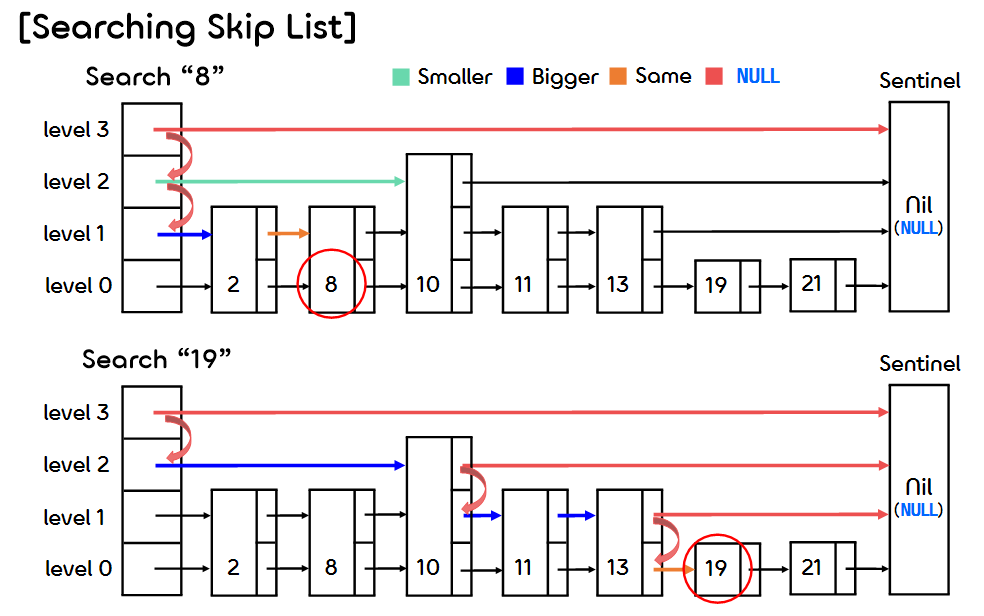</p>  

    ```c
    /* 스킵 리스트 안에서 해당 데이터를 탐색한다. */
    void SearchSkipList(SkipNode* pHeadNode, int data)
    {
        SkipNode* pTmpNode;

        // 찾고자 하는 데이터가 음수인 경우
        if (data < 0)
        {
            printf("Input data can't be negative.");
            return;
        }

        int pos = MAX_LEVEL;
        pTmpNode = pHeadNode->forward[pos];

        // (1) 현재 Level에 속한 노드가 없거나 data가 찾고자 하는 데이터보다 클 경우 Level을 감소시킨다.
        while (pTmpNode == NULL || pTmpNode->data > data)
        {
            pos--;

            if (pos < 0)  // 찾고자 하는 데이터가 스킵 리스트의 최솟값보다 작은 경우
            {
                printf("Search [%d] : ... there is no %d\n", data, data);
                return;
            }

            pTmpNode = pHeadNode->forward[pos];
        }
        
        printf("Search [%d] : ", data);

        // (2) 노드의 data가 찾고자 하는 데이터와 다를 경우
        while(pTmpNode->data != data)
        {
            // 현재 레벨에 속한 노드가 없거나 data가 찾고자 하는 데이터보다 클 경우 Level 감소시킨다.
            if (pTmpNode->forward[pos] == NULL || pTmpNode->forward[pos]->data > data)
            {
                pos -= 1;

                if (pos < 0)  // 찾고자 하는 데이터가 스킵 리스트 내부에 없는 경우
                {
                    printf("%d, ", pTmpNode->data);
                    printf("... there is no %d\n", data);
                    return;
                }
            }
            else
            {
                printf("%d, ", pTmpNode->data);
                pTmpNode = pTmpNode->forward[pos];
                // 노드의 data가 찾고자 하는 데이터와 같은 경우 
                if (pTmpNode->data == data)
                    break;
            }
        }
        printf("%d\n", pTmpNode->data);
    }
    ```
- 스킵 리스트 삽입 연산  
    <p align="center">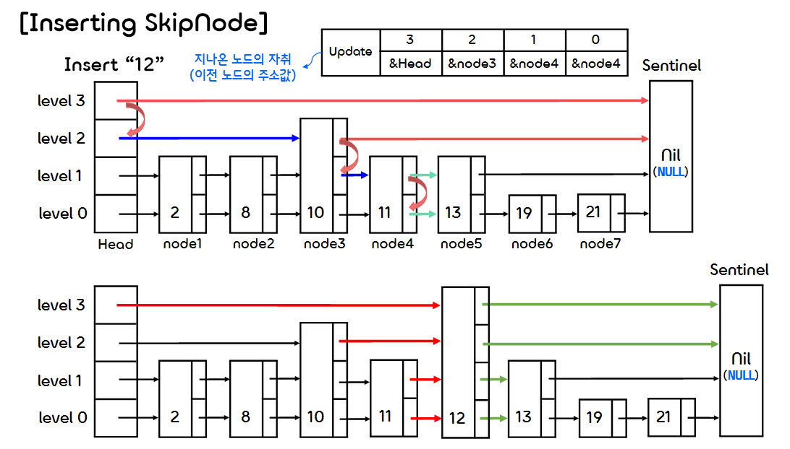</p>  

    ```c
    /* 스킵 리스트에 해당 데이터를 삽입한다. */
    void InsertSkipList(SkipNode** pHeadNode, int data)
    {
        if (data < 0)
        {
            printf("Input data can't be negative.");
            return;
        }

        int level = 0, i, pos = MAX_LEVEL;
        // 새로운 데이터를 삽입할 위치에 오기까지 레벨별로 지나온 모든 노드들의 레퍼런스가 담긴 배열
        SkipNode* Update[MAX_LEVEL + 1];      
        SkipNode* pTmpNode = *pHeadNode;

        // Update 배열을 초기화한다. (모든 element가 head 노드를 가리킨다.)
        for(i = 0; i <= MAX_LEVEL; i++)
            Update[i] = *pHeadNode;

        // 레벨별로 지나온 노드들을 Update 배열에 저장한다.
        for (i = MAX_LEVEL; i >= 0; i--)
        {
            // 현재 레벨에서 추가될 노드의 직전 노드로 이동한다.
            while (pTmpNode->forward[i] != NULL)
            {
                if ((pTmpNode->forward[i])->data >= data)
                    break;
                pTmpNode = pTmpNode->forward[i];
            }
            Update[i] = pTmpNode;
        }

        // 이미 해당 데이터가 스킵 리스트 안에 존재하는 경우
        if (pTmpNode->forward[0] != NULL && pTmpNode->forward[0]->data == data)
        {
            printf("[%d] already exists in the list., data");
            return;
        }

        // 추가할 노드의 최대 레벨을 계산한다.(Coin Flipping)
        while (rand() % 2)
        {
            level++;
            if (level >= MAX_LEVEL)
                break;
        }
        
        // 추가할 노드에 메모리를 할당하고, 초기화한다.
        pTmpNode = (SkipNode*)malloc(sizeof(SkipNode));
        pTmpNode->forward = (SkipNode**)malloc(sizeof(SkipNode*) * (MAX_LEVEL + 1));
        pTmpNode->level = level;
        pTmpNode->data = data;
        for (i = 0; i <= MAX_LEVEL; i++)
            pTmpNode->forward[i] = NULL;

        // 추가할 노드의 level만큼 앞 뒤에 연결된 노드들을 연결한다.
        for (i = pTmpNode->level; i >= 0; i--)
        {
            pTmpNode->forward[i] = Update[i]->forward[i];
            Update[i]->forward[i] = pTmpNode;
        }
        printf("Insert [%d] with level [%d]\n", data, level);
    }
    ```
- 스킵 리스트 삭제 연산
    <p align="center">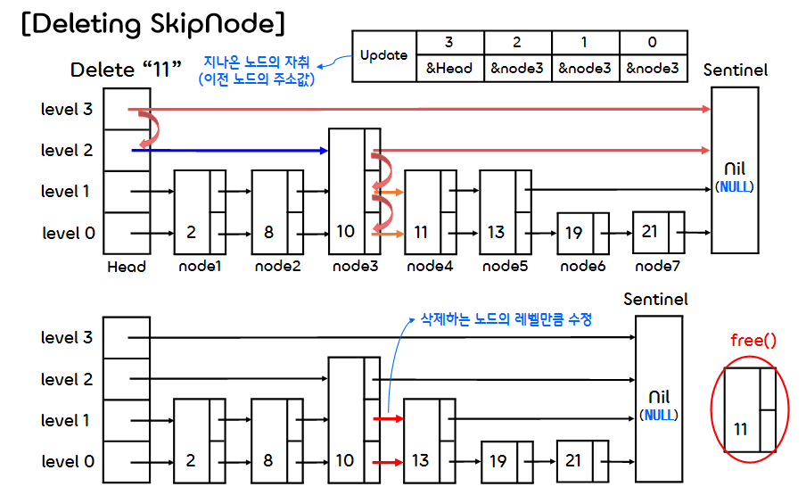</p>  

    ```c
    /* 스킵 리스트에 있는 해당 데이터를 삭제한다. */
    void DeleteSkipList(SkipNode** pHeadNode, int data)
    {
        // 삭제할 데이터가 음수인 경우
        if (data < 0)
        {
            printf("Input data can't be negative.");
            return;
        }

        int level = 0, i, pos = MAX_LEVEL;
        // 삭제할 노드의 위치에 오기까지 레벨별로 지나온 모든 노드들의 레퍼런스가 담긴 배열
        SkipNode* Update[MAX_LEVEL + 1];      
        SkipNode* pTmpNode = *pHeadNode;

        for(i = 0; i <= MAX_LEVEL; i++)
            Update[i] = *pHeadNode;

        for (i = MAX_LEVEL; i >= 0; i--)
        {
            while (pTmpNode->forward[i] != NULL)
            {
                if ((pTmpNode->forward[i])->data >= data)
                    break;
                pTmpNode = pTmpNode->forward[i];
            }
            Update[i] = pTmpNode;
        }
        // 삭제할 데이터를 갖는다고 예측되는 노드를 pCurNode에 저장한다.
        pTmpNode = pTmpNode->forward[0];

        // 삭제할 데이터가 스킵 리스트의 최대, 최소 범위를 벗어난 경우
        if (pTmpNode == NULL || (*pHeadNode)->forward[0]->data > data)
        {
            printf("[%d] does not exists in the list.\n", data);
            return;
        }
        // 예측된 노드가 삭제할 데이터를 갖고 있지 않은 경우
        else if (pTmpNode->data != data)
        {
            printf("[%d] does not exists in the list.\n", data);
            return;
        }

        // 삭제할 노드의 앞 뒤에 연결된 노드들을 연결한다.
        for (i = pTmpNode->level; i >= 0; i--)
            Update[i]->forward[i] = pTmpNode->forward[i];

        // 노드에 할당된 메모리를 해제한다.
        FreeSkipNode(pTmpNode);
        
        printf("Delete [%d] from the list.\n", data);
    }
    ```
    ```c
    /* 스킵 리스트에 할당된 모든 메모리를 해제한다. */
    void FreeSkipList(SkipNode** pHeadNode)
    {
        SkipNode *pCurNode = (*pHeadNode)->forward[0], *pNextNode;

        while (pNextNode != NULL)
        {
            pNextNode = pCurNode->forward[0];
            free(pCurNode->forward);
            free(pCurNode);
            pCurNode = pNextNode;
        }
        free((*pHeadNode)->forward);
        free(*pHeadNode);
    }


    /* 해당 노드에 할당된 모든 메모리를 해제한다. */
    void FreeSkipNode(SkipNode* node)
    {
        if (node)
        {
            free(node->forward);
            free(node);
        }
    }
    ```
    ```
    Insert [2] with level [1]
    Insert [8] with level [1]
    -------------------------
    Level 3:        ------------NULL
    Level 2:        ------------NULL
    Level 1:        2-----8-----NULL
    Level 0:        2-----8-----NULL
    -------------------------
    Insert [13] with level [1]
    Insert [21] with level [0]
    -------------------------
    Level 3:        --------------------------NULL
    Level 2:        --------------------------NULL
    Level 1:        2-----8-----13------------NULL
    Level 0:        2-----8-----13-----21-----NULL
    -------------------------
    Insert [11] with level [1]
    Insert [19] with level [0]
    Insert [10] with level [2]
    -------------------------
    Level 3:        -----------------------------------------------NULL
    Level 2:        ------------10---------------------------------NULL
    Level 1:        2-----8-----10-----11-----13-------------------NULL
    Level 0:        2-----8-----10-----11-----13-----19-----21-----NULL
    -------------------------
    Search [11] : 10, 11
    Search [21] : 10, 11, 13, 19, 21
    Search [9] : 2, 8, ... there is no 9
    Search [0] : ... there is no 0
    Search [100] : 10, 11, 13, 19, 21, ... there is no 100
    Delete [11] from the list.
    [12] does not exists in the list.
    [1] does not exists in the list.
    [30] does not exists in the list.
    -------------------------
    Level 3:        ----------------------------------------NULL
    Level 2:        ------------10--------------------------NULL
    Level 1:        2-----8-----10-----13-------------------NULL
    Level 0:        2-----8-----10-----13-----19-----21-----NULL
    -------------------------
    ```
- ※ 위와 같이 센티넬을 NULL이 아니라, 헤더 노드로 설정하여 스킵 리스트를 구현할 수도 있다.  
</br>


## ✔️ 2. **Equivalence Class(동치류)**
- Equivalence class(동치류)란 동치 관계에 있는 원소들의 집합을 말한다.  
(동치 관계 : 어떤 두 객체가 서로 "같다"는 개념을 추상화한다. 이항 관계의 일종이다.)
- 어떤 이항관계 ∼ 가 다음 세 조건을 만족시키면 이 이항관계 ∼ 를 동치 관계라고 한다.
    - (반사성, Reflexive)  a∼a
    - (대칭성, Symmetric)  a∼b → b∼a
    - (추이성, Transitive) (a∼b)∩(b∼c) → a∼c    
</br>

- Equivalence class를 찾는 알고리즘은 연결 리스트와 배열, 스택(개념적으로 이용)을 사용하여 구현한다. 
    <p align="center">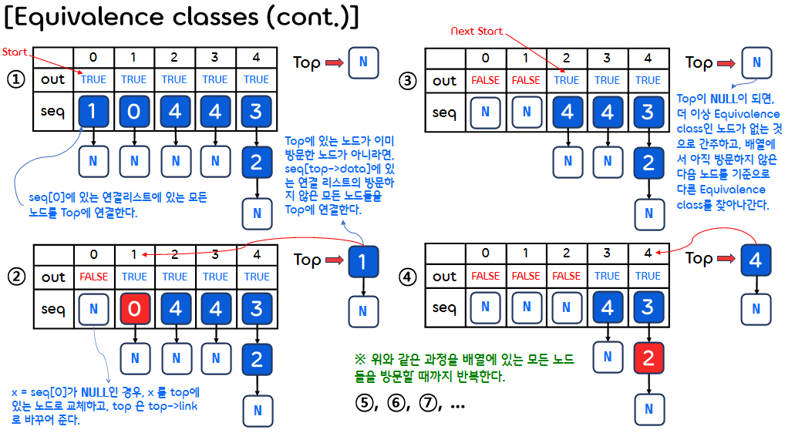</p>  
</br>

- 코드 구현
    ```c
    #include <stdio.h>
    #include <stdlib.h>

    #define MAX_SIZE 24
    #define FALSE 0
    #define TRUE 1

    /* 노드 구조체 */
    typedef struct node *NodePointer;
    typedef struct node {
        int data;
        NodePointer link;
    } node;
    ```
    ```c
    int main()
    {
        int out[MAX_SIZE];          // 방문 기록을 저장하는 배열
        NodePointer seq[MAX_SIZE];  // 연결된 노드(연결 리스트)들을 저장하는 배열
        NodePointer x, y, top;
        int i, j, n;

        printf("Enter the size (<= %d) ", MAX_SIZE);
        scanf("%d", &n);

        for (i = 0; i < n; i++)
        {
            out[i] = TRUE;
            seq[i] = NULL;
        }

        printf("Enter a pair of numbers (-1 -1 to quit): ");
        scanf("%d %d", &i, &j);

        while (i >= 0 || j >= 0)
        {
            // j를 데이터로 갖는 노드를 만들어 seq 배열의 i번 인덱스 위치에 추가한다.
            x = (NodePointer)malloc(sizeof(node));
            x->data = j;
            x->link = seq[i];
            seq[i] = x;
            
            // i를 데이터로 갖는 노드를 만들어 seq 배열의 j번 인덱스 위치에 추가한다.
            x = (NodePointer)malloc(sizeof(node));
            x->data = i;
            x->link = seq[j];
            seq[j] = x;

            printf("Enter a pair of numbers (-1 -1 to quit): ");
            scanf("%d %d", &i, &j);
        }

        for (i = 0; i < n; i++)
        {
            if (out[i])
            {
                printf("\nNew class: %5d", i);

                // 클래스 i를 탐색한다.
                out[i] = FALSE;
                x = seq[i];
                top = NULL;

                for (;;)
                {
                    while (x)
                    {
                        j = x->data;
                        // x가 아직 탐색되지 않은 노드인 경우
                        if (out[j]) {
                            printf("%5d", j);
                            out[j] = FALSE;  // 방문 기록(FALSE)을 저장하고

                            // x를 top에 저장하고, x를 해당 리스트의 다음 노드로 이동한다.
                            y = x->link;
                            x->link = top;
                            top = x;
                            x = y;
                        }
                        else  // x가 이미 탐색한 노드인 경우
                            x = x->link;
                    }
                    // top이 NULL이면 해당 Class에 속하는 모든 노드를 탐색한 경우에 해당한다.
                    if (!top)
                        break;
                    // 위치를 저장해뒀던 top으로 이동하여 위 과정(while문)을 반복한다.
                    x = seq[top->data];
                    top = top->link;
                }
            }
        }
        printf("\n");
    }
    ```
    ```
    Enter the size (<= 24) 5
    Enter a pair of numbers (-1 -1 to quit): 0 1
    Enter a pair of numbers (-1 -1 to quit): 2 4
    Enter a pair of numbers (-1 -1 to quit): 3 4
    Enter a pair of numbers (-1 -1 to quit): -1 -1

    New class:     0    1
    New class:     2    4    3
    ```  
    </br>

## ✔️ 3. **Sparse Matrix Implementation(연결 리스트로 구현한 희소행렬)**
- 0.Practice에서 구조체 배열을 사용하여 희소행렬을 만들고 연산하는 법을 대해 다뤘다면, 이번에는 연결 리스트를 사용하여 희소행렬을 어떻게 표현할 수 있을지에 대해 다룰 것이다.
- 먼저 희소행렬의 header node와 element node는 다음과 같이 나타낸다.
    <p align="center">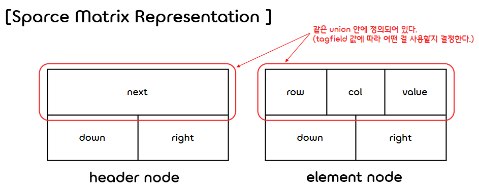</p>  

    - 이때, header node와 element node는 서로 다른 구조체가 아니라, 같은 구조체(MatrixNode)를 사용하여 만든다.
    - header node의 next 부분과 element node의 row, col, value 부분은 모두 구조체 내부 멤버인 union(공용체) 안에 정의되어 있다.  
    - 두 부분은 같은 메모리를 공유하기 때문에, 하나를 사용할 경우 다른 하나는 사용하지 않아야 한다.
    - 두 부분 중 어떤 것을 사용할지는 enum형 멤버인 tag에 따라 결정된다.
        - header node는 tag를 head로, element node는 tag를 entry로 설정한다.
        - 이는 둘을 구분하기 위한 일종의 안전장치일 뿐, 물리적인 효력은 없다.    
</br>

- 코드 구현  
    ```c
    #include <stdio.h>
    #include <stdlib.h>

    #define MAX_SIZE 50

    typedef enum {head, entry} tagfield;
    typedef struct MatrixNode* MatrixPointer;

    MatrixPointer NewNode(void);
    MatrixPointer MatrixRead(void);
    void MatrixWrite(MatrixPointer node);
    void MatrixErase(MatrixPointer* node);


    /* 실제 데이터(행, 열, 값)를 저장하는 부분 */
    typedef struct EntryNode {
        int row;
        int col;
        int value;
    } EntryNode;


    /* 희소행렬 노드 구조체 */
    typedef struct MatrixNode {
        MatrixPointer down;
        MatrixPointer right;
        tagfield tag;

        // tag가 head인 경우 next를 사용하고, tag가 entry인 경우 entry를 사용한다.
        union {
            MatrixPointer next;  // 행, 열의 기준이 되는 노드인 경우 (headnode)
            EntryNode entry;     // 실제 데이터를 담고 있는 노드인 경우 (element node)
        } u; 
    } MatrixNode;


    MatrixPointer headNode[MAX_SIZE];
    ```
    ```c
    int main()
    {
        MatrixPointer node = MatrixRead();
        MatrixWrite(node);
        MatrixErase(&node);
        return 0;
    }  
    ```
    ```c
    /* 새로운 노드를 생성하는 함수 */
    MatrixPointer NewNode(void)
    {
        MatrixPointer temp;
        temp = (MatrixPointer)malloc(sizeof(MatrixNode));
        return temp;
    }
    ```
- 행렬을 읽고 저장하는 함수 (동작 과정은 아래 이미지들을 참고한다.)
    <p align="center">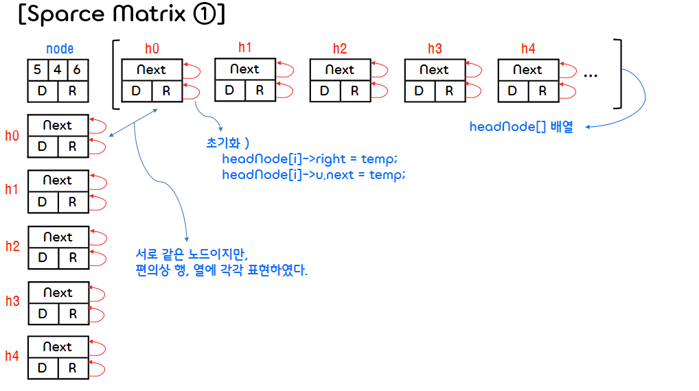</p>  
    <p align="center">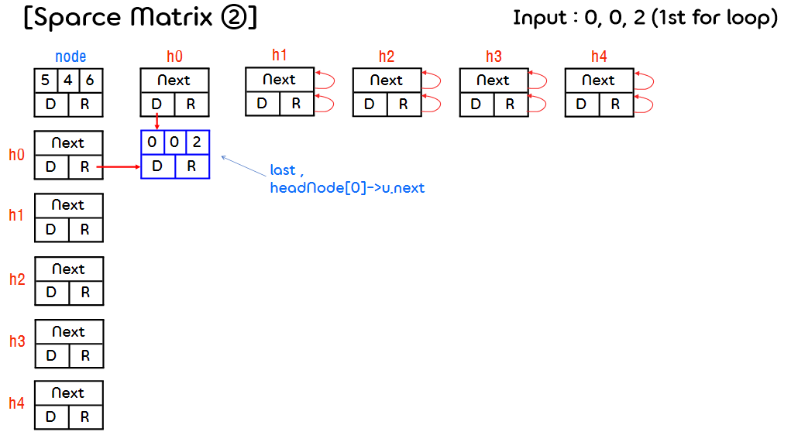</p>  
    <p align="center">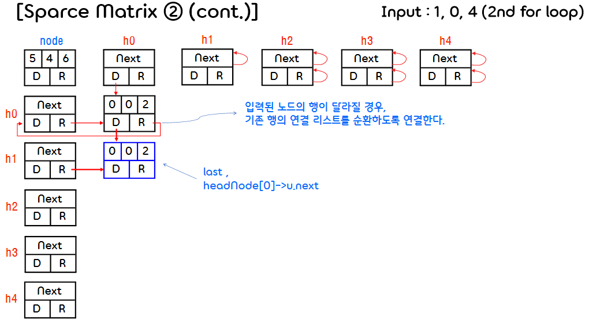</p>  
    <p align="center">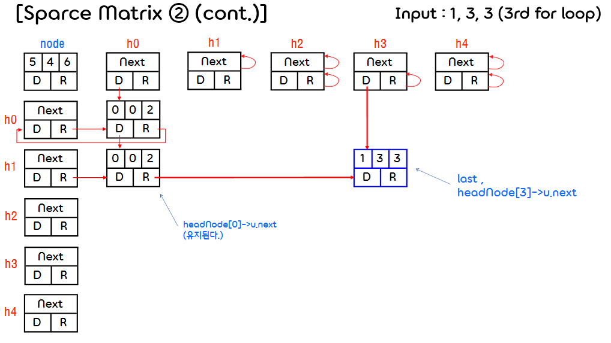</p>  
    <p align="center">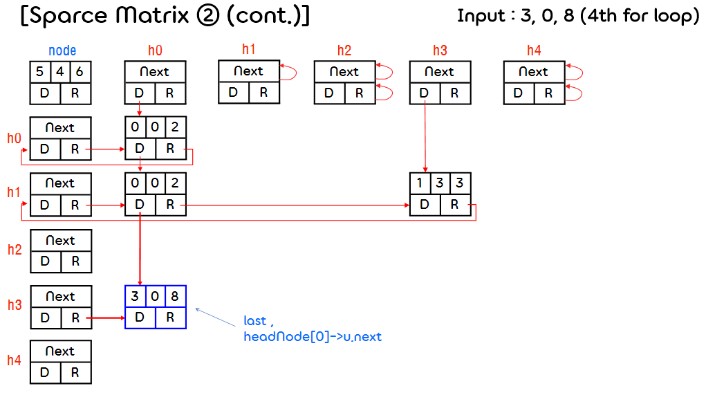</p>  
    <p align="center">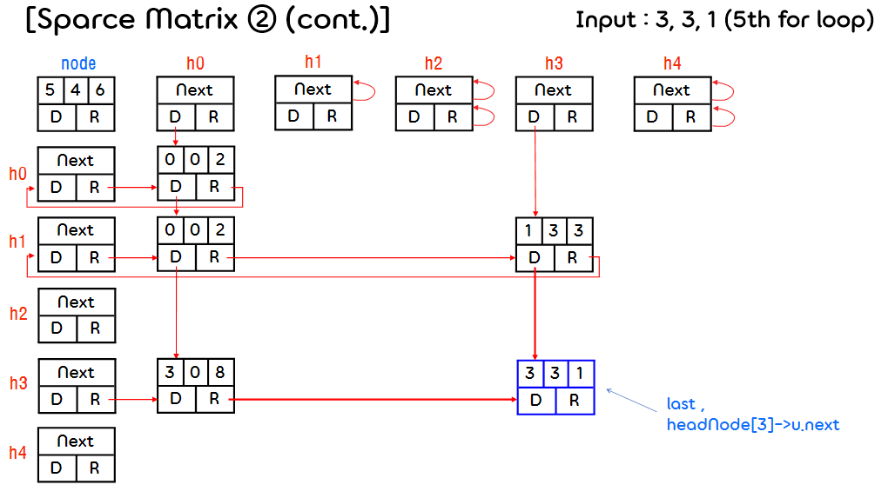</p>  
    <p align="center">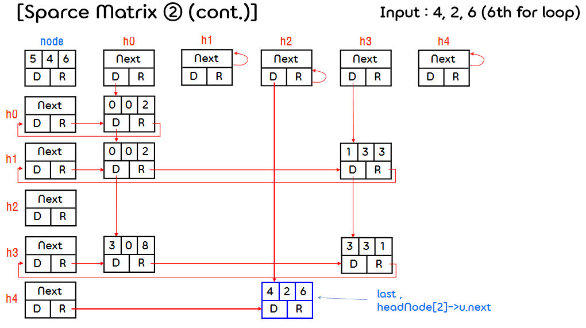</p>  
    <p align="center">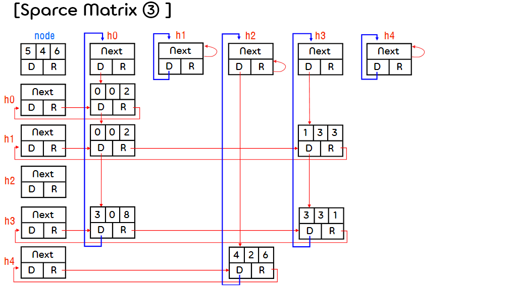</p>  
    <p align="center">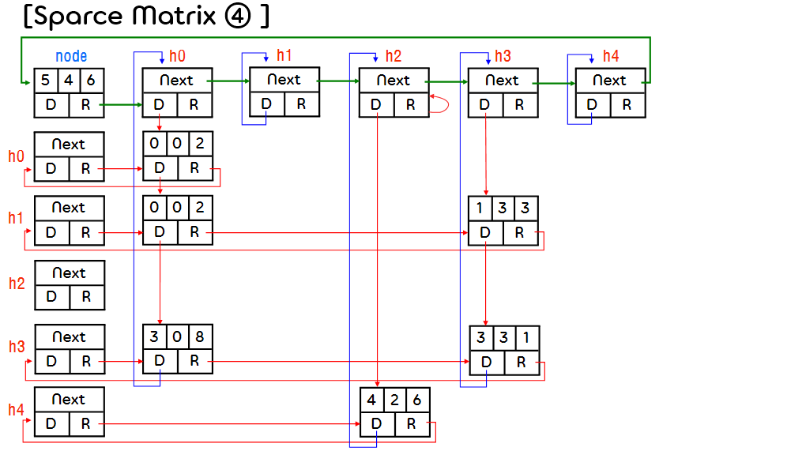</p>

    ```c
    /* 행렬을 읽고, 저장한 값을 반환하는 함수 */
    MatrixPointer MatrixRead(void)
    {
        int numRows, numCols, numTerms, numHeads, i;
        int row, col, value, currentRow;
        MatrixPointer temp, last, node;

        printf("Enter the number of rows, columns and the number of nonzero terms: ");
        scanf("%d %d %d", &numRows, &numCols, &numTerms);

        numHeads = (numCols > numRows) ? numCols : numRows;

        // 헤드 노드 생성
        node = NewNode();
        node->tag = entry;
        node->u.entry.row = numRows;
        node->u.entry.col = numCols;

        // 0x0 행렬인 경우
        if (!numHeads)
            node->right = node; 
        else
        // ① numHeads 만큼 headNode[] 배열에 기준 노드(headnode)들을 만든다.
        {
            for (i = 0; i < numHeads; i++)\
            {
                temp = NewNode();
                headNode[i] = temp;
                headNode[i]->tag = head;
                headNode[i]->right = temp;
                headNode[i]->u.next = temp;
            }
        }
        currentRow = 0;     
        last = headNode[0]; // 현재 행(0)의 마지막 노드 설정

        // ② 0이 아닌 데이터 개수만큼 반복하며 희소행렬에 각각의 노드들을 입력한다.
        for (i = 0; i <numTerms; i++)
        {
            printf("Enter row, column and value: ");
            scanf("%d %d %d", &row, &col, &value);

            // 입력 노드가 더 이상 현재 행에 속하지 않는 경우 (row가 더 큰 경우)
            if (row > currentRow)
            {
                last->right = headNode[currentRow];  // 행의 연결 리스트를 순환하도록 연결한다.
                currentRow = row;                    // 현재 행을 노드가 속한 행으로 바꿔준다.
                last = headNode[row];                // 현재 행이 속한 연결 리스트를 가리키는 headnode를 last에 저장한다.
            }
            // 노드를 만들고, 노드가 속한 행의 연결 리스트에 연결한다.
            temp = (MatrixPointer)malloc(sizeof(MatrixNode));
            temp->tag = entry;
            temp->u.entry.row = row;
            temp->u.entry.col = col;
            temp->u.entry.value = value;
            last->right = temp;
            last = temp;

            // 해당 열의 연결 리스트에도 연결시킨다.
            headNode[col]->u.next->down = temp;
            headNode[col]->u.next = temp;
        }
        // 마지막으로 작업이 끝난 노드가 속한 행의 연결 리스트를 순환하도록 연결한다.
        last->right = headNode[currentRow];

        // ③ 열의 연결 리스트를 순환하도록 연결한다.
        for (i = 0; i < numCols; i++)
            headNode[i]->u.next->down = headNode[i];

        // ④ 행, 열의 기준이 되는 노드들을 순환하도록 연결한다.
        for (i = 0; i < numHeads - 1; i++)
            headNode[i]->u.next = headNode[i+1];
        headNode[numHeads - 1]->u.next = node;
        node->right = headNode[0];
        
        return node;
    }
    ```  
    ```c
    /* 저장된 행렬을 출력하는 함수 */
    void MatrixWrite(MatrixPointer node)
    {
        int i;
        MatrixPointer temp, head = node->right;

        printf("\n numRows = %d, numCols = %d\n", node->u.entry.row, node->u.entry.col);
        printf("The matrix by row, column and value: \n\n");

        for (i = 0; i < node->u.entry.row; i++)
        {
            for (temp = head->right; temp != head; temp = temp->right)
            {
                printf("%5d%5d%5d\n", temp->u.entry.row, temp->u.entry.col, temp->u.entry.value);
            }
            head = head->u.next;  // 다음 행으로 이동
        }
    }


    /* 행렬에 저장된 모든 데이터를 삭제(메모리 해제)하는 함수 */
    void MatrixErase(MatrixPointer* node)
    {
        MatrixPointer x, y, head = (*node)->right;
        int i;

        for (i = 0; i < (*node)->u.entry.row; i++)
        {
            y = head->right;
            while (y != head)
            {
                x = y;
                y = y->right;
                free(x);
            }
            x = head;
            head = head->u.next;
            free(x);
        }
        y = head;
        while (y != *node)
        {
            x = y;
            y = y->u.next;
            free(x);
        }
        free(*node);
        *node = NULL;
    }
    ```  
    ```
    Enter the number of rows, columns and the number of nonzero terms: 5 4 6
    Enter row, column and value: 0 0 2
    Enter row, column and value: 1 0 4
    Enter row, column and value: 1 3 3
    Enter row, column and value: 3 0 8 
    Enter row, column and value: 3 3 1
    Enter row, column and value: 4 2 6

    numRows = 5, numCols = 4
    The matrix by row, column and value:

        0    0    2
        1    0    4
        1    3    3
        3    0    8
        3    3    1
        4    2    6

    ```