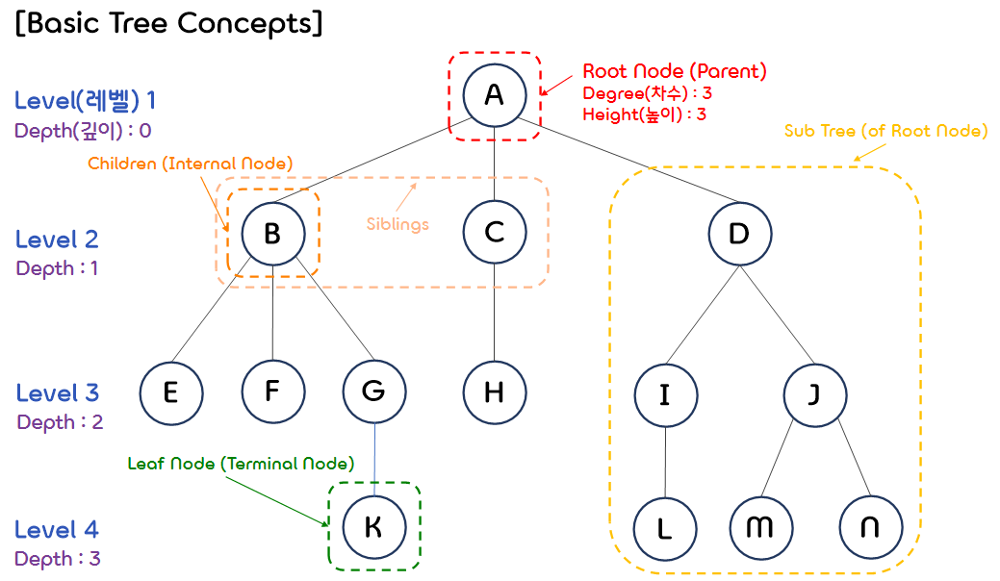
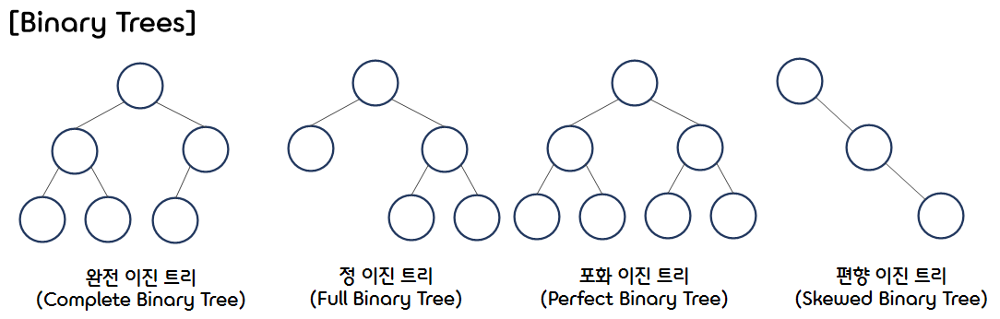
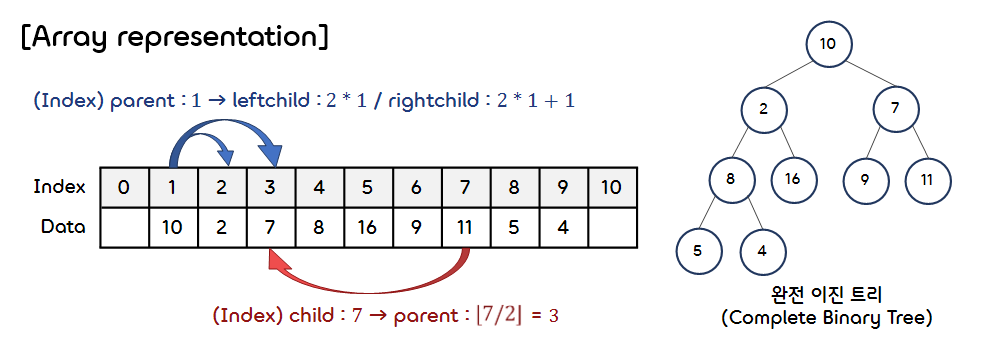
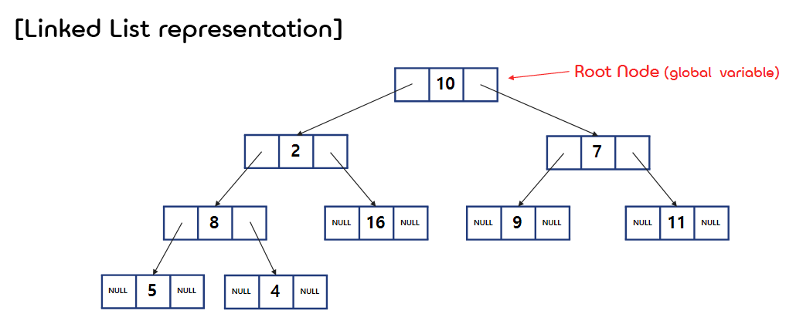
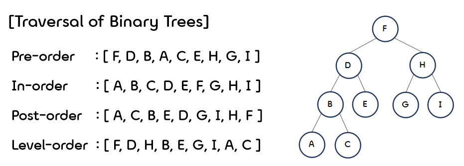
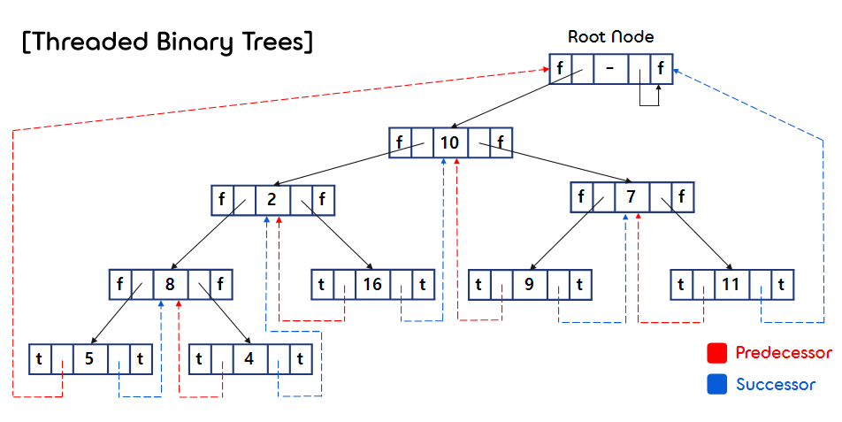

5.Binary Tree Basic
===

## < *Contents* >  
- [1. Basic Tree Concepts](#%EF%B8%8F-1-basic-tree-concepts)
- [2. Binary Trees(이진 트리)](#%EF%B8%8F-2-binary-trees이진-트리)
- [3. Binary Tree Representations](#%EF%B8%8F-3-binary-tree-representations)
- [4. Traversal of Binary Trees(이진 트리 순회)](#%EF%B8%8F-4-traversal-of-binary-trees이진-트리-순회)
- [5. Binary Tree Operations](#%EF%B8%8F-5-binary-tree-operations)
- [6. Threaded Binary Trees(스레드 이진 트리)](#%EF%B8%8F-6-threaded-binary-trees스레드-이진-트리)  

---  


## ✔️ 1. **Basic Tree Concepts**  

<p align="center"></p> 

- **트리(Tree)** 는 **노드(Node, Vertex)** 와 **간선(Edge, Branch)** 으로 구성된 **비선형적(Non-Linear)** 자료구조이다. 
    - 트리는 **한 개 이상의** 노드로 구성된 유한 집합이다.  
    - 트리는 **계층적(Hierarchical) 구조**를 나타내는 모델이다.
    - 트리에는 사이클(cycle)이 존재하지 않는다. (사이클 존재하면 그래프(Graph)에 해당한다.)  
    - 트리의 간선의 수는 노드의 수에서 1을 뺀 것과 같다. (N(Edge) = N(Node) - 1)  

</br>

- 최상위에 위치한 노드를 **루트 노드(Root Node)** 라고 부른다.  
(위 트리에서 루트 노드는 A에 해당한다.)  
</br>

- 각 노드는 단 하나의 **부모 노드(Parent Node)** 를 가지며, 여러 개의 **자식 노드(Child Node)** 를 가질 수 있다.  
(A의 자식 노드는 {B, C, D}이며, B, C, D 각각의 부모 노드는 A이다.)  
</br>

- 같은 부모 노드를 갖는 모든 노드를 **형제 노드(Sibling Node)** 라고 한다.  
({B, C, D}는 서로 형제 노드이며, {M, N}과 같은 경우도 서로 형제 노드이다.)  
</br>

- 부모 노드를 포함해 현재 노드보다 상위 계층에 있는 모든 노드들을 **조상 노드(Ancestor Node)** 라고 한다.   
(A의 조상 노드는 없으며, L의 경우 조상 노드는 {A, D, I}에 해당한다.)  
</br>

- 자식 노드를 포함해 현재 노드보다 하위 계층에 있는 모든 노드들은 **자손 노드(Descendant Node)** 라고 한다.  
(A의 경우 다른 모든 노드가 자손 노드이며, B의 경우 {E, F, G, K}를 자손 노드로 갖는다.)  
</br>  

- **단말 노드(Terminal Node, Leaf Node)** 는 자식 노드가 없는 노드이다.  
({E, F, K, H, L, M, N}은 모두 자식 노드를 갖지 않으므로, 단말 노드에 해당한다.)  
</br>

- **노드의 차수(Degree)** 란 특정 노드가 갖고 있는 자식 노드의 수를 말한다.  
(A의 차수는 3이며, B의 차수는 3, C의 차수는 1, J의 차수는 2이다.)  
</br>

- **트리의 차수(Degree of Tree)** 란 트리의 모든 노드 중 가장 높은 차수를 말한다.  
(위 트리의 차수는 3이다.)  
</br>

- 자신의 자식을 루트 노드로 하는 부분 트리를 **서브 트리(Sub Tree)** 라고 한다.  
(※ 특정 노드의 서브 트리의 개수와 차수는 동일하다.)  
</br>

- **노드의 레벨(Level)** 은 루트 노드를 1이라 했을 때, 루트 노드에서 특정 노드에 도달하기까지의 거리이다.  
(A의 레벨은 1, B의 레벨은 2, H의 레벨은 3, K의 레벨은 4이다.)  
</br>

- **노드의 깊이(Depth)** 는, 특정 노드의 조상 노드의 개수와 같다.  
(A의 깊이는 0, C의 깊이는 1, I의 깊이는 2, M의 깊이는 3이다.)  
</br>

- **트리의 높이(Height)** 란, 루트 노드에서 최하단에 존재하는 말단 노드에 이르기까지의 깊이의 최대치를 말한다.  
(최하단에 있는 단말 노드 K(또는 L, M, N)의 깊이가 3이므로, 이 트리의 높이는 3이다.)  
</br>

## ✔️ 2. **Binary Trees(이진 트리)**  
- 이진 트리(Binary tree)란 각 노드가 최대 두 개의 자식 노드를 갖는 트리를 말한다.  
    ```c
    typedef struct TreeNode *NodePointer;
    typedef struct TreeNode {
        ElementType Element;
        NodePointer Left;
        NodePointer Right;
    } TreeNode;
    ```  
    - 이진 트리는 일반적인 트리와 달리, **0개의 노드를 가질 수 있다.** (공집합인 이진 트리)  
    - 또한 일반적인 트리와 달리, 자식을 순서대로 구분한다. (왼쪽 자식 노드와 오른쪽 자식 노드)  

</br>

- Properties of Binary Trees  
    - Lemma 5.2 [Maximum number of nodes] 
        - (1) 이진 트리의 레벨 i에 있는 노드의 최대 개수는 개이다.  
        - (2) 높이가 h인 트리가 가질 수 있는 노드의 최대 개수는 개이다.  
        </br>  

    - Lemma 5.3 [Relation between leaf nodes and degree-2 nodes]  
        -  : 단말 노드(차수가 0인 노드)의 개수
        -  : 차수가 2인 노드의 개수  
        -   

            (임을 이용하여 도출할 수 있다.)  

            </br>

<p align="center"></p> 

### 1) **완전 이진 트리(Complete Binary Tree)** 
- 마지막 레벨을 제외하고, 모든 레벨이 완전히 채워진 이진 트리를 말한다.  
- 마지막 레벨은 꽉 차 있지 않아도 되지만, 노드가 왼쪽에서 오른쪽으로 채워져야 한다.  
(마지막 레벨 k에서는 개의 노드를 가질 수 있다.)  
- 완전 이진 트리는 배열을 사용해 효율적으로 표현할 수 있다.  
</br>

### 2) **정 이진 트리(Full Binary Tree)** 
- 모든 노드가 0개 또는 2개의 자식 노드를 갖는 이진 트리를 말한다.  
</br>

### 3) **포화 이진 트리(Perfect Binary Tree)**  
- 모든 레벨이 노드로 꽉 차 있는 이진 트리를 말한다.  
(정 이진 트리의 성질도 만족한다.)
- 모든 말단 노드가 동일한 깊이 또는 레벨을 갖는다.
- 트리의 노드 개수가 정확히 개이다.  (이때의 h는 트리의 높이이다.)  
</br>  

### 4) 편향 이진 트리(Skewed Binary Tree)  
- 모든 노드가 부모 노드의 왼쪽 자식 노드이거나, 부모 노드의 오른쪽 자식 노드인 트리를 말한다.  
- 높이가 h인 편향 이진 트리의 노드의 (최소) 개수는 개이다.  
</br>

## ✔️ 3. **Binary Tree Representations**  

### 1) Array Representation
- 완전 이진 트리는 배열을 사용하여 쉽게 표현할 수 있다.  

- Lemma 5.4 : in a complete binary tree, for any node i
    - (1) parent(i) =   
    - (2) leftchild(i) = 
    - (3) rightchild(i) =   

<p align="center"></p>  
</br>

### 2) Linked List Representation
- 배열을 사용하여 이진 트리를 구현하는 경우, 편향 이진 트리에 가까운 트리일 수록 메모리 낭비가 심해진다.
- 그리고 삽입과 삭제 연산 시, 데이터 복사 및 이동이 일어나기 때문에 비효율적이다.  
- 이러한 단점을 보완하기 위해 연결 리스트를 사용하여 이진 트리를 표현한다.  
    ```c
    /* 트리의 노드 구조체 */
    typedef struct Node *ThreadedPointer;
    typedef struct Node {
        ElementType data;
        ThreadedPointer leftChild;
        ThreadedPointer rightChild;
    } Node;
    ```  
<p align="center"></p>  
</br>

## ✔️ 4. **Traversal of Binary Trees(이진 트리 순회)**   
- 트리 순회(Traversal)란 트리에 있는 모든 노드들을 한 번씩 방문하는 것이다.  
- 트리 순회는 재귀 또는 스택, 큐를 활용한 반복문으로 구현할 수 있다.  

<p align="center"></p>   

### 1) **Pre-order Traversal(전위 순회)**  
- 트리를 전위 순회하는 방법은 다음과 같다.  
    - (1) 노드를 방문한다.
    - (2) 왼쪽 서브 트리를 전위 순회한다.  
    - (3) 오른쪽 서브 트리를 전위 순회한다.  
    ```c  
    void Preorder(ThreadedPointer node)
    {
        if (node)
        {
            printf("%d ", node->data);
            Preorder(node->leftChild);
            Preorder(node->rightChild);
        }
    }
    ```  
- DFS(깊이 우선 탐색)에 사용된다.  

</br>

### 2) **In-order Traversal(중위 순회)**  
- 트리를 중위 순회하는 방법은 다음과 같다.  
    - (1) 왼쪽 서브 트리를 중위 순회한다.
    - (2) 노드를 방문한다.
    - (3) 오른쪽 서브 트리를 중위 순회한다.  
    ```c  
    void Inorder(ThreadedPointer node)
    {
        if (node)
        {
            Inorder(node->leftChild);
            printf("%d ", node->data);
            Inorder(node->rightChild);
        }
    }
    ```   
- Binary Search Tree를 활용한 정렬 알고리즘에 사용된다.  

</br>

- Iterative In-order Traversal  
    - 스택(Stack)을 사용해서 중위 순회를 구현한다.
    ```c
    void IterInorder(treePointer node)
    {
        int top = -1;
        ThreadedPointer stack[MAX_STACK_SIZE];

        for (;;)
        {
            for(; node; node->leftChild)  // NULL일 때까지 왼쪽 자식 노드로 이동하면서
                push(node);               // 스택에 노드를 삽입한다.
            node = pop();                 // 스택의 top에 저장된 노드를 반환 및 제거한다.
            if (!node) break;             // 스택이 비어 있는 경우, 반복문을 종료한다.  
            printf("%d ", node->data);    // 노드를 방문(출력)한다.
            node = node->rightChild;      // 오른쪽 자식 노드로 이동한다.
        }
    }
    ```  
    - 스택을 사용하지 않고 트리를 순회하는 방법
        - (1) 각각의 노드에 부모 노드를 참조하는 ThreadedPointer 멤버를 만든다.  
        - (2) 스레드 이진 트리(Threaded Binary Tree)로 구현한다.  
</br>

### 3) **Post-order Traversal(후위 순회)**
- 트리를 후위 순회하는 방법은 다음과 같다.
    - (1) 왼쪽 서브 트리를 후위 순회한다.
    - (2) 오른쪽 서브 트리를 후위 순회한다.
    - (3) 노드를 방문한다.  
    ```c
    void Postorder(ThreadedPointer node)
    {
        if (node)
        {
            Postorder(node->leftChild);
            Postorder(node->rightChild);
            printf("%d ", node->data);
        }
    }
    ```
- 수식 트리(Expression Tree]를 순회할 때 주로 사용된다.  
</br>  

### 4) **Level-order Traversal(레벨 순서 순회)**  
- 모든 노드를 낮은 레벨부터 차례대로 순회한다.  
- 큐(Queue)를 사용해서 레벨 순서 순회를 구현한다.  
    ```c
    void LevelOrder(treePointer node)
    {
        int front = 0;
        int rear = 0;
        treePointer queue[MAX_QUEUE_SIZE];

        if (!node) return;     // 트리가 비어 있는 경우
        Enqueue(node);         // 루트 노드를 큐에 삽입한다.
        for(;;)
        {
            node = Dequeue();  // 큐의 front에 있는 데이터를 반환 및 삭제한다.
            if (node)
            {
                printf("%d ", node->data);     // 노드를 방문(출력)한다.
                if (node->leftChild)           // 왼쪽 자식 노드가 있으면 큐에 삽입한다.
                    Enqueue(node->leftChild);
                if (node->rightChild)          // 오른쪽 자식 노드가 있으면 큐에 삽입한다.
                    Enequeue(node->rightChild);
            }
            else  // 큐가 비어 있는 경우, 반복문을 종료한다.
                break; 
        }
    }
    ```  
</br>

## ✔️ 5. **Binary Tree Operations**  

### 1) Copying Binary Tree(이진 트리의 복사)
- 후위 순회 방식을 응용하여 구현한다.
    ```c
    ThreadedPointer copy(ThreadedPointer original)
    {
        ThreadedPointer temp;
        if (original)
        {
            temp = (ThreadedPointer)malloc(sizeof(Node));
            temp->leftChild = copy(original->leftChild);
            temp->rightChild = copy(original->rightChild);
            temp->data = original->data;
            return temp;
        }
        return NULL;
    }
    ```  
</br>

### 2) Testing Equality(이진 트리 동치 관계 검사)
- topology(두 개의 트리의 브랜치가 같은 순서대로 대응되는 것)와 data가 서로 같아야 한다.
    ```c
    int equal(ThreadedPointer first, ThreadedPointer second)
    {
        /*
        트리를 순회하면서 모든 노드에 대해
        1. 첫 번째 트리와 두 번째 트리의 노드 모두 NULL이거나,
        2. 첫 번째 트리와 두 번째 트리의 노드 모두 NULL이 아닐 때
           두 노드의 data, leftChild, rightChild가 모두 같은 경우
        TRUE를 반환하고, 아니면 FALSE를 반환한다.
        */
        return ((!first && !second) || ((first && second) && 
        (first->data == second->data) && 
        equal(first->leftChild, second->rightChild) && 
        equal(first->rightChild, second->rightChild)))
    }
    ```  
</br>

### 3) The satisfiability problem(충족 가능성 문제)
- 어떤 변수들로 이루어진 논리식이 주어졌을 때, 그 논리식이 참이 되는 변수값이 존재하는지를 찾는 문제이다.
- To be continued...  
</br>

## ✔️ 6. **Threaded Binary Trees(스레드 이진 트리)**  
- n개의 노드를 갖는 이진 트리에는 2n개의 링크가 존재한다.  
- 2n개의 링크 중에 (n + 1)개의 링크 값은 NULL이다.  
    - n개의 노드를 갖는 트리의 엣지의 개수(m)가 n - 1개이기 때문이다. (2n - (n - 1) = n + 1)  
- 이런 (n + 1)개의 낭비되는 NULL 링크를 유용한 정보를 갖도록 포인터로 대체한 것이 **스레드(Thread)** 이다.  
    - 어떤 노드 p의 **leftChild** 멤버인 경우, p의 **Inorder-Predecessor(이전 노드)** 를 저장한다.
    - 어떤 노드 p의 **rightChild** 멤버인 경우, p의 **Inorder-Successor(다음 노드)** 를 저장한다.  
- 스레드와 일반 포인터를 구분하기 위해 boolean 값(0, 1)을 갖는 두 개의 멤버를 사용한다.    
(ex) node->leftThread == TRUE 인 경우, node의 왼쪽 자식 노드는 스레드에 해당한다. )  
    ```c
    typedef struct ThreadedNode *ThreadedPointer;
    typedef struct ThreadedNode {
        ElementType data;
        ThreadedPointer leftChild;
        ThreadedPointer rightChild;
        int leftThread;         // leftChild가 스레드인지 확인하는 멤버
        int rightThread;        // rightChild가 스레드인지 확인하는 멤버
    } ThreadedNode;
    ```  

<p align="center"></p>  
</br>

- **In-order traversal of a threaded binary tree(스레드 이진 트리의 중위 순회)**  
    - x->rightThread == TRUE 인 경우,  
    x 노드의 In-order Successor는 x의 rightChild(스레드)이다.  
    - x->rightThread == FALSE 인 경우,  
    x 노드의 In-order Successor는 x의 오른쪽 자식 노드의 왼쪽 서브 트리의 가장 왼쪽 자식 노드이다.  
    ```c
    /* 스레드 이진 트리를 중위 순회하는 메소드 */
    void ThreadedInorder(ThreadedPointer tree)
    {
        ThreadedPointer temp = tree;

        for (;;)
        {
            temp = InSucc(temp);
            if (temp == tree) break;
            printf("%d  ", temp->data);
        }
        printf("\n");
    }
    ```
    ```c
    /* 원하는 노드의 In-order Successor(중위 후행자)를 찾아주는 메소드 */
    ThreadedPointer InSucc(ThreadedPointer node)
    {
        ThreadedPointer temp = node->rightChild;

        if (!node->rightThread)         // rightChild가 스레드가 아닌, (자식)노드인 경우
        {
            while (!temp->leftThread)   // 왼쪽 서브 트리의 맨 왼쪽 자식 노드로 이동한다.
                temp = temp->leftChild;
        }

        return temp;
    }
    ```


