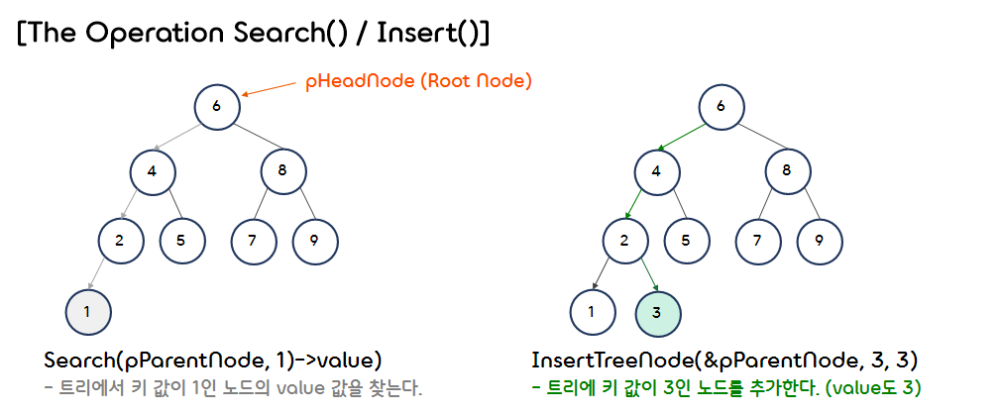
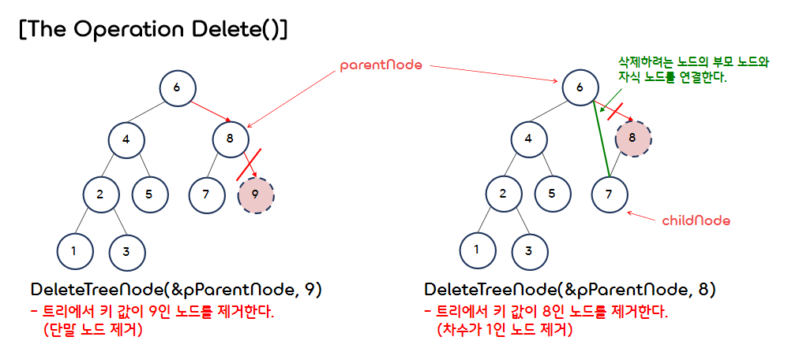
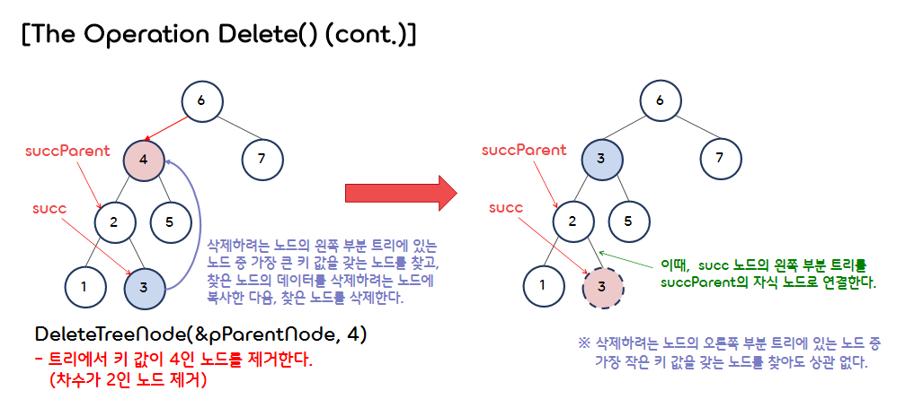

6.Binary Tree BST
===

## < *Contents* >  
- [1.Binary Search Trees(이진 탐색 트리)](#%EF%B8%8F-1-binary-search-trees이진-탐색-트리)

---  

## ✔️ 1. **Binary Search Trees(이진 탐색 트리)**  
- 이진 탐색 트리(BST)는 이진 트리를 기반으로, 이진 탐색(Binary Search)을 수행하기 위한 자료구조이다.
- 이진 탐색 트리의 조건은 다음과 같다.  
    - (1) 모든 노드의 키(Key) 값은 유일해야 한다. (힙(Heap)은 키 값이 유일하지 않아도 된다.)
    - (2) 특정 노드의 왼쪽 서브 트리에 있는 모든 노드들의 키 값은 해당 노드의 키 값보다 작다.
    - (3) 특정 노드의 오른쪽 서브 트리에 있는 모든 노드들의 키 값은 해당 노드의 키 값보다 크다.  
    - (4) 특정 노드의 왼쪽 서브 트리와 오른쪽 서브 트리 또한 이진 탐색 트리이다.  

</br>

- 코드 구현  
    ```c
    #include <stdio.h>
    #include <stdlib.h>

    #define ElementType int


    /* key와 value를 저장하는 구조체 */
    typedef struct Element
    {
        ElementType key;
        ElementType value;
    } Element;


    /* 이진 탐색 트리의 노드 구조체 */
    typedef struct Node* TreePointer;
    typedef struct Node
    {
        Element data;
        TreePointer leftChild;
        TreePointer rightChild;
    } Node;


    Element* Search(TreePointer tree, int key);
    Element* IterSearch(TreePointer tree, int key);
    void InsertTreeNode(TreePointer* tree, int key, ElementType value);
    void DeleteTreeNode(TreePointer* tree, int key);
    void PrintTreePreorder(TreePointer tree);
    void PrintTreeInorder(TreePointer tree);
    void PrintTreePostorder(TreePointer tree);
    void FreeTree(TreePointer* tree);
    ```
    ```c
    int main()
    {
        // 헤드 노드 설정
        Node* pParentNode = NULL;

        // ※ key값과 value값이 동일하게 설정하였다.
        InsertTreeNode(&pParentNode, 6, 6);
        InsertTreeNode(&pParentNode, 4, 4);
        InsertTreeNode(&pParentNode, 8, 8);
        InsertTreeNode(&pParentNode, 2, 2);
        InsertTreeNode(&pParentNode, 5, 5);
        InsertTreeNode(&pParentNode, 7, 7);
        InsertTreeNode(&pParentNode, 9, 9);
        InsertTreeNode(&pParentNode, 1, 1);

        printf("key[1] : %d\n", Search(pParentNode, 1)->value);
        printf("\n");    

        InsertTreeNode(&pParentNode, 3, 3);
        
        printf("Preorder : \n");
        PrintTreePreorder(pParentNode);
        printf("\nInorder : \n");
        PrintTreeInorder(pParentNode);
        printf("\nPostorder : \n");
        PrintTreePostorder(pParentNode);

        DeleteTreeNode(&pParentNode, 9);     // 단말 노드를 제거하는 경우
        DeleteTreeNode(&pParentNode, 8);     // 차수가 1인 노드를 제거하는 경우
        DeleteTreeNode(&pParentNode, 4);     // 차수가 2인 노드를 제거하는 경우

        printf("\n\n------After deleting nodes------");
        printf("\nInorder : \n");
        PrintTreeInorder(pParentNode);

        FreeTree(&pParentNode);
    }
    ```
- BST 탐색 / (노드) 삽입  
※ 시간 복잡도 :   
    <p align="center"></p>  

    ```c
    /* key값과 동일한 키 값을 갖는 노드의 Element 주소값을 반환한다. (재귀) */
    Element* Search(TreePointer tree, int key)
    {
        if (!tree)                              // key값을 키 값으로 갖는 노드가 없는 경우
            return NULL;
        if (key == tree->data.key)              // key값을 키 값으로 노드를 찾은 경우
            return &(tree->data);
        if (key < tree->data.key)               // key값이 해당 노드의 키 값보다 작은 경우
            return Search(tree->leftChild, key);
        return Search(tree->rightChild, key);   // key값이 해당 노드의 키 값보다 큰 경우
    }


    /* key값과 동일한 키 값을 갖는 노드의 Element 주소값을 반환한다. (반복문)*/
    Element* IterSearch(TreePointer tree, int key)
    {
        while (tree)
        { 
            if (key == tree->data.key)    
                return &(tree->data);
            if (key < tree->data.key)
                tree = tree->leftChild;
            else
                tree = tree->rightChild;
        }
        return NULL;
    }


    /* 이진 탐색 트리에 노드를 삽입한다. */
    void InsertTreeNode(TreePointer* tree, int key, ElementType value)
    {
        if ((*tree) == NULL)               // 해당 주소에 노드가 없는 경우
        {
            (*tree) = (TreePointer)malloc(sizeof(Node));
            (*tree)->data.key = key;
            (*tree)->data.value = value;
            (*tree)->leftChild = NULL;
            (*tree)->rightChild = NULL;
        }
        else if ((*tree)->data.key > key)  // 해당 주소에 있는 노드의 키 값이 더 큰 경우
        {
            InsertTreeNode(&((*tree)->leftChild), key, value);
        }
        else                               // 해당 주소에 있는 노드의 키 값이 더 작은 경우
        {
            InsertTreeNode(&((*tree)->rightChild), key, value);
        }
    }
    ```  
- BST (노드) 삭제  
※ 시간 복잡도 :    
    <p align="center"></p>  
    <p align="center"></p>  
 
    ```c
    /* 이진 탐색 트리에서 key를 키 값으로 갖는 노드를 삭제한다. */
    void DeleteTreeNode(TreePointer* tree, int key)
    {
        TreePointer p = (*tree);
        TreePointer parentNode = NULL;
        TreePointer childNode = NULL;
        TreePointer succParent, succ;

        // 삭제할 노드로 접근한다.
        while (p)
        { 
            if (key == p->data.key)    
                break;

            parentNode = p;  // 삭제할 노드의 부모 노드를 설정한다.

            if (key < p->data.key)
                p = p->leftChild;
            else
                p = p->rightChild;
        }

        // (1) 삭제할 노드가 없는 경우
        if (p == NULL)
            return;

        // (2) 삭제할 노드가 단말 노드인 경우
        if (!p->leftChild && !p->rightChild)
        {
            if (parentNode != NULL)
            {
                free(p);
                if (parentNode->leftChild == p)
                    parentNode->leftChild = NULL;
                else
                    parentNode->rightChild = NULL;
            }
            else
            {
                free(*tree);
                *tree = NULL;
            }
        }
        
        // (3) 삭제할 노드의 차수가 1인 경우 (자식 노드가 하나인 경우)
        else if (!p->leftChild || !p->rightChild)
        {
            if (p->leftChild)                // 왼쪽 자식 노드만 갖는 경우
                childNode = p->leftChild;
            else                             // 오른쪽 자식 노드만 갖는 경우
                childNode = p->rightChild;
            
            if (parentNode != NULL)          // 삭제할 노드가 헤드 노드가 아닌 경우
            {
                if (parentNode->leftChild == p)
                    parentNode->leftChild = childNode;
                else
                    parentNode->rightChild = childNode;
            }
            else                             // 삭제할 노드가 헤드 노드인 경우
                *tree = childNode;
        }

        // (4) 삭제할 노드의 차수가 2인 경우
        else
        {
            succParent = p;
            succ = p->leftChild;

            // 삭제할 노드의 왼쪽 서브 트리에서 가장 큰 키 값을 갖는 노드(succ)를 찾는다.
            while(succ->rightChild)
            {
                succParent = succ;
                succ = succ->rightChild;
            }

            // succ 노드(찾은 노드)의 왼쪽 부분 트리를 succParent의 자식 노드로 연결한다.
            if (succParent->leftChild == succ)
                succParent->leftChild = succ->leftChild;
            else
                succParent->rightChild = succ->leftChild;
            
            // 삭제하려는 노드에 succ 노드의 데이터를 복사한다.
            p->data.key = succ->data.key;
            p->data.value = succ->data.value;

            // succ 노드를 삭제한다.
            free(succ);
        }
    }
    ```  
- BST (전위, 중위, 후위) 순회  
※ 시간 복잡도 :   

    ```c
    /* 이진 탐색 트리를 전위 순회한다. */
    void PrintTreePreorder(TreePointer tree)
    {
        if (tree == NULL)
            return;
        printf("%3d", tree->data.value);
        PrintTreePreorder(tree->leftChild);
        PrintTreePreorder(tree->rightChild);   
    }


    /* 이진 탐색 트리를 중위 순회한다. */
    void PrintTreeInorder(TreePointer tree)
    {
        if (tree == NULL)
            return;
        PrintTreeInorder(tree->leftChild);
        printf("%3d", tree->data.value);
        PrintTreeInorder(tree->rightChild);   
    }


    /* 이진 탐색 트리를 후위 순회한다. */
    void PrintTreePostorder(TreePointer tree)
    {
        if (tree == NULL)
            return;
        PrintTreePostorder(tree->leftChild);
        PrintTreePostorder(tree->rightChild);   
        printf("%3d", tree->data.value);
    }
    ```
    ```c
    /* 이진 트리에 있는 모든 노드를 삭제한다. */
    void FreeTree(TreePointer* tree)
    {
        if (*tree == NULL)
            return;
        FreeTree(&((*tree)->leftChild));
        FreeTree(&((*tree)->rightChild));
        free(*tree);
        
        *tree = NULL;
    }
    ```  
    ```
    key[1] : 1

    Preorder :
    6  4  2  1  3  5  8  7  9
    Inorder :
    1  2  3  4  5  6  7  8  9
    Postorder :
    1  3  2  5  4  7  9  8  6

    ------After deleting nodes------
    Inorder :
    1  2  3  5  6  7
    ```