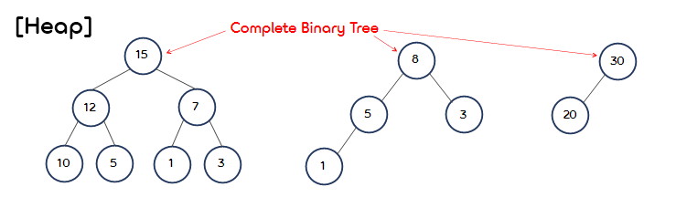
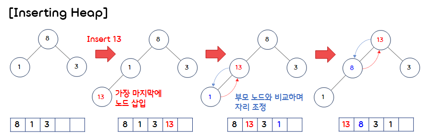
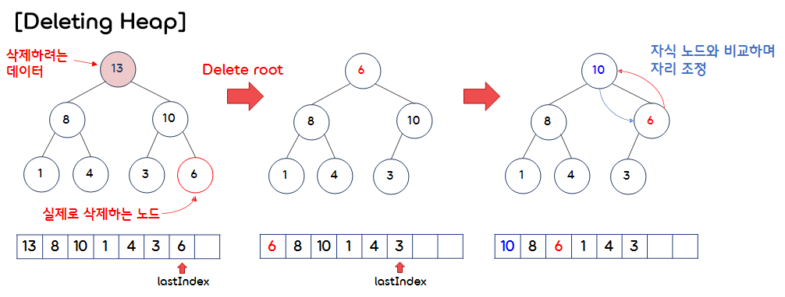
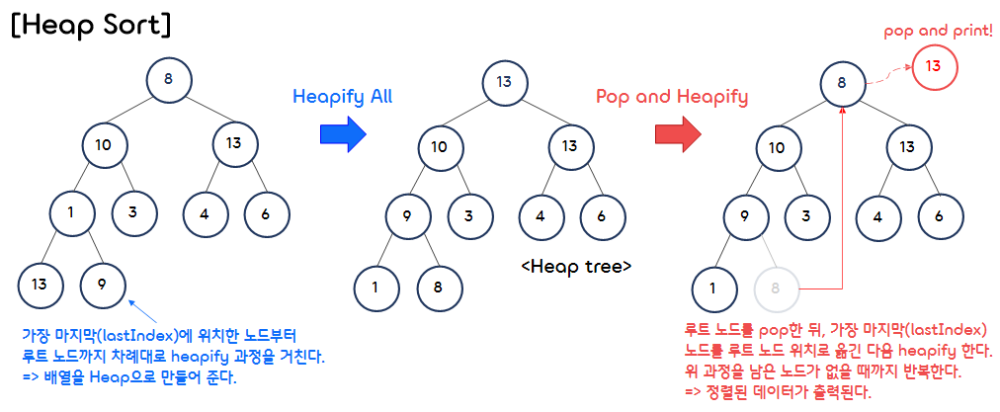

7.Binary Tree Heap
===

## < *Contents* >  
- [1. Heap(힙)](#%EF%B8%8F-1-heap힙)  

---  

## ✔️ 1. **Heap(힙)**  

<p align="center"></p>  

- 힙(Heap)은 완전 이진 트리를 기반으로, 최댓값 또는 최솟값을 빠르게 찾아낼 수 있는 자료구조이다.
- 힙의 특징은 다음과 같다. 
    - (1) 완전 이진 트리의 일종이다.
    - (2) Max Heap(최대 힙)의 경우, 각 노드의 키 값이 자식 노드의 키 값보다 크거나 같은 트리이다.  
     (Min Heap(최소 힙)은 각 노드의 키 값이 자식 노드의 키 값보다 작거나 같다.)  
    - (3) BST와 달리, 힙 트리에서는 중복된 키 값을 허용한다.  
    - (4) Partially Ordered(부분적으로 정렬된) Tree이다.  
     (키 값이 큰 노드가 상위 레벨에 있다는 정도로만 정렬된 트리이다.)
    - (5) 우선순위 큐(Priority Queue)를 구현하는데 사용된다.  
     (데이터가 들어간 순서와 상관없이 우선순위가 높은 데이터가 먼저 나오는 형태의 자료구조이다.)  

</br>  

### 1) **Max Heap(최대 힙)**  
- 부모 노드의 키 값이 자식 노드들의 키 값보다 크거나 같은 완전 이진 트리이다.  
- 삽입과 삭제 연산이 로 빠른 편에 속한다.  (우선순위 큐를 구현할 때 사용된다.)  

</br>

- 코드 구현  
    ```c
    #include <stdio.h>
    #include <stdlib.h>
    #include <math.h>

    #define MAX_NODES 50


    typedef struct heap Heap;
    void initHeap(Heap* heap);
    void insertHeap(Heap* heap, int data);
    void printHeap(Heap heap);
    void deleteData(Heap* heap);

    /* 최대 힙 구조체 */
    typedef struct heap
    {
        int nodes[MAX_NODES];
        int lastIndex;
    } Heap;
    ```  
    ```c
    int main()
    {
        Heap heap;

        initHeap(&heap);

        insertHeap(&heap, 1);
        insertHeap(&heap, 3);
        insertHeap(&heap, 8);
        insertHeap(&heap, 13);
        insertHeap(&heap, 4);
        insertHeap(&heap, 10);
        insertHeap(&heap, 6);

        printHeap(heap);

        deleteData(&heap);
        printHeap(heap);

        deleteData(&heap);
        printHeap(heap);

        return 0;
    }
    ```  
    ```c
    /* 힙을 초기화하는 메소드 */
    void initHeap(Heap* heap)
    {
        int i;
        for (i = 1; i < MAX_NODES; i++)
            heap->nodes[i] = 0;
        heap->lastIndex = 0;
    }


    /* 힙에 있는 모든 데이터를 출력하는 메소드 */
    void printHeap(Heap heap)
    {
        int i, count, newLineIndex;

        count = 1;
        newLineIndex = 0;

        for (i = 1; i <= heap.lastIndex; i++)
        {
            printf("%d\t", heap.nodes[i]);

            /* 깊이 0, 1, 2, ... n 에 있는 노드 1, 2, 4, ... 2^n 개를 차례대로 출력 */
            if (pow(2, newLineIndex) == count)
            {
                printf("\n");
                newLineIndex++;
                count = 0;
            }
            count++;
        }
        printf("\n");
    }
    ```
- 힙 삽입 연산  
    <p align="center"></p>   

    ```c
    /* 힙에 데이터를 삽입하는 메소드 */
    void insertHeap(Heap* heap, int data)
    {
        int index;

        // Heap이 가득 찬 경우
        if (heap->lastIndex == MAX_NODES - 1)
        {
            printf("Heap is full!\n");
            return;
        }

        // 새로운 Data가 들어갈 인덱스 설정
        heap->lastIndex++;
        index = heap->lastIndex;

        // 루트 노드까지 이동하거나, 부모 노드에 저장된 값이 더 커질 때까지 반복
        while ((index != 1) && data > heap->nodes[index / 2])
        {
            heap->nodes[index] = heap->nodes[index / 2];
            index /= 2;
        }
        heap->nodes[index] = data;
    }
    ```
- 힙 삭제 연산  
    <p align="center"></p>  

    ```c
    /* 힙에서 데이터(최댓값)를 삭제하는 메소드 */
    void deleteData(Heap* heap)
    {
        int temp, parentIndex, childIndex;

        // Heap이 비어 있는 경우
        if (heap->lastIndex == 0)
        {
            printf("Heap is Empty!");
            return;
        }

        // Heap에 루트 노드만 존재하는 경우
        if (heap->lastIndex == 1)
        {
            heap->nodes[heap->lastIndex] = 0;
            heap->lastIndex = 0;
            return;
        }

        // Heap에서 마지막 노드를 임시변수에 저장하고, 삭제한다.
        temp = heap->nodes[heap->lastIndex];
        heap->nodes[heap->lastIndex] = 0;
        heap->lastIndex--;

        parentIndex = 1;
        childIndex = 2;

        // 루트 노드부터 시작해서 자식 노드들의 데이터 값과 비교하여 업데이트한다. (heapify)
        while (childIndex <= heap->lastIndex)
        {
            // 형제 노드 중 값이 큰 노드를 선택한다.
            if (heap->nodes[childIndex] < heap->nodes[childIndex + 1])
                childIndex++;

            // 임시 변수에 저장된 값과 비교한다.
            if (temp > heap->nodes[childIndex])
                break;

            // 자식 노드의 값이 더 클 경우 부모 노드와 교체한다.
            heap->nodes[parentIndex] = heap->nodes[childIndex];
            parentIndex = childIndex;
            childIndex *= 2;
        }
        heap->nodes[parentIndex] = temp;
    }
    ```  
</br>

### 2) **Heap Sort(힙 정렬)**  

<p align="center"></p>  

- 힙 정렬이란 최대 힙 트리 또는 최소 힙 트리를 구성하여 데이터를 정렬하는 방법이다.  
(내림차순 정렬 시 최대 힙을 구성하고, 오름차순 정렬 시 최소 힙을 구성한다.)  
- 힙 정렬의 시간복잡도는 으로 빠른 편에 속한다.  

</br>

- 코드 구현  
    ```c
    #include <stdio.h>

    void swap(int *list, int idxA, int idxB);
    void heapify(int *list, int parentIndex, int lastIndex);
    int* makeHeap(int* list, int size);
    void heapSort(int* list, int size);


    int main()
    {
        int list[10] = {0, 8, 10, 13, 1, 3, 4, 6, 13, 9};
        heapSort(list, 9);
        return 0;
    }


    void swap(int *list, int idxA, int idxB)
    {
        int temp;

        temp = list[idxA];
        list[idxA] = list[idxB];
        list[idxB] = temp;
    }


    /* parentIndex에 위치한 노드가 힙 속성을 만족하도록 위치를 조정하는 메소드 */ 
    void heapify(int *list, int parentIndex, int lastIndex)
    {
        int childIndex, temp;

        childIndex = parentIndex * 2;
        temp = list[parentIndex];

        while (childIndex <= lastIndex)
        {
            // 형제 노드 중 값이 큰 노드를 선택한다.
            if (list[childIndex] < list[childIndex + 1])
                childIndex++;

            // 임시 변수에 저장된 값과 비교한다.
            if (temp > list[childIndex])
                break;

            // 자식 노드의 값이 더 클 경우 부모 노드와 교체한다.
            swap(list, parentIndex, childIndex);
            parentIndex = childIndex;
            childIndex *= 2;
        }
    }


    /* 정렬되지 않은 배열을 (최대) 힙으로 만드는 메소드 */
    int* makeHeap(int* list, int size)
    {
        int lastIndex, index, data, i;

        lastIndex = size;

        // 가장 마지막 노드부터 루트 노드까지 heapify한다.
        for (i = lastIndex; i >= 1; i--)
            heapify(list, i, lastIndex);

        return list;
    }


    /* 배열을 힙 정렬하여 내림차순으로 출력하는 메소드 */
    void heapSort(int* list, int size)
    {
        int* heapList;
        int lastIndex, temp, i;

        lastIndex = size;

        // 정렬되지 않은 배열을 힙으로 만든다.
        heapList = makeHeap(list, size);

        if (size <= 0)
        {
            printf("List is empty!");
            return;
        }

        // 가장 마지막 노드부터 루트 노드까지
        for (i = size; i >= 1; i--)
        {
            printf("%d ", heapList[1]);       // 루트 노드를 출력한다.
            temp = heapList[i];
            heapList[i] = 0;
            heapList[1] = temp;               // 마지막 노드를 루트 노드로 옮긴다.
            lastIndex--;
            heapify(heapList, 1, lastIndex);  // 루트 노드로 옮겨진 노드를 heapify한다.
        }
        printf("\n");
    }
    ```


