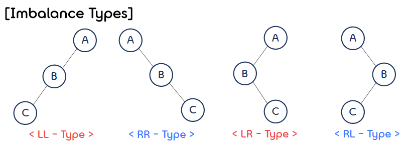
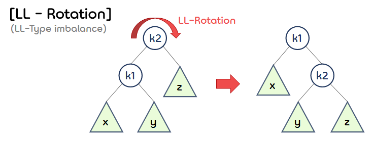
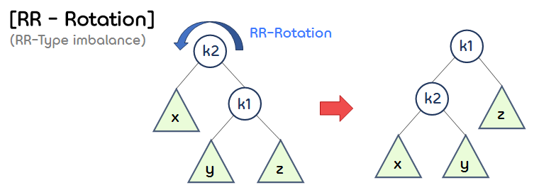
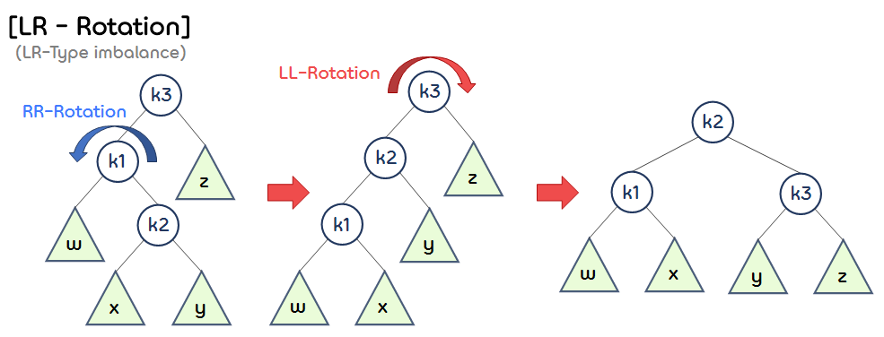
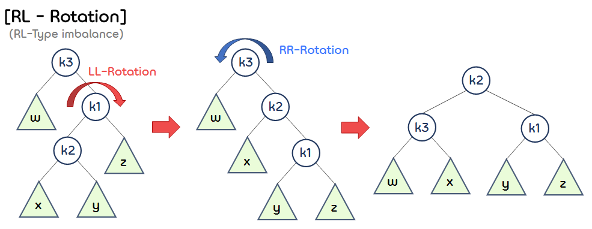

8.AVL Tree
===

## < *Contents* >  
- [1. AVL Tree](#%EF%B8%8F-1-avl-tree)  

---  

## ✔️ 1. **AVL Tree**

- AVL 트리는 스스로 균형을 잡는 **자가 균형 이진 탐색 트리(Self-Balancing BST)** 이다.
- AVL 트리의 특징은 다음과 같다.
    - (1) 왼쪽 서브 트리와 오른쪽 서브 트리의 높이 차이가 1 이하이다.  
    - (2) 높이 차이가 1보다 커지면 회전(Rotation)을 통해 균형을 잡아 높이 차이를 줄인다.
    - (3) AVL 트리는 높이를 으로 유지하기 때문에 삽입, 검색, 삭제의 시간 복잡도가 이다.  

</br>

- AVL tree의 높이(height)
    - Denote  the minimum number of nodes in an AVL tree of height .

    -  (base)  
     (recursive definition)  

    -   

    - If  is even, let .  
    The equation becomes   

    - If  is odd, let .  
    The equation becomes   

    - Thus, many operations on an AVL tree will take  time.  

</br>  

- AVL 트리에서 발생할 수 있는 불균형(Imbalance)은 다음과 같이 4가지 경우가 있다.  
    <p align="center"></p>  

</br>

- 코드 구현
    ```c
    #include <stdio.h>
    #include <stdlib.h>

    #define MAX(x, y) (((x)>(y))?(x):(y))
    #define ElementType int


    typedef struct AvlNode *Position;
    typedef struct AvlNode *AvlTree;

    int height(Position P);
    Position rotateLL(Position k2);
    Position rotateRR(Position k2);
    Position rotateLR(Position k3);
    Position rotateRL(Position k3);
    Position insertAVL(AvlTree root, ElementType data);
    Position searchAVL(AvlTree root, int key);
    Position inorderTraversing(AvlTree root);
    Position minValueNode(Position node);
    Position rebalance(Position node);
    Position deleteAVL(AvlTree root, ElementType key);


    /* AVL 트리 노드 구조체 */
    struct AvlNode {
        ElementType data;
        AvlTree left, right;
        int height;
    };
    ```  
    ```c
    int main()
    {
        AvlTree root = NULL;

        root = insertAVL(root, 7);
        root = insertAVL(root, 8);
        root = insertAVL(root, 9);
        root = insertAVL(root, 2);
        root = insertAVL(root, 1);
        root = insertAVL(root, 5);
        root = insertAVL(root, 3);
        root = insertAVL(root, 6);
        root = insertAVL(root, 4);

        printf("검색 : %d\n", searchAVL(root, 4)->data);
        printf("\n");

        inorderTraversing(root);
        printf("\n\n");

        root = deleteAVL(root, 7);
        inorderTraversing(root);
        printf("\n\n");

        root = deleteAVL(root, 5);
        inorderTraversing(root);
        printf("\n\n");

        root = deleteAVL(root, 1);
        inorderTraversing(root);
        printf("\n\n");

        root = deleteAVL(root, 3);
        inorderTraversing(root);
        printf("\n\n");

        return 0;
    }
    ```
    ```c
    /* P 노드의 높이를 구한다. */
    int height(Position P)
    {
        if (P == NULL)
            return -1;
        else
            return P->height;
    }
    ```  

- LL-Rotation  
    <p align="center"></p>  

    ```c
    /* LL-Rotation을 수행한다. */
    Position rotateLL(Position k2)
    {
        Position k1;

        k1 = k2->left;
        k2->left = k1->right;
        k1->right = k2;

        k2->height = MAX(height(k2->left), height(k2->right)) + 1;
        k1->height = MAX(height(k1->left), k2->height) + 1;

        return k1;
    }
    ```  

- RR-Rotation  
    <p align="center"></p>  

    ```c
    /* RR-Rotation을 수행한다. */
    Position rotateRR(Position k2)
    {
        Position k1;

        k1 = k2->right;
        k2->right = k1->left;
        k1->left = k2;

        k2->height = MAX(height(k2->left), height(k2->right)) + 1;
        k1->height = MAX(height(k1->right), k2->height) + 1;

        return k1;
    }
    ```  

- LR-Rotation
    <p align="center"></p>  

    ```c
    /* LR-Rotation을 수행한다. */
    Position rotateLR(Position k3)
    {
        k3->left = rotateRR(k3->left);
        return rotateLL(k3);
    }
    ```  

- RL-Rotation  
    <p align="center"></p>  

    ```c
    /* RL-Rotation을 수행한다. */
    Position rotateRL(Position k3)
    {
        k3->right = rotateLL(k3->right);
        return rotateRR(k3);
    }
    ```  
- AVL 트리 삽입 연산   
    ```c
    /* AVL 트리에 data 값을 갖는 노드를 삽입한다. */
    Position insertAVL(AvlTree root, ElementType data)
    {
        // root가 비어 있으면 노드를 삽입한다.
        if (root == NULL)
        {
            root = (AvlTree)malloc(sizeof(struct AvlNode));

            if (root == NULL)
                exit(1);
            
            root->data = data;
            root->height = 0;
            root->left = root->right = NULL;
        }
        // root의 data보다 삽입하려는 노드의 데이터가 더 작으면 왼쪽 부분 트리를 탐색한다.
        else if (data < root->data)
            root->left = insertAVL(root->left, data);
        // root의 data보다 삽입하려는 노드의 데이터가 더 크면 오른쪽 부분 트리를 탐색한다.
        else if (data > root->data)
            root->right = insertAVL(root->right, data);
        else
        {
            printf("중복 키 삽입 오류\n");
            exit(1);
        }
        // root 노드의 높이를 재설정한다.
        root->height = MAX(height(root->left), height(root->right)) + 1;

        // 노드의 삽입으로 인해 깨진 AVL 트리의 균형을 바로 잡는다.
        root = rebalance(root);

        return root;
    }
    ```  

- AVL 트리 삭제 연산  
    ```c
    /* key 값을 data로 갖는 AVL 트리의 노드를 삭제한다. */
    Position deleteAVL(AvlTree root, ElementType key)
    {
        if (root == NULL)
            return root;

        // root의 data보다 key 값이 더 작으면 왼쪽 부분 트리를 탐색한다.
        if (key < root->data)
            root->left = deleteAVL(root->left, key);
        // root의 data보다 key 값이 더 크면 오른쪽 부분 트리를 탐색한다.
        else if (key > root->data)
            root->right = deleteAVL(root->right, key);
        // key값과 일치하는 data를 갖는 노드를 찾은 경우 해당 노드를 삭제한다.
        else 
        {
            if ((root->left == NULL) || (root->right == NULL))
            {
                Position temp = NULL;
                
                // 삭제할 노드의 왼쪽 자식 노드가 NULL인 경우
                if (temp == root->left)
                    temp = root->right;
                // 삭제할 노드의 오른쪽 자식 노드가 NULL인 경우
                else    
                    temp = root->left;
                
                // 삭제할 노드가 leaf 노드인 경우
                if (temp == NULL) {
                    temp = root;
                    root = NULL;
                }
                else
                // 삭제할 노드의 자식 노드가 한 개인 경우
                    root = temp;
            }
            // 삭제할 노드의 자식 노드가 두 개인 경우
            else
            {
                // 삭제할 노드의 오른쪽 부분 트리에서 가장 작은 data를 갖는 노드를 찾는다.
                Position temp = minValueNode(root);

                // 해당 노드와 삭제할 노드의 위치를 바꾼다.
                root->data = temp->data;

                // 다시 삭제할 노드의 위치를 찾아 삭제한다.
                root->right = deleteAVL(root->right, temp->data);
            }
        }

        if (root == NULL)
            return root;
        
        // root 노드의 높이를 재조정한다.
        root->height = MAX(height(root->left), height(root->right)) + 1; 

        // 노드의 삭제로 인해 깨진 AVL 트리의 균형을 바로 잡는다.
        root = rebalance(root);

        return root;
    }
    ```  

- AVL 트리 탐색 연산  
    ```c
    /* AVL 트리를 탐색하여 key 값을 data로 갖는 노드를 반환한다. */
    Position searchAVL(AvlTree root, int key)
    {
        if (root == NULL) return NULL;

        if (key == root->data) 
            return root;
        else if (key < root->data)
            return searchAVL(root->left, key);
        else 
            return searchAVL(root->right, key);
    }
    ```  
    ```c  
    /* AVL 트리를 중위 순회하며 데이터를 출력한다. */
    Position inorderTraversing(AvlTree root)
    {
        if (root != NULL)
        {
            inorderTraversing(root->left);
            printf("[%d] ", root->data);
            inorderTraversing(root->right);
        }
    }


    /* 해당 노드의 오른쪽 부분 트리에서 가장 작은 data를 갖는 노드를 반환한다. */
    Position minValueNode(Position node)
    {
        Position succ;

        succ = node->right;

        while (succ->left)
            succ = succ->left;

        return succ;
    }


    /* 해당 노드의 위치에서 AVL 트리의 균형을 바로 잡는다. */
    Position rebalance(Position node)
    {
        if (height(node->left) - height(node->right) == 2)
        {
            // LL-Type ('='인 경우 -> 2개의 자식 노드를 갖는 노드 삭제 시)
            if (height(node->left->left) >= height(node->left->right))
                return rotateLL(node);
            // LR-Type
            else
                return rotateLR(node);
        }
        else if (height(node->right) - height(node->left) == 2)
        {
            // RR-Type ('='인 경우 -> 2개의 자식 노드를 갖는 노드 삭제 시)
            if (height(node->right->right) >= height(node->right->left))
                return rotateRR(node);
            // RL-Type
            else
                return rotateRL(node);
        }
        // 트리의 균형이 깨지지 않은 경우
        else
            return node;
    }
    ```  
    ```
    검색 : 4

    [1] [2] [3] [4] [5] [6] [7] [8] [9]

    [1] [2] [3] [4] [5] [6] [8] [9]

    [1] [2] [3] [4] [6] [8] [9]

    [2] [3] [4] [6] [8] [9]

    [2] [4] [6] [8] [9]
    ```

</br>

- AVL 트리 시각화 사이트 (참고)
    - https://www.cs.usfca.edu/~galles/visualization/AVLtree.html
