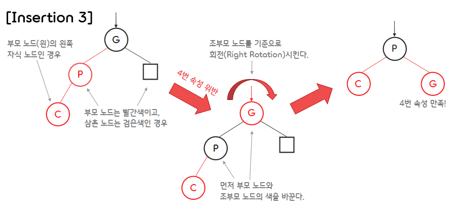
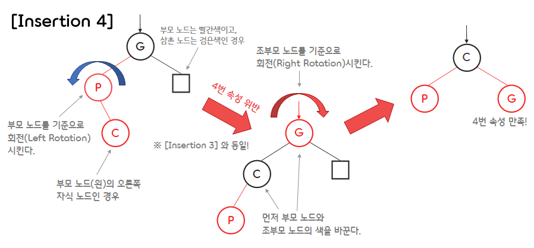

9.Red-black Tree and B-Tree
===

## < _Contents_ >

- [1. Red Black Tree](#%EF%B8%8F-1-red-black-tree)
- [2. B Tree](#%EF%B8%8F-2-b-tree)

---

## ✔️ 1. **Red Black Tree**

<p align="center"></p>

- Red-black 트리는 스스로 균형을 잡는 **자가 균형 이진 탐색 트리(Self-Balancing BST)** 이다.
- Red-black 트리는 다음과 같은 속성을 만족한다.
  - (1) 모든 노드는 빨간색(Red) 또는 검은색(Black)이다.
  - (2) 루트 노드는 검은색이다.
  - (3) 모든 리프 노드(NIL)들은 검은색이다. (**NIL** : null leaf, 데이터를 갖지 않으며 트리의 끝을 나타내는 노드)
  - (4) 빨간색 노드의 자식 노드는 검은색이다. (경로 상에 빨간색 노드가 연속적으로 나올 수 없다.)
  - (5) 임의의 노드에서 자손 리프 노드(NIL)들까지 가는 경로들에 존재하는 검은색 노드의 개수는 모두 같다.
    - 리프 노드(NIL)에서 루트 노드까지 가는 경로들에 존재하는 검은색 노드의 개수는 모두 같다.
    - 단, 자기 자신은 카운트에서 제외한다.

</br>

### 1) **Red-black tree의 높이(height)**

- 노드의 **Rank (랭크, black height)** 는 해당 노드에서 리프 노드까지의 경로 상에 존재하는 검은색 노드 포인터의 개수이다.  
  (리프 노드의 랭크는 0이다.)

</br>

- (1) **Lemma 1**

  - 루트 노드에서 리프 노드(NIL)까지의 경로의 **length(길이)** 를 해당 경로에 존재하는 포인터의 개수라고 하자.
  - $P$ 와 $Q$를 서로 다른 두 개의 루트-리프 경로라고 할 때, 다음과 같은 성질을 만족한다.
  - $length(P) \leq 2\,length(Q)$
    - Proof : $r$을 루트 노드의 랭크라고 할 때, 각각의 루트-리프 경로는 $r$과 $2r$개 사이의 포인터를 갖는다.

    </br>

- (2) **Lemma 2**
  - $h$를 Red-black 트리의 높이(리프 노드 제외), $n$을 내부 노드의 개수, $r$을 루트 노드의 랭크라고 할 때, 다음과 같은 성질을 만족한다.
  - (1) $h \leq 2r$
    - Proof : 모든 루트-리프 노드의 경로의 길이는 $2r$보다 작거나 같다.(Lemma1)
  - (2) $n \geq 2^r - 1$
    - Proof : 루트 노드의 랭크가 $r$일 때, $2^r - 1$개의 내부 노드를 갖는다.
  - (3) $h \leq 2\;log_2(n + 1)$

</br>

### 2) **색을 바꾸면서도 5번 속성을 유지하는 법**

- RB트리가 5번 속성을 만족하고, 두 자식 노드가 같은 색을 가질 때, 부모와 두 자식의 색을 바꿔도 5번 속성을 여전히 만족한다.  
(5번 속성 : 임의의 노드에서 자손 NIL 노드들까지 가는 경로들의 검은색 노드의 개수는 모두 같다.)
<p align="center"></p>

</br>

### 3) **Insertion(삽입)**

- (0) **Overview**
  - ① 노드 삽입 전 RB 트리는 위의 5가지 속성을 모두 만족하는 상태이다.
  - ② 노드를 삽입하는 방식은 일반적인 이진 탐색 트리(BST)와 동일하다.
  - ③ 노드 삽입 후, 해당 노드를 빨간색으로 칠한다. (항상)
    - 삽입 후에도 RB 트리의 5번 속성을 만족하기 위해서이다.
    - 빨간색으로 칠하는 것 외에도, 삽입되는 노드는 2개의 NIL 노드를 갖는다는 특징도 있다.
  - ④ 삽입된 노드로 인해 RB 트리의 속성을 위반한 케이스가 있는지 확인한다.
  - ⑤ RB 트리 속성을 위반한 케이스가 있다면, 재조정하여 RB 트리의 속성을 다시 만족시킨다.

</br>

- (1) **루트 노드를 삽입하는 경우**
  - 루트 노드를 삽입하는 경우, RB 트리의 2번 속성을 위반하게 된다. (삽입 노드는 항상 빨간색)
  - 이 경우, 간단하게 루트 노드를 검은색으로 칠해줌으로써 해결할 수 있다.
  <p align="center"></p>

</br>

- (2) **부모 노드와 삼촌 노드 모두 빨간색인 경우**
  - 이 경우, 삽입하는 노드로 인해 RB 트리의 4번 속성을 위반하게 된다.
  - 4번 속성을 만족시키면서 5번 속성을 유지하려면 조부모 노드(부모 노드의 부모노드)를 빨간색으로 칠하고, 삼촌 노드(부모 노드의 형제 노드)와 부모 노드를 검은색으로 칠하면 된다.
  - 이때 조부모 노드에서 다시 속성 위반이 발생할 경우, 거슬러 올라가며 위반 사항을 바로잡아 준다.
  <p align="center"></p>

</br>

- (3) **부모 노드(왼)는 빨간색, 삼촌 노드(오)는 검은색일 때 왼쪽 자식 노드인 경우**
  - 이 경우, 삽입하는 노드로 인해 RB 트리의 4번 속성을 위반하게 된다.
  - 4번 속성 위반을 해결하기 위해선 빨간색 노드 하나를 반대쪽으로 넘겨야 하는데, 이때 이진 탐색 트리(BST)의 특징 또한 유지하면서 넘기려면 **회전(Rotation)** 을 사용해야 한다.
  - 우선 부모 노드와 조부모 노드의 색깔을 서로 바꿔준 다음, 조부모 노드를 기준으로 회전(LL 로테이션)시킨다. - ※ 이 방법은 부모 노드(오)의 오른쪽 자식 노드인 경우에도 동일하게 적용한다.
  <p align="center"></p>

</br>

- (4) **부모 노드(왼)는 빨간색, 삼촌 노드(오)는 검은색일 때 오른쪽 자식 노드인 경우**
  - 이 경우, 삽입하는 노드로 인해 RB 트리의 4번 속성을 위반하게 된다.
  - 이러한 상황에서는 우선 부모 노드를 기준으로 회전(RR 로테이션)시킨다.
  - 그 다음은 3번 케이스와 마찬가지로, 부모 노드와 조부모 노드의 색깔을 서로 바꿔준 다음, 조부모 노드를 기준으로 회전(LL 로테이션)시킨다. - ※ 이 방법은 부모 노드(오)의 왼쪽 자식 노드인 경우에도 동일하게 적용한다.
  <p align="center"></p>

</br>

- (5) 연습 코드

  ```c
  #include <stdio.h>
  #include <Stdlib.h>

  /* RB 트리 노드 */
  typedef struct Node {
      struct Node *left_child, *right_child, *parent;
      int data;
      int color;
  } Node;

  void leftRotate(Node **root, Node *pNode);
  void rightRotate(Node **root, Node *pNode);
  void insertFixUp(Node **root, Node *curNode);
  void insert(Node **root, int data);
  void inOrderTraversal(Node *root);
  ```

  ```c
  int main()
  {
      Node *root = NULL;
      insert(&root, 10);
      insert(&root, 20);
      insert(&root, 40);
      insert(&root, 30);
      insert(&root, 50);
      insert(&root, 35);
      insert(&root, 25);
      insert(&root, 37);
      printf("In-Order Traversal : ");
      inOrderTraversal(root);

      return 0;
  }
  ```

  ```c
  /* Left Rotation을 수행하는 함수 */
  void leftRotate(Node **root, Node *pNode)
  {
      Node *child = pNode->right_child;

      // child(자식) 노드의 왼쪽 자식 노드를 pNode(부모) 노드의 오른쪽 자식 노드로 설정한다.
      pNode->right_child = child->left_child;
      if (pNode->right_child != NULL)
          pNode->right_child->parent = pNode;
      // child 노드의 부모 노드를 조부모 노드로 설정한다.
      child->parent = pNode->parent;

      // 조부모 노드의 자식 노드를 child 노드로 설정한다.
      if (pNode->parent == NULL)
          (*root) = child;
      else if (pNode == pNode->parent->right_child)  // RR 케이스에서의 Left Rotation인 경우
          pNode->parent->right_child = child;
      else                                           // LR 케이스에서의 Left Rotation인 경우
          pNode->parent->left_child = child;

      // child 노드의 왼쪽 자식 노드를 pNode로 설정한다.
      child->left_child = pNode;
      // pNode의 부모 노드를 child 노드로 설정한다.
      pNode->parent = child;
  }


  /* Right Rotation을 수행하는 함수 */
  void rightRotate(Node **root, Node *pNode)
  {
      Node *child = pNode->left_child;

      // child(자식) 노드의 오른쪽 자식 노드를 pNode(부모) 노드의 왼쪽 자식 노드로 설정한다.
      pNode->left_child = child->right_child;
      if (pNode->left_child != NULL)
          pNode->left_child->parent = pNode;
      // child 노드의 부모 노드를 조부모 노드로 설정한다.
      child->parent = pNode->parent;

      // 조부모 노드의 자식 노드를 child 노드로 설정한다.
      if (pNode->parent == NULL)
          (*root) = child;
      else if (pNode == pNode->parent->left_child)  // LL 케이스에서의 Right Rotation인 경우
          pNode->parent->left_child = child;
      else                                           // RL 케이스에서의 Right Rotation인 경우
          pNode->parent->right_child = child;

      // child 노드의 오른쪽 자식 노드를 pNode로 설정한다.
      child->right_child = pNode;
      // pNode의 부모 노드를 child 노드로 설정한다.
      pNode->parent = child;
  }
  ```

  ```c
  /* 노드 삽입(Insertion) 이후, 위반된 RB 트리 속성을 바로 잡아주는 함수 */
  void insertFixUp(Node **root,  Node *curNode)
  {
      // curNode가 루트 노드이거나, curNode의 부모 노드가 검은색 노드가 될 때까지 반복한다.
      while (curNode != *root && curNode->parent->color == 'R')
      {
          // pNode의 형제 노드인 삼촌(uncle) 노드를 설정한다.
          Node *uncle;
          if (curNode->parent == curNode->parent->parent->left_child)
              uncle = curNode->parent->parent->right_child;
          else
              uncle = curNode->parent->parent->left_child;

          // (1) 삼촌 노드가 빨간색인 경우
          if (uncle != NULL && uncle->color == 'R')
          {
              // 부모 노드와 삼촌 노드는 검은색으로, 조부모 노드는 빨간색으로 바꿔준다.
              uncle->color = 'B';
              curNode->parent->color = 'B';
              curNode->parent->parent->color = 'R';
              curNode = curNode->parent->parent;  // 현재 노드를 조부모 노드로 바꿔준다.
          }
          // 삼촌 노드가 검은색일 때
          else
          {
              // (2) LL 케이스인 경우
              if (curNode->parent == curNode->parent->parent->left_child && curNode == curNode->parent->left_child)
              {
                  // 부모 노드와 조부모 노드의 색을 바꾼다.
                  char parentColor = curNode->parent->color;
                  curNode->parent->color = curNode->parent->parent->color;
                  curNode->parent->parent->color = parentColor;

                  // 조부모 노드를 기준으로 오른쪽으로 회전한다.
                  rightRotate(root, curNode->parent->parent);
              }

              // (3) RR 케이스인 경우
              else if (curNode->parent == curNode->parent->parent->right_child && curNode == curNode->parent->right_child)
              {
                  // 부모 노드와 조부모 노드의 색을 바꾼다.
                  char parentColor = curNode->parent->color;
                  curNode->parent->color = curNode->parent->parent->color;
                  curNode->parent->parent->color = parentColor;

                  // 조부모 노드를 기준으로 왼쪽으로 회전한다.
                  leftRotate(root, curNode->parent->parent);
              }

              // (4) LR 케이스인 경우
              else if (curNode->parent == curNode->parent->parent->left_child && curNode == curNode->parent->right_child)
              {
                  // 현재 노드와 조부모 노드의 색을 바꾼다.
                  char nodeColor = curNode->color;
                  curNode->color = curNode->parent->parent->color;
                  curNode->parent->parent->color = nodeColor;

                  // 먼저 부모 노드를 기준으로 왼쪽으로 회전한다.
                  leftRotate(root, curNode->parent);
                  // 그 다음 조부모 노드를 기준으로 오른쪽으로 회전한다.
                  // (※ leftRotate() 함수 실행 시 curNode가 curNode->parent로 바뀐다!)
                  rightRotate(root, curNode->parent);
              }

              // (5) RL 케이스인 경우
              else if (curNode->parent == curNode->parent->parent->right_child && curNode == curNode->parent->left_child)
              {
                  // 현재 노드와 조부모 노드의 색을 바꾼다.
                  char nodeColor = curNode->color;
                  curNode->color = curNode->parent->parent->color;
                  curNode->parent->parent->color = nodeColor;

                  // 먼저 부모 노드를 기준으로 오른쪽으로 회전한다.
                  rightRotate(root, curNode->parent);
                  // 그 다음 조부모 노드를 기준으로 왼쪽으로 회전한다.
                  // (※ rightRotate() 함수 실행 시 curNode가 curNode->parent로 바뀐다!)
                  leftRotate(root, curNode->parent);
              }
          }
      }
      // 루트 노드는 항상 검은색으로 유지한다.
      (*root)->color = 'B';
  }
  ```

  ```c
  /* RB 트리에 새로운 노드를 삽입하는 함수 */
  void insert(Node **root, int data)
  {
      Node *newNode = (Node*)malloc(sizeof(Node));
      newNode->data = data;
      newNode->left_child = newNode->right_child = newNode->parent = NULL;

      // 루트 노드가 비어 있으면 newNode를 루트 노드로 만든다.
      if (*root == NULL)
      {
          newNode->color = 'B';
          (*root) = newNode;
      }
      // 루트 노드가 비어 있지 않을 경우
      else {
          Node *prevNode = NULL;
          Node *curNode = (*root);

          // curNode가 리프 노드가 될 때까지 반복하며 RB 트리를 내려간다.
          while (curNode != NULL)
          {
              prevNode = curNode;
              if (newNode->data < curNode->data)
                  curNode = curNode->left_child;
              else
                  curNode = curNode->right_child;
          }

          // curNode의 부모 노드를 prevNode로 설정한다.
          newNode->parent = prevNode;

          // prevNode(부모) 노드의 자식 노드를 curNode로 설정한다.
          if (newNode->data > prevNode->data)
              prevNode->right_child = newNode;
          else
              prevNode->left_child = newNode;
          newNode->color = 'R';

          // 새로운 노드 삽입으로 인해 위반된 RB 트리 속성을 바로 잡아준다.
          insertFixUp(root, newNode);
      }
  }
  ```

  ```c
  /* RB 트리를 In-Order 방식으로 순회하며 노드에 저장된 데이터와 노드의 색깔을 출력하는 함수. */
  void inOrderTraversal(Node *root)
  {
      if (root == NULL)
          return;
      inOrderTraversal(root->left_child);
      printf("%d(%c) ", root->data, root->color);
      inOrderTraversal(root->right_child);
  }
  ```

  ```
  In-Order Traversal : 10(B) 20(R) 25(B) 30(B) 35(B) 37(R) 40(R) 50(B)
  ```

</br>

### 4) **Deletion(삭제)**

- (0) **Overview**

  - ① 노드 삽입 전 RB 트리는 위의 5가지 속성을 모두 만족하는 상태이다.
  - ② 노드를 삭제하는 방식은 일반적인 이진 탐색 트리(BST)와 동일하다.
  - ③ 삭제된 노드로 인해 RB 트리의 속성을 위반한 케이스가 있는지 확인한다.
  - ④ RB 트리 속성을 위반한 케이스가 있다면, 재조정하여 RB 트리의 속성을 다시 만족시킨다.

    </br>

  - RB 트리에서 노드를 삭제할 때, 어떤 색이 삭제되는지가 속성 위반 여부를 확인할 때 매우 중요하다.
    - ① 삭제하려는 노드의 자식 노드가 없거나 하나라면, 삭제되는 색 == 삭제되는 노드의 색  
      (※ 여기서 말하는 자식 노드는 NIL 노드가 아닌 유효한 값을 갖는 자식 노드를 말한다.)
    - ② 삭제하려는 노드의 자식 노드가 둘이라면, 삭제되는 색 == 삭제되는 노드의 Successor의 색
        <p align="center"></p>

</br>

- (1) **속성 위반 여부 확인**
  - ① 삭제되는 색이 빨간색이라면, RB 트리의 어떠한 속성도 위반하지 않는다.
  - ② 삭제되는 색이 검은색이라면, RB 트리의 2번, 4번, 5번 속성을 위반할 수 있다.

</br>

- (2) **Extra Black**
  - 삭제되는 색이 검은색이면 특수한 상황을 제외하면 5번 속성을 위반하게 된다.
  - 이때, 5번 속성을 다시 만족시키기 위해선 삭제된 색의 위치를 대체한 노드에 **Extra-Black** 을 부여한다.
  - 경로에서 검은색 노드의 수를 카운트할 때 Extra-Black은 하나의 검은색 노드로 카운트 된다.
  - 검은색 노드(NIL 노드 포함)에 Extra Black이 부여될 경우, 이를 **Doubly-Black** 이라고 한다.
  - 빨간색 노드에 Extra Black이 부여될 경우, 이를 **Red-and-Black** 이라고 한다.
      <p align="center"></p>
  - Red-and-Black은 해당 노드를 검은색 노드로 바꿔주면 해결된다.
  - Doubly-Black은 아래와 같이 4가지 케이스로 분류하여 해결한다.
    - 4가지 케이스로 분류할 때의 기준은 Doubly-Black의 형제 노드의 색과, 그 형제의 자식 노드들의 색이다.

</br>

- (3) **Case1. Doubly-Black의 오른쪽 형제 노드가 검은색이고, 그 형제의 오른쪽 자식 노드가 빨간색인 경우**
  - ① Red를 왼쪽으로 보내기 위해 우선 D의 Black을 C와 E로 보내고, D를 빨간색 노드로 바꾼다.
  - ② Red가 왼쪽으로 넘어갈 수 있도록 왼쪽으로 회전하기 전에, B와 D의 색을 바꿔준다.
  - ③ B를 기준으로 왼쪽으로 회전한다.
  - ④ A와 C의 Extra-Black을 B로 올린다.
  - ⑤ B는 Red-and-Black이 됐기 때문에, B의 색을 검은색으로 바꾸어서 Extra-Black을 제거하면 문제가 해결된다.
  - 위와 대칭인 경우에도 성립하며, 이를 간략하게 줄여서 설명한 것은 아래 그림과 같다.  
    (※ 파란색 노드는 빨간색 노드 또는 검은색 노드임을 나타낸다.)  
     <p align="center"></p>

</br>

- (4) **Case2. Doubly-Black의 오른쪽 형제 노드가 검은색이고, 그 형제의 왼쪽 자식은 빨간색, 오른쪽 자식은 검은색인 경우**
  - ① E 위치에 Red가 오도록 만들기 위해 C와 D의 색을 바꾼 후, D를 기준으로 오른쪽으로 회전한다.
  - ② 기존 E 위치에 Red가 왔으므로, Case1과 같은 방법으로 해결한다.
  - 위와 대칭인 경우에도 성립하며, 이를 간략하게 줄여서 설명한 것은 아래 그림과 같다.
      <p align="center"></p>

</br>

- (5) **Case3. Doubly-Black의 오른쪽 형제 노드가 검은색이고, 그 형제의 두 자식 노드 모두 검은색인 경우**
  - ① A와 A의 형제인 D의 Black을 모아서 부모에게 전달한다.
  - ② 이 경우에 A는 여전히 검은색 노드, D는 빨간색 노드가 되며, 부모 노드인 B는 Extra-Black을 갖게 된다.
  - ③ B에서 다시 Extra-Black을 해결한다.
    - B가 Red일 경우, Red-and-Black이 되므로, B 노드를 검은색 노드로 바꾸어 준다.
    - B가 Black일 경우, Doubly-Black이 되므로, 다시 B 노드를 기준으로 Case 1 ~ 4 중 하나를 선택하여 해결한다.
  - 위와 대칭인 경우에도 성립하며, 이를 간략하게 줄여서 설명한 것은 아래 그림과 같다.
      <p align="center"></p>

</br>

- (6) **Case4. Doubly-Black의 오른쪽 형제 노드가 빨간색인 경우**
  - ① 우선 B와 D의 색을 바꾸어 준다.
  - ② A의 형제 노드를 검은색으로 만들기 위해, B를 기준으로 왼쪽으로 회전하여 C를 A의 형제 노드가 되도록 한다.
  - ③ A의 형제 노드가 검은색이 되었으므로, 다시 A노드의 Doubly-Black을 Case1 ~ 3 중 하나를 선택하여 해결한다.
  - 위와 대칭인 경우에도 성립하며, 이를 간략하게 줄여서 설명한 것은 아래 그림과 같다.
      <p align="center"></p>

</br>

## ✔️ 2. **B Tree**

- **B-트리(B-Tree)** 는 데이터베이스와 파일 시스템에서 널리 사용되는 트리 자료구조의 일종이다.
- **M-way Search Tree** : B-트리는 하나의 노드가 가질 수 있는 자식 노드의 개수가 $m$개인 탐색 트리이다. ($m \geq 3$)  
  (2-way Search Tree == Binary Search Tree)
- 이진 탐색 트리는 디스크(Disk)에 저장되어 있는 방대한 양의 데이터를 다루기에는 적합하지 않다.
  - 일반적으로 Memory Access보다 Disk Access 속도가 훨씬 느리다.  
  - 디스크는 Block 별로 분할(Partition)되어 있고, 어떤 검색어에 대한 Access time은 그 검색어를 포함하는(감싸고 있는) 전체 Block의 수와 비례한다.  
- 이 경우, Disk Access의 수를 줄이기 위해 B-트리처럼 넓은 분포를 가진 트리(Multi-way Search Tree)를 사용한다.
- B-트리의 속성은 다음과 같다.
  - 루트 노드와 리프 노드를 제외한 트리의 각 노드들은 최소한 $\lceil m/2 \rceil$개의 서브 트리를 갖는다.
  - 트리의 루트 노드는 최소한 2개의 서브 트리를 갖는다.
  - 트리의 모든 리프 노드들은 같은 레벨(Level)에 존재하며, 최소한 $\lceil m/2 \rceil - 1$개의 키 값을 갖는다.

</br>

### 1) **B-tree의 높이(height)**
- (1) Best Case : 트리가 수평적으로 넓게 퍼져있는 경우 ( $m^h$개의 리프 노드가 존재 )  
  $$h \leq log_m{n} = \frac{log{n}}{log{m}} = O(log{n})$$
- (2) Worst Case : 트리가 수직적으로 좁게 퍼져있는 경우 ( $\lceil \frac{m}{2} \rceil$ 개의 경로가 존재 )  
  $$h \leq log_{\lceil \frac{m}{2} \rceil}{n} = \frac{log{n}}{log{\lceil \frac{m}{2}} \rceil} = O(log{n})$$
- ex) $m = 256$일 때, B-트리의 높이가 $3$이라면 최대 약 $1M$개의 Records를 가질 수 있다.  

<br>

### 2) **M-way Search Tree**
- (1) **구조(Structure)**  <p align="center"></p>
  - $p_0, p_1, ..., p_n$은 노드의 서브 트리에 대한 포인터이다.  
  - $k_0, k_1, ..., k_{n-1}$은 노드의 키(Key) 값이다.  
  - $n$ : 키의 개수로, 포인터의 수보다 1만큼 적다. M-way Search Tree이므로, $n \leq m - 1$이 성립한다.  

</br>

- (2) **조건(Condition)**  <p align="center"></p>
  - 노트의 키 값은 오름차순이다. ($i = 0, 1, ..., n$인 $i$에 대해 $k_i < k_{i+1}$ 를 만족한다.)  
  - $i = 0, 1, ..., n$인 $i$에 대해 $p_i$가 가리키는 서브 트리의 모든 키 값은 $k_i$의 값보다 작다.  
  - $p_n$이 가리키는 서브 트리의 모든 노드들의 키 값은 $k_{n-1}$의 값보다 크다.  
  - $i = 0, 1, ..., n$인 $i$에 대해 $p_i$가 가리키는 서브 트리들도 M-way Search Tree이다.  

</br>

### 3) **Insertion(삽입)**  

- (1) **Data Insertion**
  - ① 데이터는 항상 리프 노드에 추가된다. (BST와 동일한 방식)
  - ② 추가될 리프 노드에 데이터가 가득 차 있지 않은 경우 (키의 개수 < $m - 1$)
    - 그냥 리프 노드에 데이터를 추가한다.
  - ③ 추가될 리프 노드에 데이터가 가득 차 있는 경우 (키의 개수 = $m - 1$)
    - 리프 노드에 'Spilt'을 수행한다.
    - 'Split' 이후 해당 리프 노드의 부모 노드가 가득 차게 되면 또 다시 'Split'을 수행한다.  

</br>

- (2) **Split**  <p align="center"></p>  
  - ① 추가될 리프 노드를 두 개의 리프 노드로 분할한다.
  - ② 중간에 위치한 키 값은 부모 노드로 이동시킨다. (Key Rotation)
  - ③ 부모 노드에 위치한 키 값의 오른쪽 서브 트리에 분할된 리프 노드를 연결한다.  

</br>

- (3) **연습 코드** <p align="center"></p> <p align="center"></p>  
  ```c
  #include <stdio.h>
  #include <stdlib.h>
  #include <stdbool.h>

  #define M_WAY 3


  /* B-트리 노드 */
  typedef struct BTNode {
      int n;
      bool isLeaf;        // 리프 노드인 경우 true
      bool isRoot;        // 루트 노드인 경우 true
      int keys[M_WAY];    // 3-Way B-Tree이기 때문에 최대 2개의 키(key) 값을 갖는다.
                          // 하지만 Split을 용이하게 하기 위해 1개의 여유 키 값을 갖도록 선언한다.
      struct BTNode *childs[M_WAY + 1];    // Child Node Pointer의 개수도 같은 이유로 +1 해준다.
  } BTNode;


  BTNode* initBTNode();
  BTNode* insertBTNode(BTNode* root, int key);
  BTNode* splitChild(BTNode* root);
  void inOrderTraversal(BTNode* root);
  ```  
  ```c
  int main()
  {
      BTNode* root;
      int i, n, t;

      root = initBTNode();
      root->isRoot = true;

      printf("넣을 데이터의 개수: ");
      scanf("%d", &n);
      printf("\n");

      for (i = 0; i < n; i++)
      {
          printf("데이터를 입력하세요: ");
          scanf("%d", &t);
          root = insertBTNode(root, t);
      }
      printf("\n In-Order Traversal : ");
      inOrderTraversal(root);
  }
  ```
  ```c
  /* B-트리의 노드를 초기화하는 함수 */
  BTNode* initBTNode()
  {
      int i;
      BTNode* newBTNode;
      newBTNode = (BTNode*)malloc(sizeof(BTNode));
      newBTNode->n = 0;
      newBTNode->isLeaf = true;  // 새로운 노드는 B-트리에 리프 노드로 삽입된다.
      newBTNode->isRoot = false;

      for (i = 0; i < M_WAY + 1; i++)
          newBTNode->childs[i] = NULL;

      return newBTNode;
  }
  ```
  ```c
  /* B-트리에 key 값을 갖는 새로운 노드를 삽입하는 함수 */
  BTNode* insertBTNode(BTNode* root, int key)
  {
      int i, pos, mid;
      BTNode* split;

      // 해당 노드가 리프 노드인 경우
      if (root->isLeaf)
      {
          // 노드의 키 값들 중 key가 들어갈 위치를 탐색한다.
          for (pos = 0; pos < root->n; pos++)
          {
              if (root->keys[pos] > key)
                  break;
          }
          
          // key가 들어갈 위치에 있는 노드부터 한 칸씩 뒤로 밀고, key를 넣어준다.
          for (i = root->n; i > pos; i--)
              root->keys[i] = root->keys[i-1];
          root->keys[pos] = key;
          (root->n)++;

          // 노드 삽입 후, 노드의 키 값의 개수가 다 찼을 때
          // 그리고 해당 노드가 루트 노드인 경우 Split을 수행한다.
          if (root->isRoot && root->n == M_WAY)
              return splitChild(root);
          return root;
      }
      // 해당 노드가 리프 노드가 아닌 경우
      else
      {
          // 노드의 키 값들 중 키 값이 들어갈 위치를 탐색한다.
          for (pos = 0; pos < root->n; pos++)
          {
              if (root->keys[pos] > key)
                  break;
          }

          // 해당 위치에 존재하는 자식 노드로 들어가 리프 노드까지 탐색한다.
          root->childs[pos] = insertBTNode(root->childs[pos], key);

          // 노드 삽입 후, 자식 노드의 키의 개수가 다 찼을 때
          if (root->childs[pos]->n == M_WAY)
          {
              // 자식 노드에 대해 Split을 수행한다.
              split = splitChild(root->childs[pos]);

              // Split 수행 후 적절하게 부모 노드에 추가한다.
              for (i = root->n; i > pos; i--)
              {
                  root->keys[i] = root->keys[i-1];
                  root->childs[i + 1] = root->childs[i];
              }
              root->keys[pos] = split->keys[0];
              root->n++;
              root->childs[pos] = split->childs[0];
              root->childs[pos + 1] = split->childs[1];
          }
          
          // 최종적으로 root 노드가 실제 B-트리의 루트 노드인 경우 중에
          // 키의 개수가 다 찼을 때 Split을 수행한다.
          if (root->isRoot && root->n == M_WAY)
              return splitChild(root);

          return root;
      }
  }
  ```
  ```c
  /* Split을 수행하는 함수 */
  BTNode* splitChild(BTNode* root)
  {
      int i, mid;
      // root 노드를 Split하게 되면
      //     newParent
      // root         newSibling
      // 형태로 Split이 일어나게끔 수행한다.
      BTNode* newParent;
      BTNode* newSibling;

      newParent = initBTNode();
      newParent->isLeaf = 0;

      // root 노드가 B-트리의 실제 루트 노드인 경우
      // newParent 노드가 실제 루트 노드가 된다.
      if (root->isRoot)
      {
          newParent->isRoot = true;
          root->isRoot = false;
      }

      // newSibling 노드는 root와 같은 레벨(Level) 상에 존재한다.
      newSibling = initBTNode();
      newSibling->isLeaf = root->isLeaf;

      // root 노드의 중간 지점을 정하고
      // 오른쪽 key 값들을 newSibling 노드로 이동시킨다.
      mid = (M_WAY - 1) / 2;
      for (i = mid + 1; i < M_WAY; i++)
      {
          newSibling->childs[i - (mid + 1)] = root->childs[i];
          newSibling->keys[i - (mid + 1)] = root->keys[i];
          newSibling->n++;

          root->childs[i] = NULL;
          root->keys[i] = 0;
          root->n--;
      }

      // 이때, Child Node Pointer는 키 값보다 1개 더 많으므로
      // for 문이 끝난 후 한 번 더 수행한다.
      newSibling->childs[i - (mid + 1)] = root->childs[i];
      root->childs[i] = NULL;

      // root 노드 중간에 위치했던 key 값을 newParent 노드로 이동시킨다.
      newParent->keys[0] = root->keys[mid];
      newParent->n++;
      root->keys[mid] = 0;
      root->n--;
      
      // newParent 노드의 자식 노드로 root, newSibling 노드를 연결한다.
      newParent->childs[0] = root;
      newParent->childs[1] = newSibling;

      return newParent;
  }
  ```
  ```c
  /* B-트리를 In-Order 방식으로 순회하며 데이터를 출력하는 함수 */
  void inOrderTraversal(BTNode* root)
  {
      int i;
      for (i = 0; i < root->n; i++)
      {
          // 리프 노드가 아니라면 밑으로 탐색한다.
          if (!(root->isLeaf))
          {
              inOrderTraversal(root->childs[i]);
          }
          // 데이터를 출력한다.
          printf("%d ", root->keys[i]);
      }
      // 키 값보다 자식 노드가 한 개 더 많으므로
      // 마지막 자식 노드에 대해 밑으로 탐색한다.
      if (!(root->isLeaf))
      {
          inOrderTraversal(root->childs[i]);
      }
  }
  ```
  ```
  넣을 데이터의 개수: 9

  데이터를 입력하세요: 1
  데이터를 입력하세요: 9
  데이터를 입력하세요: 2
  데이터를 입력하세요: 8
  데이터를 입력하세요: 3
  데이터를 입력하세요: 7
  데이터를 입력하세요: 4
  데이터를 입력하세요: 6
  데이터를 입력하세요: 5

  In-Order Traversal : 1 2 3 4 5 6 7 8 9
  ```  

</br>

### 4) **Deletion(삭제)**  

- (1) **Data Deletion**
  - ① 지우고자 하는 데이터가 존재하는 노드를 탐색한다.
  - ② 리프 노드가 아니라면 해당 데이터를 대체할 키 값을 찾는다.  
  (BST와 같은 방식으로 Successor를 찾아 교체한다.)
  - ③ 데이터 삭제 이후 해당 노드에 존재하는 키의 개수가 $\lceil m/2 \rceil - 1$개 이상인 경우
    - B-트리를 유지하고 있으므로 연산을 종료한다.
  - ④ 데이터 삭제 이후 해당 노드에 존재하는 키의 개수가 $\lceil m/2 \rceil - 1$개 보다 작을 경우  
    - '**Redistribution**'이나 '**Merge**'를 수행한다.  

</br>

- (2) **Redistribution**
  - 해당 노드의 Sibling 노드로부터 한 개의 키 값을 차출(키의 개수가 충분한 경우)하여 부모 노드로 이동시키고, 부모 노드의 키 값을 해당 노드로 이동한다.  
  <p align="center"></p>    

</br>

- (3) **Merge(Join)**
  - Redistribution이 불가능한 경우, 해당 노드의 Sibling 노드의 키 값들과 부모 노드의 키 값들을 모아 하나의 노드로 합병한다.
  - 이때 합병되는 노드의 부모 노드에 대해 다시 삭제를 수행한다.
  <p align="center"></p> 
  <p align="center"></p>  