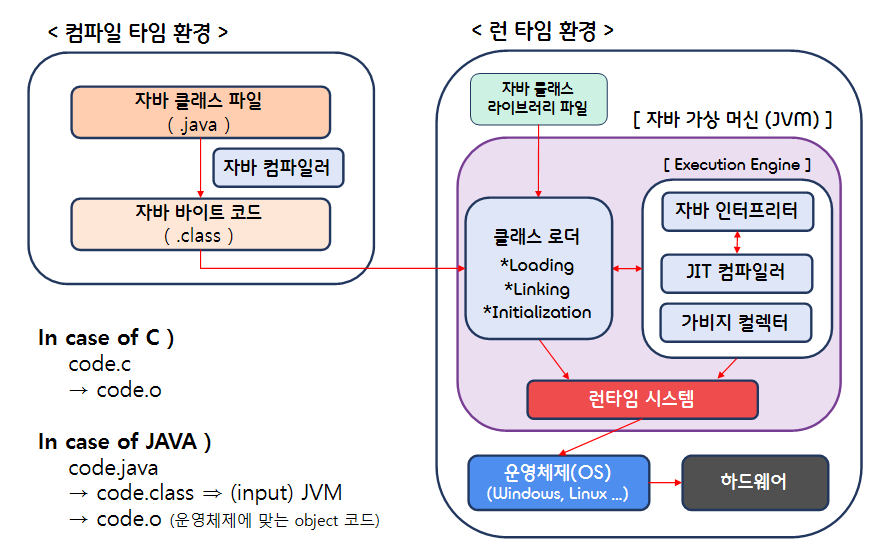
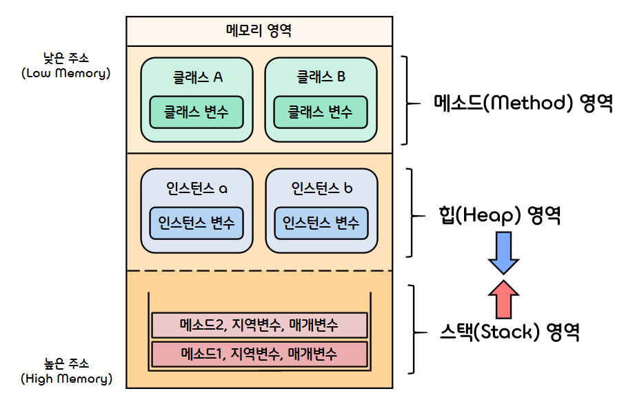

1.**Introduction**
===  

## < *Contents* >
- [1. Introduction to Java](#%EF%B8%8F-1-introduction-to-java)
- [2. Basic concepts in Java](#%EF%B8%8F-2-basic-concepts-in-java)
- [3. The String class(문자열 클래스)](#%EF%B8%8F-3-the-string-class문자열-클래스)
- [4. The StringBuffer class(문자열 버퍼 클래스)](#%EF%B8%8F-4-the-stringbuffer-class문자열-버퍼-클래스)
- [5. Array(배열)](#%EF%B8%8F-5-array배열)

---  

## ✔️ 1. **Introduction to Java**  

### 1) **Object-oriented language**
- Java is an **object-oriented programming(OOP)** language.  
(객체 지향 프로그래밍(OOP) : 컴퓨터 프로그래밍 패러다임 중 하나로, 프로그래밍에서 필요한 데이터를 추상화시켜 상태와 행위(method)를 가진 객체를 만들고, 그 객체들 간의 유기적인 상호작용을 통해 로직을 구성하는 프로그래밍 방법이다.)  

- Java programs work by having things called **objects(객체)** perform actions.  
The actions performed by an object are called **methods(메서드)**. 
    - (ex) System.out.println
        - System.out : An object used for sending output to the screen.
        - println : The method or action that the "System.out" object performs.  
</br>

### 2) Features of Java 
- 자바는 운영체제와 독립적으로 실행할 수 있다.( JVM(자바 가상 머신) 이용 → 속도는 ↓)
- 자동 메모리 관리( GC(Garbage Collection) 이용 ) 등의 기능을 지원하여 다른 언어에 비해 안정성이 높다.
- 연산자 오버로딩을 금지하고, 제네릭(Generic)을 도입함으로써 코드의 가독성의 높였다.
- 참고 자료가 많다.  
</br>

### 3) Two types of Java programs
- (1) **Application(어플리케이션)** : 클래스 안에 main 함수를 가지고 있는 일반적인 자바 프로그램
    - Java application program이 실행되면 run-time system이 자동적으로 main 함수를 호출한다.
    - 모든 Java application program은 main 함수에서부터 시작한다.  
</br>

- (2) **Applet(애플릿)** : 웹 브라우저에서 동작하는 작은 크기의 자바 프로그램
    - 인터넷 상의 다른 장소로 보내져서 동작할 수 있다.
    - 대부분 Windowing interface로 사용한다.(GUI 형태. Application 프로그램은 console I/O로도 사용한다.)  
    - "Applet viewer"라는 프로그램으로도 동작할 수 있다.
        - Applet viewer : JDK에서 제공하는 애플릿 전용 웹 브라우저 (디버깅 용으로 사용한다.)  

</br>

### 4) **Java complier(자바 컴파일러)**
- 자바 컴파일러는 자바로 작성한 자바 소스코드를 JVM이 이해할 수 있는 자바 바이트 코드로 변환한다.  
- 자바 컴파일러는 자바를 설치하면 "javac.exe" 이라는 실행 파일 형태로 설치된다.  
    - ※ Complier : 한 언어에서 다른 언어로 번역하는 프로그램.  (ex) High-level-language → Machine-language  
</br>

### 5) **Java bytecode(자바 바이트 코드)**
- JVM이 이해할 수 있는 언어로 변환된 자바 소스 코드  
- High-level-language(Java) → Java-bytecode → Machine-language 순으로 번역된다.
- 자바 컴파일러에 의해 변환되는 코드 명령어의 크기가 1바이트라서 자바 바이트 코드라고 불린다.  
- 자바 바이트 코드의 확장자는 ".class" 이다.  
- JVM만 설치되어 있으면 어떤 운영체제에서도 실행이 가능하다.   
</br>

### 6) **Java Virtual Machine(자바 가상 머신)**
- 자바 바이트 코드를 실행시키기 위한 가상의 기계 (자바 프로그램을 실행하기 위해서 꼭 필요하다.)
- JVM은 자바 프로그램과 달리 운영체제에 종속적이므로, 각 운영체제에 맞는 JVM을 설치해야 한다.
- 자바 프로그램은 JVM이라는 한 단계를 더 거쳐야 하므로, 상대적으로 실행 속도가 느리다.
- 하지만 한 번 자바 바이트 코드로 컴파일되면, JVM이 설치된 모든 컴퓨터에서 사용할 수 있게 된다.
- 자바 가상머신은 다음과 같이 구성된다.  
</br>

    - (1) **Interpreter(자바 인터프리터)**
        - 자바 컴파일러에 의해 변환된 자바 바이트 코드를 읽고 해석한다.  
        </br>
    - (2) **Class loader(클래스 로더)**
        - 자바는 동적으로 클래스를 읽어오므로, 프로그램이 실행 중인 런타임에서야 모든 코드가 자바 가성머신과 연결된다.
        - 이때 동적으로 클래스를 로딩해주는 역할이 클래스 로더이다.  
        </br>
    - (3) **JIT Complier(Just-In-Time 컴파일러)**
        - 프로그램이 실행 중인 런타임에 실제 기계어로 변환(Dynamic translation)해주는 컴파일러이다.
        - 자바 컴파일러가 생성한 자바 바이트 코드를 런타임에 바로 기계어로 변환하는데 사용한다.  
        </br>
    - (4) **Garbage collector(가비지 컬렉터)**
        - 더 이상 사용하지 않는 메모리를 자동으로 회수한다. (사용자가 직접 메모리 관리 X)    
        </br>

<p align="center"></p>  
</br>  

### 7) **JVM Memory Structure(JVM 메모리 구조)**
- 자바 프로그램이 실행되면, JVM은 운영체제로부터 해당 프로그램을 수행하는데 필요한 메모리를 할당받는다.  
- 할당받은 메모리를 JVM은 용도에 따라 다음과 같이 구분하여 관리한다.  
<p align="center"></p>  

- (1) **메소드(method) 영역**
    - 자바 프로그램에서 사용되는 클래스에 대한 정보와 함께 클래스 변수(static varible)이 저장된다.
    - JVM은 자바 프로그램에서 특정 클래스가 사용되면 해당 클래스의 클래스 파일(*.class) 파일을 읽어들여, 해당 클래스에 대한 정보를 메소드 영역에 저장한다.  
    </br>

- (2) **힙(heap) 영역**
    - 자바 프로그램에서 사용되는 모든 인스턴스 변수가 저장된다.
    - new 키워드를 사용하여 인스턴스가 생성되면, 해당 인스턴스의 정보를 힙 영역에 저장한다.  
    - 힙 영역은 메모리의 낮은 주소에서 높은 주소 방향으로 할당된다.  
    </br>

- (3) **스택(stack) 영역**
    - 자바 프로그램에서 메소드가 호출될 때 메소드의 stack-frame(스택 프레임)이 저장된다.  
    (스택 프레임에는 메소드 호출에 필요한 반환 주소, 지역변수, 매개변수 등이 있다.)
    - 스택 영역은 메소드의 호출과 함께 할당되며, 메소드 호출이 완료되면 소멸한다.  
    - 스택 영역은 메모리의 높은 주소에서 낮은 주소 방향으로 할당된다.  
        - 잘못된 재귀 호출로 Call-stack이 지정된 스택 메모리 크기를 넘어서면, 힙 영역을 침범하게 된다.  
        이를 Stack-overflow(스택 오버플로우)라고 한다.  
</br>

## ✔️ 2. **Basic concepts in Java**  
### 1) **Identifiers(식별자)**
- 클래스, 인터페이스, 변수, 메소드, 배열, 문자열 등을 구분할 수 있는 이름.
    - 숫자로 시작하면 안 된다.
    - digits, letters, underscore(_)로만 구성되어야 한다.
    - 특별한 경우 "$" 기호도 사용 가능하다.
    - 소문자, 대문자에 따라 구분된다.(Case-sensitive)  (ex) Rate, Rate, rate  
</br>

- **Keywords(키워드) or Reserved words(예약어)**
    - 자바에 등록되어 있어서 의미가 약속되어 있는 단어  (ex) abstract, boolean, break, ...
    - 변수명, 메소드명 등으로 사용할 수 없다.  
</br>

- **Predefined words**
    - 자바의 Standard Library에 정의된 단어  (ex) System, println, ...
    - 변수명, 메소드명으로 사용할 수 있다. (하지만 바꾸지 않는 편이 낫다.)  
</br>

### 2) **Variables(변수)**
- 변수란 데이터를 저장하기 위해 프로그램에 의해 이름을 할당받은 메모리 공간을 의미한다.
- 자바에서는 변수를 사용하기 전에 반드시 먼저 변수를 선언하고, 초기화 해야한다.
    - 변수의 선언은 컴파일러에게 어떤 타입의 데이터가 변수에 저장될 것인지를 알려주는 것이다.  
        ```java
        int intVariable;  // int형의 데이터가 intVariable이란 변수 안에 저장된다.
        ```
    - 변수의 선언과 동시에 초기화를 할 수도 있다. (변수에 initial value를 넣는 것)  
        ```java
        int intVariable = 10; // int형의 데이터가 intVariable이란 변수 안에 저장된다.
        ```

- 자바에서 변수나 메소드의 파라미터는 Camel-Case(카멜-표기법)를 사용한다.
- 자바는 여러 형태의 타입들을 미리 정의 제공하고 있는데, 이를 Primitive Types(원시타입)이라고 한다.  
    |Type Name|Kind of Value             |Memory Used|           Size Range|
    |:-------:|:------------------------:|:-----:|:-----------------------:|
    |boolean  |true or false             |1byte  |not applicable           |
    |char     |single character(Unicode) |2bytes |all Unicode characters   |
    |byte     |integer                   |1byte  |-128 to 127              |
    |short    |integer                   |2bytes |-32768 to 32767          |
    |int      |integer                   |4bytes |-2147483648 to 2147483647|
    |long     |integer                   |8bytes |-9223372036854775808 to 9223372036854775807|
    |float    |Floating-point number     |4bytes |±3.40282347 * 10^(+38) to ±1.40239846 * 10^(-45)
    |double   |Floating-point number     |8bytes |±1.76769313486231570 * 10^(+308) to ±4.94065645841246544 * 10^(-324)  
    </br>

### 3) **Constants(상수)와 Literal(리터럴)**
- **Constant(상수)**
    - 변수와 마찬가지로 데이터를 저장할 수 있는 이름을 가진 메모리 공간을 의미한다.
    - 변수와의 다른 점은 프로그램이 실행되는 동안에 메모리에 저장된 데이터를 변경할 수 없다는 것이다.  
    - 상수는 모두 대문자로 작성하고, 구분이 필요한 경우 언더바(_)를 사용한다.
    - 자바에서 상수는 일반적으로 다음과 같이 final 키워드를 이용해서 만든다.  
        ```java
        public final int CONST_VARIABLE = 10;  // CONST_VARIABLE이 상수이다.  
        ```  
    - ※ static 키워드를 사용하면 어디서나 접근 가능하고, 메모리 공간에 유일하게 존재하게 된다.  
        ```java
        public static final int STATIC_CONST_VARIABLE = 10;
        ```  
</br>

- **Literal(리터럴)**
    - 그 자체로 값을 의미한다.
    - 변수와 상수와는 달리 데이터가 저장된 메모리 공간을 가리키는 이름을 가지고 있지 않다.  
        ```java
        final int CONST_VARIABLE = 10;  // 10이 리터럴이다.
        ```  
</br>  

### 4) **Ternary operator(삼항연산자)**  
- 자바에서 유일하게 피연산자(Operand)를 3개나 갖는 조건 연산자
- 사용 방법 : 조건식 ? (반환값1) : 반환값
    ```java
    System.out.println*=((10 > 5) ? "10 is bigger than 5" : "10 is smaller than 5")
    ```
    ```bash
    10 is bigger than 5
    ```  
</br>  

### 5) **instanceof 연산자**
- 참조 변수가 참조하고 있는 인스턴스의 실제 타입을 반환한다.
- 즉, 해당 객체가 어떤 클래스나 인터페이스로부터 생성되었는지를 판별해주는 역할을 한다.
    ```java
    class A {}
    class B extends A {}

    public static void main(String[] args) {
        A a = new A();
        B b = new B();

        System.out.println(a instanceof A); // true
        System.out.println(b instanceof A); // true
        System.out.println(a instanceof B); // false
        System.out.println(b instanceof B); // true

    }
    ```
    ```bash
    true
    true
    false
    true
    ```  
</br>  

### 6) **Type Conversion(형 변환)**
- 하나의 타입을 다른 타입으로 바꾸는 것을 Type Conversion(형 변환)이라고 한다.
- 자바에서는 boolean형을 제외한 나머지 기본 타입 간의 형 변환을 자유)롭게 수행할 수 있다.  

- (1) **Implicit conversion(묵시적 형 변환, 자동 형 변환)**
    - 대입 연산이나 산술 연산에서 컴파일러가 자동으로 수행해주는 형 변환이다.
    - 데이터 손실이 발생하지 않거나, 데이터 손실이 최소화되는 방향으로 묵시적 형 변환을 진행한다.  
    ```java
    double num1 = 10;          // int to double
    double num2 = 5.0f + 1.0;  // float to double
    // int num3 = 3.0f;        // 컴파일 에러(Type mismatch)
    ```  
    - 자바에서는 타입의 표현 범위에 따라 다음과 같은 방향으로 자동 형 변환이 이루어진다.  
    (byte → short → int → long → float → double)   
    </br>

- (2) **Explicit conversion(명시적 형 변환, 강제 형 변환)**
    - 사용자가 Type-cast(타입 캐스트) 연산자를 사용해서 강제적으로 수행하는 형 변환이다.
    - 사용 방법 : (변환할 타입) 변환할 데이터  
        ```java
        int num1 = 7, num2 = 2;
        int quotient1 = num1 / num2;
        float quotient2 = (float)num1 / num2;  // 타입 캐스팅

        System.out.printf("int type : %d\nfloat type : %.1f\n", quotient1, quotient2);
        ```
        ```bash
        int type : 3
        float type : 3.5
        ```  
</br>  

### 7) **Packages(패키지)**
- 자바에서 Package(패키지)란 서로 관련 있는 클래스와 인터페이스의 집합이다.  
    - 자바에서 library(라이브러리)의 개념에 해당하는 것이 패키지이다.  
    - 물리적으로 하나의 디렉터리를 의미한다.  
    (패키지 안에는 .class 파일들이 포함되어야 하며, .java 파일은 optional하다.)  
</br>

- 패키지 안에 있는 클래스나 인터페이스를 사용하려면 먼저 import 해야 한다.  
( ※ java.lang 패키지에 있는 클래스는 자바 프로그램이 실행될 때 자동으로 import 된다. )
- 패키지는 다른 패키지를 포함할 수 있으며, 디렉터리의 계층 구조는 점(.)으로 구분된다.  
    ```java
    import java.text.NumberFormat;  // java.text에서 NumberFormat 클래스를 가져온다.
    import java.text.*;             // java.text에 있는 모든 클래스를 가져온다.
    ```  
    - ※ "*" 를 사용해도 해당 패키지에 포함된 다른 모든 하위 패키지의 클래스까지 포함시킬 수는 없다.  
    (하위 패키지는 각각 import 해야 한다.)  
    - ※ "*" 를 사용해도 단일 클래스를 import하는 것과 비교했을 때 추가적인 overhead는 발생하지 않는다.  
    (단순히 Directory 이름만 명시해주는 것일 뿐, 실제로는 class를 사용할 때 include 된다.)  
    </br>

- 자바에서 패키지를 선언하는 방법은 다음과 같다.  
(패키지 이름에는 패키지의 경로까지 포함한 풀 네임을 명시해야 한다.) 
    ```java
    package 패키지이름;
    ```  
- 패키지의 선언은 import statement보다 선행되어야 한다.  
</br>

- 자바의 모든 클래스는 반드시 하나 이상의 패키지에 포함되어야 한다.  
(자바 컴파일러는 소스 파일에 어떠한 패키지의 선언도 포함되지 않으면, 기본적으로 Unnamed Package(Default Package)에 포함해 컴파일 한다. 따라서, 패키지를 명시하지 않는 모든 클래스와 인터페이스는 모두 같은 패키지에 포함된다.)  
- 만약 서로 다른 패키지에 같은 이름을 같는 클래스가 있을 경우, 패키지 이름을 명시함으로써 구분할 수 있다.
- 자바는 특정 디렉토리에 있는 패키지 찾기 위해 ① 패키지 이름과 ② CLASSPATH 변수의 값을 필요로 한다.  
(Full path = PATH(환경 변수에서 찾는다.) + Class Path)  
</br>

## ✔️ 3. The **String** class(문자열 클래스)
### 1) Features of String class in java
- 자바에는 string에 대한 primitive type이 존재하지 않는다.  
→ 자바에선 문자열을 위한 String 클래스를 별도로 제공한다.  
- String 클래스는 java.lang 패키지에 포함되어 제공된다.
- String 클래스의 인스턴스는 한 번 생성되면 그 값을 읽기만 할 수 있고, 변경할 수는 없다. (Immutable object)  
- 덧셈(+) 연산자를 이용하여 문자열 결합(Concatenation)을 수행하면 기존 문자열의 내용이 변경되는 것이  
아니라, 내용이 합쳐진 새로운 String 인스턴스가 생성된다.  
</br>

### 2) String Methods  

- (1) **int length()**
    - 해당 문자열의 길이를 반환한다. (띄어쓰기 포함)
        ```java
        String str = new String("Java is fun");  // String 클래스의 인스턴스를 만든다.

        System.out.println(str.length);
        System.out.println("hello".length);
        ``` 
        ```bash
        11
        5
        ```  
</br>

- (2) **char charAt(int index)**
    - 해당 문자열의 특정 인덱스에 해당하는 문자를 반환한다.  
        ```java
        String str = "Java is fun";  // 이런 표현도 가능하다.

        // 해당 문자열을 거꾸로 출력한다.
        for (int i = str.length() - 1; i >= 0; i--)
            System.out.print(str.charAt(i));
        System.out.println("");
        ```  
        ```bash
        nuf si avaJ
        ```
</br>

- (3) **boolean equals(String Other_String)**
    - 주어진 문자열과 같은 문자열일 경우 true, 다를 경우 false를 반환한다.
        ```java
        String str = "Java is fun"; 
        
        System.out.println(str.equals("Java is fun"));
        System.out.println(str.equals("Python is fun"));
        ```  
        ```bash
        true
        false
        ```  
</br>

- (4) **boolean equalsIgnoreCase(String Other_String)**
    - 대소문자를 무시했을 때, 주어진 문자열과 같은 문자열일 경우 true, 다를 경우 false를 반환한다.
        ```java
        String str = "Java is fun"; 
        
        System.out.println(str.equals("JAVA IS FUN"));
        System.out.println(str.equals("java is fun"));
        ```  
        ```bash
        true
        true
        ```  
</br>

- (5) **String toLowerCase() / toUpperCase()**
    - 해당 문자열의 모든 문자를 소문자 / 대문자로 변환한다.
        ```java
        String str = "Java is fun"; 
        
        System.out.println(str.toLowerCase());
        System.out.println(str.toUpperCase());
        ```  
        ```bash
        java is fun
        JAVA IS FUN
        ```  
</br>

- (6) **String trim()**
    - 해당 문자열의 맨 앞과 맨 뒤에 포함된 모든 공백 문자를 제거한다.
        ```java
        String str = "      Java is fun  "; 
        
        System.out.println(str);
        System.out.println(str.trim());
        ```  
        ```bash
              Java is fun
        Java is fun   
        ```  
</br>  

- (7) **String subString(int Start)**
    - 해당 문자열의 전달된 인덱스부터 끝까지를 새로운 문자열로 반환한다.
        ```java
        String str = "Java is fun"; 
        
        System.out.println(str.substring(8));
        ```  
        ```bash
        fun
        ```  
</br>  

- (8) **String subString(int Start, int End)**
    - 해당 문자열의 전달된 시작 인덱스부터 마지막 인덱스까지를 새로운 문자열로 반환한다.  
    (※ 단, End 인덱스에 있는 문자는 포함되지 않는다.)
        ```java
        String str = "Java is fun"; 
        
        System.out.println(str.substring(0, 4));
        ```  
        ```bash
        Java
        ```  
</br>  

- (9) **int indexOf(String A_String)**
    - 해당 문자열에서 특정 문자열이 처음으로 등장하는 위치의 인덱스를 반환한다.
        ```java
        String str = "Java is fun"; 
        
        System.out.println(str.indexOf("fun"));
        ```  
        ```bash
        8
        ```  
</br>  

- (10) **int indexOf(String A_String, int Start)**
    - 해당 문자열에서 특정 문자열이 전달된 인덱스 이후에 처음으로 등장하는 위치의 인덱스를 반환한다.
        ```java
        String str = "Java is fun. Also, Python is fun"; 
        
        System.out.println(str.indexOf("fun", 9));
        ```  
        ```bash
        29
        ```  
</br>  

- (11) **int lastIndexOf(String A_String)**
    - 해당 문자열에서 특정 문자열이 마지막으로 등장하는 위치의 인덱스를 반환함.
        ```java
        String str = "Java is fun. Python is fun. C is not fun"; 
        
        System.out.println(str.lastIndexOf("fun"));
        ```  
        ```bash
        37
        ```  
</br>  

- (12) **int compareTo(String A_String)**
    - 해당 문자열을 인수로 전달된 문자열과 사전 편찬 순으로 비교한다.
        - 두 문자열이 일치하는 경우, 0을 반환한다.
        - 처음부터 A_String이 해당 문자열의 substring인 경우, 겹치지 않는 문자의 개수를 반환한다.  
        - 위의 두 경우에 해당하지 않는 경우, 맨 처음 겹치지 않는 문자의 ASCII 코드값의 차이를 반환한다.  
        (해당 문자열의 문자 ASCII 코드값 - A_String의 문자 ASCII 코드값)  

        ```java
        String str = "Java is fun"; 
        
        // 0
        System.out.println(str.compareTo("Java is fun"));
        // 겹치지 않는 문자 개수 = 7(개)
        System.out.println(str.compareTo("Java"));
        // f의 아스키 코드값(102) - n의 아스키 코드값(110) = -8
        System.out.println(str.compareTo("Java is not fun"));
        // J의 아스키 코드값(74) - C의 아스키 코드값(67) = 7
        System.out.println(str.compareTo("C is not fun"));
        ```  
        ```bash
        0
        7
        -8
        7
        ```  
</br>  

- (13) **int compareToIgnoreCase(String A_String)**
    - 대소문자를 구분하지 않고, 해당 문자열을 인수로 전달된 문자열과 사전 편찬 순으로 비교한다.
        ```java
        String str = "Java is fun"; 
        
        System.out.println(str.compareToIgnoreCase("java is fun");
        ```  
        ```bash
        0
        ```  
</br>  

- (14) **String[] split(String regex)**
    - 문자열을 지정된 분리자로 나누어 문자열 배열 형태로 반환한다.  
        ```java
        String[] strList;
        String str = "Java is fun"; 

        strList = str.split(" ");

        System.out.println(strList[0]);
        System.out.println(strList[1]);
        System.out.println(strList[2]);
        ```  
        ```bash
        Java
        is
        fun
        ```  
</br>  

- (15) **Boolean contains(String A_String)**
    - 해당 문자열 안에 A_String이 포함되면 true, 포함되지 않으면 false를 반환한다.  
        ```java
        String str = "Java is fun"; 

        System.out.println(str.contains("fun"));
        System.out.println(str.contains("Python"));
        ```  
        ```bash
        true
        false
        ```  
</br>  

- (16) **Boolean endsWith(String A_String)**
    - 해당 문자열의 마지막이 A_String으로 끝나면 true, 아니면 false를 반환한다.  
        ```java
        String str = "Java is fun"; 

        System.out.println(str.endsWith("fun"));
        ```  
        ```bash
        true
        ```  
</br>  

- (17) **String replace(String A, String B)**
    - 해당 문자열의 A 문자열을 B 문자열로 교체한 문자열을 반환한다.
        ```java
        String str = "Java is fun";
        String newStr = str.replace("Java", "Python");

        System.out.println(newStr);
        System.out.println(str);    // 원본 문자열은 바뀌지 않는다!!
        ```
        ```bash
        Python is fun
        Java is fun
        ```
</br>  

- (18) **static String valueOf(primitive-type)**
    - 특정 값을 문자열로 변환하여 반환한다.
        ```java
        String str1 = String.valueOf(true);  // boolean to String
        String str2 = String.valueOf(10);    // in to String
        String str3 = String.valueOf('c');   // char to String
        String str4 = String.valueOf(5.5f);  // float to String

        System.out.println(str1 + str2 + str3 + str4);
        ```
        ```bash
        true10c5.5
        ```  
</br>  

## ✔️ 4. The **StringBuffer** class(문자열 버퍼 클래스)
### 1) Features of StringBuffer class in java
- String 클래스의 인스턴스는 한 번 생성되면 그 값을 읽기만 할 수 있고, 변경할 수 는 없다.  
→ StringBuffer 클래스의 인스턴스는 그 값을 변경할 수도, 추가할 수도 있다. (Mutable object)
- StringBuffer 클래스는 내부적으로 버퍼(buffer)라고 하는 독립적인 공간을 갖는다.
    - 버퍼 크기의 기본값은 16개의 문자를 저장할 수 있는 크기이다.
    - 생성자를 통해 그 크기를 별도로 설정할 수 있다.  
    (사용자가 설정한 크기보다 언제나 16개의 문자를 더 저장할 수 있도록 여유 있는 크기로 생성된다.)  
</br>  

### 2) StringBuffer Methods  
- (1) **StringBuffer append(type)**
    - 인수로 전달된 값을 문자열로 변환한 후, 해당 문자열의 마지막에 추가한다.
    (String 클래스의 concat() 메소드보다 내부적인 처리 속도가 더 빠르다.)
        ```java
        StringBuffer strBuff = new StringBuffer("Java");
        StringBuffer newStrBuff = strBuff.append(" is fun");
        
        System.out.println(newStrBuff);  
        System.out.println(strBuff);     // 원본 문자열(버퍼)도 바뀐다.
        ```
        ```bash
        Java is fun
        Java is fun
        ```  
</br>  

- (2) **int capacity()**
    - StringBuffer 인스턴스의 현재 버퍼 크기를 반환한다.
        ```java
        StringBuffer strBuff01= new StringBuffer();
        StringBuffer strBuff02 = new StringBuffer("Java");
        
        System.out.println(strBuff01.capacity());  // 기본 버퍼 크기는 16
        System.out.println(strBuff02.capacity());
        ```
        ```bash
        16
        20
        ```  
</br>  

- (3) **StringBuffer delete(int Start, int End)**
    - 전달된 인덱스에 해당하는 부분 문자열을 해당 문자열에서 제거한다.
        - ※ 단, End 인덱스에 있는 문자는 포함되지 않는다.
    - **deleteCharAt()** 메소드를 사용하면 특정 위치의 문자 한 개를 제거할 수 있다.
        ```java
        StringBuffer strBuff = new StringBuffer("Java Oracle");
        
        System.out.println(strBuff.delete(4, 8));
        System.out.println(strBuff.deleteCharAt(1));
        ```
        ```bash
        Javacle
        Jvacle
        ```  
</br>  

- (4) **StringBuffer insert(int offset, type)**
    - 인수로 전달된 값을 문자열로 변환한 후, 해당 문자열의 지정된 인덱스 위치에 추가한다.  
    (지정된 인덱스 뒤에 있는 문자열은 모두 새로 삽입된 문자열 뒤에 붙는다.)
        ```java
        StringBuffer strBuff = new StringBuffer("Java is fun");
        
        System.out.println(strBuff.insert(4, "Script"));
        ```
        ```bash
        JavaScript is fun
        ```  
</br>  

- (5) **StringBuffer reverse()**
    - 해당 문자열을 역순으로 재배열한다.  
        ```java
        StringBuffer strBuff = new StringBuffer("Java is fun");
        
        System.out.println(strBuff.reverse());
        ```
        ```bash
        nuf si avaJ
        ```  
</br>

## ✔️ 5. **Array(배열)**  
- 배열은 같은 타입의 변수들로 이루어진 유한 집합이다.
- 자바에서 배열은 0부터 시작하며, 0을 포함한 양의 정수만을 인덱스로 가질 수 있다.

### 1) **One-Dimensional Array(1차원 배열)**
- 배열의 선언  
: 타입[] 배열이름;
    ```java
    int[] array;
    ```  

- 배열의 생성  
: 배열이름 : 타입[배열길이];
    ```java
    array = int[10];
    ```  

- 배열의 선언과 동시에 생성, 초기화  
: 타입[] 배열이름 = 타입[배열길이]; / 배열이름[인덱스] = 데이터;
    ```java
    int[] array = int[10];

    array[0] = 10;
    array[1] = 20;
    array[2] = 30;
    // 초기화되지 않은 요소들은 배열의 타입에 맞게 초기화 (int → 0)
    ```  

- Initialization block(초기화 블록)을 이용한 배열의 초기화  
    - 초기화 블록에 맞춰 자동으로 배열의 길이가 설정된다.
    - 이미 선언된 배열은 초기화 블록을 사용해서 초기화할 수 없다.  
        ```java
        int[] array = {10, 20, 30};
        int[] array2 = new int[]{40, 50, 60};
        // int[] array3;
        // array3 = {70, 80, 90};
        ```  
</br>  

### 2) **Multi-Dimensional Array(다차원 배열)**
- 다차원 배열이란 2차원 이상의 배열이며, 배열 요소로 또 다른 배열을 가지는 배열을 의미한다.

- (1) **Two-dimensional Array(2차원 배열)**
    - 2차원 배열이란 배열의 요소로 1차원 배열을 가지는 배열이다.
    - 2차원 배열은 다음과 같이 만들고 사용할 수 있다.  
        ```java
        int[][] array1 = new int[3][2];  // array1 배열 선언 및 생성
        int[][] array2 = { {1, 2}, {3, 4}, {5, 6} };  // array2 배열 선언, 생성 및 초기화

        // array1 배열 초기화
        for (int i = 0; i < array1.length; i++) {
            for (int j = 0; j < array1[0].length; j++) {
                array1[i][j] = i*2 + j + 1;
            }
        }

        // array1과 array2의 요소 출력
        System.out.println("arr1 | arr2");
        for (int i = 0; i < 3; i++) {
            for (int j = 0; j < 2; j++) {
                System.out.println(array1[i][j] + "\t" + array2[i][j]);
            }
        }
        ```  
    <br/>
- (2) **Dynamic Array(가변 배열)**
    - 자바에서는 2차원 배열을 생성할 때 열의 길이를 명시하지 않음으로써, 행마다 다른 길이의 배열을 요소로 저장할 수 있다.  
    - 가변 배열은 다음과 같이 만들고 사용할 수 있다.
        ```java
        int[][] dynamicArray1 = new int[3][];
        int[][] dynamicArray2 = { {10, 20}, {30, 40 ,50}, {60} };

        dynamicArray1[0] = new int[2];
        dynamicArray1[1] = new int[3];
        dynamicArray1[2] = new int[1];

        dynamicArray[0][0] = 10;
        dynamicArray[1][2] = 50;
        dynamicArray[2][0] = 60;
        ...
        ```


    
