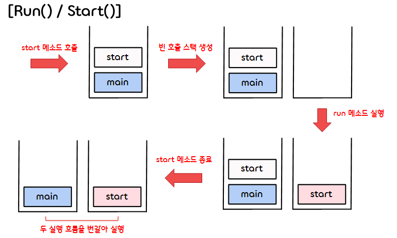
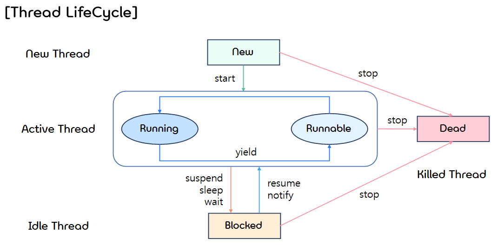

11.**Threads**
===  

## < *Contents* >
- [1. Threads](#%EF%B8%8F-1-threads)
- [2. Race Condition(경쟁 조건)](#%EF%B8%8F-2-race-condition경쟁-조건)
- [3. Thread Synchronization(스레드 동기화)](#%EF%B8%8F-3-thread-synchronization스레드-동기화)
- [4. Other Methods](#%EF%B8%8F-4-other-methods)
---  

## ✔️ 1. **Threads**

### 1) **Process(프로세스)**
- 프로세스(process)란 운영체제로부터 메모리를 할당받아 작업을 수행하는 프로그램을 말한다.
- 프로세스는 프로그램에 사용되는 데이터와 메모리 등의 자원과, 스레드(Thread)로 구성된다.  

</br>

### 2) **Threads(스레드)**
- 자바에서 **스레드(Threads)** 란 프로세스 내에서 작업을 수행하는 하나의 작업 단위를 말한다.
    - 스레드는 프로세스 내에서 실행되는 일련의 흐름이라고 볼 수 있다.
    - 모든 프로세스에는 한 개 이상의 스레드가 존재하여 작업을 수행한다.  
    - 스레드는 실행 과정에서 프로세스의 메모리와 자원들을 사용한다. (프로세스 내의 자원을 공유한다.)  
    - 스레드는 **Light Weight Process(LWP)** 라고도 부르기도 한다.  

</br> 

### 3) **Multi threads(멀티 스레드)**
- 자바에서 **멀티 스레드(Multi thread)** 란 하나의 프로세스 내에서 둘 이상의 스레드가 동시에 작업을 수행하는 것을 말한다.  

</br>

### 4) **Multi Process vs Multi Thread**
- **멀티 프로세스(Multi process)** 란 여러 개의 CPU를 사용하여 여러 프로세스를 동시에 수행하는 것을 말한다.  
- 멀티 스레드와 멀티 프로세스는 모두 여러 흐름을 동시에 수행한다.
- 하지만, 멀티 프로세스는 각 프로세스가 독립적인 메모리를 가지고 별도로 실행되는 반면, 멀티 스레드는 각 스레드가 자신이 속한 프로세스의 메모리를 공유한다는 차이점이 있다.  
- 멀티 스레드는 각 스레드가 자신이 속한 프로세스의 메모리를 공유하므로, 시스템 자원의 낭비가 적다.  

</br>

### 5) Thread 사용의 이점
- Parallel processing(병렬 처리)가 가능해진다.  
- CPU의 유휴 시간을 활용할 수 있다.  
- 우선 순위에 따른 작업 순서를 지정할 수 있게 된다.  

</br>  

### 6) **Context switching(문맥 교환)**
- 컴퓨터에서 동시에 처리할 수 있는 최대 작업의 수는 CPU의 Core(코어)의 개수와 같다.  
- 만약 CPU 코어의 개수보다 많은 스레드가 실행되면, 각 코어가 정해진 시간 동안 여러 작업을 번갈아가며 수행하게 된다.
- 이때, 각 스레드가 교체되면서 스레드 간의 **Context Switching (문맥 교환. 현재까지 작업 상태나 다음 작업에 필요한 각종 데이터를 저장하고 읽어오는 작업)** 이 일어나는데, 이러한 문맥 교환에 걸리는 시간이 커질수록 멀티 스레딩의 효율이 떨어진다.
- 따라서 많은 양의 단순 계산 같은 경우, 싱글 스레드로 동작하는 것이 더 효율적일 수 있다.  

</br>

### 7) Threads in java  
- 자바에서 스레드를 생성하는 방법은 다음과 같은 두 가지 방법이 있다.  

    - (1) **Runnable 인터페이스** 를 구현하는 방법
        ```java
        public class MyThreadClass implements Runnable
        {
            ...
        }
        ```  

    - (2) **Thread 클래스** 를 상속받는 방법  
        ```java
        public class MyThreadClass extends Thread
        {
            ...
        }
        ```  

</br>  

- (1) **Thread 클래스** 를 상속하는 경우
    - 자바에서 스레드는 Thread 클래스(또는 Thread 클래스의 파생 클래스)의 object로 구현된다.
    - Thread 클래스로부터 public void run(), public void start() 메소드를 상속받는다.
    - start() 메소드는 Thread Processing을 시작하고, run() 메소드를 호출한다. 

</br>

- (2) **Runnable 인터페이스** 를 구현하는 경우
    - 주로 Runnable 인터페이스를 구현하는 방식으로 스레드를 구현하다.
    - Runnable 인터페이스의 경우 public void run() 메소드 heading 하나만을 갖는다.
    - Runnable 인터페이스를 구현하는 경우에도, Thread 클래스의 인스턴스로 run 되어야 한다.  
    (Runnable 인터페이스를 구현한 클래스의 object를 Thread 클래스의 생성자의 인수로 넘긴다.)
        ```java
        public class ClassToRun extends someClass implements Runnable
        {
            public void run()
            {
                ...
            }
        }

        public void startThread()
        {
            Thread theThread = new Thread(this);  // this : Runnable 인터페이스를 구현한 클래스의 object
            theThread.start();
        }
        ```  

</br>  

### 8) **run()** vs **start()** 
<p align="center"></p>

- (1) **run** 메소드
    - run 메소드는 실행할 동작에 대한 코드를 작성해 놓은 메소드이다. 
    - 별도의 스레드가 생성되지 않으며, 호출 시 일반 메소드처럼 그냥 run() 메소드만 실행된다.
    - 호출 수에 제한없이 계속 호출이 가능하다.
    - 싱글스레드로 동작한다.  

</br>

- (2) **start** 메소드
    - start 메소드를 실행하면 새로운 스레드가 생성되며, 해당 스레드가 시작되면 run() 메소드가 호출된다.
        - run 메소드가 호출 스택에 올라간 이후 start 메소드는 호출 스택에서 제거된다.
        - 만들어진 두 실행 흐름은 OS 스케줄러에 의해 번갈아가며 실행된다.
    - 동일 객체에서 2번 이상 호출 시 "IllegalThreadStateException" 예외가 발생한다.  
    - 멀티스레드로 동작한다.  

</br>

### 9) **Thread LifeCycle**  

<p align="center"></p>  

- 기본적인 스레드 상태(Thread State)는 다음과 같다.
    <table border="1">
        <tr>
            <th style="text-align: center">상태</th>
            <th style="text-align: center">설명</th>
        </tr>
        <tr>
            <td align="center">New</td>
            <td>
                <ul>
                    <li>Thread 객체 생성</li>
                    <li>아직 start() 메소드가 호출되지 않은 상태</li>
                </ul>
            </td>
        </tr>
        <tr>
            <td align="center">Runnable</td>
            <td>
                <ul>
                    <li>실행 대기 상태</li>
                    <li>CPU를 점유하여 실행하기 위해 대기하고 있는 상태(Running 이전 상태)</li>
                    <li>start() 메소드가 호출되어 스레드가 생성된 상태</li>
                </ul>
            </td>
        </tr>
        <tr>
            <td align="center">Running</td>
            <td>
                <ul>
                    <li>실행 상태</li>
                    <li>CPU를 점유하여 실행중인 상태</li>
                    <li>Runnable 상태의 여러 스레드 중 우선 순위를 가진 스레드가 결정되면 JVM이 자동으로 run() 메소드를 호출하여 Running 상태로 이동한다.</li>
                </ul>
            </td>
        </tr>
        <tr>
            <td align="center">Blocked</td>
            <td>
                <ul>
                    <li>(일시) 정지 상태</li>
                    <li>사용하고자 하는 (공유) 객체의 락(lock)이 풀릴 때까지 기다리는 상태</li>
                </ul>
            </td>
        </tr>
        <tr>
        <tr>
            <td align="center">Waiting / Timed_waiting</td>
            <td>
                <ul>
                    <li>(일시) 정지 상태</li>
                    <li>Waiting - 다른 스레드가 통지(notify)할 때까지 기다리는 상태</li>
                    <li>Timed_waiting - 주어진 시간(sleep) 동안 기다리는 상태</li>
                </ul>
            </td>
        </tr>
        <tr>
            <td align="center">Dead</td>
            <td>
                <ul>
                    <li>실행을 마친 상태 (혹은 임의로 kill 된 상태)</li>
                    <li>run() 메소드 종료 후 스레드가 종료되면 그 스레드는 다시 시작할 수 없다.</li>
                </ul>
            </td>
        </tr>
    </table>  

</br>
    
## ✔️ 2. **Race Condition(경쟁 조건)**
- **경쟁 조건(Race condition)** 이란 두 개 이상의 프로세스 혹은 스레드가 공유 자원(객체)을 서로 사용하려고 경쟁(race)하는 현상을 의미한다.
- 여러 프로세스 혹은 스레드가 공유 자원을 경쟁적으로 업데이트하면 예측 불가능한 데이터 문제가 발생할 수 있다.
- 이때 공유 자원에 마지막으로 저장되는 데이터는 스레드의 접근 순서에 의해 결정된다.  

</br>

- 연습 코드
    ```java
    /* 카운터 클래스 */
    public class Counter
    {
        private int counter;

        public Counter()
        {
            counter = 0;
        }

        public int value()
        {
            return counter;
        }

        public void increment()
        {
            int local;
            local = counter;
            local++;
            counter = local;
        }
    }
    ```  
    ```java
    /* RaceCondition 테스트 클래스 */
    public class RaceConditionTest extends Thread
    {
        private Counter counterObject;  

        public RaceConditionTest(Counter ctr) 
        {
            counterObject = ctr;
        }

        public void run()
        {
            counterObject.increment();
        }

        public static void main(String[] args)
        {
            int i;
            Counter masterCounter = new Counter();  // Counter 객체 (공유 객체)
            RaceConditionTest[] threads = new RaceConditionTest[30000];  // 스레드 객체 (30000개)

            System.out.println("The counter is " + masterCounter.value());
            for (i = 0; i < threads.length; i++)
            {
                threads[i] = new RaceConditionTest(masterCounter);
                threads[i].start();
            }
            
            // 모든 스레드가 종료될 때까지 기다린다.
            for (i = 0; i < threads.length; i++)
            {
                try
                {
                    threads[i].join();
                }
                catch (InterruptedException e)
                {
                    System.out.println(e.getMessage());
                }
            }
            System.out.println("The counter is " + masterCounter.value());
        }
    }
    ```
    ```
    The counter is 0
    The counter is 29999
    ```  

</br>

## ✔️ 3. **Thread Synchronization(스레드 동기화)**
- 위와 같이, 멀티스레딩의 경우 비동기(asynchronous)로 동작하기 때문에 race condition이 발생할 수 있다.
- 이러한 문제가 발생할 경우, 하나의 스레드만 공유 객체에 접근하여 데이터을 변경할 수 있도록 하고, 나머지 스레드들은 해당 작업이 끝날 때까지 기다리게(wait) 만듦으로써 해결할 수 있다.
- 여기서 하나의 스레드에게만 접근을 허용하고자 하는 영역을 **임계 영역(Critical region)** 이라고 한다.
- 자바는 이러한 임계 영역의 처리를 위하여 **synchronized** 키워드를 제공한다.  
    - Solution 1 )
        ```java
        /* synchronized 함수를 만들어 사용하는 방법 */
        public synchronized void increment()
        {
            int local;
            local = counter;
            local++;
            counter = local;
        }
    - Solution 2 )
        ```java
        /* synchronized block을 사용하는 방법 */
        public void increment()
        {
            int local;
            synchronized (this)
            {
                local = counter;
                local++
            }
        }  
        ```
    - Thread method가 실행되면 자동으로 해당 객체에 대한 lock을 획득하고, 메소드 종료 시 lock이 해제된다.  

</br>

- 자바에서 **동기화(Synchronization)** 이란 멀티스레드에 의한 공유 자원에 대한 접근을 제어하는 것을 말한다.
- 동기화는 한번에 하나의 스레드만 객체에 대한 작업을 수행할 수 있도록 한다.
- 동기화를 사용하는 이유는 다음과 같다.
    - (1) Thread의 간섭 방지
    - (2) 일관성 문제 방지
    - (3) 데이터 변형 방지  

</br>

- 연습 코드
    ```java
    /* 버퍼 클래스(공유 자원) */
    public class Buffer {
        
        private int loc = 0;
        private double[] data;
        
        public Buffer(int size) {
            data = new double[size];
        }
        
        public int getSize() {
            return data.length;
        }
        
        public synchronized void add(double toAdd) throws InterruptedException {
            if (loc >= data.length) {
                System.out.println("Buffer is full.");
                wait();
            }
            System.out.println("Adding item " + toAdd);
            System.out.flush();
            data[loc++] = toAdd;
            notifyAll();
        }
        
        public synchronized double remove() throws InterruptedException {
            if (loc <= 0) {
                System.out.println("Buffer is empty.");
                wait();
            }
            double hold = data[--loc];
            data[loc] = 0.0;
            System.out.println("Removing item" + hold);
            System.out.flush();
            notifyAll();
            return hold;
        }
        
        public synchronized String toString() {
            String toReturn = "";
            for (int i = 0;  i < data.length; i++) {
                toReturn += String.format("%2.2f", data[i]) + " ";
            }
            return toReturn;
        }
    }
    ```
    ```java
    /* 버퍼(공유 자원)에 접근하는 Producer 클래스 */
    public class Producer extends Thread {
        
        private int pNum;
        private final Buffer buffer;
        
        public Producer(Buffer buffer) {
            this.buffer = buffer;
        }
        
        public void produce() throws InterruptedException {
            for (int i = 0; i < buffer.getSize(); i++) {
                buffer.add(Math.random() * 100);
            }
        }
        
        public void run() {
            try {
                produce();
            } catch (InterruptedException e) {
                e.printStackTrace();
            }
        }
    }

    ```
    ```java 
    /* 버퍼(공유 자원)에 접근하는 Consumer 클래스 */
    public class Consumer extends Thread {
        
        private int pNum;
        private Buffer buffer;
        
        public Consumer(Buffer buffer) {
            this.buffer = buffer;
        }
        
        public void consume() throws InterruptedException {
            for (int i = buffer.getSize(); i >= 0; i--) {
                buffer.remove();
            }
        }
        
        public void run() {
            try {
                consume();
            } catch (InterruptedException e) {
                e.printStackTrace();
            }
        }
    }
    ```
    ```java
    /* main 함수가 위치한 prodConTest 클래스 */
    public class prodConTest {
        
        public static void main(String[] args) {
            
            Buffer buff = new Buffer(10);
            
            Producer producer = new Producer(buff);
            Consumer consumer = new Consumer(buff);
            producer.start();
            consumer.start();
        }
    }
    ```
    ```
    Buffer is empty.
    Adding item 97.17254886817354
    Removing item97.17254886817354
    Adding item 40.340974543304306
    Adding item 16.20650460790879
    Adding item 26.01526429595531
    Adding item 71.3601787393501
    Adding item 11.597179261784119
    Adding item 82.7407964331822
    Adding item 60.27000292768319
    Removing item60.27000292768319
    Removing item82.7407964331822
    Removing item11.597179261784119
    Removing item71.3601787393501
    Removing item26.01526429595531
    Removing item16.20650460790879
    Removing item40.340974543304306
    Buffer is empty.
    Adding item 56.18324947414668
    Adding item 75.05916203202732
    Removing item75.05916203202732
    Removing item56.18324947414668
    Buffer is empty.
    ```
    - **wait()** 을 사용하면 동기화 영역에서 객체의 락(lock)을 풀고 해당 스레드를 일시 정지한다.  
    (일시 정지된 스레드는 Waiting-pool에서 대기한다.)
    - **notify()** 를 사용하면 일시 정지된 스레드들 중 임의로 하나를 깨워 Runnable 상태에 놓는다.  
    (**notifyAll()** 은 일시 정지된 모든 스레드를 깨워 Runnable 상태에 놓는다.)  

</br>

## ✔️ 4. **Other Methods**
- 스레드와 관련된 추가적인 메소드는 다음과 같다.
    <table border="1">
        <tr>
            <th style="text-align: center">메소드</th>
            <th style="text-align: center">설명</th>
        </tr>
        <tr>
            <td align="center">Thread currentThread()</td>
            <td>현재 실행중인 스레드를 반환한다.</td>
        </tr>
        <tr>
            <td align="center">Void sleep(long msec)</td>
            <td>스레드를 주어진 시간 동안(ms) 일시 정지시킨다.</td>
        </tr>
        <tr>
            <td align="center">String getName()</td>
            <td>스레드의 이름을 반환한다.</td>
        </tr>
        <tr>
            <td align="center">Int getPriority()</td>
            <td>스레드의 우선순위를 반환한다.</td>
        </tr>
        <tr>
            <td align="center">Boolean isAlive()</td>
            <td>스레드가 시작되었고, 아직 종료되지 않았는지에 대한 boolean 값을 반환한다.</td>
        </tr>
        <tr>
            <td align="center">Void join()</td>
            <td>다른 스레드의 작업이 종료될 때까지 기다린다.</td>
        </tr>
        <tr>
            <td align="center">Void setName(String s)</td>
            <td>스레드의 이름을 정의한다.</td>
        </tr>
        <tr>
            <td align="center">Void setPriority(int p)</td>
            <td>스레드의 우선순위를 정의한다.</td>
        </tr>
    </table>  

</br>