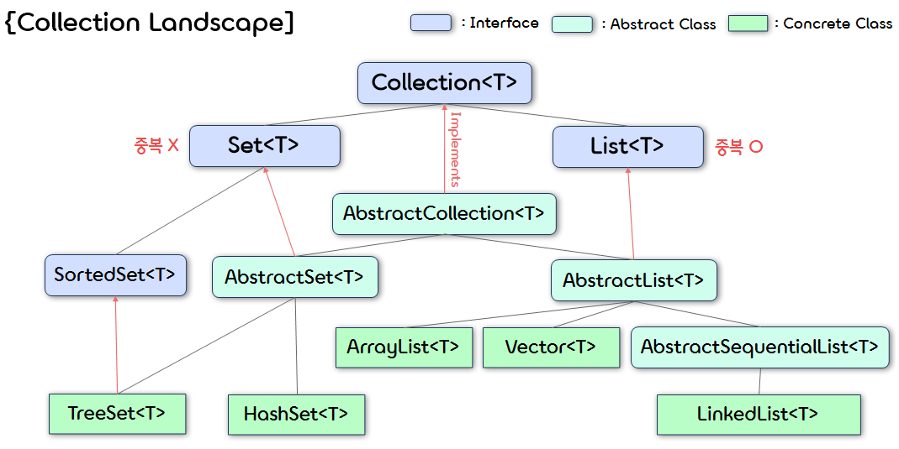
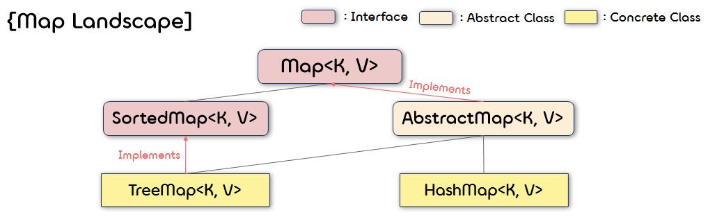

12.**Collections, Maps and Iterators**
===  

## < *Contents* >
- [1. Collections](#%EF%B8%8F-1-collections)
- [2. Maps](#%EF%B8%8F-2-maps)
- [3. Iterators](#%EF%B8%8F-3-iterators)
---  

## ✔️ 1. **Collections**
- 자바에서 **컬렉션(Collection)** 이란 다수의 데이터를 쉽고 효과적으로 처리할 수 있는 표준화된 방법을 제공하는 클래스의 집합이다.
- 즉, 데이터를 저장하는 자료구조와 이를 처리하는 알고리즘을 구조화하여 클래스로 구현해 놓은 것이다.  
- 컬렉션 클래스는 **Collection 인터페이스** 를 구현하는 모든 클래스를 말한다.
    - Collection 인터페이스는 컬렉션 클래스를 위한 최상위 레벨의 자바 프레임워크이다.
    - ArrayList\<T\>도 컬랙션 클래스이며, Collection 인터페이스의 모든 함수를 구현한다.  
    <p align="center"></p>

</br>

### 1) **The Collection Framework**
- Collection\<T\> 인터페이스에는 컬렉션 클래스에서 구현해야 할 기본적인 연산들이 정의되어 있다.
- 인터페이스 또한 타입(Type)이기 때문에 함수의 파라미터로 Collection\<T\> 타입을 사용할 수 있다.  
    - 이 경우, 함수의 인자로 Collection 인터페이스를 구현하는 모든 클래스의 객체를 받을 수 있다.  
- Collection\<T\> 인터페이스는 java.util 패키지에 정의되어 있다.  

</br>

### 2) **Method headings in the Collection interface**
- Collection\<T\> 인터페이스에 정의되어 있는 주요 Method heading은 다음과 같다.
    <table border="1">
        <tr>
            <th style="text-align: center">메소드</th>
            <th style="text-align: center">설명</th>
        </tr>
        <tr>
            <td align="center">boolean isEmpty()</td>
            <td>해당 컬렉션이 비어있는지를 확인한다.</td>
        </tr>
        <tr>
            <td align="center">boolean contains(Object target)</td>
            <td>해당 컬렉션이 target 객체를 포함하고 있는지를 확인한다.</td>
        </tr>
        <tr>
            <td align="center">boolean equals(Other other)</td>
            <td>해당 컬렉션과 전달된 객체가 같은지를 확인한다.</td>
        </tr>
        <tr>
            <td align="center">int size()</td>
            <td>해당 컬렉션의 요소의 총 개수를 반환한다.</td>
        </tr>
        <tr>
            <td align="center">Iterator&lt;T&gt; iterator</td>
            <td>해당 컬렉션의 이터레이터(Iterator)를 반환한다.</td>
        </tr>
        <tr>
            <td align="center">Object[] toArray()</td>
            <td>해당 컬렉션의 모든 요소를 Object 타입의 배열로 반환한다.</td>
        </tr>
        <tr>
            <td align="center">boolean add(T element)</td>
            <td>해당 컬렉션에 전달할 요소를 추가한다. (Optional)</td>
        </tr>
        <tr>
            <td align="center">boolean remove(Object object)</td>
            <td>해당 컬렉션에서 전달된 객체를 제거한다. (Optional)</td>
        </tr>
        <tr>
            <td align="center">void clear()</td>
            <td>해당 컬렉션의 모든 요소를 제거한다. (Optional)</td>
        </tr>
    </table>  
        - 이외에도 containsAll, addAll, removeAll, retainAll, hashCode와 같은 method heading이 정의되어 있다.

</br>

### 3) **Collection Relationships**
- 자바에는 Collection&lt;T&gt; 인터페이스를 구현, 상속하는 많은 클래스, 인터페이스들이 존재한다.
- Collection&lt;T&gt; 인터페이스를 상속하는 대표적인 인터페이스로는 Set&lt;T&gt;, List&lt;T&gt; 등이 있다.
    - (1) **Set&lt;T&gt;**
        - 요소의 저장 순서를 유지하지 않는다.
        - 같은 요소의 중복 저장을 허용하지 않는다.  
        - ex ) HashSet&lt;T&gt;, TreeSet&lt;T&gt;
    - (2) **List&lt;T&gt;**
        - 요소의 저장 순서를 유지한다.
        - 같은 요소의 중복 저장을 허용한다.
        - ex ) ArrayList&lt;T&gt;, LinkedList&lt;T&gt;, Vector&lt;T&gt;

<br/>

### 4) **Concrete Collections Classes**
- (1) **HashSet&lt;T&gt; 클래스**
    - HashSet 클래스는 Set 인터페이스를 구현하며, 가장 많이 사용되는 Set 컬렉션 클래스이다.
    - Set 인터페이스를 구현하므로, 요소를 순서 상관없이 저장하며, 중복된 값은 저장하지 않는다.  
    (순서대로 나열할 필요가 있는 경우, LinkedHashSet 클래스를 사용한다.)
    - HashSet 클래스는 **해시 알고리즘(Hash Algorithm)** 을 사용하여 검색속도가 매우 빠르다.
    - 내부적으로는 **HashMap** 을 이용하여 요소를 저장한다.  
        ```java
        import java.util.HashSet;

        public class HashSetTest 
        {
            public static void main(String[] args) 
            {
                HashSet<String> hs = new HashSet<String>();
                
                hs.add("first");
                hs.add("second");
                System.out.println(hs.add("third"));  // 중복되지 않은 데이터 -> true
                System.out.println(hs.add("third"));  // 중복된 데이터 -> false
                
                // HashSet 요소 출력(Enhanced for문 사용)
                System.out.print("HashSet : ( ");
                for (String element : hs)
                    System.out.print(element + " ");
                System.out.println(")");
            }
        }
        ```
        ```
        true
        false
        HashSet : ( third first second )
        ```
    - HashSet에 이미 존재하는 요소인지를 파악하기 위해서는 내부적으로 다음 과정을 거친다.
        - ⓛ 해당 요소에서 hashCode() 메소드를 호출하여 반환된 해시값으로 검색 범위를 결정한다.
        - ② 해당 범위 내의 요소들을 equals 메소드로 비교한다.
    - 따라서 HashSet에서 add() 메소드를 사용하여 중복 없이 새로운 요소를 추가하기 위해서는 hashCode()와 equals() 메소드를 상황에 맞게 오버라이딩해야 한다.

</br>

- (2) **TreeSet&lt;T&gt; 클래스**
    - TreeSet 클래스는 Set 인터페이스를 구현하며, **이진 탐색 트리(BST)** 구조로 데이터를 저장하는 클래스이다.  
    (JDK 1.2부터는 기존의 이진 탐색 트리의 성능을 향상시킨 **레드-블랙 트리(Red-Black tree)** 로 구현한다.)
    - 마찬가지로 Set 인터페이스를 구현하므로, 요소를 순서 상관없이 저장하며, 중복된 값은 저장하지 않는다.
    - 이진 탐색 트리 구조로 데이터를 저장하므로, 탐색(search)과 정렬(sort)에 용이하다.
    - 내부적으로는 **TreeMap** 을 이용하여 요소를 저장한다.  
        ```java
        import java.util.TreeSet;
        import java.util.Iterator;

        public class TreeSetTest 
        {
            public static void main(String[] args) 
            {
                TreeSet<Integer> ts = new TreeSet<Integer>();
                
                ts.add(30);
                ts.add(10);
                System.out.println(ts.add(20));  // 중복되지 않은 데이터 -> true
                System.out.println(ts.add(20));  // 중복된 데이터 -> false
                
                // TreeSet 요소 출력(Iterator 사용)
                Iterator<Integer> iter = ts.iterator();

                System.out.print("TreeSet : ( ");
                while (iter.hasNext())
                    System.out.print(iter.next() + " ");
                System.out.println(")");
            }
        }
        ```
        ```
        true
        false
        TreeSet : ( 10 20 30 )
        ```  

</br>

- (3) **ArrayList&lt;T&gt; 클래스**
    - ArrayList 클래스는 List 인터페이스를 구현하며, 가장 많이 사용되는 컬렉션 클래스 중 하나이다.  
    - List 인터페이스를 구현하므로 요소를 순서대로 저장하며, 중복된 값의 저장을 허용한다.
    - 내부적으로 **배열** 을 이용하여 요소를 저장하기 때문에, 인덱스를 사용해 요소에 빠르게 접근할 수 있다.
    - Vector 클래스의 신(new) 버전이 ArrayList 클래스라고 볼 수 있다. (ArrayList 사용을 권장한다.)
        ```java
        import java.util.*;

        public class ArrayListTest
        {
            public static void main(String[] args)
            {
                ArrayList<Integer> al = new ArrayList<Integer>();
                
                al.add(30);
                al.add(10);
                al.add(20);
                al.add(10);  // 중복된 요소 저장
                
                // ArrayList 요소 출력(for문 사용)
                System.out.print("ArrayList : [ ");
                for (int i = 0; i < al.size(); i++)
                    System.out.print(al.get(i) + " ");
                System.out.println("]");
                
                // ArrayList 요소 변경
                for (int i = 0; i < al.size(); i++)
                    al.set(i, al.get(i)/10);
                
                // ArrayList 요소 정렬
                Collections.sort(al);
                
                // 변경 및 정렬된 ArrayList 요소 출력
                System.out.print("Updated ArrayList : [ ");
                for (int i = 0; i < al.size(); i++)
                    System.out.print(al.get(i) + " ");
                System.out.println("]");
            }
        }
        ```
        ```
        ArrayList : [ 30 10 20 10 ]
        Updated ArrayList : [ 1 1 2 3 ]
        ```  

</br>

- (4) **LinkedList&lt;T&gt; 클래스**
    - LinkedList 클래스는 List 인터페이스를 구현하며, ArrayList 클래스(배열)의 단점을 극복하기 위해 만들어진 클래스이다.
    - List 인터페이스를 구현하므로 요소를 순서대로 저장하며, 중복된 값의 저장을 허용한다.
    - 내부적으로 **연결 리스트(Linked list)** 를 이용하여 요소를 저장한다.
    - 연결 리스트를 사용하므로 저장된 요소가 비순차적으로 분포되며, 각 요소들이 링크(link)로 연결된다.
        ```java
        import java.util.*;

        public class LinkedListTest
        {
            public static void main(String[] args) 
            {
                LinkedList<String> ll = new LinkedList<String>();
                
                ll.add("하나");
                ll.add("둘");
                ll.add("삼");
                ll.add("넷");
                
                // LinkedList 요소 삭제 및 대체
                ll.remove(2);
                ll.set(2, "셋");  // 2번 인덱스에 위치한 "넷" 요소가 "셋"으로 대체된다.
                
                // LinkedList 요소 출력(Enhanced for문 사용)
                System.out.print("LinkedList : [ ");
                for (String e : ll)
                    System.out.print(e + " ");
                System.out.println("]");
            }
        }
        ```
        ```
        LinkedList : [ 하나 둘 셋 ]
        ```  

</br>

## ✔️ 2. **Maps**
- 자바에서 **Map(맵)** 인터페이스는 Collection 인터페이스와 다른 저장 방식을 갖는다.
- Map 인터페이스를 구현한 Map 컬렉션 클래스들은 데이터를 **키와 값의 쌍(Key-value pair)** 으로 저장한다.
- Map 인터페이스를 구현한 모든 Map 컬렉션 클래스들은 다음과 같은 특징을 갖는다.
    - (1) 요소의 저장 순서가 유지되지 않는다.
    - (2) 값(value)의 중복은 허용되지만, 키(key)의 중복은 허용되지 않는다.
- Map 컬렉션 클래스에 속하는 대표적인 클래스는 HashMap, TreeMap 등이 있다.
- Map 인터페이스는 컬렉션과 동일하게 java.util 패키지에 정의되어 있다.
    <p align="center"></p>  

</br>

### 1) **Method headings in the Map interface**
- Map&lt;K, V&gt; 인터페이스에 정의되어 있는 주요 Method heading은 다음과 같다.
    <table border="1">
        <tr>
            <th style="text-align: center">메소드</th>
            <th style="text-align: center">설명</th>
        </tr>
        <tr>
            <td align="center">boolean isEmpty()</td>
            <td>해당 맵이 비어있는지를 확인한다.</td>
        </tr>
        <tr>
            <td align="center">boolean containsValue(Object value)</td>
            <td>해당 맵이 전달된 값에 해당하는 하나 이상의 키를 포함하고 있는지를 확인한다.</td>
        </tr>
        <tr>
            <td align="center">boolean containsKey(Object key)</td>
            <td>해당 맵이 전달된 키를 포함하고 있는지를 확인한다.</td>
        </tr>
        <tr>
            <td align="center">int size()</td>
            <td>해당 맵에 존재하는 매핑(mapping)의 총 개수를 반환한다.</td>
        </tr>
        <tr>
            <td align="center">boolean equals(Object other)</td>
            <td>해당 맵과 전달된 객체가 같은지를 확인한다.</td>
        </tr>
        <tr>
            <td align="center">int hashCode()</td>
            <td>호출 객체의 메모리 주소를 이용하여 생성한 해시 코드를 반환한다.</td>
        </tr>
        <tr>
            <td align="center">Set&lt;Map.Entry&lt;K, V&gt;&gt; entrySet()</td>
            <td>해당 맵에 존재하는 모든 매핑들을 Set 형태로 보여준다.</td>
        </tr>
        <tr>
            <td align="center">Collection&lt;V&gt; values()</td>
            <td>해당 맵에 존재하는 값들을 Collection 형태로 보여준다.</td>
        </tr>
        <tr>
            <td align="center">V get(Object key)</td>
            <td>해당 맵에서 전달된 키에 대응하는 값을 반환한다.</td>
        </tr>
        <tr>
            <td align="center">V put(Object key)</td>
            <td>해당 맵에 전달된 키에 대응하는 값으로 특정 값을 매핑한다.</td>
        </tr>
        <tr>
            <td align="center">V remove(Object key)</td>
            <td>해당 맵에서 전달된 키에 대응하는 매핑을 제거한다.</td>
        </tr>
        <tr>
            <td align="center">V replace(K key, V value)</td>
            <td>해당 맵에서 전달된 키에 대응하는 값을 특정 값으로 대체한다.</td>
        </tr>
        <tr>
            <td align="center">void clear()</td>
            <td>해당 맵의 모든 매핑을 제거한다. (Optional)</td>
        </tr>
    </table>  

</br>

### 2) **Concrete Map Classes**
- (1) **HashMap&lt;K, V&gt; 클래스**
    - HashMap 클래스는 Map 인터페이스를 구현하며, Map 컬렉션 클래스에서 가장 많이 사용되는 클래스이다.  
    - JDK 1.2부터 제공된 HashMap 클래스는 해시 알고리즘을 사용하여 검색 속도가 매우 빠르다.
    - Map 인터페이스를 구현하므로 요소의 저장 순서가 유지되지 않으며, 중복된 키로 값을 저장할 수 없다.  
    (순서대로 나열할 필요가 있는 경우, TreeMap 또는 LinkedHashMap 클래스를 사용한다.)
        ```java
        import java.util.*;

        public class HashMapTest
        {
            public static void main(String[] args) 
            {
                HashMap<String, Integer> hm = new HashMap<String, Integer>();
                
                hm.put("ten", 10);
                hm.put("twenty", 20);
                hm.put("thirty", 30);
                
                // HashMap 요소 출력(Enhanced for문 사용)
                System.out.print("HashMap : { ");
                for (String key : hm.keySet())
                    System.out.print(String.format("(%s, %s) ", key, hm.get(key)));
                System.out.println("}");
            }
        }
        ```  
    - HashMap에서 **초기 용량(Initial Capacity)** 은 해시테이블에 **버킷(Bucket)** 이 얼마나 많은지를 나타낸다.
        - 버킷이 많을수록 HashMap의 성능은 좋아지지만, 메모리를 많이 차지하게 된다.
    - 그리고, **로드 팩터(Load Factor)** 는 버킷이 얼마나 가득 찼는지를 나타내는 수치이다.
        - 로드 팩터는 0과 1 사이의 값을 갖는다.
        - HashMap에서 로드 팩터가 임계치에 다다르면 더블링을 통해 버킷의 수를 2배로 증가시키고, 해시테이블을 리해싱(Rehashing)한다.
    - HashMap의 default capacity는 16, default load factor는 0.75이다.  

</br>

- (2) **TreeMap&lt;K, V&gt; 클래스**
    - TreeMap 클래스는 Map 인터페이스를 구현하며, 키와 값을 한 쌍으로 하는 데이터를 이진 탐색 트리(BST) 구조로 저장하는 클래스이다.  
    (JDK 1.2부터는 기존의 이진 탐색 트리의 성능을 향상시킨 레드-블랙 트리(Red-Black tree)로 구현한다.)
    - Map 인터페이스를 구현하므로 요소의 저장 순서가 유지되지 않으며, 중복된 키로 값을 저장할 수 없다.  

</br>

## ✔️ 3. **Iterators**
- 자바에서 **이터레이터(Iterator)** 는 컬렉션 요소에 대한 **순차적 접근(Sequential access)** 기능을 제공하는 객체이다.  
- 자바의 컬렉션 프레임워크는 컬렉션에 저장된 요소를 읽어오는 방법을 Iterator 인터페이스로 표준화하고 있다.
- Collection 인터페이스에서는 Iterator 인터페이스를 구현한 클래스의 인스턴스를 반환하는 iterator() 메소드를 정의하여, 각 요소에 접근할 수 있도록 한다.
    ```java
    Iterator iter = c.iterator();
    ```
- 이터레이터는 컬렉션 요소들의 순서가 정해져 있지 않을 경우, 해당 요소들에 순서를 자체적으로 부여한다.  
(요소들 사이에 이미 정해진 순서가 있을 경우, 기존 순서를 유지한다.)  
- For-Each문도 이터레이터와 동일한 기능을 한다.

</br>

### 1) **Method headings in the Iterator interface**
- Iterator&lt;T&gt; 인터페이스에 정의되어 있는 주요 Method heading은 다음과 같다.
    <table border="1">
        <tr>
            <th style="text-align: center">메소드</th>
            <th style="text-align: center">설명</th>
        </tr>
        <tr>
            <td align="center">boolean hasNext()</td>
            <td>해당 컬렉션에 아직 읽어 올 요소가 남아있는지를 확인한다.</td>
        </tr>
        <tr>
            <td align="center">T next()</td>
            <td>이터레이션(Iteration)의 다음 요소를 반환한다.</td>
        </tr>
        <tr>
            <td align="center">void remove()</td>
            <td>이터레이터로 반환되는 마지막 요소를 현재 컬렉션에서 제거한다. (Optional)</td>
        </tr>
    </table>  

</br>

- 연습 코드

    ```java
    import java.util.*;

    public class IteratorTest
    {
        public static void main(String[] args) 
        {
            HashSet<String> hs = new HashSet<String>();
            
            hs.add("health");
            hs.add("love");
            hs.add("money");
            
            // 이터레이터를 사용한 요소 출력
            Iterator<String> iter = hs.iterator();
            while (iter.hasNext())
                System.out.println(iter.next());
        }
    }
    ```
    ```
    love
    money
    health
    ```  

</br>