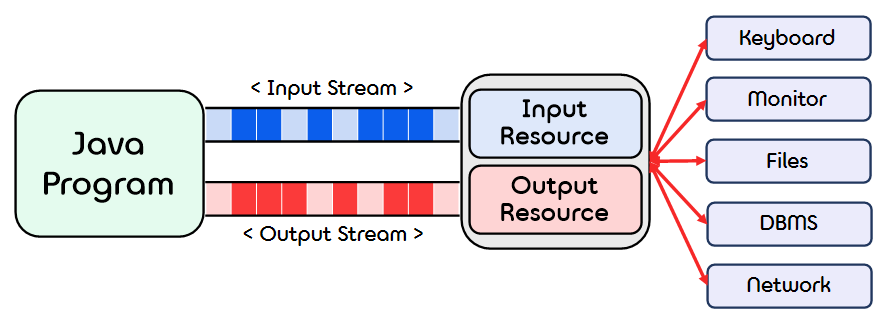

2.**Input and Output**
===  

## < *Contents* >
- [1. Console Input and Output(콘솔 입출력)](#%EF%B8%8F-1-console-input-and-output콘솔-입출력)
- [2. Stream(스트림)](#%EF%B8%8F-2-stream스트림)
- [3. File Input and Output(파일 입출력)](#%EF%B8%8F-3-file-input-and-output파일-입출력)

---  

## ✔️ 1. **Console Input and Output(콘솔 입출력)**  
- 사용자가 프로그램과 대화하기 위해서는 사용자와 프로그램 사이의 입출력을 담당하는 수단이 필요하다.
- 자바에서는 모든 것이 객체로 표현되므로, 입출력을 담당하는 수단 역시 모두 객체이다.
- 자바에서는 System이라는 표준 입출력 클래스를 java.lang 패키지에 포함하여 제공한다.  
    - 표준 입출력이란 간단히 스크린과 키보드를 통한 입출력 방법을 의미한다.
    - System 클래스의 필드는 System.in, System.out, System.err가 있다.  
</br>

### 1) **System.out**
- System.out은 Java language를 구성하는 객체 중 하나로, 표준 출력 스트림에 해당한다.  
- 표준 출력 스트림에 저장된 데이터는 스트림을 통해 출력 장치로 전달되어 출력된다.  

- (1) **System.out.println()**
    - println() 메소드는 System.out 객체에 의해 호출되는 메소드이다.  
    - println() 메소드를 사용하면 전달된 데이터를 출력한 뒤, 줄바꿈이 일어난다.  
    - 덧셈(+) 기호를 통해 서로 다른 타입의 데이터를 입력할 수 있으며, 문자열로 concat되어 출력된다.  
        ```java
        System.out.println("ASCII code of a is " + 65);
        System.out.println("new line");
        ```  
        ```bash
        ASCII code of a is 65
        new line
        ```  
    </br>

- (2) **System.out.print()**
    - println() 메소드와 마찬가지로 전달된 데이터를 출력하지만, 줄바꿈은 일어나지 않는다.
        ```java
        System.out.print("first line. ");
        System.out.print("new line");
        ```
        ```bash
        first line. new line
        ```  
    </br>

- (3) **System.out.printf()**
    - format specifiers(서식지정자) (%)를 사용하여 모든 타입의 데이터를 입력받아 하나의 문자열로 출력한다.  
    (5.0 version 이상의 Java부터 formatting을 지원하는 printf() 메소드를 사용할 수 있게 되었다.)
    - print() 메소드와 마찬가지로 데이터를 출력한 뒤 줄바꿈이 일어나지 않는다.   
        ```java
        String name = "LaonCoder";
        int slept = 4;
        System.out.printf("%s slept for %d hours yesterday.\n", name, slept);
        ```  
        ```
        LaonCoder slept for 4 hours yesterday
        ```  
    </br>

    - ※ printf **Format Specifiers**  
        - 사용 방법 : %[플래그][너비][.정밀도]변환문자  

        - (1) **Flag(플래그)** : 정렬이나 기호를 추가하는 등 형식을 수정하는 문자들  

            |Flag   |Function|
            |:------:|-----|
            |-    |왼쪽으로 정렬한다. '-' 플래그가 없으면 오른쪽으로 정렬한다.|
            |+    |양수 값에 + 기호를 추가한다. 숫자 값에만 적용된다.|  
            |#    |8진수 변환 문자와 함께 쓰면 출력 앞에 0이 붙고, 16진수 변환 문자와 함께쓰면 출력 앞에 0x가 붙는다.|
            |0    |앞의 빈자리에 0을 채워 넣는다. 숫자 값에만 적용된다.|
            |(    |음수에 괄호를 추가한다. 숫자 값에만 적용된다.
            |,    |숫자에 지역별 구분 기호를 추가한다. 숫자 값에만 적용된다.|
            |     |공백. 양수 앞에는 빈칸 하나가 추가된다. 숫자 값에만 적용된다.|  
        </br>  

        - (2) **Width(너비)** : 인수를 출력하기 위해 너비(출력할 최소 문자 수)를 지정한다.  
        (출력 길이가 너비 값보다 작으면 공백이 추가되고, 크면 공백없이 그 길이만큼 출력된다.)  
        </br>

        - (3) **Precision(정밀도)** : 부동 소수점 타입과 함께 사용하며, 출력될 소수점의 자릿수를 지정한다.  
        </br>

        - (4) **Conversion Character(서식문자, 문자열 포맷 문자)** : 제공한 인수에 대한 타입을 지정한다.  
        </br>  

        |Conversion Character|Output type|
        |:--------------:|------------------|
        |%d              |부호 있는 10진 정수|
        |%u              |부호 없는 10진 정수|
        |%f              |부호 있는 10진 실수|
        |%o              |부호 없는 8진 정수 |
        |%x, %X          |부호 없는 16진 정수|
        |%e, %E          |과학적 표기법 기반의 실수|
        |%g, %G          |값에 따라 %e 또는 %f로 변환|
        |%s              |문자열            |
        |%c              |문자              |
        |%b              |논리형(true 또는 false)|  
        </br>

        - 연습 코드 ①
            ```java
            double value = 12.127;

            // 너비 8, 소수점 셋째 자리에서 반올림
            System.out.printf("Start%8.2fEnd", value);  
            System.out.println();
            // 왼쪽 정렬 (default는 오른쪽 정렬이다.)
            System.out.printf("Start%-8.2fEnd", value);
            System.out.println();
            ```  
            ```
            Start   12.12End
            Start12.12   End
            ```  
        - 연습 코드 ②
            ```java
            double price = 19.8;
            String name = "magic apple";

            System.out.printf("$%6.2f for each %s.", price, name);
            System.out.println();
            ```  
            ```
            $ 19.80 for each magic apple.
            ```  
        - 연습 코드 ③  
            ```java
            String s = "abc";

            System.out.printf("START %s END %n", s);  // "%n"은 "\n"과 동일하다.
            System.out.printf("START %4s END %n", s);
            System.out.printf("START %2s END %n", s);
            System.out.println();  

            double d = 12345.123456789;

            System.out.printf("START%f END %n", d);
            System.out.printf("START%.4f END %n", d);
            System.out.printf("START%.2f END %n", d);
            System.out.printf("START%12.4f END %n", d);
            System.out.printf("START%e END %n", d);
            System.out.printf("START%12.5e END %n", d);
            ```  
            ```
            START abc END 
            START  abc END
            START abc END

            START12345.123457 END
            START12345.1235 END
            START12345.12 END
            START  12345.1235 END
            START1.234512e+04 END
            START 1.23451e+04 END
            ```  
</br>

### 2) **System.err**
- System.out과 동일한 역할을 하지만, System.err는 오류 메시지를 출력할 경우에 사용한다.  
</br>

### 3) **System.in**  
- System.in 역시 Java language를 구성하는 객체 중 하나로, 표준 입력 스트림에 해당한다.  
- InputStream, InputStreamReader, BufferedReader 메소드에 관한 내용은 다음 링크를 참고한다. https://wikidocs.net/226#_2 (점프 투 자바)  
</br>

### 4) The Class **Scanner(스캐너)**
- J2SE 5.0 부터 Scanner 라는 java.util.Scanner 클래스가 새로 추가되어 콘솔입력을 쉽게 처리할 수 있게 되었다.  

- Scanner 클래스를 사용하기 위해선 다음과 같이 Scanner 클래스를 import 해야 한다.
    ```java
    import java.util.Scanner
    ```  

- Scanner 클래스의 인스턴스는 다음과 같이 생성한다. (대개 인스턴스 이름으로 "keyboard"를 사용한다.)  
(Scanner 클래스의 생성자의 입력으로 System.in, 즉 콘솔입력인 InputStream을 필요로 한다.)
    ```java
    Scanner keyboard = new Scanner(System.in);
    ```  

- Methods of Scanner Class
    - (1) **double nextInt()**
        - 키보드에 의해 입력된 int형의 데이터를 찾아 읽는다.  
        (int형 데이터를 찾을 때까지 앞에 입력된 공백문자(whitespace)를 모두 무시한다.)
            ```java
            int intData = keyboard.nextInt();
            ```  
            </br>

    - (2) **double nextDouble()**
        - 키보드에 의해 입력된 double형의 데이터를 찾아 읽는다.  
        (double형 데이터를 찾을 때까지 앞에 입력된 공백문자(whitespace)를 모두 무시한다.)
            ```java
            double doubleData = keyboard.nextInt();
            ```  
            </br>

    - (3) **String next()**
        - 키보드에 의해 입력된 공백문자(whitespace characters)로 구분된 문자열을 찾아 읽는다.  
        (String형 데이터를 찾을 때까지 앞에 입력된 공백문자(whitespace)를 모두 무시한다.)  
            ```java
            String stringData = keyboard.next();
            ```  
            </br>

    - (4) **String nextLine()**
        - 키보드에 의해 입력된 라인 전체를 찾아 읽는다.  
        - '\n'(개행문자)가 나올 때까지 라인을 읽고, '\n'이 나오면 읽고 버린다(출력하지 않는다).  
        (다음 라인부터 읽을 수 있도록 설정된다.) 
            ```java
            String lineData = keyboard.nextLine();
            ```  
            </br>  
    
    - (5) **useDelimiter(String new_Delimeter)**  
        - Scanner 클래스의 default delimiter(구분자)는 공백문자이다.
        - useDelimiter() 메소드를 통해 구분자(분리 문자열) 변경한다. (new_Delimeter의 타입은 String이다.)
            ```java
            keyboard.useDelimiter("\n");  // 개행문자로 구분
            keyboard.useDelimiter("&");   // "&"로 구분
            ```  
            </br>

    - (6) 이외에도 **nextLong()**, **nextByte()**, **nextShort()**, **nextFloat()**, **nextBoolean()** 등의 메소드가 존재한다.  
    </br>  

    - 연습 코드
        ```java
        package JAVA;
        import java.util.Scanner;
        
        public class Main {
            public static void main(String[] args)
            {
                int n1, n2;
                Scanner scannerObject = new Scanner(System.in);

                System.out.println("Enter two whole numbers");
                System.out.println("separated by one or more spaces");

                n1 = scannerObject.nextInt();
                n2 = scannerObject.nextInt();
                System.out.println("You entered " + n1 + " and " + n2);  

                System.out.println("Next enter two numbers."); 
                System.out.println("Decimal points are allowed."); 

                double d1, d2;
                d1 = scannerObject.nextDouble();
                d2 = scannerObject.nextDouble();
                System.out.println("You entered " + d1 + " and " + d2); 

                System.out.println("Next enter two words:");
                String word1 = scannerObject.next();
                String word2 = scannerObject.next(); 
                System.out.println("You entered \"" + word1 + "\" and \"" + word2 + "\"");

                String junk = scannerObject.nextLine();  // 남은 문자열 또는 '\n' 제거

                System.out.println("Next enter a line of text:");
                String line = scannerObject.nextLine(); 
                System.out.println("You entered: \"" + line + "\""); 

                scannerObject.close();
            }
        }
        ```
        ```
        Enter two whole numbers
        separated by one or more spaces
        2 3
        You entered 2 and 3
        Next enter two numbers.
        Decimal points are allowed.
        10 3.14  
        You entered 10.0 and 3.14
        Next enter two words:
        Java is fun 
        You entered "Java" and "is"
        Next enter a line of text:
        Java is fun
        You entered: "Java is fun"
        ```  
    </br>

    - (7) 주의할 점(Pitfall)  
        - nextLine() 메소드는 '\n'(개행문자)를 입력받는 순간, 이전까지 입력된 문자열을 출력하고 개행문자는 버린다(출력하지 않는다). 이전에 next()나 nextInt()와 같은 메소드로 데이터를 입력받은 경우, Scanner의 Buffer(버퍼)에는 아직 엔터를 쳤을 때의 '\n'이 남아있게 된다. 이때, nextLine() 메소드를 사용하면 버퍼에 남아있는 '\n'를 입력 받은 후, 아무런 출력도 하지 않고 종료된다. 따라서 위의 코드처럼 '\n'를 입력받는 newLine() 메소드를 한 줄 추가하여, 다음 newLine() 메소드를 사용했을 때 본래의 목적대로 라인을 입력받을 수 있게 만들어주어야 한다.  
            ```java
            int num = scannerObject.nextInt();
            System.out.println("num : " + num);

            String word = scannerObject.next();      // 버퍼에 아직 '\n'이 남아있다.
            System.out.println("word : " + word);
            
            String line = scannerObject.nextLine();  // empty string을 입력받는다.
            System.out.println("line : " + line);
            ```
            ```
            3
            num : 3
            java
            word : java
            line :
            ```  
        </br>  

## ✔️ 2. **Stream(스트림)**  
<p align="center"></p>  

- 자바에서는 파일이나 콘솔의 입출력을 직접 다루지 않고, 스트림이라는 흐름을 통해 다룬다.
    - 스트림은 실제의 입력이나 출력이 표현된 데이터의 이상화된 흐름이다.
    - 즉, 스트림은 운영체제에 의해 생성되는 가상의 연결 고리이며, 중간 매개자 역할을 한다.
    - 자바에서는 java.io 패키지를 통해 InputStream과 OutputStream 클래스를 별도로 제공한다.   
    - 스트림에 관한 추가적인 내용은 다음 링크를 참고한다.  
    http://www.tcpschool.com/java/java_io_stream (TCP 코딩스쿨)  
</br> 

## ✔️ 3. **File Input and Output(파일 입출력)**  
- 텍스트 파일의 내용을 읽거나 작성하려면 FileInputStream, FileOutputStream, FileNotFoundException 등의  
클래스를 import 해야 한다.  
    ```java
    import java.io.FileInputStream;
    import java.io.FileOutputStream;
    import java.io.FileNotFoundException;
    ```  
</br>

- 파일 읽기  
(Scanner 클래스를 이용하였다.)
    ```java
    package JAVA;
    import java.util.Scanner;
    import java.io.FileInputStream; 
    import java.io.FileNotFoundException;

    public class Main {
        public static void main(String[] args)
        {
            Scanner fileIn = null;

            try
            {
                // "player.txt" 파일의 내용을 입력받는다.
                fileIn = new Scanner(new FileInputStream("JAVA/player.txt"));
            }
            catch (FileNotFoundException e) 
            {
                // 파일이 존재하지 않는 경우 프로그램을 종료한다.
                System.out.println("File not found.");
                System.exit(0);
            }
        
            int highScore;
            String name;
        
            System.out.println("Text left to read? " + fileIn.hasNextLine());
        
            highScore = fileIn.nextInt();
            fileIn.nextLine();             // '\n'를 제거한다.
            name = fileIn.nextLine();
        
            System.out.println("Name : " + name);
            System.out.println("High score : " + highScore);
            System.out.println("Text left to read? " + fileIn.hasNextLine()); 
            fileIn.close();
        }
    }
    ```
    ```
    [player.txt]
    100510
    Gordon Freeman

    ```  
    ```
    Text left to read? true
    Name : Gordon Freeman
    High score : 100510
    Text left to read? false
    ```  
</br>

- 파일 쓰기  
(다음 링크를 참고한다. https://hianna.tistory.com/590 (hi.anna님의 '어제 오늘 내일' 블로그))
    ```java
    package JAVA;
    import java.io.File;
    import java.io.FileWriter;   // write() 메소드 사용 가능
    import java.io.PrintWriter;  // println(), print() 메소드도 사용 가능
    import java.io.IOException;


    public class Main {
        public static void main(String[] args)
        {
            try {
                File file = new File("JAVA/player.txt");

                if (!file.exists()) {
                    file.createNewFile();
                }
                
                // PrinterWriter의 사용
                FileWriter fileOut = new FileWriter(file);
                PrintWriter writer = new PrintWriter(fileOut);

                writer.println("123000");
                writer.write("Alyx\n");

                writer.close();
            } 
            catch (IOException e) 
            {
                e.printStackTrace();
            }
        }
    }
    ```
    ```
    [player.txt]
    123000
    Alyx
    
    ```


            

            


