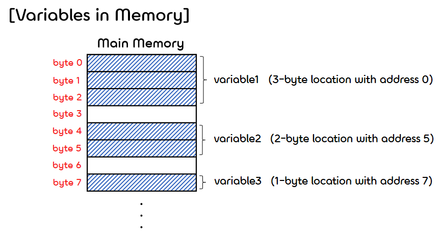

3.**Defining Classes 3**
===  

## < *Contents* >
- [1. References and Class Parameters](#%EF%B8%8F-1-references-and-class-parameters)
- [2. Using and Misusing References](#%EF%B8%8F-2-using-and-misusing-references)  

---  
## ✔️ 1. **References and Class Parameters**

### 1) Variables and Memory
- 대부분의 데이터는 1byte 이상의 저장공간에 저장된다.
    - 데이터를 담고 있는 하나의 공간을 Memory Location(메모리 위치)이라고 한다.
    - Memory Location의 첫 번째 바이트의 주소값이 Memory Address(메모리 주소)가 된다.  
    (메모리 위치의 식별자가 메모리 주소이다.)    
- 컴퓨터의 메인 메모리(RAM)는 다양한 크기의 Memory location들을 저장하는 긴 리스트라고 생각할 수 있다.  
    - 메인 메모리는 Byte(바이트, 8 bit)로 구분된다.
    - 이때, 바이트를 식별하기 위한 숫자를 Address(주소값)라고 한다.

<p align="center"></p>  
</br>

### 2) **References(레퍼런스)**
- (1) 변수가 primitive type이라면 변수의 값이 변수에 할당된 메모리 위치에 저장된다.  
    - 모든 primitive type은 매번 해당 타입에 맞는 크기만큼 메모리를 할당받는다.  
</br>

- (2) **변수가 class type이라면, 객체가 저장된 위치를 가리키는 Memory Address(Reference)만이 변수에 할당된 메모리 위치에 저장된다.**  
    - 이러한 변수를 Reference Variable(레퍼런스 변수)라고 한다.  
    (레퍼런스를 갖는 변수들을 Reference Type(레퍼런스 타입)이라고도 한다.)
    - 실제 객체(인스턴스)는 변수에 할당된 메모리 위치가 아닌 다른 메모리 위치에 저장된다.
    - 주소값이 저장된 객체의 크기와는 상관이 없다.
    - 두 개의 레퍼런스 변수는 동시에 같은 레퍼런스를 가질 수 있으며, 이때 같은 객체를 가리키게 된다.  
    (하나의 변수에서 객체의 데이터를 수정할 경우, 다른 변수에서도 데이터가 수정된 객체를 갖게 된다.)  

    <p align="center"></p>  
    </br>

- class type 변수의 경우 "="(Assignment operator)는 같은 객체를 가리키는 서로 다른 이름의 변수를 만들어 준다.
- 그리고 class type 변수의 경우 "=="(Equallity)는 두 변수가 같은 레퍼런스(메모리 주소)를 갖는지를 확인한다.  
(서로 다른 객체가 같은 데이터를 갖는지 확인하려면 equals() 메소드를 사용해야 한다.)  
</br>

### 3) **Class Parameters(클래스 타입의 매개변수)**
- 자바에서는 메소드에 전달된 값이 Call-by-Value 방식(값에 의한 호출)으로 복사되어 parameter에 전달된다.
    - parameter는 지역변수로, 주어진 argument의 값과 동일하게 설정된다.
    - 메소드 안에서 parameter의 값을 바꾼다고 argument(원본)의 값이 같이 변경되지는 않는다.  
</br>

- 하지만, class type의 parameter는 마치 Call-by-Reference 방식(참조에 의한 호출)인 것처럼 동작한다.
    - 메소드 안에서 parameter의 값을 바꾸면, 주어진 argument(원본)의 값도 바뀌게 된다.
    - 하지만 이는 직접적인 참조를 넘긴 것이 아닌 argument에 저장된 주소값을 복사하여 parameter에 넘긴 것이므로, Call-by-Value에 해당한다.  
    - 따라서 parameter의 주소값를 수정한다고 해서, argument의 주소값까지 변경되지는 않는다.  
</br>

- 메소드에 전달되는 argument가 primitive type인 경우 parameter를 통해 원본의 값을 변경할 수 없지만, class type인 경우 원본의 값을 변경할 수 있다.  
</br>

- 연습 코드
    ```java
    public class ParametersDemo
    {
        public static void main(String[] args)
        {
            ToyClass object1 = new ToyClass();
            object1.set("Mr. Jones", 10);
            ToyClass object2 = new ToyClass("Ms. Peregrine", 20);

            System.out.print("Value of object2 before call to method: ");
            System.out.println(object2);
            object1.makeEqual(object2);       // class type의 argument가 전달된다.
            System.out.print("Value of object2 after call to method: ");
            System.out.println(object2);

            int aNumber = 42;
            System.out.println("Value of aNumber before call to method: " + aNumber);
            object1.tryToMakeEqual(aNumber);  // primitive type의 argument가 전달된다.
            System.out.println("Value of aNumber after call to method: " + aNumber);
        }
    }
    ```
    ```java
    public class ToyClass
    {
        private String name;
        private int number;

        public ToyClass(String newName, int newNumber)
        {
            name = newName;
            number = newNumber;
        }

        public ToyClass()
        {
            name = "No name yet.";
            number = 0;
        }

        public void set(String newName, int newNumber)
        {
            name = newName;
            number = newNumber;
        }

        public String toString()
        {
            return (name + " " + number);
        }

        // class type의 argument를 전달받는다.
        public void makeEqual(ToyClass anObject)
        {
            anObject.name = this.name;
            anObject.number = this.number;
        }

        // primitive type의 argument을 전달받는다.
        public void tryToMakeEqual(int aNumber)
        {
            aNumber = this.number;
        }

        public boolean equals(ToyClass otherObject)
        {
            return ( (name.equals(otherObject.name)) && (number == otherObject.number) );
        }
    }     
    ```  
    ```
    Value of object2 before call to method: Ms. Peregrine 20
    Value of object2 after call to method: Mr. Jones 10
    Value of aNumber before call to method: 42
    Value of aNumber after call to method: 42
    ```

### 4) **The new Operator and Anonymous Objects**
- new 연산자를 사용하면 생성자가 호출되고, 객체가 저장되어 있는 레퍼런스가 반환된다.  
(이러한 레퍼런스는 class type의 변수에 저장된다.)
- 단순히 메소드에 객체를 argument로 넘겨주기 위해서 새로운 객체를 생성하는 것은 비효율적이다.
- 이와 같은 경우, Anonymous Object를 사용하면 변수에 할당하지 않고 객체를 argument로 넘겨줄 수 있다.  
(레퍼런스가 변수에 할당되지 않는 객체를 Anonymous Object(익명 객체)라고 한다.)
    ```java
    sampleVariable.equals(new ToyClass("Mr. Jones", 30));  // 익명 객체의 사용
    ```  
</br>

## ✔️ 2. **Using and Misusing References**
- 프로그램을 작성할 때 private을 사용하여 인스턴스 변수를 외부에서 접근하지 못하게 하는 것은 매우 중요하다.  
- primitive type의 인스턴스 변수는 private을 사용할 경우, 완전하게 외부에서의 접근을 차단할 수 있다.
- 하지만, class type의 인스턴스 변수는 private을 사용해도 접근할 수 있는 방법이 있다. (Privacy leak 문제 발생)  
</br>

### 1) **Shallow copy and Deep copy(얕은 복사와 깊은 복사)**
- **Shallow copy(얕은 복사)** : '주소 값'을 복사하는 것. (참조하고 있는 실제 값은 같다.) 
    - 대입 연산자(=)를 사용할 때, class type의 경우 Shallow copy(얕은 복사)가 수행된다.  
</br>

- **Deep copy(깊은 복사)** : '실제 값'을 새로운 메모리 공간에 복사하는 것. (서로 독립적이다.)
    - Cloneable 인터페이스, 복사 생성자 등으로 깊은 복사를 구현할 수 있다.  

<p align="center"></p>  
</br>

### 2) **Copy Constructor(복사 생성자)**
- 복사 생성자는 자신과 같은 class type의 객체에 대한 reference를 argument로 받는 생성자이다.
- 복사 생성자는 새롭게 생성되는 객체가 원본 객체와 같으면서도 완전한 독립성을 갖게 해준다.  
(복사 생성자를 이용한 대입은 깊은 복사(deep copy)를 통한 값의 복사이기 때문이다.)  

    ```java
    public class Date
    {
        private int month;
        private int day;
        private int year;

        ...

        // 복사 생성자
        public Date(Date aDate)
        {
            if (aDate == null)  // Not a real date.
            {
                System.out.println("Fatal Error.");
                System.exit(0);
            }

            // only primitive types
            month = aDate.month;
            day = aDate.day;
            year = aDate.year;
        }

        ...
    }
    ```  

- 그런데, 클래스가 인스턴스 변수를 갖는 경우, 복사 생성자로 다음처럼 인스턴스 변수를 복사하면 문제가 된다.  
(이는 값을 가리키는 주소를 복사하는 얕은 복사(shallow copy)이므로, Privacy leak 문제가 발생하기 때문이다.)  

    ```java
    public class Person
    {
        private String name;
        private Date born;
        private Date died;

        ...

        // 복사 생성자
        public Human(Human aHuman)
        {
        {
            if (aHuman == null)
            {
                System.out.println("Fatal Error.");
                System.exit(0);
            }

            name = aHuman.name
            // class types (아래와 같이 사용하면 Privacy leak 문제가 발생한다.)
            born = aHuman.born;
            died = aHuman.died;
        } 
    }
    ```  
- 따라서 클래스가 인스턴스 변수를 갖는 경우, 원본의 것과 다른 새롭고 독립적인 인스턴스 변수를 가질 수 있게 다음과 같이 복사 생성자를 정의해야 한다. 
- ※ 이때 주의해야 할 점은, class type 변수의 클래스에도 복사 생성자가 존재해야 한다는 점이다.
    ```java
    ...
        // Privacy leak 문제가 발생하지 않는 복사 생성자
        public Human(Human aHuman)
        {
            if (aHuman == null)
            {
                System.out.println("Fatal Error.");
                System.exit(0);
            }

            name = aHuman.name
            // 복사 생성자를 사용한 인스턴스 변수의 복사
            born = new Date(aHuman.born);
            died = new Date(aHuman.died);
        }
    ```  
</br>

### 3) **Immutable Classes(불변 클래스)**
- 아래와 같이 Person 클래스의 getName() 메소드를 통해 String 타입인 name(인스턴스 변수)을 반환하는 행위는 얼핏보면 Privacy leak 문제를 일으킬 것처럼 보인다.  
    ```java
    public String getName()
    {
        return this.name;  // class type인 인스턴스 변수를 반환한다. → Privacy leak?
    }
    ```
- 하지만 String 클래스는 Mutator 메서드를 포함하지 않기 때문에, 객체에 저장된 데이터를 변경할 수 없다.
- 따라서 원본이 반환되어도 값을 변경할 수 없기 때문에, Privacy leak 문제가 발생하지 않는다.  
</br>

- 이와 같이 객체의 내부 데이터를 변경할 수 있는 메소드가 없는 클래스를 Immutable Class(불변 클래스)라고 한다.  
(반면에 데이터를 변경할 수 있는 메소드를 갖는 클래스는 Mutable Class(가변 클래스)라고 한다.)  
    - 불변 클래스를 통해 생성한 객체는 Immutable Object(불변 객체)라고 한다.  
    (※ 불변 객체에 대한 shallow copy는 허용된다.) 
    - 가변 객체를 반환하는 메소드 작성은 지양해야 한다.  
    (대신 복사 생성자를 사용하여 가변 객체에 대한 독립적인 복사본을 반환하게끔 만들어야 한다.)  


    


