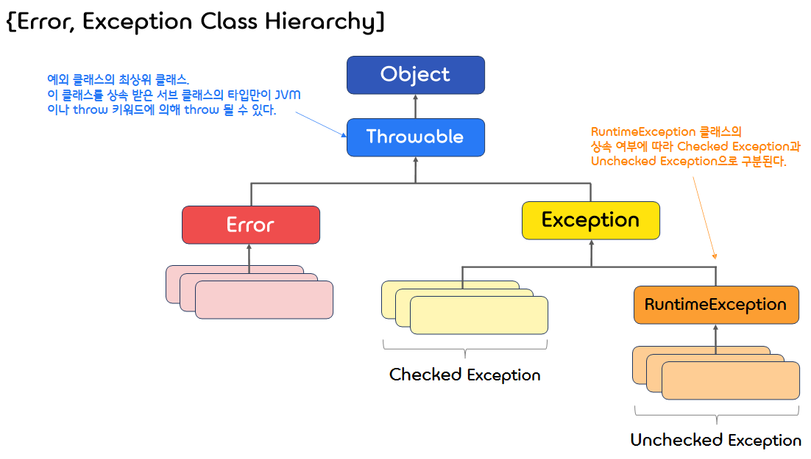

8.**Exception Handling**
===  

## < *Contents* >
- [1. Introduction to Exception Handling](#%EF%B8%8F-1-introduction-to-exception-handling)
- [2. Exception Classes(예외 클래스)](#%EF%B8%8F-2-exception-classes예외-클래스)
- [3. Checked and Unchecked Exceptions](#%EF%B8%8F-3-checked-and-unchecked-exceptions)  

---

## ✔️ 1. **Introduction to Exception Handling**  

### 1) **Errors and Exceptions**  

- 오류(Error)와 예외(Exception)는 모두 예상치 못한 문제가 발생하여 실행 중인 프로그램이 영향을 받는 것이다.
- **오류(Error)** 는 시스템 레벨에서 프로그램에 심각한 문제가 발생하는 것으로, 실행 중인 프로그램을 종료시킨다.  
    - 오류는 개발자가 미리 대처할 수 없는 것이 대부분이므로, 오류에 대한 처리는 할 수 없다.
- **예외(Exception)** 또한 실행 중인 프로그램을 비정상적으로 종료시키지만, 미리 예측하고 처리할 수 있다.  
    - 따라서 예외 처리(Exception Handling)를 통해 예외 상황을 처리할 수 있도록 프로그래밍 해야 한다.  

</br>

### 2) **Exception Handling(예외 처리)**
- 자바에서는 비정상적인 상황이 발생하면 특별한 signal을 발생시킨다. (Throwing an Exception)
- 이러한 signal을 받아 해당 상황을 처리할 수 있는 코드가 실행된다. (Handling the Exception)  

</br>  

- 자바에서 예외처리는 기본적으로 "**try-throw-catch**" 메커니즘에 의해 수행된다.  
    - **try** : 정상적으로 작동한다고 생각되는 코드를 실행한다. (예외 발생 코드 포함)
    - **throw** : 예외 상황(Exception)이 발생하면 try 블록이 멈추고, 예외를 발생(Throwing)시킨다.  
    (ExceptionClassName 클래스의 객체가 생성되어 throw 된다.)
    - **catch** : throw된 ExceptionClassName의 객체를 Parameter로 받아 해당 예외 상황을 처리(Handling)한다.  
        ```java
        try {
            // 실행 코드

            if (...)                             // 예외 상황 발생 시
                throw new ExceptionClassName();  // ExceptionClassName의 객체 throw   
        }
        catch (ExceptionClassName e)            // throw된 객체를 e로 받고 예외 처리
        {
            // 예외처리 코드
        }
        ```  

</br>  

- catch 블록은 여러 개를 사용할 수 있다. (다양한 예외 상황에 대한 처리)  
    - 자바에서는 예외가 발생하면, try 블록과 가장 가까운 catch 블록부터 순서대로 검사한다.
    - 이에 따라, catch 블록을 통해 어떤 예외를 먼저 처리할지가 중요해진다.
    - 광범위한(상위 계층) Exception을 처리하는 catch 블록을 앞에 두면, 보다 좁은 범위의 Exception을 처리하는 catch 블록들이 실행되지 않을 수 있다.
    - 따라서, **좁은 범위의(구체적인) 예외를 처리하는 catch 블록부터**, 보다 넓은 범위의 예외를 처리하는 catch 블록까지 순차적으로 배치해야 상황에 맞는 예외 처리를 할 수 있게 된다.
        ```java
        try {
            System.out.write(list);
        } 
        catch (IOException e) {
            e.printStackTrace();
        }
        catch (Exception e) {  // Exception 클래스는 IOException 클래스의 Base class
            e.printStackTrace();
        }
        ```  

</br>  

- 메소드에서 Exception을 throw 하지만, 메소드 내부에서 예외 처리(try-catch)를 하지 않을 수도 있다.  
    - 이러한 경우, 메소드를 호출하는 프로그램에서 try-catch 블록을 통해 예외를 처리해야 한다.  
    - 그리고, 예외를 발생시키는 메소드는 예외 상황에 대한 warning을 제공해야 한다. (**throws clause**)  
    (여러 예외 상황을 발생시키는 경우, 콤마로 Exception 타입을 구분하여 작성할 수 있다.)  
    - 자바에서 메소드는 예외를 직접 catch 하거나, throws를 통해 발생 가능한 예외들을 Declare 해야 한다.  
    (**Catch or Declare Rule**)
        ```java
        /* DivisionByZeroException을 발생시킬 수 있는 메소드 */
        public int static safeDivide(int top, int bottom) throws DivisionByZeroException
        {
            if (bottom == 0)
                throw new DivisionByZeroException();
            
            return top / bottom;
        }

        ...

        public static void main(String[] args)
        {
            Scanner keyboard = new Scanner(System.in);
            int numerator, denominator, quotient;

            try
            {
                System.out.print("Enter numerator: ");
                numerator = keyboard.nextInt();
                
                System.out.print("Enter denominator: ");
                denominator = keyboard.nextInt();

                quotient = safeDivide(numerator, denominator);

                System.out.println(numerator + " / " + denominator + " = " + quotient);
            }
            catch (DivisionByZeroException e)  // safeDivide 메소드에서 발생한 예외 처리
            {
                System.out.println(e.getMessage());
                secondChance();
            }
            ...
        }
        ```  

</br>

- 예외의 발생 여부에 상관없이 실행하고 싶은 코드는 **finally** 블록에 작성한다.  

</br>

## ✔️ 2. **Exception Classes(예외 클래스)**
- Standard Java library에 기본적인 예외 클래스가 정의되어 있다. (e.g. IOException, NoSuchMethodException ... )  
    - 모든 예외 클래스는 Exception 클래스를 상속받는다. (java.lang 패키지에 존재) 
    - 대다수의 예외 클래스들은 사용하기 이전에 import 되어야 한다.  
- 직접 사용자 정의 예외 클래스를 만들 수도 있다.  
    - 단, 기존의 예외 클래스 (e.g. Exception)를 반드시 상속해야 한다.
- 모든 예외 클래스는 다음과 같은 Property를 충족해야 한다.  
    - No-Argument 생성자와 String 타입의 값을 매개변수로 받는 생성자를 포함해야 한다.
    - 입력한 String 타입의 값을 반환할 수 있는(Accessor) getMessage() 메소드가 정의되어야  한다.

</br>

- 연습 코드
    ```java
    /* 사용자 정의 예외 클래스 (입력값이 음수인 경우에 대한 예외 처리) */
    @SuppressWarnings("serial")
    public class NegativeInputException extends Exception{
        
        private int inputNum = 0;
        
        
        public NegativeInputException()
        {
            super("Entered negative number.");
        }
        
        
        public NegativeInputException(int inputNum)
        {
            super("Entered negative number.");
            this.inputNum = inputNum;
        }
        

        public NegativeInputException(String message)
        {
            super(message);
        }
        

        public int getNum()
        {
            return inputNum;
        }


        public String getMessage()
        {
            return super.getMessage();
        }
    }
    ```  
    ```java
    import java.util.Scanner;
    import java.util.InputMismatchException;
    import java.lang.ArithmeticException;


    public class ExceptionCheck {

        public static void main(String[] args) {
            
            Scanner keyboard = new Scanner(System.in);
            int dividend, divisor, result;
            
            while (true)
            {
                try 
                {
                    System.out.print("Enter Diviend: ");  // 피제수(나눠지는 수) 입력
                    dividend = keyboard.nextInt();
                    
                    System.out.print("Enter Divisor: ");  // 제수(나누는 수) 입력
                    divisor = keyboard.nextInt();
                    
                    
                    if (dividend < 0)
                        throw new NegativeInputException();	
                    else if (divisor < 0)
                        throw new NegativeInputException(divisor);
                    else if (divisor == 0)
                        throw new ArithmeticException();
                    else
                    {
                        /* 입력이 정상적으로 처리된 경우 */
                        result = dividend / divisor;
                        System.out.println(dividend + " / " + divisor + " = " + result);
                        keyboard.close();
                        return;  // 프로그램 종료
                    }
                }
                catch (InputMismatchException e)
                {
                    /* 입력값이 Integer가 아닌 다른 타입인 경우 */
                    System.out.println(e + " at "+e.getStackTrace()[0]);
                    keyboard.nextLine();
                }
                catch (NegativeInputException e)
                {
                    /* 입력값이 음수인 경우 */
                    System.out.println(e + "\nat "+e.getStackTrace()[0]);
                    
                    /* 제수가 0일 때 inputNum이 음수가 되므로, 다음 코드가 실행된다. */
                    if (e.getNum() != 0)
                        System.out.println("Entered " + e.getNum() + " as a divisor.");
                }
                catch (ArithmeticException e)
                {
                    /* 수학적인 계산 과정에서 예외가 발생한 경우 (e.g. Divide by 0) */
                    System.out.println(e + " at "+e.getStackTrace()[0]);
                    System.out.println("Entered 0 as a divisor.");
                }
                catch (Exception e)
                {
                    /* 기타 예외 상황이 발생한 경우 */
                    System.out.println(e + " at "+e.getStackTrace()[0]);
                }
                finally
                {
                    System.out.println();
                }
            }
        }
    }
    ```
    ```
    Enter Diviend: -10
    Enter Divisor: 2
    practice1.NegativeInputException: Entered negative number.
    at practice1.ExceptionCheck.main(ExceptionCheck.java:27)

    Enter Diviend: 10
    Enter Divisor: -2
    practice1.NegativeInputException: Entered negative number.
    at practice1.ExceptionCheck.main(ExceptionCheck.java:29)
    Entered -2 as a divisor.

    Enter Diviend: 10
    Enter Divisor: 0
    java.lang.ArithmeticException at practice1.ExceptionCheck.main(ExceptionCheck.java:31)
    Entered 0 as a divisor.

    Enter Diviend: A
    java.util.InputMismatchException at java.base/java.util.Scanner.throwFor(Scanner.java:939)

    Enter Diviend: 10
    Enter Divisor: 2
    10 / 2 = 5
    ```  

</br>

## ✔️ 3. **Checked and Unchecked Exceptions**  

<p align="center"></p>

### 1) **Checked Exceptions**
- RuntimeException의 하위 클래스가 아니면서 Exception 클래스의 하위 클래스인 예외 클래스를 말한다.  
- Catch or Declare Rule에 따라 반드시 예외 처리를 해주어야 한다.  
(이러한 예외가 발생할 가능성이 있는 구문을 예외 처리하지 않으면, 컴파일 에러가 발생한다.)
- e.g. FileNotFoundException, ClassNotFoundException, ...  
- 트랜잭션을 Roll-back 하지 않고 예외를 던져준다.

</br>

### 2) **Unchecked Exceptions**
- RuntimeException의 하위 클래스들을 말한다.  
(문자 그대로 런타임에 발생할 수 있는 예외들에 해당한다.)
- CheckedException과 달리 예외 처리를 강제하지 않는다.  
- e.g. IndexOutOfBoundException, IllegalArgumentException, ...  
- 트랜잭션을 Roll-back 할 수 있다.  

</br>  

- ※ 트랜잭션(Transaction)에 관한 내용은 다음 링크를 참고한다.  
https://wikidocs.net/229#transaction (점프 투 자바), https://devjem.tistory.com/27 (Jemni의 기술 블로그)  

