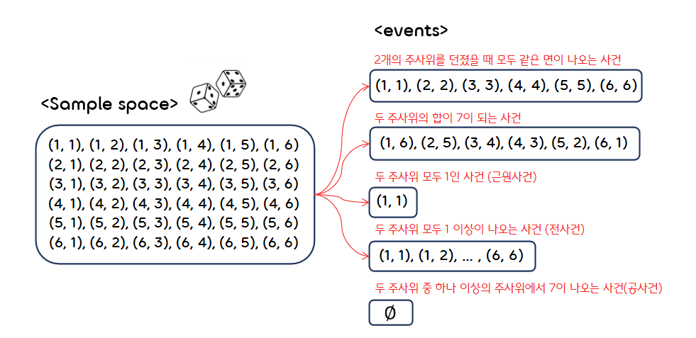
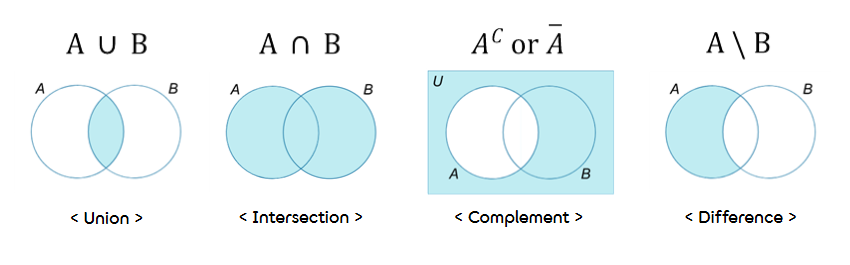
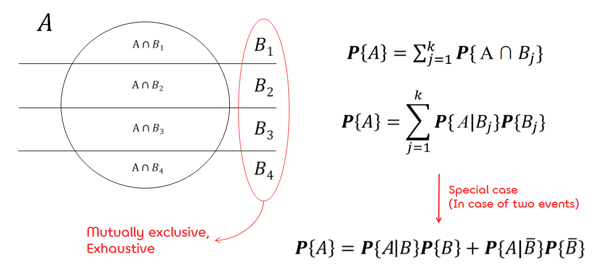

1.**Probability(확률)**
===

## < *Contents* >
- [1. Outcomes, Events, and the Sample space(결과, 사건, 표본공간)](#%EF%B8%8F-1-outcomes-events-and-the-sample-space결과-사건-표본공간)
- [2. Set operations(집합의 연산)](#%EF%B8%8F-2-set-operations집합의-연산)
- [3. Axioms of Probability(확률의 공리)](#%EF%B8%8F-3-axioms-of-probability확률의-공리)
- [4. Combinatorics(조합론)](#%EF%B8%8F-4-combinatorics조합론)
- [5. Conditional probability(조건부 확률)](#%EF%B8%8F-5-conditional-probability조건부-확률)

---  

## ✔️ 1. **Outcomes, Events, and the Sample space(결과, 사건, 표본공간)**
### 1) **Sample space(표본공간, Ω)**  
- A collection of all elementary results, or outcomes of an experiment.  
(어떤 특정 실험, 또는 무작위 실험을 했을 때 측정가능한 모든 결과의 집합이다.)  
 

### 2) **Events(사건, E)**
- Any set of outcomes is an event.  
(어떤 결과들의 집합이다. 이때, 사건은 표본 공간의 부분집합(subset)이다.)
- A sample space of  possible outcomes yield  possible events.  
(표본공간 에서의 가능한 모든 결과에 대해 사건의 총 개수는 개이다. → 부분집합의 개수)    

  
 

## ✔️ 2. **Set operations(집합의 연산)**

### 1) **Union(합집합)**
- A union of events A, B, C, ... is an event consisting of all the outcomes in all these events.  
(A, B, C, ... 사건에서 나올 수 있는 모든 결과들의 집합)
- corresponds to the word "OR"  
 

### 2) **Intersection(교집합)**
- An intersection of events A, B, C, ... is an event consisting of outcomes that are common in all these events.  
(A, B, C, ... 사건에서 공통적으로 나올 수 있는 결과들의 집합)
- corresponds to the word "AND"  
 

### 3) **Complement(여집합)**
- A complement of an event A is an event that occurs every time when A does not occur.  
(표본공간에서 A사건을 뺀 나머지 결과들의 집합)
- corresponds to the word "NOT"  
 

### 4) **Difference(차집합)**
- A difference of events A and B consists of all outcomes included in A but excluded from B.  
(A사건에는 포함되지만, B사건에는 포함되지 않는 결과들의 집합)
- corresponds to the word "BUT NOT"  

  
 

### 5) **Disjoint(배반) and Mutually exclusive(상호 배타적)**
- Events A and B are disjoint if their intersection is empty  
(A사건과 B사건의 교집합이 공집합인 경우)  

  

- Events A1, A2, A3, ... are mutually exclusive or pairwise disjoint if any two of these events are disjoint  
(A1, A2, A3, ... 사건들 각각의 교집합이 공집합인 경우)

  
 

### 6) **Exhaustive (Collectively Exhaustive, 전체 망라적)**
- Events A, B, C, ... are exhaustive if their union equals the whole sample space  
(A, B, C, ... 사건들의 합집합이 표본 공간과 같아지는 경우)  

  

- A사건과 A사건의 여사건은 전형적인 disjoint, exhaustive 사건이다.  

  

  
 

### ※ Taking Complements

  

  
 

## ✔️ 3. **Axioms of Probability(확률의 공리)**

### 1) **Sigma-algebra(시그마 대수)**  

- Let S be a set, and let M be a family of subsets of S. M is called sigma(σ)-algebra if  
(표본공간 S에 대해 M이 S에서 발생할 수 있는 사건(부분집합)들의 집합일 때,  
다음과 같은 조건을 만족하면 M을 시그마 대수라고 한다.)  
    - (a) it includes the sample space,  
    (M이 표본공간을 포함하고 있을 때)  

    

  

    - (b) every event in M is contained along with its complement; that is,  
    (M에 있는 모든 사건이 각각의 여사건을 가지고 있을 때 → (a) 항목에 의해  역시 만족해야 한다.)  

    

  

    - (c) every finite or countable collection of events in M is contained along with its union; that is,  
    (M에 속한 모든 측정 가능한 집합에 대해, 유한 집합들의 합집합 역시 M에 속해야 한다.)  

    

- By conditions (a), (b), every sigma-algebra has to contain the sample space and the empty event.  
The minimal collection 

forms a sigma-algebra that is called "degenerate".  
(표본공간과 공사건만을 포함하는 가장 작은 집합은 "degenerate"이라는 시그마 대수를 나타낸다.)  

- The richest sigma-algebra on a sample space Ω is the collection of all the events.(Power set)  
(가장 큰 집합인 표본공간 Ω의 멱집합(Power set)은 "Power set"이라는 시그마 대수를 나타낸다.)

  
 

### 2) **Axioms of Probability(확률의 공리)** 
#### (1)  For any event A ,   
#### (2) Probability of the sample space is   
#### (3) if  are disjoint events, then   
 

- Assume a sample space Ω and a sigma-algebra of events M on it.
- **Probability** 

is a function of events with the domain M and the range[0, 1] that satisfies the following two conditions.
    - (Unit measure) The sample space has unit probability.  
    (표본공간(전체집합)이라는 사건(부분집합)에 대한 확률은 1이다.)  
    

  

    - (Sigma-additivity) For any finite or countable collection of mutually exclusive events  
    (유한하거나 측정가능하고, 상호 배타적인 모든 사건들에 대해 아래의 식이 성립한다.)  
    

   
    

- **Extreme cases**
    -  and   

- **Union**
    - Consider an event that consists of some finite or countable collection of mutually exclusive outcomes,  
    (어떤 사건이 측정 가능한 mutually exclusive인 결과들을 원소로 가질 때,)  
    

  
    

 
    

- **Probability of union(합집합의 확률)**
    - 

    - For mutually exclusive events, 

    - More than 3 → 홀수항은 더하고, 짝수항은 빼준다.  
    

- **Complement(여집합의 확률)**
    

    

- **Intersection of independent events(독립사건들의 교집합)** 
    - Independent events  
    

  
 

## ✔️ 4. **Combinatorics(조합론)**  

### 1) **Equally likely outcomes**
- The sample space Ω consists of n possible outcomes, ω1, ..., ωn, each having the
same probability.  
(표본공간 Ω의 결과들이 도출될 확률이 모두 같은 경우)  

  

  

- A probability of any event E consisting of t out comes, equals  
(t개의 결과를 포함한 어떤 사건 E가 발생할 확률은 다음과 같다.)  

  

- The outcomes forming event E are often called "favorable". Thus we have a formula  
(사건 E를 구성하는 결과들을 "favorable"이라고 표현하면,)  

  

- (ex) 주사위를 던졌을 때, 각 면이 나올 확률은 모두 1/6로 동일하다.  
 

### 2) **Permutations and combinations(순열과 조합)**
- **Sampling with replacement(복원추출)**
    - Every sampled item is replaced into the initial set after sampling.  
    (추출한 아이템을 원상복구시킨 다음, 다시 시행한다.)
    - The same object may be sampled more than once.  
    (한 번 추출된 아이템이 다시 나올 수 있다.)  
 

- **Sampling without replacement(비복원추출)**
    - Every sampled item is removed from further sampling.  
    (한 번 추출한 아이템은 제거한 다음, 다시 시행한다.)
    - The same object cannot be sampled more than once.  
    (한 번 추출된 아이템은 다시 나올 수 없다.)  
 

- **Distinguishable(구분 가능한)**
    - Sampling of exactly the same objects in a different order yields a different outcome.  
    (같은 아이템을 뽑을 때 순서를 다르게 하면 서로 다른 결과가 도출된다. → 순서 고려)
    - That is, a different element of the sample space.  
    (즉, 표본공간의 서로 다른 원소이다.)  
    - (ex) 두 개의 같은 주사위를 던질 때, 순서를 구분하는 경우 (사실상 서로 다른 두 개의 주사위)  
 

- **Distinguishable(구분 불가능한)**
    - The order is not important, it only matters which objects are sampled and which ones aren't.  
    (순서는 고려하지 않고, 어떤 아이템이 나왔는지만을 고려한다. → 순서 고려 X)  
    - Indistinguishable objects arranged in a different order do not generate a new outcome.
    (구분 가능한 아이템들은 순서에 상관 없이 같은 결과만이 도출된다.)
    - (ex) 두 개의 같은 주사위를 던질 때, 순서를 구분하지 않는 경우     
 

#### (1) **Permutations with replacement(중복순열)**
- Sampling with replacement(복원) / Distinguishable(순서 상관 O)  

 

#### (2) **Permutations without replacement(순열)**
- Sampling without replacement(비복원) / Distinguishable(순서 상관 O)

   

#### (3) **Combinations without replacement(조합)**
- Sampling without replacement(비복원) / Indistinguishable(순서 상관 X)

  
   

#### (3) **Combinations with replacement(중복조합)**
- Sampling with replacement(복원) / Indistinguishable(순서 상관 X)  

   

## ✔️ 5. **Conditional probability(조건부 확률)**
### 1) **Conditional probability**  
- Conditional probability of event A given event B is the probability that A occurs when B is known to occur.  
(B에 대한 A의 조건부 확률은, 사건B가 발생했을 때 사건A도 마찬가지도 발생할 확률을 말한다.)  

  

- Intersection, general case

  
 

### 2) **Independence(독립)**
- Events A and B are independent if occurrence of B does not affect the probability of A.  
(사건 B가 일어날 확률이 사건 A가 일어날 확률에 아무런 영향을 주지 않을 때, 사건 A와 B는 서로 "독립"이다.)  

  

- 
   

### 3) **The Law of total probability (전체 확률의 법칙)**
- This law relates the unconditional probability of an event A
with its conditional probabilities.  
(조건부 확률로부터 조건이 붙지 않은 확률 A를 구할 때 사용한다.)  

  
 

### 4) **Bayes'rule (베이즈 룰)**

  

- bayes' rule for two events  

