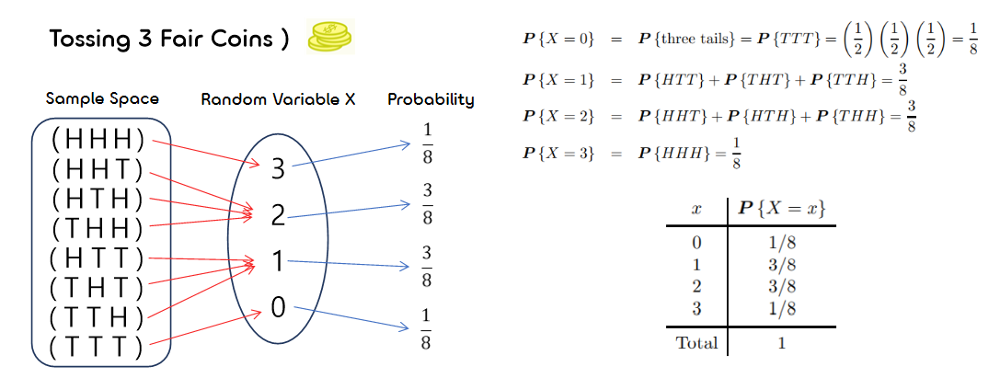
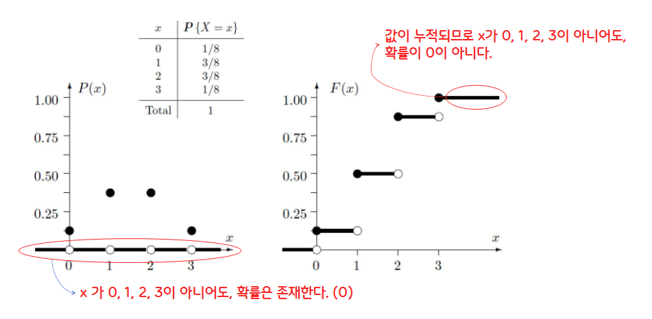
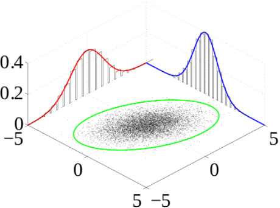
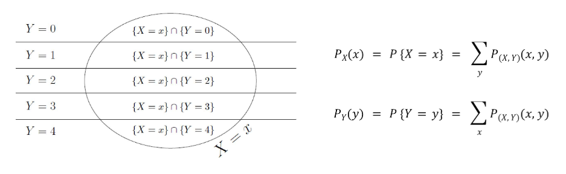
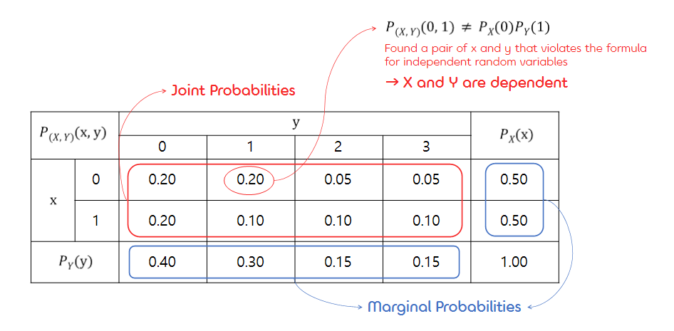
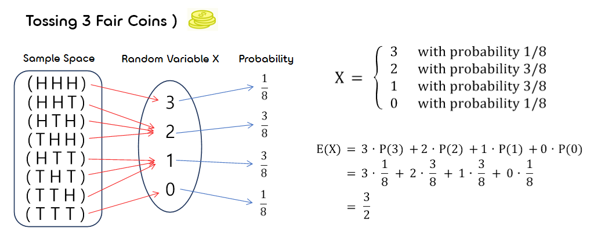
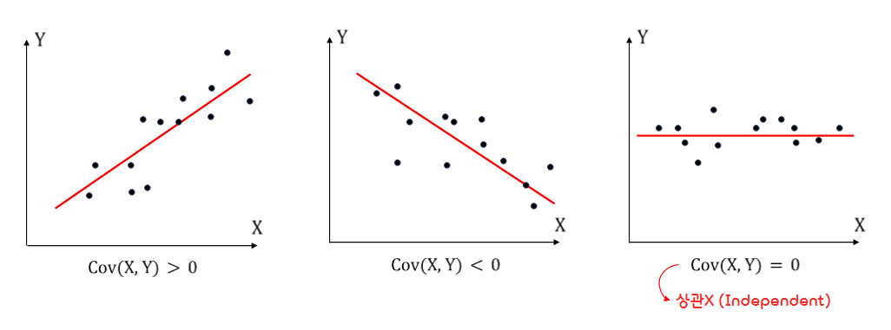
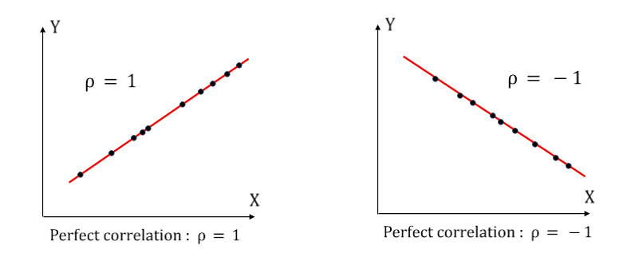

2.**Discrete random variables and their Distribution**
===

## < *Contents* >
- [1. Distribution of a random variable(확률변수의 분포)](#%EF%B8%8F-1-distribution-of-a-random-variable확률변수의-분포)
- [2. Distribution of a random vector(확률벡터의 분포)](#%EF%B8%8F-2-distribution-of-a-random-vector확률벡터의-분포)
- [3. Expectation and Variance(기댓값과 분산)](#%EF%B8%8F-3-expectation-and-variance기댓값과-분산)  

---  

## ✔️ 1. **Distribution of a random variable(확률변수의 분포)**  
### 1) **Random Variable(확률변수)**
- 어떤 시행의 결과에 따른 값과, 그 값에 대응하는 확률이 정해지는 변수를 "확률변수"라고 한다.  
- A random variable is a function of an outcome ω.  
(확률변수는 결과 ω에 대한 함수이다. → 정의역 : 표본공간, 공역 : 실수 전체의 집합)

  

- 확률변수는 대개 알파벳 대문자(X, Y, Z 등)로 나타내고, 확률변수가 취하는 값은 소문자(x, y, z 등)로 나타낸다.   

- (ex) 3개의 Fair coin 던지기를 할 때, 동전의 앞면이 나오는 경우를 센다고 해보자.
    - 를 앞면이 나오는 동전의 개수라고 할 때, 다음과 같이 각 사건에 대한 확률을 구해볼 수 있다.  

    

  
   

### 2) **Distribution of X**
- Collection of all the probabilities related to  is the distribution of  .  

- The function below is the **probability mass function(확률질량함수)**, or **pmf**.

  

- The **cummulative distribution function(누적분포함수)**, or **cdf** is defined as   

  

- The set of possible values of  is called the support of the distribution   
(가 가질 수 있는 모든 가능한 값들을 분포 의 "support"라고 한다.)

-  

  
 

### 3) **Types of random variables(확률변수의 종류)**
- **Discrete random variable(이산확률변수)**  
    - A variable which may take only a countable number of distinct values.  
    (확률변수 가 취할 수 있는 값이 유한한(셀 수 있는) 경우) 
    - (ex) 프린터가 출력할 출력물의 개수  
 

- **Continuous random variable(연속확률변수)**  
    - A variable which takes an infinite number of possible values.  
    (확률변수 가 취할 수 있는 값이 무한한(셀 수 없는) 경우)
    - (ex) 프린터가 출력물을 출력하는데 걸리는 시간
 

## ✔️ 2. **Distribution of a random vector(확률벡터의 분포)**  

### 1) **Joint distribution and Marginal distribution(결합 분포와 주변 분포)**
- If  and  are random variables, the pair(, ) is a random vector.  
(확률변수 , 로 이루어진 벡터 (, )를 "확률벡터"라고 한다.)  

- Its distribution is called the **joint distribution** of  and .  
Individual distributions of  and  are then called the **marginal distributions**.  
(두 개 이상의 확률변수를 동시에 고려한 확률분포를 "결합 분포"라고 하며,  
 각각의 확률변수에 대한 분포를 "주변 분포"라고 한다.)  

  

-   

-   (Since,  are exhaustive and mutually exclusive events.)

- All the concepts extend to a vector  of n components and its joint distribution.  
 

### 2) **Addition Rule**
- Computing marginal probabilities from the joint distribution.  
(결합 분포를 통해 주변 확률을 구하는 방법이다.)  

  
  

### 3) **Independence of random variables(확률변수의 독립)**
- Random variables  and  are independent if they satisfy the expression below for all values of  and   
(확률변수 , 가 모든 , 에 대해 다음 식을 만족하면 두 확률변수는 서로 "독립"이다.)

  

- In other words, variable  and  take their values independently of each other.  
(두 확률변수가 어떤 값을 가질지에 대해서 서로 상관이 없다.)  

  
 

## ✔️ 3. **Expectation and Variance(기댓값과 분산)**  
### 1) **Expectation(기댓값)**
- Expectation or expected value of a random variable X is its mean, the average value.  
(이산확률변수의 기댓값은 표본공간의 원소 의 가중 평균을 의미한다.)  

- Expectation discrete case  

  
 

### 2) **Expectation of function(함수의 기댓값)**
- If  is a function of , expectation of   is computed by a similar formula,  
(에 대한 함수 의 기댓값도 다음과 같이 구할 수 있다.) 

  
 

### 3) Properties of expectations(기댓값의 성질)   
- Properties of expectations

  
 In particular,

   

   
 For independent X and Y  

  

- proof )  

  
  
   

 
  

   

### 4) **Variance and standard deviation(분산과 표준편차)**  
- **Variance(분산)**
    - 편차의 제곱의 평균값
    - 기댓값은 확률변수의 위치를 나타내고 분산은 그것이 얼마나 넓게 퍼져 있는지를 나타낸다.

  

 

- **Standard deviation(표준편차)**
    - 분산의 제곱근 값 (다시 원래 크기로 만들어 준다.)
    - 기댓값에서 얼마나 떨어져 있는지를 나타낸다.  

  

### 5) **Covariance and correlation(공분산과 상관관계)**  
- **Covariance(공분산)**
    - 확률변수 X의 편차와 Y의 편차를 곱한 것의 평균값
    - 2개의 확률변수의 선형 관계를 나타낸다.

  
   

- **Correlation coefficient(상관계수)**
    - 두 변수 ,  사이의 상관관계의 정도를 나타내는 수치  
    - 상관계수는 피어슨(Karl Pearson)에 의하여 제안되었기 때문에 피어슨 상관계수라고도 한다.

  

  
   

### 6) Properties of variances and covariances(분산과 공분산의 성질)
- Properties of variances and covariances   

  

  

 In particular,  

  

  

  

 For independent X and Y,  

  

  

 

- proof )  

  

  

  

   

 

### 7) **Chebyshev's inequality(쳬비쇼프 부등식)**  

- Any random variable  with expectation  and variance  belongs to the
interval  
 with probability of at least 
. That is,  

   
 

 for any distribution with expectation  and variance  and for any positive   

