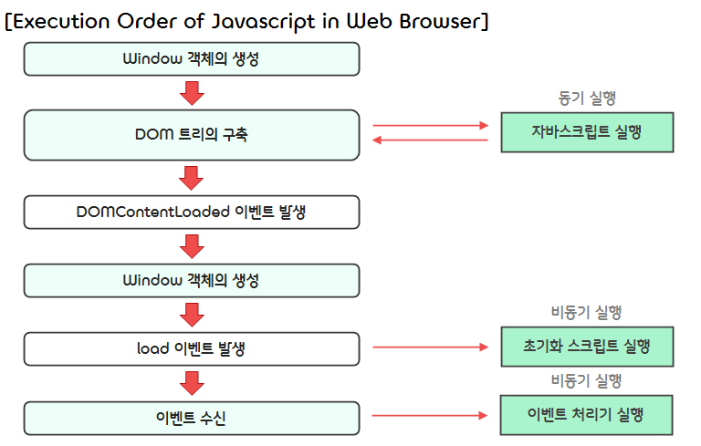

10.**Host Object**
===  

## < *Contents* >
- [1. About Host Object](#%EF%B8%8F-1-about-host-object)
- [2. Client Side Javascript](#%EF%B8%8F-2-client-side-javascript)
- [3. Location Object](#%EF%B8%8F-3-location-object)
- [4. History Object](#%EF%B8%8F-4-history-object)
- [5. Navigator Object](#%EF%B8%8F-5-navigator-object)
- [6. Screen Object](#%EF%B8%8F-6-screen-object)
- [7. Document Object](#%EF%B8%8F-7-document-object)
- [8. Controlling Windows](#%EF%B8%8F-8-controlling-windows)

---

## ✔️ 1. **About Host Object**
- **호스트 객체(Host Object)** 란 ECMAScript로 규정된 기본 객체 외에 자바스크립트 실행 환경에 정의된 객체를 말한다.
- 자바스크립트 프로그램은 웹 브라우저에 구현된 다양한 호스트 객체를 이용해 CSS로 스타일을 제어하거나, HTML 문서를 제어할 수 있으며, 웹 브라우저의 Window 객체를 제어할 수 있다. 또한 호스트 객체를 사용해 대화형(Interactive) 웹 페이지를 동적(Dynamic)으로 만들 수도 있다.  
- Window, XMLHttpRequest, HTMLElement 등의 객체가 호스트 객체에 해당하며, 이러한 호스트 객체는 OS, 웹 브라우저에 따라 달라질 수 있다.  

</br>

## ✔️ 2. **Client Side Javascript**  
### 1) **What is JavaScript Used for?**
- 자바스크립트를 사용하면 웹 페이지를 동적(Dynamic)으로 만들 수 있다.
- 그리고, 자바스크립트를 활용해 사용자 입력에 대응하는 등 다양한 작업을 자동화하여 웹 페이지의 사용성을 향상시킬 수 있다.  
- 또한, 자바스크립트를 활용하여 웹 브라우저에서 동작하는 웹 애플리케이션을 만들 수도 있다.  

</br>

- 기술적인 측면에서 웹 브라우저에서 자바스크립트가 하는 일은 다음과 같이 네 가지로 분류할 수 있다.  
    - ① 웹 페이지의 Document 객체 제어(HTML 요소와 CSS 스타일 작업)
    - ② 웹 페이지의 window 객체 제어 및 브라우저 제어
    - ③ 웹 페이지에서 발생하는 이벤트 처리
    - ④ HTTP를 이용한 통신 제어  

</br>

### 2) **Adding Javascript to HTML Document**
- HTML에 자바스크립트 코드를 삽입하는 방법은 다음과 같이 네 가지가 있다.  
(단, 자바스크립트 코드와 HTML 코드를 분리하여 사용하려는 차원에서, 최근에는 (3), (4)번 방법을 거의 사용하지 않는다.)  

</br>

- (1) script 요소의 내용물로 작성하는 방법(Inline Script)
    ```html
    <script>
        console.log("Hello world!");
    </script>
    ```  
- (2) 외부 파일을 읽어 들이는 방법(External Script)
    ```html
    <script src = "../scripts/sample.js"></script>
    ```  
- (3) 이벤트 처리기의 속성에 작성하는 방법
    ```html
    <input type="button" value="click" onclick="console.log('Hello world!');">
    ```  
- (4) 자바스크립트 의사 프로토콜(Javascript : URL)
    ```html
    <a href = "javascript:console.log('Hello world!');">click</a>
    ```  

</br>

### 3) **Execution Sequence of Javascript in Web Browser**  
- 웹 브라우저에서 HTML 문서를 분석하고 표시하는 프로그램을 가리켜 **렌더링 엔진(Rendering Engine)** 이라고 한다.
- 렌더링 엔진은 다음과 같은 과정을 거쳐 HTML 문서의 구문을 분석하고 DOM 트리를 구축한 후, HTML 안에 지정된 자바스크립트 코드를 실행한다.  

</br>

- ① 웹 브라우저로 웹 페이지를 열면 먼저 Window 객체가 생성된다.
    - Window 객체는 웹 페이지의 전역 객체로, 웹 페이지와 탭마다 생성된다.
- ② Document 객체가 Window 객체의 프로퍼티로 생성되며, 웹 페이지를 해석해서 DOM 트리의 구축을 시도한다.
    - Document 객체는 readyState 프로퍼티를 가지고 있으며, 이 프로퍼티에는 HTML 문서의 해석 상태를 뜻하는 문자열이 저장된다.
    - readyState 프로퍼티는 "loading"이라는 문자열을 초깃값으로 갖는다.
- ③ HTML 문서는 HTML 구문을 작성 순서에 따라 분석하며 Document 객체 요소와 텍스트 노드를 추가해 나간다.  
- ④ HTML 문서 안에 script 요소가 있으면 script 요소 안의 코드 또는 외부 파일에 저장된 코드의 구문을 분석한다.  
    - 그 결과 오류가 발생하지 않으면 그 시점에 해당 코드를 실행한다.
    - 이때, script 요소들은 동기적으로 실행된다.  
    - 즉, script 요소의 구문을 분석해서 실행할 때는 HTML 문서의 구문 분석이 일시적으로 중단되고, 자바스크립트 코드의 실행을 완료한 후에는 일시적으로 중단되어 있었던 HTML 문서의 구문분석이 재개된다.  
- ⑤ HTML 문서의 모든 내용을 읽은 후에 DOM 트리 구축을 완료하면 document.readyState 프로퍼티 값이 "interactive"로 바뀐다.  
- ⑥ 웹 브라우저는 Document 객체에 DOM 트리 구축의 완료를 알리기 위해 DOMContentLoaded 이벤트를 발생시킨다.
- ⑦ img 등의 요소가 이미지 파일 등의 외부 리소스를 읽어 들여야 한다면, 이 시점에 읽어 들인다.  
- ⑧ 모든 리소스를 읽어 들인 후에는 document.readyState 프로퍼티 값이 "complete"로 바뀐다.  
    - 마지막으로 웹 브라우저는 Window 객체를 상대로 load 이벤트를 발생시킨다.  
- ⑨ 이 시점부터 다양한 이벤트(사용자 정의 이벤트, 네트워크 이벤트)를 수신하며, 이벤트가 발생하면 이벤트 처리기가 비동기로 호출된다.  

</br>

- 위의 흐름을 그림으로 나타내면 다음과 같다.
<p align="center"></p>  

</br>

### 4) **async와 defer**
- **async** 와 **defer** 속성은 script의 논리 속성으로, src 속성을 갖는 script 요소에는 적용할 수 있지만, 인라인 스크립트에는 적용할 수 없다.  
- 이들을 속성으로 사용할 경우, 해당 자바스크립트 코드를 실행할 때 HTML의 구문 분석(Parsing)을 중단하지 않는다.  
    ```html
    <script async src="../scripts/sample.js"></script>
    <script defer src="../scripts/sample.js"></script>
    ```  

</br>

- script 요소에 **async** 속성을 설정하면 script 요소의 코드가 **비동기적(Asynchronous)** 으로 실행된다.
    - **동기적(Synchronous)** : 어떤 작업을 요청했을 때, 그 작업이 종료될 때까지 기다린 후 다음 작업을 수행하는 방식
    - **비동기적(Asynchronous)** : 어떤 작업을 요청했을 때, 그 작업이 종료될 때까지 기다리지 않고 다른 작업을 진행하다가, 요청했던 작업이 종료되면 그에 대한 추가 작업을 수행하는 방식  
- 즉, HTML 문서의 구문 분석 처리를 막지 않으며, script 요소의 코드를 최대한 빨리 실행한다.
- 이때, 여러 개의 script 요소에 async 속성을 설정하면 다 읽어 들인 코드부터 비동기적으로 실행하므로, 실행 순서가 보장되지 않는다.
- 따라서 읽어 들이는 순서에 의존하는 script 요소들에는 async 속성을 설정하지 않도록 주의해야 한다.  

</br>

- **defer** 속성을 설정한 script 요소는 DOM 트리 구축이 끝난 후에 실행된다,
- DOM 구축이 끝난 시점에 실행되기 때문에, 자바스크립트 코드로 요소 객체에 이벤트 처리기를 등록하는 등의 초기화 작업을 할 수 있다.  
- 따라서 defer 속성은 DOMContentLoad 이벤트의 대안으로 활용할 수 있다.
- 그리고, defer는 async와 달리, 먼저 읽어 들이는 순서가 아니라 script 요소가 정의된 순서대로 실행된다.  

</br>

- 이때 주의해야 할 점은, async 또는 defer 속성이 설정된 script 요소에 document.write 메소드가 있거나, async, defer 속성을 지원하지 않는 웹 브라우저에서 이를 사용할 경우, script 요소를 동기적으로 실행된다는 것이다.  

</br>

### 5) **Window Object**
- Window 객체는 클라이언트 측 자바스크립트 프로그램의 전역 객체이며, 전역 변수는 Window 객체의 프로퍼티에 해당한다.  
- 그리고, 웹 브라우저에서 사용할 수 있는 다양한 객체와 메소드 또한 Window 객체의 프로퍼티로 저장되어 있다.  
- 이때 Window 객체에 내장된 프로퍼티들은 window. 접두사 없이도 참조가 가능한다.
    ```javascript
    window.document ... 
    document ...
    ```  
- Window 객체는 screen, document, location, window, console, opener, name, scrollX 등의 프로퍼티와, alert(message), prompt(message, default), setTimeOut(callback, interval), blur(), focus(), open(), resizeBy(width, height) 등의 메소드를 갖는다.

</br>

## ✔️ 3. **Location Object**
- **Location** 객체는 창에 표시되는 문서의 URL을 관리한다.  
- Location 객체는 window.location 또는 location으로 참조할 수 있다.  
- Location 객체의 프로퍼티는 수정할 수 있으며, 그 값을 수정하면 필요에 따라 웹 서버에 수정을 요청하고 응답에 따라 창을 갱신한다.  

</br>

- Location 객체의 프로퍼티는 다음과 같다.
    <table border="1">
        <tr>
            <th><center>프로퍼티</center></th>
            <th><center>설명</center></th>
            <th><center>예시</center></th>
        </tr>
        <tr>
            <td align="center">hash</td>
            <td>앵커 부분</td>
            <td>#anchor</td>
        </tr>
        <tr>
            <td align="center">host</td>
            <td>호스트 이름 : 포트 번호</td>
            <td>www.example.com:80</td>
        </tr>
        <tr>
            <td align="center">hostname</td>
            <td>호스트 이름</td>
            <td>www.example.com</td>
        </tr>
        <tr>
            <td align="center">href</td>
            <td>전체 URL</td>
            <td>http://www.example.com:80/test/index.html?q=value#anchor</td>
        </tr>
        <tr>
            <td align="center">pathname</td>
            <td>웹 사이트의 루트를 기준으로 한 상대 경로</td>
            <td>/test</td>
        </tr>
        <tr>
            <td align="center">port</td>
            <td>포트 번호</td>
            <td>80</td>
        </tr>
        <tr>
            <td align="center">protocol</td>
            <td>프로토콜</td>
            <td>http:</td>
        </tr>
        <tr>
            <td align="center">search</td>
            <td>질의 문자열</td>
            <td>?q=value</td>
        </tr>
    </table>  

</br>

- Location 객체의 메소드는 다음과 같다.
    <table border="1">
        <tr>
            <th><center>메소드</center></th>
            <th><center>설명</center></th>
        </tr>
        <tr>
            <td align="center">assign(url)</td>
            <td>url이 가리키는 문서를 읽는다. 웹 브라우저의 이력에 남는다.</td>
        </tr>
        <tr>
            <td align="center">reload()</td>
            <td>문서를 다시 읽어들인다.</td>
        </tr>
        <tr>
            <td align="center">replace(url)</td>
            <td>url로 이동한다. 웹 브라우저의 이력에 남지 않는다.</td>
        </tr>
        <tr>
            <td align="center">toString()</td>
            <td>location.href 값을 반환한다.</td>
        </tr>
    </table>  

</br>

- 연습 코드
    ```javascript
    // 해당 URL이 가리키는 문서를 읽어 들인다. 
    // 아래 두 코드 모두 읽어 들이기 이전의 URL을 이력으로 남기므로, '뒤로 가기' 버튼을 사용해서 되돌아갈 수 있다.
    location.href = "https://github.com/LaonCoder/";
    location.assign("https://github.com/LaonCoder/");

    // URL이 가리키는 문서를 읽어 들일 때, 이력을 남기지 않으려면 replace 메소드를 사용한다.
    location.replace("https://github.com/LaonCoder/");

    // URL에는 상대 경로를 지정할 수도 있다.
    // 상대 경로를 지정하면 이전 웹 페이지의 사이트 루트에 대한 상대 URL로 인식한다.
    location.replace("/book/bookList.aspx");

    // reload를 사용하면 현재의 페이지를 다시 읽어 들일 수 있다.
    location.reload();

    // hash 프로퍼티에 HTML 요소의 id 속성 값을 대입하면 그 HTML 요소로 스크롤한다.
    location.hash = "#header";

    // search 프로퍼티 값을 바꾸면 서버에 질의 문자열을 보낸다.
    // 이때 search 프로퍼티에 저장된 값은 URL 인코딩되어 서버로 전송된다. (ex. "?some%20data")
    location search = "some data";
    ```  

</br>

## ✔️ 4. **History Object**
- **History** 객체는 창의 웹 페이지 열람 이력을 관리한다.
- History 객체는 window.history 또는 history로 참조할 수 있다.  

</br>

- History 객체의 프로퍼티는 다음과 같다.
    <table border="1">
        <tr>
            <th><center>프로퍼티</center></th>
            <th><center>설명</center></th>
        </tr>
        <tr>
            <td align="center">length</td>
            <td>현재 세션의 이력 개수(읽기 전용)</td>
        </tr>
        <tr>
            <td align="center">scrollRestoration</td>
            <td>웹 페이지를 이동한 후에 동작하는 웹 브라우저의 자동 스크롤 기능을 켜거나 끄는 값</td>
        </tr>
        <tr>
            <td align="center">state</td>
            <td>pushState와 replaceState 메소드로 설정한 state값(읽기 전용)</td>
        </tr>
    </table>  

</br>

- History 객체의 메소드는 다음과 같다.
    <table border="1">
        <tr>
            <th><center>메소드</center></th>
            <th><center>설명</center></th>
        </tr>
        <tr>
            <td align="center">back()</td>
            <td>창의 웹 페이지 열람 이력을 하나 되돌린다.</td>
        </tr>
        <tr>
            <td align="center">forward()</td>
            <td>창의 웹 페이지 열람 이력을 하나 진행한다.</td>
        </tr>
        <tr>
            <td align="center">go(number)</td>
            <td>창의 웹 페이지 열람 이력을 number만큼 진행한다. number 값이 음수면 그만큼 되돌린다.</td>
        </tr>
        <tr>
            <td align="center">pushState(state, title url)</td>
            <td>창에 웹 페이지 열람 이력을 추가한다. 페이지는 이동하지 않는다.</td>
        </tr>
        <tr>
            <td align="center">replaceState(state, title url)</td>
            <td>현재 창의 열람 이력을 수정한다.</td>
        </tr>
    </table>  

</br>

- 연습 코드
    ```javascript
    // 웹 페이지 열람 이력을 진행하거나 되돌아갈 때는 back과 forward 메소드를 사용한다.
    history.back();
    history.forward();

    // 건너뛸 횟수를 지정해서 웹 페이지 이력을 진행하거나 되돌아갈 때는 go 메소드를 사용한다.
    history.go(-3);
    history.go(2);

    // 페이지를 전환하지 않고 웹 페이지 열람 이력만 추가하고자 할 때는 pushState 메소드를 사용한다.
    history.pushState(null, null, "page2.html");
    ```  

</br>

## ✔️ 5. **Navigator Object**
- **Navigator** 객체는 스크립트가 실행 중인 웹 브라우저 등의 애플리케이션 정보를 관리한다.
- Navigator 객체는 window.navigator 또는 navigator로 참조할 수 있고, 브라우저 테스트에 활용될 수 있다.

</br>

- Navigator 객체의 프로퍼티는 다음과 같다.
    <table border="1">
        <tr>
            <th><center>프로퍼티</center></th>
            <th><center>설명</center></th>
        </tr>
        <tr>
            <td align="center">appCodeName</td>
            <td>웹 브라우저의 내부 코드 네임(정확하지 않다.)</td>
        </tr>
        <tr>
            <td align="center">appName</td>
            <td>웹 브라우저 이름(정확하지 않다.)</td>
        </tr>
        <tr>
            <td align="center">appVersion</td>
            <td>웹 브라우저 버전(정확하지 않다.)</td>
        </tr>
        <tr>
            <td align="center">geolocation</td>
            <td>단말기의 물리적 위치를 관리하는 Geolocation 객체</td>
        </tr>
        <tr>
            <td align="center">language</td>
            <td>웹 브라우저의 UI 언어("en", "ko", "fr" 등)</td>
        </tr>
        <tr>
            <td align="center">mimeTypes[]</td>
            <td>웹 브라우저가 지원하는 MIME 타입 목록을 저장한 MimeTypeArray 객체</td>
        </tr>
        <tr>
            <td align="center">onLine</td>
            <td>웹 브라우저가 네트워크에 연결되어 있는지를 뜻하는 논리값</td>
        </tr>
        <tr>
            <td align="center">platform</td>
            <td>웹 브라우저의 플랫폼(윈도우는 "win32", 맥은 "MacIntel" 등)</td>
        </tr>
        <tr>
            <td align="center">plugins</td>
            <td>웹 브라우저에 설치된 플러그인 목록을 가리키는 Plugin 객체의 배열</td>
        </tr>
        <tr>
            <td align="center">userAgent</td>
            <td>웹 브라우저가 USER-AGENT 헤더에 보내는 문자열</td>
        </tr>
    </table>  

</br>

- Navigator 객체의 메소드는 다음과 같다.
    <table border="1">
        <tr>
            <th><center>메소드</center></th>
            <th><center>설명</center></th>
        </tr>
        <tr>
            <td align="center">javaEnabled()</td>
            <td>Java를 사용할 수 있는지를 뜻하는 논리값을 반환한다.</td>
        </tr>
        <tr>
            <td align="center">getUserMedia()</td>
            <td>단말기의 마이크와 카메라에서 audio와 video 스트림을 반환한다.</td>
        </tr>
        <tr>
            <td align="center">registerContentHandler(mimeType, uri, title)</td>
            <td>웹 사이트를 특정 MIME 타입과 연결한다.</td>
        </tr>
        <tr>
            <td align="center">vibrate()</td>
            <td>단말기를 진동시킨다.</td>
        </tr>
    </table>  

</br>

## ✔️ 6. **Screen Object**
- **Screen** 객체는 화면(모니터) 크기와 색상 등의 정보를 관리한다.
- Screen 객체는 window.screen 또는 screen으로 참조할 수 있고, Screen 객체를 사용하면 웹 페이지가 어떤 크기의 단말기에 표시되고 있는지를 알 수 있다.  

</br>

- Screen 객체의 프로퍼티는 다음과 같다.
    <table border="1">
        <tr>
            <th><center>프로퍼티</center></th>
            <th><center>설명</center></th>
        </tr>
        <tr>
            <td align="center">availTop</td>
            <td>사용할 수 있는 화면의 첫 번째 픽셀의 y좌표</td>
        </tr>
        <tr>
            <td align="center">availLeft</td>
            <td>사용할 수 있는 화면의 첫 번째 픽셀의 x좌표</td>
        </tr>
        <tr>
            <td align="center">availHeight</td>
            <td>사용할 수 있는 화면의 높이</td>
        </tr>
        <tr>
            <td align="center">availWidth</td>
            <td>사용할 수 있는 화면의 너비</td>
        </tr>
        <tr>
            <td align="center">colorDepth</td>
            <td>화면의 색상 심도(비트 수) : 약 1,678만 색상이면 24</td>
        </tr>
        <tr>
            <td align="center">pixelDepth</td>
            <td>화면의 비트 심도(비트 수) : 약 1,678만 색상이면 24(IE9는 제공하지 않는다.)</td>
        </tr>
        <tr>
            <td align="center">height</td>
            <td>화면 높이</td>
        </tr>
        <tr>
            <td align="center">width</td>
            <td>화면 너비</td>
        </tr>
        <tr>
            <td align="center">orientation</td>
            <td>화면 방향</td>
        </tr>
    </table>  

</br>

## ✔️ 7. **Document Object**
- **Document** 객체는 창에 표시되고 있는 웹 페이지를 관리한다.
- Document 객체는 window.document 또는 document로 참조할 수 있으며, Document 객체를 사용해 DOM 트리를 읽고 쓸 수 있다.  

</br>

- Document 객체의 프로퍼티는 다음과 같다.
    <table border="1">
        <tr>
            <th><center>프로퍼티</center></th>
            <th><center>설명</center></th>
        </tr>
        <tr>
            <td align="center">characterSet</td>
            <td>문서에 적용된 문자 인코딩(읽기 전용)</td>
        </tr>
        <tr>
            <td align="center">cookie</td>
            <td>문서의 cookies를 쉼표로 연결한 문자열</td>
        </tr>
        <tr>
            <td align="center">domain</td>
            <td>문서의 도메인(읽기 전용)</td>
        </tr>
        <tr>
            <td align="center">lastModified</td>
            <td>문서를 마지막으로 수정한 날(읽기 전용)</td>
        </tr>
        <tr>
            <td align="center">location</td>
            <td>window.location 프로퍼티와 마찬가지로 Location 객체를 가리킨다.</td>
        </tr>
        <tr>
            <td align="center">readyState</td>
            <td>문서를 읽어 들인 상태(읽기 전용)</td>
        </tr>
        <tr>
            <td align="center">referrer</td>
            <td>문서에 링크된 페이지 URL(읽기 전용)</td>
        </tr>
        <tr>
            <td align="center">title</td>
            <td>문서 제목</td>
        </tr>
        <tr>
            <td align="center">URL</td>
            <td>문서 URL(읽기 전용)</td>
        </tr>
    </table>  

</br>

- Document 객체의 메소드는 다음과 같다.
    <table border="1">
        <tr>
            <th><center>메소드</center></th>
            <th><center>설명</center></th>
        </tr>
        <tr>
            <td align="center">close()</td>
            <td>document.open() 메소드로 연 문서를 닫는다.</td>
        </tr>
        <tr>
            <td align="center">open()</td>
            <td>문서를 쓰기 위해 연다.</td>
        </tr>
        <tr>
            <td align="center">write(text)</td>
            <td>document.open() 메소드로 연 문서에 기록한다.</td>
        </tr>
        <tr>
            <td align="center">writeln(text)</td>
            <td>document.open() 메소드로 연 문서에 기록하고 개행 문자를 추가한다.</td>
        </tr>
    </table>  

</br>

## ✔️ 8. **Controlling Windows**
- 웹 브라우저는 일반적으로 여러 개의 창과 탭을 표시하는데, 각각의 창과 탭은 별도의 **브라우징 컨텍스트(Browsing Context)** 를 제공한다.  
(브라우징 콘텍스트는 사용자에게 표시되는 일종의 환경을 말한다.)  
- 그리고 각각의 브라우징 컨텍스트는 별도의 Window 객체를 갖는다.  

</br>

### 1) **Opening/Closing Windows**  
- 새로운 창 또는 탭을 열 때는 **open** 메소드를 사용한다.  
    - **url** : 새롭게 여는 창이 읽어 들이는 문서의 URL. 
    - **창의 이름** : 새로운 창의 이름. 이미 이름이 같은 창이 있다면 새로 열지 않고 그 창에 표시한다.  
    - **옵션** : 새로운 창의 설정 값(창의 크기 등)을 쉼표로 연결해서 표기한다.
    ```javascript
    const w = open(url, 창의 이름, 옵션);
    ```  
- open 메소드는 새로운 창의 Window 객체를 반환한다.
- 열린 창을 닫을 때는 **close** 메소드를 사용한다.  
    ```javascript
    w.close();
    ```  

</br>

- 연습 코드  
    ```html
    <!DOCTYPE html>
    <html lang="ko">
    <head>
        <meta charset="UTF-8">
        <meta http-equiv="X-UA-Compatible" content="IE=edge">
        <meta name="viewport" content="width=device-width, initial-scale=1.0">
        <title>top page</title>
        <script>
            window.onload = function() {
                let w;
                document.getElementById("open").onclick = function() {
                    w = open("https://github.com/LaonCoder", "new page", "width=400, height=300");
                };  
                document.getElementById("close").onclick = function() {
                    if (w) w.close();
                };
            };
        </script>
    </head>
    <body>
        <p>
            <input type="button" value="open" id="open">
            <input type="button" value="close" id="close">
        </p>
    </body>
    </html>
    ```  

</br>

### 2) **Controlling Windows** 
- open 메소드로 연 창은 위치와 크기를 바꾸거나 스크롤할 수 있다.
- 위치를 변경하려면 **moveBy** 와 **MoveTo** 메소드를 사용한다.  
    ```javascript
    w.moveBy(10, 20);    // 너비를 10px, 높이를 20px 키운다.
    w.moveTo(100, 150);  // 창의 왼쪽 좌표(100, 150)로 이동한다.
    ```  
- 크기를 변경하려면 **resizeBy** 와 **resizeTo** 메소드를 사용한다.  
    ```javascript
    w.resizeBy(10, 20);    // 너비를 10px, 높이를 20px 키운다.
    w.resizeTo(200, 150);  // 너비를 200px, 높이를 150px로 설정한다.  
    ```
- 창에 표시되는 페이지를 스크롤하려면 **scrollBy** 와 **ScrollTo** 메소드를 사용한다.  
    ```javascript
    w.scrollBy(0, 100);  // 아래쪽으로 100px 스크롤한다.
    w.scrollTo(0, 0);    // 시작 위치로 이동한다.
    ```  

</br>

### 3) **Referencing other Windows** 
- 부모 창과 부모 창이 open 메소드로 연 자식 창은 서로의 Window 객체를 참조하여, 상대의 프로퍼티와 메소드를 참조할 수 있다.  
(단, 상호 간에 참조할 수 있는 경우는 '동일 출처 정책'을 만족할 때로 한정된다.)
- 부모 창이 자식 창의 Window 객체를 참조할 때는 open 메소드가 반환한 값을 사용한다.  
    ```javascript
    const w = open("newpage.html", "new page", "width=400, height=300");
    w.document.body.style.backgroundColor = "blue";  // 자식 창의 배경색을 파란색으로 만든다.
    ```  
- 자식 창이 부모 창의 Window 객체를 참조할 때는 자식 창의 Window 객체에 있는 **opener** 프로퍼티를 사용한다.  
    ```javascript
    opener.document.body.style.backgroundColor = "red";  // 부모 창의 배경색을 빨간색으로 만든다.
    ```  

