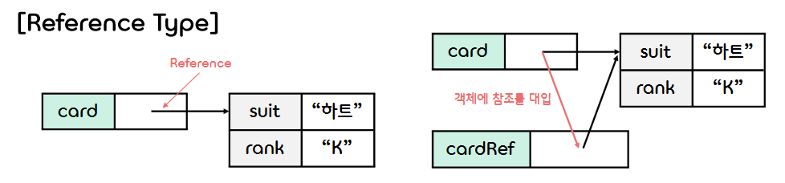

2.**Objects, Arrays and Functions**
===  

## < *Contents* >
- [1. Objects(객체)](#%EF%B8%8F-1-objects객체)
- [2. Constructors(생성자)](#%EF%B8%8F-2-constructors생성자)
- [3. Functions(함수)](#%EF%B8%8F-3-functions함수)  
- [4. Arrays(배열)](#%EF%B8%8F-4-arrays배열)  

---

## ✔️ 1. **Objects(객체)**

### 1) **About Object**  
- 자바스크립트의 기본 타입(Datatype)은 **객체(Object)** 이다.
- 객체는 이름(name)과 값(value)을 한 쌍으로 묶은 데이터를 여러 개 모은 것이다.
- 객체에 포함된 데이터 하나(이름과 값의 쌍)를 가리켜 객체의 **프로퍼티(Property)** 라고 한다.  
- 프로퍼티의 이름 부분은 **프로퍼티 이름** 또는 **키(key)** 라고 부른다.

</br>

### 2) **객체 리터럴로 객체 생성**
- {...} 부분이 객체 리터럴에 해당한다.
- 프로퍼티 이름과 값은 **콜론( : )** 을 사용해서 구분하며, 중괄호( {} ) 안에 있는 프로퍼티들은 **쉼표( , )** 로 구분한다.
- 프로퍼티 이름으로는 모든 식별자와 문자열 리터럴(빈 문자열도 사용 가능)을 사용할 수 있다.
    ```javascript
    let card = {suit: "스페이드", rank: "A"};
    ```  
- 변수에 대입된 객체 안의 프로퍼티 값을 읽거나 쓸 때는 **마침표( . ) 연산자** 또는 **대괄호 연산자( [] )** 를 사용한다.  
    ```javascript
    console.log(card.suit);     // → 스페이드
    console.log(card["rank"]);  // → A
    ```
- 객체 없는 프로퍼티를 읽으려고 시도하면 undefined를 반환한다. 
- 객체 리터럴 안에 어떠한 프로퍼티도 작성하지 않으면 빈 객체가 생성된다.  

</br>

### 3) **프로퍼티 추가와 삭제**
- 없는 프로퍼티 이름에 값을 대입하면 새로운 프로퍼티가 추가된다.
    ```javascript
    card.value = 14;
    console.log(card);  // → { suit: '스페이드', rank: 'A', value: 14 }
    ```  
- delete 연산자를 사용하면 프로퍼티를 삭제할 수 있다.
    ```javascript
    delete card.rank;
    console.log(card);  // → { suit: '스페이드', value: 14 }
    ```  

</br>

### 4) **in 연산자로 프로퍼티가 있는지 확인**
- **in 연산자** 를 사용하면 객체에 특정 프로퍼티가 있는지 확인할 수 있다.
- 이때, in 연산자가 조사하는 대상이 그 객체가 가진 프로퍼티와 그 객체가 상속받은 모든 프로퍼티라는 점을 주의한다.  
    ```javascript
    let card = {suit: "하트", rank: "K"};
    console.log("suit" in card);      // → true
    console.log("color" in card);     // → false
    console.log("toString" in card);  // → true (Object 객체를 상속 받았기 때문)
    ```  

</br>

### 5) **메소드(Method)**
- 프로퍼티에 저장된 값의 타입이 함수이면, 그 프로퍼티를 **메소드(Method)** 라고 부른다.  

</br>

### 6) **객체는 참조 타입**
- 생성된 객체는 메모리의 영역을 차지하는 한 덩어리가 된다.
- 객체 타입의 값을 변수에 대입하면 그 변수에는 객체의 **참조** (메모리 주소)가 저장된다.
- 이때 변수의 상태를 가리켜 그 객체를 참조하고 있다고 한다.  
    <p></p>  

</br>  

## ✔️ 2. **Constructors(생성자)**

### 1) **About Constructor**
- 자바스크립트에는 같은 프로퍼티를 갖는 객체를 여러 개 생성할 수 있는 수단인 클래스(Class)가 없다. 
- 대신 **생성자(Constructor)** 라고 하는 함수로 객체를 생성할 수 있다.
    ```javascript
    function Card(suit, rank) {
        this.suit = suit;
        this.rank = rank;
    }

    const card = new Card("스페이드", "A");
    ```  
- 위의 예시처럼 **new 연산자** 로 객체를 생성할 것이라 기대하고 만든 함수를 생성자라고 한다.
- 생성자 이름은 관례적으로 첫 글자를 대문자로 쓰는 파스칼 표기법(Pascal case)를 사용한다.
- 생성자 안에서 "this.프로퍼티 이름"에 값을 대입하면, 그 이름을 가진 프로퍼티에 값이 할당된 객체가 생성된다.  
(**this** 는 생성자가 생성하는 객체를 가리킨다.)
- 생성자와 new 연산자로 생성한 객체는 그 생성자의 **인스턴스(Instance)** 라고 한다.  

</br>

### 2) **생성자의 역할**
- 생성자는 객체를 생성하고 초기화하는 역할을 한다.
- 생성자를 사용하면 이름은 같지만 프로퍼티 값이 다른 객체(인스턴스) 여러 개를 간단히 생성할 수 있다.
    ```javascript
    var card1 = new Card("하트", "K");
    var card2 = new Card("클로버", "J");
    var card3 = new Card("다이아몬드", "Q");
    ```  

</br>

### 3) **메소드를 가진 객체를 생성하는 생성자**
- 생성자에서 "this.프로퍼티 이름"에 함수의 참조를 대입하면 메소드를 정의할 수 있다.
- 메소드 함수 안에서 this를 사용하면 그 값이 인스턴스의 프로퍼티임을 명시할 수 있다.
    ```javascript
    function Circle(center, radius) {
        this.center = center;
        this.radius = radius;
        this.area = function() {
            return Math.PI * this.radius * this.radius;
        };
    }

    const position = { x: 3, y: 4 };
    const circle = new Circle(position, 5);
    console.log("Area : " + circle.area());  // → Area : 78.53981633974483
    ```  

</br>

### 4) **내장 생성자**
- 자바스크립트에 포함되어 있는 **내장 생성자** 에는 유용한 프로퍼티와 메소드가 마련되어 있다.
- 따라서 내장 생성자를 이용하여 객체를 생성하면 다양한 작업을 쉽게 처리할 수 있다.  
- ex) Object, String, Number, Symbol, Array, Function, RegExp, Error, Promise, Generator, Map, Set, Proxy ... 등등  

</br>

- (1) **Date 생성자**
    - 대표적인 내장 생성자인 Date 생성자는 날짜와 시간을 표현하는 객체를 생성한다.
    - Date 객체에 내장된 다양한 메소드를 활용하면 날짜와 시간 처리를 간단하게 할 수 있다.
        ```javascript
        var now = new Date();
        console.log(now);  // → 2022-08-15T14:54:55.233Z
        ```
    - Date 객체는 계산식 안에서 밀리초(ms) 단위 정수로 값이 바뀐다.
    - 이 성질을 활용하면 프로그램 실행에 걸리는 시간을 밀리초 단위로 구할 수 있다.
        ```javascript
        var start = new Date();
        /* 실행 시간을 측정할 코드 */
        var end = new Date();
        var elapsed = end - start;  // 프로그램 실행에 걸리는 시간(밀리초 단위)
        ```
    - Date 객체가 제공하는 주요 메소드는 다음과 같다.
        ```javascript
        now.getFullYear()       // → 2022 (연도)
        now.getMonth()          // → 8    (월)
        now.getDate()           // → 15   (날짜)
        now.getDay();           // → 1    (요일. 일요일이 0이므로 이 경우는 월요일)
        now.getHours();         // → 14   (시)
        now.getMinutes();       // → 54   (분)
        now.getSeconds();       // → 55   (초)
        now.getMilliseconds();  // → 233  (밀리초)
        ...
        ```  
</br>

- (2) **Function 생성자**
    - **Function 생성자** 는 함수를 생성하는 내장 생성자이다.
        ```javascript
        const func = new Function("x", "return x * x");
        // const 변수 이름 = new Function(첫 번째 인수, ... , n번째 인수, 함수 몸통);
        ```
    - Function 생성자로 생성한 함수는 전역 변수와 자신의 지역 변수만 읽고 쓸 수 있다는 단점이 있어서, 함수를 동적으로 생성해야하는 특별한 상황 외에는 사용하지 않는다.
    - Function 생성자는 함수를 생성하는 기능보다 함수 리터럴에 래퍼 객체를 제공한다는 점에 의미를 둔다.

</br>

### 5) **기타 내장 객체**
- 자바스크립트에서는 처음부터 사용할 수 있는 객체를 가리켜 **내장 객체(Built-in object)** 라고 한다.
- 내장 객체는 내장 생성자를 사용하여 생성할 수 있다.
- 아래의 4가지 내장 객체는 내장 생성자가 생성하지는 않지만 기본적으로 사용할 수 있는 내장 객체이다.
    - (1) **전역 객체** : 프로그램 어디서나 사용할 수 있는 객체이다.
    - (2) **JSON** : JSON을 처리하는 기능을 제공한다.
    - (3) **Math** : 수학적인 함수와 상수를 제공한다.
    - (4) **Reflect** : 프로그램의 흐름을 가로채는 기능을 제공한다.  

</br>

### 6) **전역 객체**
- 전역 객체의 프로퍼티는 프로그램 어느 위치에서나 사용할 수 있다.
- 자바스크립트 인터프리터가 시작될 때 혹은 웹 브라우저가 새로운 페이지를 읽어 들일 때마다 새로운 전역 객체가 생성되며, 다음과 같은 프로퍼티를 갖게 된다.
    - (1) **전역 프로퍼티** - undefined, NaN, Infinity
    - (2) **생성자** - Object(), String(), Number() 등
    - (3) **전역 함수** - parseInt(), parseFloat(), isNaN() 등
    - (4) **내장 객체** - Math, JSON, Reflect
- 클라이언트 측 자바스크립트에서는 **Window 객체** 가 전역 객체이다.
- Window 객체에는 위의 프로퍼티와 웹 브라우저 고유의 다양한 프로퍼티가 추가되어 있다.  
(콘솔 창에 "console.dir(window);"를 입력하여 확인 가능)  

</br>

### 7) **자바스크립트 객체의 분류**
- (1) **네이티브 객체**
    - ECMAScript 사양에 정의된 객체가 **네이티브 객체(Native object)** 이다.
    - 내장 생성자(Object, String, Function 등)로 생성된 객체와 JSON, Math, Reflect 등이 네이티브 객체이다.  

</br>

- (2) **호스트 객체**
    - ECMAScript에는 정의되어 있지 않지만, 자바스크립트 실행 환경에 정의된 객체가 **호스트 객체(Host object)** 이다.
    - 브라우저 객체(Window, Navigator, Location 등), DOM에 정의되어 있는 객체, XMLHttpRequest 객체, HTML5 API 등이 클라이언트 측 자바스크립트에 정의된 호스트 객체이다.  

</br>

- (3) **사용자 정의 객체**
    - 사용자가 정의한 자바스크립트 코드를 실행한 결과로 생성된 객체가 **사용자 정의 객체(User-defined object)** 이다.  

</br>

## ✔️ 3. **Functions(함수)**  

### 1) **About Function**
- **함수(Function)** 란 일련의 처리를 하나로 모아 언제든 호출할 수 있도록 만들어둔 것을 의미한다.    
- 함수는 필요할 때마다 호출하여 해당 작업을 반복해서 수행할 수 있다.
- 자바스크립트에서는 함수의 입력 값을 **인수(Argument)** 라고 부르고, 함수의 출력 값을 **반환값(Return Value)** 이라고 한다.  

</br>

### 2) **함수 선언문으로 함수 정의**
- 함수는 **function** 키워드를 사용해서 정의한다.
    ```javascript
    function square(x) { return x * x; }
    ```  

</br>

### 3) **함수 호출**
- 함수를 호출하려면 함수 이름 뒤에 소괄호로 인수를 묶어 입력한다.
- 인수가 여러 개라면 인수와 인수를 쉼표로 구분한다.
- 이때 함수를 호출할 때 전달하는 값을 **인수(Argument)** , 함수 정의문의 인수를 **인자(Parameter)** 라고 한다.
- 인수를 **객체** 로 넘겼을 때 전달되는 값은 **참조 값** 이다. 이를 가리켜 **참조 전달(Pass by reference)** 이라고 부른다.  
    - 함수 안에서 객체의 프로퍼티를 수정하면 인수 객체의 프로퍼티가 함께 바뀌게 된다.
    - 이는 객체를 인수로 넘기면 함수에는 객체의 참조가 전달되기 때문이다.
- 함수에 넘겨야 하는 인수 개수가 많아지면 객체의 프로퍼티에 인수를 담아서 넘기는 방법이 유용하다.
    ```javascript
    let parameters = {a: 10, b: 20, c:30, d: 40};

    function cubicEquation(params) { ... }  // 참조 전달

    cubicEquation(parameters);
    ```  

</br>

### 4) **변수의 유효범위**
- 변수에 접근할 수 있는 범위를 그 변수의 **유효 범위(Scope)** 라고 한다.
- 자바스크립트 변수는 변수의 유효 범위에 따라 **전역 변수** 와 **지역 변수** 로 나뉜다.  

</br>

- (1) **전역 변수(Global variable)**
    - 전역 변수는 함수 바깥에서 선언된 변수로, 유효 범위가 전체 프로그램이다.
    - 전역 변수는 프로그램 어느 영역에서나 접근할 수 있으며, 웹 페이지가 닫혀야만 메모리에서 사라진다.  
    - 변수를 선언하지 않은 상태에서 값을 대입하면 전역 변수로 선언된다.  

</br>

- (2) **지역 변수(Local variable)**
    - 지역 변수는 함수 안에서 선언된 변수와 함수 인자로, 유효 범위는 변수가 선언된 함수 내부이다.  
    - 지역 변수는 함수가 종료될 때 메모리에서 사라진다.
        ```javascript
        var num = 10;            // 전역 변수 num 선언

        function globalNum() {
            var num = 20;        // 같은 이름의 지역 변수 num 선언
            console.log(num);    // → 20
        }

        globalNum();             // 함수 globalNum() 호출
        console.log(num);        // → 10
        ```  
- 전역 변수 이름과 지역 변수 이름이 같아지면 두 변수가 충돌하게 된다.
- 이때는 전역 변수를 숨기고 지역 변수를 사용하게 된다.  

</br>

### 5) **함수 안에서의 변수 선언과 변수 끌어올림**
- 함수 안에서 선언된 지역 변수의 유효 범위는 함수 전체이다.
- 함수 중간에서 변수를 선언하더라도 변수는 함수 첫머리에서 선언된 것처럼 함수 안의 다른 문장보다 먼저 생성된다.(Hoisting)
    ```javascript
    function f() {
        console.log(a);  // → undefined (변수의 Hoisting)
        var a = "local"
        console.log(a);  // → local
        return a;  
    }
    ```  

</br>

### 6) **블록 유효 범위 : let과 const**
- **let** 과 **const** 는 모두 **"블록 유효 범위"** 를 갖는 변수를 선언한다.
- 블록 유효 범위를 갖는 변수는 중괄호( {} ) 안에서만 유효하다.  

</br>

- (1) **let 선언자**
    - let문은 블록 유효 범위를 갖는 지역 변수를 선언한다.
    - var과 let의 가장 큰 차이점은, let으로 선언한 변수의 유효 범위가 블록(Block) 안이라는 것이다.
    - let문은 변수의 Hoisting 및 중복 선언을 허용하지 않는다.
        ```javascript
        console.log(x);
        let x = 5;  // REferenceError: x is not defined
        ```
        ```javascript
        let x;
        let x;  // → Uncaught SyntaxError
        ```  

</br>

- (2) **const 선언자**
    - const문은 블록 유효 범위를 가지면서 한 번만 할당할 수 있는 변수(상수)를 선언한다.
    - const로 상수를 선언할 때 반드시 초기화를 해주어야 한다.
        ```javascript
        const c = 2;
        c = 5;  // → Uncaught TypeError
        ```
    - const문으로 선언한 상수 값은 수정할 수 없지만, 상수 값이 객체이거나 배열일 경우에는 프로퍼티 또는 프로퍼티 값을 수정할 수 있다.
        ```javascript
        const position = {x: 1, y: 2};
        position.x = 3;
        console.log(position);  // { x: 3, y: 2 }
        ```  

</br>

### 7) **함수 리터럴로 함수 정의**
- 함수는 다음과 같이 **함수 리터럴(Function literal)** 로도 정의할 수 있다.
    ```javascript
    const funcLiteral = function(x) { return x * x; };
    ```  
- 위 코드에서 function(x) {...} 부분이 함수 리터럴이다.
- 함수 리터럴은 이름이 없는 함수이므로 **익명 함수(Anonymous function)** 라고 한다.
- 함수 리터럴을 사용할 때는 끝에 반드시 세미콜론을 붙여주어야 한다.
- 자바스크립트 엔진은 변수 선언문으로 정의한 함수는 끌어올리지만(Hoisting), 함수 리터럴로 정의한 함수는 끌어올리지 않는다.  
- 아래와 같이 익명 함수에 이름을 붙여 어떤 함수인지를 설명할 수 있다.
    ```javascript
    const funcLiteral = function functionLiteral(x) { return x * x; };
    ```  

</br>

### 8) **객체의 메소드(Method)**
- 객체의 프로퍼티 중에서 함수 객체의 참조를 값으로 담고 있는 프로퍼티를 가리켜 **메소드(Method)** 라고 한다.
- 프로퍼티 값의 데이터 타입만 다를 뿐, 객체 안의 데이터와 메소드 모두 프로퍼티이다.
- 메소드를 정의할 때는 프로퍼티 값으로 함수 리터럴을 대입한다.
    ```javascript
    var circle = {
        center: { x: 3.0, y: 4.0 },  // 원의 중점을 표현하는 객체
        radius: 5.0,                 // 원의 반지름
        area: function() {           // 원의 넓이를 구하는 메소드
            return Math.PI * this.radius * this.radius;
        }
    }
    ```  
- 메소드 또한 프로퍼티의 일종이므로 나중에 추가할 수 있다.
    ```javascript
    circle.translate = function(a, b) {  // 원을 평행이동하는 메소드
        this.center.x = this.center.x + a;
        this.center.y = this.center.y + b;
    };
    ```
- 메소드는 일반적으로 메소드가 속한 객체 내부 데이터(프로퍼티 값) 상태를 바꾸는 용도로 사용한다.  

</br>

## ✔️ 4. **Arrays(배열)**  

### 1) **배열 리터럴로 배열 생성**
- 배열 리터럴은 쉼표로 구분한 값을 대괄호로 묶어서 표현한다.
    ```javascript
    const evens = [2, 4, 6, 8];
    ```
- 위의 코드에서 [ ... ] 부분이 배열 리터럴이며, 배열 값 하나를 배열 **요소(Element)** 라고 한다.
- 배열 리터럴 안에 어떠한 요소도 작성하지 않으면 빈 배열이 생성된다.
- 변수의 요소에는 변수와 마찬가지로 모든 타입의 값이 올 수 있다.
- **length 프로퍼티** 를 사용하면 배열의 길이(배열 요소의 최대 인덱스 값 + 1)를 알 수 있다.
    ```javascript
    const various = [ 3.14, "pi", true, { x: 1, y: 2 }, [ 2, 4, 6, 8 ] ];
    console.log(various.length);  // → 5
    ```  

</br>

### 2) **Array 생성자로 배열 생성**
- 배열은 Array 생성자로도 생성할 수 있다.
    ```javascript
    const evens = new Array(2, 4, 6, 8);
    const empty = new Array();  // 빈 배열 생성
    ```
- Array 생성자의 인수가 한 개이고 그 값이 양수일 경우, 그 값의 크기만큼의 길이를 갖는 배열이 생성된다.
    ```javascript
    const newArr = new Array(10);
    console.log(newArr.length);  // → 10
    ```  

</br>

### 3) **배열 요소의 참조**
- 특정 인덱스의 요소는 **대괄호( [] ) 연산자** 를 사용해 읽거나 쓸 수 있다.
    ```javascript
    evens[2];  // → 6
    ```  

</br>

### 4) **배열 객체**
- 자바스크립트의 배열은 **Array 객체** 이며, 객체로 배열의 기능을 가상으로 흉내낸 것이다.
- Array 객체는 배열의 인덱스를 문자열로 변환해서 그것을 프로퍼티로 이용한다.
- 즉, 배열에 대괄호 연산자를 사용하는 것은 객체에 대괄호 연산자를 사용하는 것과 마찬가지이며, 배열의 인덱스로 숫자 값 대신 문자열을 사용할 수 있다.  
    ```javascript
    const arr = ["A", "B", "C", "D"];
    console.log(a["2"]);  // → C
    ```
- 이때 없는 배열 요소를 읽으려고 시도하면 undefined가 반환된다.  
(객체에 없는 프로퍼티를 읽으려고 시도하면 undefined가 반환되는 것과 같은 내용!)  

</br>

### 5) **배열 요소의 추가와 삭제**
- 없는 배열 요소에 값을 대입하면 새로운 요소가 추가된다.
    ```javascript
    arr[4] = "E";
    console.log(arr);  // → [ 'A', 'B', 'C', 'D', 'E' ]
    ```
- **push 메소드** 를 사용하면 요소를 배열 끝에 추가할 수 있다.
    ```javascript
    arr.push("F");
    console.log(arr);  // → [ 'A', 'B', 'C', 'D', 'E', 'F' ]
    ```
- **delete 연산자** 를 사용하면 특정 배열 요소를 삭제할 수 있다.
- 단, delete 연산자를 사용하여 배열의 요소를 삭제해도 해당 요소만 사라질 뿐, length 프로퍼티 값은 바뀌지 않는다.
    ```javascript
    delete arr[1];        // "B" 요소 삭제
    console.log(arr);     // → [ 'A', <1 empty item>, 'C', 'D', 'E', 'F' ]
    console.log(arr[1]);  // → undefined
    ```  

</br>

### 6) **희소 배열**
- 배열에 요소를 추가하거나 제거하면 인덱스가 0부터 시작되지 않는 배열이 만들어진다.
- 이러한 배열을 **희소 배열** 이라고 한다.
- 희소 배열의 길이는 배열 요소의 개수보다 크다.
    ```javascript
    const arr = ["A", "B", "C"];
    arr[4] = "E";
    console.log(arr);         // → [ 'A', 'B', 'C', <1 empty item>, 'E' ]
    console.log(arr.length);  // → 5
    ```  
- 희소 배열에서 배열 요소가 있는지 확인하는 방법은 객체의 프로퍼티가 있는지 확인하는 방법과 같다.
- 즉, for/in 문이나 hasOwnProperty 메소드를 사용해서 확인할 수 있다.
    ```javascript
    for (let i in arr) console.log(i);  // 없는 요소는 출력되지 않는다.
    arr.hasOwnProperty("3")             // 프로퍼티가 있으면 true, 없으면 false가 반환된다.
    ```  

