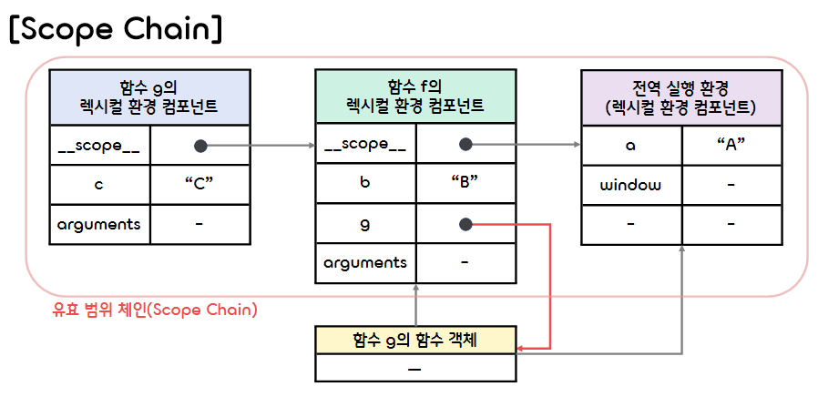
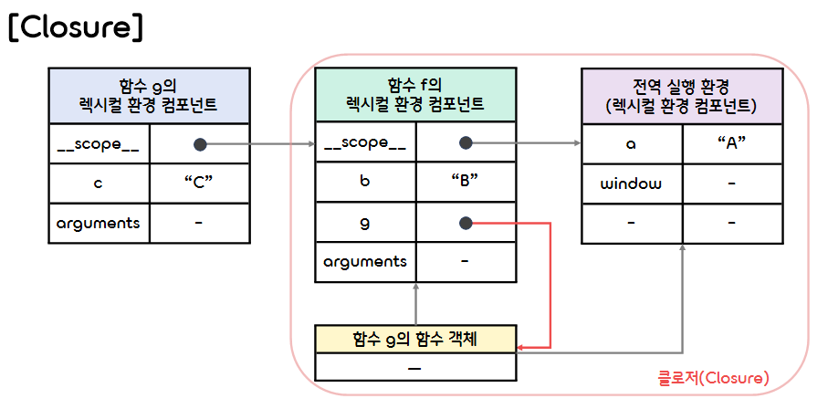

5.**Function**
===  

## < *Contents* >
- [1. About Function](#%EF%B8%8F-1-about-function)
- [2. Evaluation and Implementation of the Program](#%EF%B8%8F-2-evaluation-and-implementation-of-the-program)  
- [3. Closure](#%EF%B8%8F-3-closure)  

---

## ✔️ 1. **About Function** 
- 자바스크립트에서는 함수도 하나의 타입(Datatype)이다.
- 따라서 함수를 변수에 대입하거나, 함수에 프로퍼티를 지정하는 것도 가능하다.
- 또한 자바스크립트 함수는 다른 함수 내에 중첩되어 정의될 수도 있다.  

</br>

### 1) **Definition of Function(함수의 정의)**
- 함수를 정의하는 방법은 다음과 같이 4가지가 있다.  

</br>

- (1) **함수 선언문으로 정의하는 방법**
    ```javascript
    function square(x) { return x*x; }
    ```  

</br>

- (2) **함수 리터럴로 정의하는 방법**
    ```javascript
    const square = function(x) { return x*x; };
    ```  

</br>

- (3) **Function 생성자로 정의하는 방법**
    ```javascript
    const square = new Function("x", "return x*x");
    ```  

</br>

- (4) **화살표 함수 표현식으로 정의하는 방법**
    ```javascript
    const square = x => x*x ;
    ```

</br>  

### 2) **Nested Function(중첩 함수)**
- 특정 함수 내부에 선언된 함수를 가리켜 그 함수의 **중첩 함수(Nested Function)** 라고 한다.
- 자바스크립트에서는 외부 함수의 최상위 레벨에만 중첩함수를 작성할 수 있다.  
(바꿔말하면 함수 안의 if 문과 while 문 등의 문장 블록 안에는 중첩 함수를 작성할 수 없다는 뜻이다!)  
- 중첩 함수의 참조는 그 중첩 함수를 둘러싼 외부 함수의 지역 변수에 저장되므로, 외부 함수의 바깥에서는 읽거나 쓸 수 없다.
- 그리고, 중첩 함수는 자신을 둘러싼 외부 함수의 인수와 지역 변수에 접근할 수 있다는 특징이 있다.
    ```javascript
    /* 입력 받은 배열 안에 있는 모든 요소의 제곱합의 대한 제곱근을 구하는 함수 */
    function norm(arr) {
        let sum2 = sumSquare();
        return Math.sqrt(sum2);

        /* 주어진 배열 arr 안에 있는 모든 요소의 제곱합을 구하는 함수 */
        function sumSquare() {
            sum = 0;
            for (var i = 0; i < arr.length; i++) sum += arr[i]*arr[i];
            return sum;
        }
    }

    console.log(norm([1, 2, 3, 4, 5]));  // → 7.416198487095663
    ```  

</br>

### 3) **Function Call(함수의 호출)**
- 자바스크립트에서 함수를 호출하여 실행하는 방법은 다음과 같이 4가지가 있다.  

</br>

- (1) **함수 호출**
    - 함수의 참조가 저장된 변수 뒤에 그룹 연산자인 ()를 붙여서 함수를 호출한다.
        ```javascript
        const s = someMethod(5);
        ```  

</br>

- (2) **메소드 호출**
    - 객체의 프로퍼티에 저장된 값이 함수 타입일 때는 그 프로퍼티를 메소드라고 한다.
    - 메소드를 호출할 때에는 그룹 연산자인 ()를 붙여서 함수를 호출한다.  
    (본질적으로 함수 호출과 같은 방법이다.)
        ```javascript
        obj.someMethod = function(x) {...};
        obj.someMethod(5);
        ```  

</br>

- (3) **생성자 호출**
    - 함수 또는 메소드를 호출할 때 함수의 참조를 저장한 변수 앞에 **new** 키워드를 추가하면 함수가 생성자로 동작한다.
        ```javascript
        const obj = new Object();
        ```  

</br>

- (4) **call, apply를 사용한 간접 호출**
    - 함수의 **call** 와 **apply** 메소드를 사용하면 함수를 간접적으로 호출할 수 있다.  

</br>

### 4) **Immediately Invoked Function Expression(즉시 실행 함수)**
- 자바스크립트에는 익명 함수를 정의하고 이를 곧바로 실행하는 **즉시 실행 함수(IIFE)** 라는 구문이 있다.
- IIFE는 익명 함수 전체를 괄호로 감싸줌으로써 내부 코드가 선언문이 아니라 표현식인 것처럼 Parser를 속인다.
    - **선언문** 은 변수에 정의된 함수를 할당하지 않는다. 따라서 함수 자신이 다른 어딘가로 리턴될 일이 없다. 또한 선언문은 호이스팅(Hoisting)을 통해 선언된 위치보다 위로 끌어올려질 수 있다.  
    - **표현식** 은 함수가 변수로 할당될 수 있다. 또한 함수가 익명이 될 수 있으며, 리턴 값이 되어 다시 다른 함수 표현식의 일부가 될 수 있다. Global Scope가 오염되는 것을 방지하기 위해 쓰이기도 한다.  
- 아래와 같이 괄호로 묶어주면 함수 선언문이 아니라, 함수 표현식이라는 것을 명시적으로 나타낼 수 있다.
    ```javascript
    (function() { ... })();
    // (function() { ... }()); 와 같이 정의하는 방법도 있다.
    ```
- IIFE를 변수에 할당하면 IIFE 자체는 저장되지 않고, 함수가 실행된 결과만 저장된다. 
- 그리고, IIFE를 사용할 경우, 외부에서 접근할 수 없는 자체 Scope가 형성된다.  
    - IIFE 함수는 상위 Scope에 접근할 수 있으면서도, 내부 변수는 외부로부터 보호해 Privacy를 유지할 수 있다.
    - 이처럼 외부에서는 내부 변수에 접근하는 것이 불가능하기 때문에 보통 Global Scope를 오염시키지 않기 위해 사용하는 경우가 많다.  
    ```javascript
    let randNum = (function() {
        let num = Math.random() * 10;
        return num;
    })();

    console.log(randNum);  // → 6.0410655706373255
    console.log(num);      // → ReferenceError: num is not defined
    ```  

</br>

### 5) **Function argument(함수의 인수)**

- (1) **인수의 생략**
    - 함수 정의식에 작성된 인자의 개수보다 인수를 적게 전달해서 함수를 실행하면 인수에서 생략된 인자는 undefined가 된다.
        ```javascript
        function f(x, y) { ... }
        f(2);  // → x = 2, y = undefined
        ```  
    - 인수를 생략할 수 있는 함수를 정의하려면, 함수 정의식에서 인수를 생략했을 때 사용할 초깃값을 설정해야 한다.
        ```javascript
        function f(x, y) {
            y = y || 0;  // y의 초깃값을 0으로 설정
            ...
        }
        f(2, 3)  // → x = 2, y = 3
        f(2);    // → x = 2, y = 0
        ```  

</br>

- (2) **가변 길이 인수 목록(Arguments 객체)**
    - 모든 함수에서 사용할 수 있는 지역 변수로는 arguments 변수가 있다.
    - 함수에 인수를 n개 넘겨서 호출하면 arguments[0], arguments[1], ..., arguments[n-1]에 각각 저장된다.  
    - arguments 변수의 값은 Arguments 객체로, Arguments 객체의 프로퍼티로는 length와 callee가 있다.  
        ```javascript
        function myConcat(separator) {
            let s = "";
            for (let i = 1; i < arguments.length; i++) {
                s += arguments[i];
                if (i < arguments.length - 1) s += separator;
            }
            return s;
        }

        console.log(myConcat("/", "apple", "orange", "peach"));  // → apple/orange/peach
        ```  

</br>

## ✔️ 2. **Evaluation and Implementation of the Program**  

### 1) **Executable Code(실행 가능한 코드)**
- 자바스크립트 엔진은 **실행 가능한 코드(Executable Code)** 를 만나면 그 코드를 평가(Evaluate)해서 **실행 문맥(Execution Context)** 으로 만든다.
- 실행 가능한 코드의 유형은 다음과 같이 3가지가 있다.
    - (1) **전역 코드** : 전역 객체 Window 아래에 정의된 함수를 말한다.
    - (2) **함수 코드** : 문자 그대로 함수를 말한다.
    - (3) **eval 코드** : eval 함수를 말한다.  
- 자바스크립트 엔진이 실행 가능한 코드의 유형을 분류하는 이유는 실행 문맥을 초기화하는 환경과 과정이 다르기 때문이다.  

</br>

### 2) **Execution Contexts(실행 문맥)**
- **실행 문맥(Execution Context)** 은 실행 가능한 코드가 실제로 실행되고 관리되는 영역으로, 실행에 필요한 모든 정보를 컴포넌트 여러 개가 나누어 관리하도록 만들어져 있다.  
- 그중에서 가장 중요한 컴포넌트는 **렉시컬 환경(LexicalEnvironment) 컴포넌트** , **변수 환경(VariableEnvironment) 컴포넌트** , **디스 바인딩(This Binding) 컴포넌트** 이다.
- 다음 코드는 자바스크립트의 객체 표현을 빌려 실행 문맥을 표현한 것이다.  
(앞으로도 이런 표현 방식을 사용할 예정!)
    ```javascript
    // 실행 문맥
    ExecutionContext {
        // 렉시컬 환경 컴포넌트
        LexicalEnvironment: {},
        // 변수 환경 컴포넌트
        VariableEnvironment: {},
        // 디스 바인딩 컴포넌트
        ThisBinding: null,
    }
    ```  
- 렉시컬 환경 컴포넌트와 변수 환경 컴포넌트는 모두 렉시컬 환경 컴포넌트(Lexical Environment) 타입의 컴포넌트이다.
- 렉시컬 환경 컴포넌트와 변수 환경 컴포넌트는 타입이 같고, with 문을 사용할 때를 제외하면 내부 값이 같으므로, 똑같이 취급해도 문제가 되지 않는다.  
- 디스 바인딩 컴포넌트는 그 함수를 호출할 때 호출한 객체의 참조가 저장되는 곳이다.  
(이것이 가리키는 값은 곧 해당 실행 문맥의 this가 된다.)  

</br>

### 3) **Lexical Environment Component(렉시컬 환경 컴포넌트)**
- **렉시컬 환경 컴포넌트(Lexical Environment Component)** 는 자바스크립트 엔진이 자바스크립트 코드를 실행하기 위해 자원을 모아둔 곳으로, 구체적으로는 함수 또는 블록의 유효 범위 안에 있는 식별자와 그 결괏값이 저장되는 곳이다.  
- 자바스크립트 엔진은 해당 자바스크립트 코드의 유효 범위 안에 있는 식별자와 그 식별자가 가리키는 값을 키와 값의 쌍으로 바인드(Bind)하여 렉시컬 환경 컴포넌트에 기록한다.  
- 렉시컬 환경 컴포넌트는 **환경 레코드(Environment Record)** 와 **외부 렉시컬 환경 참조(Outer Lexical Environment Reference)** 컴포넌트 로 구성되어 있다.
    ```javascript
    // 렉시컬 환경 컴포넌트
    LexicalEnvironment: {
        // 환경 레코드
        EnvironmentRecord: {},
        // 외부 렉시컬 환경 참조
        OuterLexicalEnvironmentReference: {}
    }
    ```  
- 환경 레코드는 유효 범위 안에 포함된 식별자를 기록하고 실행하는 영역이다.
- 자바스크립트 엔진은 유효 범위 안의 식별자과 결괏값을 바인드해서 환경 레코드에 기록한다.
- 외부 렉시컬 환경 참조에는 함수를 둘러싸고 있는 코드가 속한 렉시컬 환경 컴포넌트의 참조가 저장된다.
- 중첩된 함수 안에서 바깥 코드에 정의된 변수를 읽거나 써야할 때, 자바스크립트 엔진은 외부 렉시컬 환경 참조를 따라 한 단계씩 렉시컬 환경을 거슬러 올라가서 그 변수를 검색한다.  

</br>

### 4) **Environment Record(환경 레코드)**
- **환경 레코드(Environment Record)** 는 렉시컬 환경 안의 식별자와 그 식별자가 가리키는 값의 쌍이 저장되는 영역이다.  
- 환경 레코드는 **선언적 환경 레코드(Declarative Environment Record)** 와 **객체 환경 레코드(Object Environment Record)** 로 구성되어 있다.
    ```javascript
    // 환경 레코드
    EnvironmentRecord: {
        // 선언적 환경 레코드
        DeclarativeEnvironmentRecord: {},
        // 객체 환경 레코드
        ObjectEnvironmentRecord: {}
    }
    ```  
- 선언적 환경 레코드는 실제로 함수와 변수, catch문의 식별자와 실행 결과가 저장되는 영역이다.
- 선언적 환경 레코드가 식별자와 그 실행 결과를 키와 값의 쌍으로 관리하는 한편, 객체 환경 레코드는 실행 문맥 외부에 별도로 저장된 객체의 참조에서 데이터를 읽거나 쓰는 역할을 한다.
- with 문의 렉시컬 환경이나 전역 객체처럼 별도의 객체에 저장된 데이터는 그 객체가 가진 키와 값의 쌍을 복사해 오는 것이 아니라, 그 객체 전체의 **참조** 를 가져와서 객체 환경 레코드의 **bindObject** 라는 프로퍼티에 바인드하도록 만들어져 있다.  

</br>

### 5) **Global Environment and Global Object**
- 자바스크립트 인터프리터는 시작하자마자(웹 페이지를 읽어들인 후) 렉시컬 환경 타입의 **전역 환경(Global Environment)** 을 생성한다.  
- 그리고 **전역 객체(Global Object)** 를 생성하여 전역 환경의 객체 환경 레코드에 전역 객체의 참조를 대입한다.  
(최상위 레벨(함수 바깥 쪽에 있는 코드)의 **this** 는 이 전역 객체를 가리킨다.)  
    ```javascript
    // 전역 환경 
    GlobalEnvironment = {
        ObjectEnvironmentRecord: {
            bindObject: window
        }, 
        OuterLexicalEnvironmentReference: null
    }

    // 전역 실행 문맥
    ExecutionContext = {
        LexicalEnvironment: GlobalEnvironment,
        ThisBinding: window,
    }
    ```
- 웹 브라우저의 자바스크립트 실행 환경에서는 Window 객체가 전역 객체이므로 객체 환경 레코드의 bindObject 프로퍼티에는 Window의 참조가 할당되고, 이로 인해 전역 환경의 변수와 함수를 Window 안에서 검색하게 된다.
- 그리고 전역 실행 문맥의 디스 바인딩 컴포넌트에도 Window의 참조가 할당되어 전역 실행 문맥의 this가 Window를 가리키게 되고 전역 실행 문맥의 프로퍼티를 디스 바인딩 컴포넌트 안에서 검색하게 된다.  
- Window 객체는 Window 객체의 프로퍼티인 window로 참조할 수 있다.  

</br>

### 6) **Program Evaluation and Global Object**
- 전역 환경과 전역 객체를 생성한 후에는 자바스크립트 프로그램을 읽어 들인다.
- 이후 프로그램을 평가하며, 최상위 레벨에 var 문으로 작성된 전역 변수를 전역 환경의 객체 환경 레코드의 프로퍼티로 기록한다.  
    ```javascript
    // 전역 환경
    GlobalEnvironment = {
        // 전역 환경의 환경 레코드인 객체 환경 레코드에 Window의 참조가 설정되어 있다.
        ObjectEnvironmentRecord: {
            bindObject: window
        }, 
        OuterLexicalEnvironmentReference: null
    }
    ```
- 해당 프로퍼티 이름은 식별자 이름이 되고, 프로퍼티 값은 undefined가 된다.
- 함수의 경우, 최상위 레벨에 작성된 함수 선언문을 함수 객체로 생성해서 전역 환경의 객체 환경 레코드에 프로퍼티로 기록한다.
- 이처럼 최상위 레벨에 선언된 변수와 함수는 프로그램을 평가할 때 객체 환경 레코드에 기록된다.  
    ```javascript
    var gVariable = {x: 1, y: 2};  // var 문으로 선언한 전역 변수
    gVariable2 = {x: 2, y: 3};     // 선언되지 않고 값이 할당된 변수는 자동으로 전역 변수가 된다.
    console.log(window.gVariable);
    console.log(window.gVariable2);

    function gFunction() { 
        let mVariable = 1;  // gFunction의 지역 변수
        gVariable3 = 2;     // 전역 변수
        ...
    }

    gFunction();
    console.log(window.gFunction);
    console.log(window.mVariable);
    console.log(window.gVariable3);
    ```
    ```
    ▷ {x: 1, y: 2}
    ▷ {x: 2, y: 3}
    f gFunction() {
        let mVariable = 1;
        gVariable3 = 2;
        ...
    }
    undefined
    2
    ```  
- 즉, 전역 변수의 실체는 전역 객체의 프로퍼티 또는 전역 객체의 실행 문맥에 들어 있는 객체 환경 레코드의 프로퍼티이다.
- 마찬가지로 함수 안에 선언된 지역 변수와 중첩 함수의 참조 또한 그 함수가 속한 실행 환경의 선언적 환경 레코드의 프로퍼티이다.
- 이처럼 자바스크립트의 모든 변수를 객체의 프로퍼티로 간주하면 쉽게 이해할 수 있다.  

</br>

- 최상위 레벨에 선언된 변수와 함수는 프로그램을 평가하는 시점에 객체 환경 레코드에 추가된다.  
- 최상위 레벨에 선언된 함수와 변수는 프로그램을 평가하는 단계에서 이미 객체 환경 레코드에 추가된 상태이기 때문에, 코드의 어느 위치에 작성해도 전체 프로그램이 참조할 수 있다.
- 이것이 최상위 코드의 변수 선언문과 함수 선언문의 **호이스팅(Hoisting)** 이라는 현상의 실체이다.  
- var 문을 사용하지 않고 변수를 선언해서 값을 할당한 경우, 프로그램을 실행하는 도중에 디스 바인딩 컴포넌트가 가리키는 객체의 프로퍼티로 추가된다.
- 이때 전역 객체의 디스 바인딩 컴포넌트는 전역 객체(window)를 가리키므로, 결국 전역 객체의 프로퍼티가 된다.  

</br>

### 7) **Program Execution and Execution Context**
- 프로그램이 평가된 다음에는 프로그램이 실행되며, 프로그램은 **실행 문맥(Execution Context)** 안에서 실행된다.
- 이때 실행 문맥은 실행 가능한 코드(전역 코드, 함수 코드, eval 코드) 별로 생성된다.
- 실행 문맥은 **스택(Stack)** 구조로 관리된다.
    - 실행 문맥은 프로그램 실행 중 스택에 push되어 실행된다.
    - 가장 먼저 실행하는 코드는 전역 코드이다.  
    (스택의 맨 아랫부분에 전역 코드를 실행하기 위한 실행 문맥이 자리잡고 있다.)  
    - 전역 코드 안에서 함수를 실행하면 그 함수를 실행하기 위한 실행 문맥을 스택에 push한다.
    - 그 함수의 작업을 끝내고 함수를 호출한 부분으로 제어권이 돌아오면 스택에서 pop한다.
    - 이때 실행하는 함수가 중첩 함수라면 중첩 함수의 실행 문맥을 새로 만들어서 스택에 push/pop한다.  
    (※ 중첩 함수의 실행 문맥은 외부 함수의 실행 문맥 안에 중첩되지 않는다!)  
    - 마찬가지로 함수 안에 있는 코드를 실행하는 도중에 다른 함수를 호출하면 그 함수의 실행 문맥도 스택에 push/pop한다.  
    - 재귀 함수의 경우, 이를 호출한 함수와는 전혀 다른 함수로서 스택에 push/pop된다. 
    - 이러한 이유로 실행 문맥 스택을 **호출 스택(Call Stack)** 이라고 부른다.  
- 호출 스택의 예시는 다음과 같다.
    ```javascript
    /* 중첩 함수 예시 */
    function outerFunc(x) {
        ...
        function innerFunc() {
            ...
        }
    }
    ```
    <p></p>  

</br>

### 8) **Thread in Javascript**
- 자바스크립트에서는 작업을 **싱글 스레드(Single-Thread)** 로 처리한다.
- 따라서 호출 스택에 쌓인 실행 문맥(함수 또는 코드)을 위에서부터 아래로 차례대로 실행한다.
- 실행 문맥 단위의 작업을 차례대로 실행하므로, 하나의 작업이 끝날 때까지 다른 실행 문맥의 작업을 실행하지 않는다.  
- 이때 웹 브라우저의 API인 Web Workers를 사용하면 특정 작업을 백그라운드에 있는 다른 스레드에서 실행할 수 있다.
- 즉, 멀티스레드 처리를 할 수 있다.  

</br>

### 9) **Environment Record and Local Variable**
- 함수를 호출하면 현재 실행 중인 코드의 작업을 일시적으로 멈추고 **실행 문맥** 영역을 생성한다.
- 그리고 프로그램의 실행 흐름이 그 실행 문맥으로 이동한다.
- 다음으로 그 함수의 실행 문맥이 호출 스택에 push되고, 실행 문만 안에 렉시컬 환경 컴포넌트를 생성한다.
- 이 렉시컬 환경 컴포넌트에 존재하는 환경 레코드 안에 그 함수 안에서 선언된 중첨 함수의 참조와 변수를 기록한다.  
- 이 환경 레코드는 사용자가 읽거나 쓸 수 없으며 다음과 같은 정보를 기록한다.
    - (1) 함수의 인자
    - (2) 함수 안에서 선언된 중첩 함수의 참조
    - (3) 함수 내부의 지역 변수
    - (4) arguments  

</br>

- 함수의 실행 문맥, 렉시컬 환경 컴포넌트, 환경 레코드가 생성되면 실행 문맥에 있는 **디스 바인딩(This Binding)** 컴포넌트에 그 함수를 호출한 객체의 참조를 저장하며, 이것을 this 값으로 결정한다.  
(this는 동적이며, 함수를 호출하는 상황에 따라 가리키는 객체가 달라진다.) 
- 환경 레코드와 this 값이 결정되면 함수 안의 코드가 순서대로 실행된다.
- 함수가 실행되는 시점에는 지역 변수 또는 함수 선언문으로 선언한 함수 이름이 함수를 평가하는 시점에 선언적 환경 레코드에 기록된 상태이다.
- 따라서 변수 또는 함수 선언문이 함수 안의 어느 부분에 위치하더라도 함수 전체에서 사용할 수 있다.
- 이것이 변수 선언문과 함수 선언문이 함수의 첫머리로 호이스팅(Hoisting)되는 이유이다.
- 함수가 종료되어 제어권이 호출한 코드로 돌아가면 일반적으로 실행 문맥과 함께 그 안에 있는 렉시컬 환경 컴포넌트가 메모리에서 지워진다.
- 하지만 그 함수 바깥에 위치한 함수의 참조가 환경 레코드에 유지되는 경우에는 렉시컬 환경 컴포넌트가 메모리에서 지워지지 않는다.  

</br>

### 10) **this**
- 함수가 호출되어 실행되는 시점에 **this** 값이 결정된다.
- this 값은 함수가 호출되었을 때 그 함수가 속해 있던 객체의 참조이며, 실행 문맥의 디스 바인딩 컴포넌트가 참조하는 객체이다.  
    ```javascript
    const jones = {
        name: "Jones",
        sayHello: function() {
            console.log(`Hello ${this.name}!`);
        },
    }
    jones.sayHello();  // → Hello Jones!
    ```  
- 위의 코드에서 sayHello 메소드가 호출되는 실행 문맥의 디스 바인딩 컴포넌트가 가리키는 객체는 jones가 된다.  
- 따라서 this 값이 jones를 가리키므로, this.name 값은 "Jones"가 된다.
- sayHello 값은 함수의 참조이므로, 이 값을 아래와 같이 다른 객체의 프로퍼티에 대입할 수 있다.  
    ```javascript
    const susan = { name: "Susan", }
    susan.sayHello = jones.sayHello;

    susan.sayHello();  // → Hello Susan!
    ```  
- 위 코드에서는 susan.sayHello가 속한 객체가 susan이므로, 실행 문맥의 디스 바인딩 컴포넌트가 가리키는 객체는 susan이다.
- 이처럼 자바스크립트의 함수는 특정 객체에 묶여 있지 않다. (일반적으로 여러 개의 객체가 하나의 함수를 가리킨다.)
- 따라서 호출될 때의 상황에 따라 this가 가리키는 객체가 바뀌게 된다.
- 엄밀히 말하면, 실행 문맥의 디스 바인딩 컴포넌트가 가리키는 객체가 무엇인지에 따라 this가 가리키는 객체가 바뀐다. 
- 다음은 다양한 상황에서 this가 어떤 객체를 가리키는지를 나타낸다.
    - (1) 최상위 레벨 코드의 this : 전역 객체
    - (2) 이벤트 처리기 안의 this : 이벤트가 발생한 요소 객체
    - (3) 생성자 함수 안의 this : 해당 생성자로 생성한 객체
    - (4) 생성자의 prototype 메소드 안의 this : 해당 생성자로 생성한 객체
    - (5) 직접 호출한 함수 안의 this
        - ① 함수를 최상위 레벨의 코드에서 호출한 경우 : 전역 객체
        - ② 함수 앞에 어떤 객체를 붙여서 호출한 경우 : 해당 객체
    - (6) apply와 call 메소드로 호출한 함수 안의 this : this가 가리키는 객체를 명시적으로 설정 가능  

</br>

### 11) **Identifier Resolution**
- 변수 x가 어디에서 선언된 변수인지를 결정하는 작업을 가리켜 변수 x의 **식별자 결정(Identifier Resolution)** 이라고 한다.
- 자바스크립트의 식별자 결정 규칙은 '좀 더 안쪽에 선언된 변수를 우선적으로 사용한다'이다. 
    ```javascript
    var a = "A";
    function f() {
        var b = "B";
        function g() {
            var c = "C";
            console.log(a+b+c);
        }
        g();
    }
    f();  // → ABC
    ```
- 일반적으로 함수의 인수와 지역 변수를 **속박 변수** 라고 하고, 그 외의 변수를 **자유 변수** 라고 한다.  
(위에서는 c가 속박 변수이고, a, b가 자유변수에 해당한다.)
- 그리고, 속박 변수만을 포함한 함수를 **닫힌 함수** , 자유 변수를 포함하고 있는 함수를 **열린 함수** 라고 한다.  
(위에서는 함수 f가 닫힌 함수이고, 함수 g가 열린 함수에 해당한다)
- 내부적으로는 변수 식별자 결정에 렉시컬 환경 컴포넌트 안의 외부 렉시컬 환경 컴포넌트 참조와 환경 레코드를 사용해서 다음과 같이 변수 a, b, c가 선언된 위치를 찾아낸다.  

</br>

- (1) 속박변수 c
    - 변수 c는 함수 g 안에서 선언된 속박 변수이므로, 함수 g의 선언적 환경 레코드에서 찾을 수 있다.  
        ```javascript
        // 함수 g가 속한 실행 렉시컬 환경 컴포넌트
        g_LexicalEnvironment: {
            // 선언적 환경 컴포넌트
            DeclarativeEnvironmentRecord: {
                c: "C",
            },
            // 함수 f의 렉시컬 환경 컴포넌트를 참조한다.
            OuterLexicalEnvironmentReference: f_LexicalEnvironment
        }
        ```  

</br>

- (2) 자유 변수 b
    - 변수 b는 g의 바깥에서 선언된 자유 변수이므로, 함수 g가 속한 실행 문맥의 선언적 환경 레코드 안에서 찾을 수 없다.
    - 따라서 실행 문맥 속에 있는 외부 렉시컬 환경 참조를 따라, 함수 g를 호출한 함수인 f가 속한 실행 문맥의 선언적 환경 레코드를 탐색한다.
    - 변수 b는 함수 f 안에 선언되어 있으므로 함수 f의 선언적 환경 레코드 안에서 찾을 수 있다.
        ```javascript
        // 함수 g가 속한 실행 렉시컬 환경 컴포넌트
        g_LexicalEnvironment: {
            // 선언적 환경 컴포넌트
            DeclarativeEnvironmentRecord: {
                c: "C",
            },
            // 함수 f의 렉시컬 환경 컴포넌트를 참조한다.
            OuterLexicalEnvironmentReference: f_LexicalEnvironment
        }

        // 함수 f가 속한 실행 렉시컬 환경 컴포넌트
        f_LexicalEnvironment: {
            DeclarativeEnvironmentRecord: {
                b: "B",
            },
            OuterLexicalEnvironmentReference: global_LexicalEnvironment
        }
        ```  

</br>

- (3) 자유 변수 a
    - 변수 a는 g의 바깥에서 선언된 자유 변수이므로, 함수 g가 속한 실행 문맥의 선언적 환경 레코드 안에서 찾을 수 없다.
    - 따라서 실행 문맥 속에 있는 외부 렉시컬 환경 참조를 따라, 함수 g를 호출한 함수인 f가 속한 실행 문맥의 선언적 환경 레코드를 탐색한다.
    - 하지면 이 안에서도 변수 a를 찾을 수 없으므로, 외부 렉시컬 환경 참조를 따라 한 단계 더 거슬러 올라가, 함수 f의 전역 실행 문맥 속에 있는 객체 환경 레코드 내부를 검색한다.
    - 변수 a는 var로 선언되어 있으므로, 전역 실행 문맥의 객체 환경 레코드 안에서 찾을 수 있다.  
    (변수 a가 var로 선언되어 있지 않다면, 전역 실행 문맥의 디스 바인딩 컴포넌트가 가리키는 전역 객체 안에서 검색한다.)  
        ```javascript
            // 함수 g가 속한 실행 렉시컬 환경 컴포넌트
            g_LexicalEnvironment: {
                // 선언적 환경 컴포넌트
                DeclarativeEnvironmentRecord: {
                    c: "C",
                },
                // 함수 f의 렉시컬 환경 컴포넌트를 참조한다.
                OuterLexicalEnvironmentReference: f_LexicalEnvironment
            }

            // 함수 f가 속한 실행 렉시컬 환경 컴포넌트
            f_LexicalEnvironment: {
                DeclarativeEnvironmentRecord: {
                    b: "B",
                },
                OuterLexicalEnvironmentReference: global_LexicalEnvironment
            }

            // 전역 실행 환경(렉시컬 환경 컴포넌트)
            global_LexicalEnvironment: {
                ObjectEnvironmentRecord: {
                    bindObject: {
                        a: "A",
                    },
                }
                OuterLexicalEnvironmentReference: null
            }
        ```  

</br>

- 이처럼 식별자 결정은 현재의 유효 범위 안에 없는 식별자를 찾을 때 바깥쪽 범위로 호출자의 렉시컬 환경에 속한 외부 렉시컬 환경의 참조를 따라 찾아가는 방식을 취한다.  
- 이러한 논리적인 연결 고리(선형 목록)를 ES3 기준으로는 **스코프 체인(Scope Chain)** 이라고 한다.
- ES5부터는 이 단어를 사용하지 않으므로, **외부 렉시컬 환경 체인(Outer Lexical Environment Chain)** 이 부합하겠지만, 이 역시 ES5 스펙에 있는 단어가 아니므로 간단하게 **유효 범위 체인** 이라고 하자.  
(MDN에서는 **어휘적 범위 지정(Lexical Scoping)** 이라는 용어로 설명하고 있다.)
- 아래 그림은 유효 범위 체인의 참조 관계를 그림으로 묘사한 것이다.  
(이 그림에서는 외부 렉시컬 환경 참조가 저장된 프로퍼티를 __scope__로 표기했다.)  
    <p></p>
- 유효 범위 체인 안에서 식별자를 찾지 못하면, 참조 오류(ReferenceError)가 발생하게 된다.  

</br>

### 12) **Garbage Collection**
- 프로그램에서 객체를 생성하면 메모리 공간이 동적으로 확보된다.
- 이때 사용하지 않는 객체의 메모리 영역은 **가비지 컬렉터(Garbage Collector)** 에 의해 자동으로 해제된다.
- 이러한 메커니즘을 가리켜 **가비지 컬렉션(Garbage Collection)** 이라고 한다.
- 여기서 사용하지 않는 객체란 다른 객체의 프로퍼티와 변수가 참조하지 않는 객체를 말한다.  
    ```javascript
    let obj = {x:1, y:2};
    console.log(object.x + object.y);
    
    obj = null;  // 객체 {x: 1, y: 2}는 더 이상 그 어떤 변수에서도 참조하지 않는다.
    ```
- 과거에는 참조하는 객체 개수를 세어 참조하는 객체의 개수가 0이 되었을 때 메모리에서 해제하는 **참조 카운터 방식** 을 사용했는데, 이는 고립된 **순환 참조** 가 발생했을 때 메모리 누수(Memory-leak)를 일으키는 문제가 있다.
- 이러한 단점을 보완하고자, 최근 주요 웹 브라우저에서는 전역 객체가 참조할 수 없는 객체를 검색하고, 해당 객체가 있다면 이를 메모리에서 해제하는 방식인 **마크 앤 스윕(Mark-and_Sweep)** 알고리즘을 사용한다.  

</br>

## ✔️ 3. **Closure**
- **클로저(Closure)** 란 자기 자신이 정의된 환경에서 함수 안에 있는 자유 변수의 식별자 결정을 실행하는 함수와 이 기능을 구현한 자료 구조의 모음이라고 볼 수 있다.  
- 위의 유효 범위 체인 예제에서 함수 g의 함수 객체와 객체가 참조하는 렉시컬 환경 컴포넌트를 자유 변수 a, b의 식별자 결정을 위한 자료구조라고 할 수 있다.
- 이 자료구조는 함수 f가 호출되어 함수 g가 평가되는 시점에 생성된다.
- 따라서 자바스크립트의 클로저는 함수 객체와 렉시컬 환경 컴포넌트의 집합이라고 볼 수 있다. 
    <p></p>  
- 위에서 함수 g의 함수 객체가 있는 동안에는 클로저 안의 모든 렉시컬 환경 컴포넌트를 함수 g의 함수 객체가 참조하므로, 클로저는 가비지 컬렉션의 대상이 되지 않는다.

</br>

- (1) **클로저의 성질**
    ```javascript
    /* 카운터 함수를 만드는 함수 */
    function makeCounter() {
        var count = 0;
        return f;
        function f() {
            return count++;;
        }
    }
    
    const counter = makeCounter();
    console.log(counter());  // → 0
    console.log(counter());  // → 1
    console.log(counter());  // → 2
    ```  
    - ① 위의 예제에서 외부 함수 makeCounter는 중첩 함수 f의 참조를 반환한다.
        - 이로 인해 f의 함수 객체를 전역 변수 counter가 참조하게 된다.
    - ② 그리고, 중첩 함수 f는 외부 함수 makeCounter의 지역 변수 count를 참조한다.
        - 이로 인해 makeCounter의 렉시컬 환경 컴포넌트를 f의 함수 객체가 참조하게 된다. 
    - 결과적으로, makeCounter의 렉시컬 환경 컴포넌트를 counter가 f의 함수 객체로 간접적으로 참조하게 되므로, 가비지 컬렉션의 대상이 되지 않는다.
    - 이에 따라 makeCounter의 실행이 끝나서 호출자에게 제어권이 넘어가도 makeCounter의 렉시컬 환경 컴포넌트가 메모리에서 지워지지 않게 된다.
    - 지역 변수 count는 함수 makeCounter가 속한 렉시컬 환경 컴포넌트에 있는 선언적 환경 레코드의 프로퍼티이므로, 이 또한 메모리에서 지워지지 않는다.  
    - 이때 변수 count는 클로저의 내부 상태로서 저장되는데, 지역 변수이기 때문에 함수 바깥에서 읽거나 쓸 수 없다.
    - 이러한 성질 때문에 클로저는 **캡슐화** (객체의 프로퍼티를 외부로부터 은폐)된 객체라고도 한다.
        ```javascript
        const counter1 = makeCounter();
        const counter2 = makeCounter();

        console.log(counter1()):  // → 0
        console.log(counter2()):  // → 0
        console.log(counter1()):  // → 1
        console.log(counter2()):  // → 1
        ```
    - 위의 예시처럼 makeCounter()를 실행해서 함수를 두 개 이상 생성할 경우, 이는 모두 별도의 카운터가 되는데, 이는 makeCounter()를 호출할 때마다 makeCounter의 렉시컬 환경 컴포넌트가 새로 생성되기 때문이다.
    - 따라서 각 클로저는 서로 다른 내부 상태를 저장한다는 걸 알 수 있다.
    - 클로저를 객체로 간주하면 makeCounter()는 클로저를 생성하는 팩토리 함수로 간주할 수 있다.
    - 클로저를 만들 때 보통은 이름이 없는 익명함수를 반환하는 방법을 자주 사용한다.  

</br>

- (2) **클로저를 이해하기 위한 핵심 사항**
    - 외부 함수를 호출하면, 그 함수의 렉시컬 환경 컴포넌트가 생성된다. 그리고 그 안에 중첩된 중첩 함수의 함수 객체를 생성해서 반환한다. 그 결과 외부 함수의 렉시컬 환경 컴포넌트를 참조하는 중첩 함수가 정의한 클로저가 생성된다. 즉, 외부 함수는 클로저를 생성하는 팩토리 함수라고 할 수 있다.  
    - 외부 함수가 속한 렉시컬 환경 컴포넌트는 클로저 내부 상태 자체이다. 외부 함수가 호출될 때마다 새로 생성된다.
    - 중첩 함수의 함수 객체가 있는 한 외부 함수가 속한 렉시컬 환경 컴포넌트는 지워지지 않는다. 외부 함수의 함수 객체가 사라져도 지워지지 않는다.
    - 클로저 내부 상태(외부 함수의 지역 변수, 선언적 환경 레코드)는 외부로부터 은폐되어 있으며, 중첩 함수 안에서만 읽거나 쓸 수 있다.  

</br>

- (3) **클로저를 응용한 예제**
    - ① 여러 개의 내부 상태와 메소드를 가진 클로저
        ```javascript
        /* 사람의 이름과 나이 정보를 저장하는 클로저를 생성하는 함수 */
        function Person(name, age) {
            let _name = name;
            let _age = age;
            return {
                getName: function() { return _name; },
                getAge: function() { return _age; },
                setAge: function(x) { _age = x; }
            };
        }

        const person = Person("Tom", 13);
        console.log(person.getName());  // → 13
        console.log(person.getAge());   // → Tom
        person.setAge(14);
        console.log(person.getAge());   // → 14
        ```  

    </br>

    - ② 함수 팩토리
        ```javascript
        /* x번 곱하는 함수를 생성하는 함수 */
        function makeMultiplier(x) {
            return function(y) {
                return x * y
            }
        }

        let multi2 = makeMultiplier(2);
        let multi5 = makeMultiplier(5);
        console.log(multi2(3));  // → 6
        console.log(multi5(3));  // → 15 
        ```  
    
    </br>

    - ③ 초기화 기능이 추가된 함수 생성
        ```javascript
        function Primes(n) {
            // 에라토스테네스의 체로 2 ~ n 사이의 소수를 구한다.
            let arr = [];
            for (let i = 2; i <= n; i++) arr[i] = true;
            let max = Math.floor(Math.sqrt(n));
            var x = 2;
            while (x <= max) {
                for (let i = 2 * x; i <= n; i += x) arr[i] = false;
                while(!arr[++x]);
            }
            // 소수만 꺼내 배열 primes에 저장한다.
            const primes = [];
            let nprimes = 0;
            for (let i = 2; i <= n; i++) if(arr[i]) primes[nprimes++] = i;
            arr = null;  // 필요가 없어진 배열은 메모리에서 해제한다.
            // 소수 m개를 무작위로 선택하여 곱한 값을 반환하는 함수를 반환한다.
            return function(m) {
                let product = 1;
                for (let i = 0; i < m; i++) {
                    product *= primes[Math.floor(Math.random()*nprimes)];
                }
                return product;
            };
        }
        let primeProduct = Primes(100000);
        console.log(primeProduct(2));  // → 2893102073
        console.log(primeProduct(3));  // → 7029183258733
        ```  

</br>  


