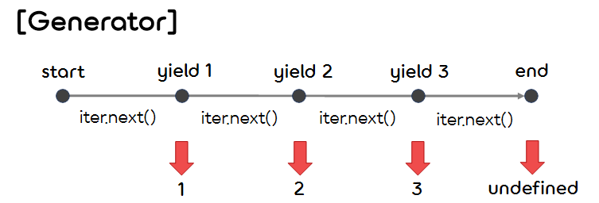

6.**Function 2**
===  

## < *Contents* >
- [1. Name Space](#%EF%B8%8F-1-name-space)
- [2. Function Object](#%EF%B8%8F-2-function-object)  
- [3. Higher Order Function](#%EF%B8%8F-3-higher-order-function)  
- [4. Callback Function](#%EF%B8%8F-4-callback-function)  
- [5. New Function Features in ECMAScript 6](#%EF%B8%8F-5-new-function-features-in-ecmascript-6)  
---

## ✔️ 1. **Name Space** 

### 1) **Global Namespace Pollution(전역 이름 공간의 오염)**
- 전역 변수와 전역 함수를 전역 객체에 선언하는 행위를 가리켜 '전역 유효 범위를 오염시킨다'라고 한다.  
- 전역 유효 범위가 오염되면 다음과 같은 상황일 때 변수 이름과 함수 이름이 겹칠 수 있다.
    - 라이브러리 파일을 여러 개 읽어 들여 사용할 때
    - 규모가 큰 프로그램을 만들 때
    - 여러 사람이 한 프로그램이 만들 때
- 위의 상황에서 예기치 않은 오류를 피하려면 전역 유효 범위의 오염을 최소화해야 한다.  
- 전역 변수의 오염을 방지하기 위한 대표적인 방법들은 다음과 같다.  

</br>

### 2) **객체를 이름 공간으로 사용**
- **이름 공간(Namespace)** 은 변수와 함수의 이름을 모아 이름 충돌을 방지하고, 변수와 함수를 쉽게 사용할 수 있게 만든 메커니즘이다.
- 자바스크립트에서는 기본적으로 이름 공간 기능을 제공하지는 않지만, 객체를 이름 공간으로 활용할 수 있다. 
- 객체를 이름 공간으로 활용하려면 객체를 값으로 갖는 전역 변수를 하나 생성하고, 그 객체에 프로그램 전체에서 사용하는 모든 변수와 함수를 프로퍼티로 정의한다.
    ```javascript
    // myApp이 이미 정의되어 있을 땐 이를 사용하고, 그렇지 않으면 빈 객체를 myApp에 할당한다.
    const myApp = myApp || {};  

    myApp.gVariable1 = "variable 1";
    myApp.gVariable2 = "variable 2";
    myApp.gVariable3 = "variable 3";
    myApp.gFunction = function() { ... };
    ...
    ```  
- 위의 예제에서는 myApp만이 사용자가 정의한 전역 변수가 되므로 전역 유효 범위의 오염을 최소화할 수 있다.
- 또한 이름 공간 안에 **부분 이름 공간(Sub Namespace)** 을 만들 수도 있다.
- 각각의 부분 이름 공간 안에 필요한 변수 또는 함수를 프로퍼티로 정의해서 사용한다.
- 객체를 이름 공간으로 이용하면 변수 또는 함수 이름을 계층적으로 관리할 수 있게 된다.
    ```javascript
    myApp.view = {}; 
    myApp.view.imageHeight = 720; 
    myApp.view.draw = function() { ... };
    ```  

</br>

### 3) **함수를 이름 공간으로 활용**
- 함수 안에서 선언된 변수의 유효 범위는 함수 내부이므로, 그 변수를 함수 안에서는 읽거나 쓸 수 있지만, 밖에서는 읽거나 쓸 수 없다.
- 이러한 성질을 활용하면 함수를 이름 공간으로 활용할 수 있다.
    ```javascript
    let x = "global variable";
    (function() {
        var x = "local x";
        var y = "local y";
    })();
    console.log(x);  // → global x
    console.log(y);  // → ReferenceError: y is not defined
    ```  
- 위와 같이 일시적인 처리를 수행하고자 할 때, 그 내용물을 즉시 실행 함수에 작성하면 전역 유효 공간을 오염시키지 않고 실행할 수 있다.  
- 라이브러리를 사용할 때 라이브러리 안에 있는 전역 변수와 충돌하지 않도록 하려면 전체 프로그램을 즉시 함수 안에 넣어서 실행한다.  

</br>

### 4) **모듈 패턴(Module Pattern)**
- 모듈은 함수(기능)들 여러 개를 하나로 묶은 것이다.
- 일반적으로 모듈은 함수 여러 개와 함수가 공유하는 데이터로 구성된다.
- 모듈을 즉시 실행 함수 안에서 작성하여 실행하면, 해당 모듈을 사용하는 프로그램에서 이름이 충돌하는 상황을 피할 수 있다.
- 하지만 즉시 실행 함수의 내부에 작성한 함수나 변수는 프로그램 바깥에서는 사용할 수 없다.
- 이 경우, 즉시 실행 함수에 객체로 구현한 이름 공간을 전역 변수로 넘겨서 공개할 함수를 이름 공간에 추가함으로써 해결할 수 있다.
- 이를 이용해 모듈의 내부 구조(변수 또는 함수)는 은폐하고 원하는 함수만 공개할 수 있다.  
    ```javascript
    var Module = Module || {};

    (function(_Module) {
        let name = "Unnamed";  // private 변수

        function getName() {   // private 변수
            return name;
        }

        _Module.greeting = function() {  // public 함수
            console.log(`Hi! I'm ${getName()}.`);
        }

        _Module.setName = function(x) {  // public 함수
            name = x;
        };
    })(Module);

    Module.setName("Lilly");
    Module.greeting();  // → Hi! I'm Lilly.
    ```  
- 위에서 showName 메소드는 getName을 참조하고 있고, setName 메소드는 name을 참조하고 있으므로, 이로 인해 클로저가 생성된다.  
- 즉시 실행 함수의 지역 변수 name과 지역 함수 getName은 클로저의 내부 상태로 저장된다.

</br>

## ✔️ 2. **Function Object**  

### 1) **함수는 객체(Object)**
- 자바스크립트의 함수는 **Function** 객체이므로, 다른 객체와 마찬가지로 다음과 같은 특징을 갖는다.
    - ① 함수는 변수나 프로퍼티나 배열 요소에 대입할 수 있다.
    - ② 함수는 함수의 인수로 사용할 수 있다.
    - ③ 함수는 함수의 반환값으로 사용할 수 있다.
    - ④ 함수는 프로퍼티와 메소드를 가질 수 있다.
    - ⑤ 함수는 이름 없는 리터럴로 표현할 수 있다. (익명 함수)
    - ⑥ 함수는 동적으로 생성할 수 있다.
- 이러한 작업이 가능한 객체를 **일급 객체(First-Class Object)** 라고 하고, 일급 객체인 함수는 **일급 함수(First-Class Function)** 라고 한다.  

</br>

### 2) **함수의 프로퍼티(Property)**
- 함수는 다음과 같은 프로퍼티를 갖는다.
    <table border="1">
        <tr>
            <th><center>프로퍼티 이름<center/></th>
            <th><center>설명<center/></th>
        </tr>
        <tr>
            <td align="center">caller</td>
            <td align="center">현재 실행 중인 함수를 호출한 함수</td>
        </tr>
        <tr>
            <td align="center">length</td>
            <td align="center">함수의 인자 개수</td>
        </tr>
        <tr>
            <td align="center">name</td>
            <td align="center">함수를 표시할 때 사용하는 이름</td>
        </tr>
        <tr>
            <td align="center">prototype</td>
            <td align="center">프로토타입 객체의 참조</td>
        </tr>
    </table>  
- Function 생성자의 prototype 객체(Function.prototype)의 프로퍼티는 다음과 같다.
    <table border="1">
        <tr>
            <th><center>프로퍼티 이름<center/></th>
            <th><center>설명<center/></th>
        </tr>
        <tr>
            <td align="center">apply()</td>
            <td align="center">선택한 this와 인수를 사용하여 함수를 호출한다. (인수는 배열 객체이다.)</td>
        </tr>
        <tr>
            <td align="center">bind()</td>
            <td align="center">선택한 this와 인수를 적용한 새로운 함수를 반환한다.</td>
        </tr>
        <tr>
            <td align="center">call()</td>
            <td align="center">선택한 this와 인수를 사용하여 함수를 호출한단. (인수는 쉼표로 구분한 값이다.)</td>
        </tr>
        <tr>
            <td align="center">constructor</td>
            <td align="center">Function 생성자의 참조</td>
        </tr>
        <tr>
            <td align="center">toString</td>
            <td align="center">함수의 소스 코드를 문자열로 만들어 반환한다.</td>
        </tr>
    </table>  

</br>

### 3) **apply와 call 메소드**
- Function 객체의 apply와 call 메소드는 this 값과 함수의 인수를 사용하여 함수를 실행하는 메소드이다.
- apply와 call의 동작은 본질적으로 같으나, 함수의 인수를 넘기는 방법에서 차이가 있다.
- apply의 인수는 배열이고, call의 인수는 쉼표로 구분한 값의 목록이다.
    ```javascript
    function timeChecker(start, end) {
        console.log(`-----[${this.name}]-----\nwork start: ${start}\nwork end: ${end}\n`);
    }
    
    const tom = { name: "Tom" }
    const becky = { name: "Becky" }
    timeChecker.apply(tom, ["07:30", "12:30"]);
    timeChecker.call(becky, "13:00", "18:00");
    ```
    ```
    -----[Tom]-----
    work start: 07:30
    work end: 12:30

    -----[Becky]-----
    work start: 13:00
    work end: 18:00
    ```  

</br>

### 4) **bind 메소드**
- Function 객체의 bind 메소드는 객체에 함수를 바인드(bind)한다.
- 바인드된 (새로운) 함수를 호출하면 this 객체가 항상 바인드된 객체를 가리킨다.  
    ```javascript
    function timeChecker(start, end) {
        console.log(`-----[${this.name}]-----\nwork start: ${start}\nwork end: ${end}\n`);
    }

    const john = { name : "John" };
    const timeCheckerForJohn = timeChecker.bind(john);
    timeCheckerForJohn("18:30", "23:30");
    ```
    ```
    -----[John]-----
    work start: 18:30
    work end: 23:30
    ```  

</br>

### 5) **함수에 프로퍼티 추가**
- 다른 객체와 마찬가지로 함수에도 프로퍼티를 추가할 수 있다.
    ```javascript
    function f(x) { ... }
    f.sampleVariable = 100;
    f.sampleFunction = function { ... };
    ```  
- Function 객체에 추가된 프로퍼티는 그 함수를 실행하지 않아도 읽거나 쓸 수 있다.
- 함수의 프로퍼티에는 일반적으로 그 함수의 작업과 관련된 데이터와 메소드를 저장한다.  

</br>


## ✔️ 3. **Higher Order Function**  

### 1) **Higher Order Function(고차 함수)**
- **고차 함수(Higher Order Function)** 는 함수를 인수로 받는 함수 또는 함수를 반환하는 함수를 말한다.
- 자바스크립트의 함수는 일급 함수이므로, 고차 함수를 쉽게 정의할 수 있다.
- 고차 함수는 함수형 프로그래밍을 할 때 자주 사용된다.  
    ```javascript   
    /* 패턴이 같은 작업을 고차 함수로 정리하는 예시 */

    /* n번 동안 함수 f에서 생성한 숫자 또는 문자들을 concatenate하여 출력하는 고차 함수 */
    function joinStrings(n, f) {
        let s = "";
        for (let i = 0; i < n; i++) {
            s += f(i);
        }
        return s;
    }

    let digits = joinStrings(10, function(i) { return i; });
    let randomChars = joinStrings(8, function(i) {
        return String.fromCharCode(Math.floor(Math.random() * 26) + "a".charCodeAt(0));
    });

    console.log(digits);       // → 0123456789
    console.log(randomChars);  // → yjzjzrhk
    ```  

</br>

### 2) **Memoization(메모이제이션)**
- **메모이제이션(Memoization)** 은 컴퓨터 프로그램이 동일한 계산을 반복해야 할 때, 이전에 계산한 값을 메모리에 저장함으로써 동일한 계산의 반복 수행을 제거하여 프로그램의 실행 속도를 빠르게 하는 기술이다.
- 메모이제이션은 **동적 계획법(Dynamic programming)** 의 핵심이 되는 기술이다.
- 메모이제이션 함수(아래의 memorize 함수)는 재귀 함수를 대상으로 처리 속도를 높일 때 유용하게 사용할 수 있다.
- 다음과 같이 함수의 프로퍼티에 그 함수의 반환값을 기록하는 방법으로 메모이제이션을 구현할 수 있다.  
    ```javascript
    /* 인수로 받은 함수의 실행 결과를 객체 cache에 저장하고, 이를 반환하는 함수 */
    function memorize(f) {
        let cache = {};
        return function(x) {
            if (cache[x] == undefined) cache[x] = f(x);
            return cache[x];
        }
    }

    /* 
     * 피보나치 수열을 구하는 함수 
     * 구한 피보나치 수를 memorize 함수 내부의 cache에 저장해둔다.
     */
    let fibonacci = memorize(function(n) {
        if (n < 2) return n;
        return fibonacci(n - 1) + fibonacci(n - 2); 
    });

    // 0 ~ 20까지의 피보나치 수열을 출력한다.
    for (let i = 0; i <= 20; i++) {
        console.log((" " + i).slice(-2) + ":" + fibonacci(i));
    }
    ```  

</br>  

### 3) **Function Composition**
- 다음과 같이 서로 다른 함수를 합성한 합성 함수를 만들 수 있다.
    ```javascript
    /* 인수로 받은 함수를 순차적으로 합성한 함수 */
    function compose(f, p) {
        return function(x) {
            f(g(x));
        }
    }
    ```
    ```javascript
    /* 인수로 받은 함수를 순차적으로 합성한 함수 (여러 개의 인수를 갖는 경우) */
    function compose(f, p) {
        return function() {
            return f.call(this, g.apply(this, arguments));
        }
    }
    ```  

</br>

### 4) **Partial Application(부분 적용)**
- **부분 적용(Partial Application)** 은 인수를 여러 개 받는 함수의 몇몇 인수를 상수로 지정해 새로운 함수를 생성하는 기법을 말한다.
    ```javascript
    function partial(f) {
        // 중첩 함수에서 arguments를 사용하기 위해 저장해둔다.
        let args = arguments;

        return function() {
            // 외부 함수의 두 번째 인수를 변수 a에 복사한다.
            let a = Array.prototype.slice.call(args, 1);
            for (let i = 0, j = 0; i < a.length; i++) {
                // 외부 함수의 두 번째 인수가 undefined면 이 함수의 arguments를 사용한다.
                if (a[i] == undefined) a[i] = arguments[j++];
            }
            return f.apply(this, a);
        };
    }

    const square = partial(Math.pow, undefined, 2);    // 제곱을 구하는 함수
    const sqrt = partial(Math.pow, undefined, 0.5);    // 제곱근을 구하는 함수 
    const exp = partial(Math.pow, Math.E, undefined);  // 지수 함수 (exp(x))

    console.log(square(3));  // → 9 
    console.log(sqrt(9));    // → 3
    console.log(exp(1));     // → 2.718281828459045
    ```  

</br>

### 5) **Curring(커링)**
- **커링(Curring)** 이란 인수를 여러 개 받는 함수를 분리하여 인수를 하나씩만 받는 함수의 체인(중첩 함수)으로 만드는 방법이다.  
    ```javascript
    /* Math.pow 메소드를 커링한 함수 */
    const pow = function(exponent) {
        return function(base) {
            return Math.pow(base, exponent);
        };
    };
    ```  
- 위와 같이 커링된 함수를 만들면 아래와 같이 부분 적용한 함수를 쉽게 만들어낼 수 있게 된다.
    ```javascript
    const square = pow(2);
    const sqrt = pow(0.5);
    ```  

</br>

## ✔️ 4. **Callback Function**  

### 1) **Callback Function(콜백 함수)**  
- 자바스크립트 함수는 일급 객체이며, 다른 함수에 인수로 넘겨질 수 있다. 
- 다음과 같이 함수에 인수로 넘겨지는 함수를 **콜백 함수(Callback Function)** 이라고 한다.
    ```javascript
    f(g, ...);  // 함수 f의 인수로 넘겨진 g가 콜백 함수이다.
    ...
    function f(callback, ...) {
        ...
        callback();
        ...
    }
    ```
- 어떤 함수를 호출하고 이벤트가 발생하거나 그 함수의 실행이 끝났을 때 특정한 작업을 수행해야 하는 경우, 해당 함수에서 지정된 콜백 함수를 실행한다.  
- 호출된 함수는 콜백 함수를 실행하지만 그 콜백 함수가 작업하는 내용에는 관여하지 않는다.  

</br>

### 2) **Event Handler(이벤트 처리기)**  
- 이벤트 처리기는 특정 이벤트가 발생했을 때 실행하도록 등록하는 함수이다.
- 다음과 같이 이벤트 처리기를 addEventListener 메소드의 인수로 넘겨서 등록할 수 있는데, 이때 이벤트 처리기는 콜백 함수 그 자체이다.
    ```javascript
    button.addEventListener("click", function() { ... }, false);
    ```  

</br>

### 3) **Timer(타이머)**
- 타이머 메소드(setTimeout, setInterval)에 첫 번째 인수로 넘기는 함수도 콜백 함수에 해당한다.  
    ```javascript
    setInterval(function() { ... }, 2000);
    ```  

</br>

## ✔️ 5. **New Function Features in ECMAScript 6**

### 1) **Arrow Function Expression(화살표 함수 표현식)**
- **화살표 함수 표현식(Arrow Function Expression)** 은 함수 리터럴(익명 함수)의 단축 표현이다.  
- '=' 다음에는 인수 목록이 오고, '=>' 다음에는 함수의 몸통(body)이 온다.  
    ```javascript
    const add = (x, y) => { return x + y };

    console.log(add(2, 3));  // → 5
    ```  
- 인수가 하나만 있으면 인수를 묶는 괄호를 생략할 수 있다.  
(단, 인수가 없을 경우에는 괄호를 생략할 수 없다.)
- 함수 몸통 안에 문장이 return뿐이면 중괄호와 return 키워드를 생략할 수 있다.  
(단, 함수 몸통 안에 return 문만 있더라도 함수의 반환값이 객체 리터럴이면 그룹 연산자인 '()'로 묶어주어야 한다.)
    ```javascript
    const square = x => x * x;  
    ```

</br>

- 화살표 함수는 함수 리터럴과 다음과 같은 차이점을 갖는다.
    - ① this의 값이 함수를 정의할 때 결정된다.
        - 함수 리터럴로 정의한 함수의 this 값은 함수를 호출할 때 결정된다.
        - 그러나 화살표 함수의 this 값은 함수를 정의할 때 결정된다.  
        (this나 super에 대한 바인딩이 없다.)
        - 즉, 화살표 함수 바깥의 this 값이 화살표 함수의 this 값이 된다.  
    - ② arguments 변수가 없다.
        - 화살표 함수 안에는 arguments 변수가 정의되어 있지 않으므로 사용할 수 없다.
    - ③ 생성자로 사용할 수 없다. 
        - 화살표 함수 앞에 new 연산자를 붙여서 호출할 수 없다.
    - ④ yield 키워드를 화살표 함수 내부에서 사용할 수 없다.
    - ⑤ new.target 키워드가 없다.  

</br>

### 2) **About Arguments** 

- (1) **Rest Parameters(나머지 매개변수)**
    - ES6부터는 함수의 인자가 들어가는 부분에 **...** 을 입력하면 그만큼의 인수를 배열로 받을 수 있다.
    - 이처럼 ...으로 표현한 인자를 가리켜 **나머지 매개변수(Rest Parameters)** 라고 한다.
    - 화살표 함수 내부에서 사용 불가능한 arguments 대신, 나머지 매개변수를 통해 가변 인수를 사용할 수 있다.
        ```javascript
        function f(a, b, ...args) {
            console.log(a, b, args);
        }

        console.log(1, 2, [3, 4, 5, 6]);  // → 1 2 [ 3, 4, 5, 6 ]
        ```  

</br>

- (2) **Default Function Parameter(기본값 매개변수)**
    - ES6부터는 **기본값 함수 매개변수(Default Function Parameter)** 를 사용하여 값이 없거나 undefined가 전달될 경우, 이름붙은 매개변수를 기본값으로 초기화 할 수 있다.  
        ```javascript
        function multiply(a, b = 1) {
            return a * b;
        }

        console.log(multiply(3));     // → 3
        console.log(multiply(3, 2));  // → 6
        ```  

</br>

### 3) **Iterator(이터레이터)** 

- (1) **Iteration(이터레이션)**
    - **이터레이션(Iteration)** 은 반복 처리란 뜻으로, 데이터 안의 요소를 연속적으로 꺼내는 행위를 말한다.  
    - 예를 들어 forEach 메소드는 배열의 요소를 순차적으로 검색하여 그 값을 함수의 인수로 넘기기를 반복한다.
        ```javascript
        const arr = [1, 2, 3, 4, 5];
        let sum = 0;

        // arr 배열에 있는 모든 요소의 제곱의 합을 구한다.
        arr.forEach(function(element) {
            sum += element * element;
        })

        console.log(sum);  // → 55
        ```  

</br>

- (2) **Iterator(이터레이터)**
    - **이터레이터(Iterator)** 란 반복 처리(Iteration)이 가능한 객체를 말한다.
    - ES6부터 추가된 이터레이터를 사용하면 개발자가 반복 처리를 단계별로 제어할 수 있게 된다.
    - 배열의 경우, 이터레이터를 반환하는 **Symbol.iterator** 메소드를 갖고 있다.  
    (Symbol.iterator는 특별한 의미를 갖는 자바스크립트 내장 심벌로, @@iterator라고 표기하고, **이터레이터 심벌** 이라고 한다.)
        ```javascript
        const arr = [1, 2, 3, 4, 5];
        let iter = arr[Symbol.iterator]();

        console.log(iter.next());  // → { value: 1, done: false }
        console.log(iter.next());  // → { value: 2, done: false }
        console.log(iter.next());  // → { value: 3, done: false }
        console.log(iter.next());  // → { value: 4, done: false }
        console.log(iter.next());  // → { value: 5, done: false }
        console.log(iter.next());  // → { value: undefined, done: true }
        ```  
    - 위와 같이 iter의 next 메소드를 호출할 때마다 **이터레이터 리절트(Iterator Result)** 라는 객체가 반환된다.  
    - 이터레이터 리절트는 value와 done 프로퍼티를 갖는다.
    - value 프로퍼티에는 차례대로 꺼내진 배열 요소의 값이 저장되고, done 프로퍼티에는 열거가 끝났는지를 나타내는 논리값이 저장된다.  

    </br>

    - ES6의 이터레이터는 일반적으로 다음 두 가지 항목을 만족하는 객체이다.
        - ① next 메소드를 갖는다.
        - ② next 메소드의 반환값은 value 프로퍼티와 done 프로퍼티를 갖는 객체이다.  
        (이때 value에는 꺼낸 값이 저장되고, done에는 반복이 끝났는지를 뜻하는 논리값이 저장된다.)  
        ```javascript
        /* 배열의 이터레이터를 반환하는 함수 */
        function makeIterator(array) {
            let index = 0;
            return {
                next: function() {
                    if ( index < array.length ) {
                        return { value: array[index++], done: false }  // Iterator result
                    } else {
                        return { value: undefined, done: true }
                    }
                }
            };
        }

        const arr = [1, 2, 3];
        const arrIter = makeIterator(arr);
        console.log(arrIter.next());  // → { value: 1, done: false }
        console.log(arrIter.next());  // → { value: 2, done: false }
        console.log(arrIter.next());  // → { value: 3, done: false }
        console.log(arrIter.next());  // → { value: undefined, done: true }
        ```  

</br>

- (3) **반복 가능한(Iterable) 객체와 for/of 문**
    - 이터레이터를 사용해서 이터레이션을 하려면 개발자가 적절한 처리를 직접 작성해야 한다.
        ```javascript
        const arr = [1, 2, 3];
        let iter = arr[Symbol.iterator]();

        // 배열 안의 모든 요소를 차례대로 출력한다.
        while (true) {
            let iteratorResult = iter.next();
            if (iteratorResult.done == true) break;
            else console.log(iteratorResult.value);
        }
        ```  
        ```
        1
        2
        3
        ```
    - **for/of 문** 을 사용하면 이러한 반복 처리를 자동으로 하도록 만들 수 있다. 
        ```javascript
        const arr = [1, 2, 3];
        for (let d of arr) console.log(d);  // → 1, 2, 3을 순서대로 출력한다.
        ```
    - for/of 문은 arr 이터레이터의 next 메소드를 순회할 때마다 매번 호출한다.
    - 이터레이터 리절트의 done 프로퍼티 값이 false인 동안, value 프로퍼티 값을 변수 d에 대입하여 for/of 문 안의 코드를 실행한다.  

    </br>

    - 일반적으로 for/of 문은 다음 두 가지 조건을 만족하는 객체를 반복 처리한다.
        - ① Symbol.iterator 메소드를 갖는다.
        - ② Symbol.iterator 메소드는 반환값으로 이터레이터를 반환한다.  
    - Symbol.iterator 메소드를 가진 객체를 **반복 가능(이터러블, Iterable)** 한 객체라고 한다.  
    (이터레이터 객체와 이터러블한 객체는 다른 개념의 객체라는 것을 유의하자!)
    - Array, String, TypedArray, Map, Set 생성자로 생성한 내장 객체는 Symbol.iterator 메소드를 갖는 반복 가능한 객체이다.  
        ```javascript
        for (let c of "ABC") console.log(c);  // → "A", "B", "C"를 순서대로 출력한다.
        ```  

</br>  

### 4) **Generator(제너레이터)** 
- (1) **Definition and Execution of Generator**
    - **제너레이터(Generator)** 는 다음과 같은 성질을 지닌 함수이다.
        - ① 반복 가능한 이터레이터를 값으로 반환한다.
        - ② 작업의 일시 정지와 재시작이 가능하며 자신의 상태를 관리한다.
    - 제너레이터는 이터레이터의 반복 처리를 강력하게 지원한다.  

    </br>

    - 제너레이터는 function* 문으로 정의한 함수이며, 하나 이상의 **yield** 표현식을 포함한다.
        ```javascript
        function* gen() {
            yield 1;  // 포인트 1
            yield 2;  // 포인트 2
            yield 3;  // 포인트 3
        }

        var iter = gen();
        console.log(iter.next());  // → { value: 1, done: false }
        console.log(iter.next());  // → { value: 2, done: false }
        console.log(iter.next());  // → { value: 3, done: false }
        console.log(iter.next());  // → { value: undefined, done: true }
        ```
        - ① 제너레이터 함수인 gen은 호출해도 바로 실행되지 않고, 이터레이터를 반환한다.  
        - ② 이터레이터의 next 메소드가 호출되면 함수의 첫 번째(다음) yield 연산자의 위치까지 실행하며 결괏값으로 이터레이터 리절트를 반환한다. 이때 이터레이터 리절트의 value 프로퍼티 값으로 yield 표현식에 지정한 값을 저장하고, done 프로퍼티 값으로 제너레이터 함수를 끝까지 실행했는지를 저장한다. 그리고 제너레이터 함수 내부 처리는 포인트 1에서 일시 정지 상태가 된다.
        - ③ 다시 이터레이터의 next 메소드가 호출되면 일시 정지한 위치에서 ②번 과정을 반복한다.
        - ④ 메소드의 next 메소드가 호출되어 함수 처리가 마지막 yield에 도착하면, 그 다음 처리에선 value 프로퍼티 값이 undefined고 done 프로퍼티 값이 true인 이터레이터 리절트를 반환한다.  

    </br>

    - 즉, 제너레이터의 yield는 프로그램이 일시적으로 정지하는 위치이다.
    - 그리고 반환된 이터레이터의 next 메소드는 제너레이터 함수를 일시정지 상태에서 실행 상태로 바꾸는 역할을 한다.  
    - 이때 이터레이터 객체는 처리를 재개할 수 있도록 제너레이터 함수의 내부 상태를 모두 저장한다.
        <p></p>  

    </br>

    - yield에 지정한 값은 next 메소드의 반환값이 되어 바깥으로 산출된다.
    - 그리고 yield 표현식은 yield에 지정한 표현식을 값으로 가지며 이 자체를 변수에 대입할 수 있다.  

    </br>

    - 제너레이터로 생성한 이터레이터는 이터러블하기 때문에 for/of 문으로 반복해서 처리(Iteration)할 수 있다.
        ```javascript
        /* from부터 to까지의 정수 값을 순서대로 꺼내는 이터레이터를 생성하는 제너레이터 */
        function* createNumbers(from, to) {
            while (from <= to) yield from++;
        }

        let iter = createNumbers(10, 20);
        for (let i of iter) console.log(i);  // → 10 ~ 20 사이의 정수를 순서대로 출력한다.
        ```  

</br>

- (2) **제너레이터에 값 넘기기**
    - 제너레이터로 생성한 이터레이터의 next 메소드에 값을 대입하면 제너레이터에 값을 넘길 수 있다.
    - next 메소드에 넘긴 값은 제너레이터가 일시적으로 정지하기 직전의 yield 표현식의 값으로 사용된다.
        ```javascript
        function* fibonacci() {
            let fn1 = 0; fn2 = 1;
            while (true) {
                let fnew = fn1 + f2;
                fn1 = f2;
                fn2 = fnew;
                reset = yield fn1;  // 여기서 함수 처리를 일시 정지한다.
                if (reset) {
                    fn1 = 0; fn2 = 1;
                }
            }
        }

        let iter = fibonacci();
        for(let i = 0;  i < 10; i++) {
            console.log(iter.next().value);  // 1, 1, 2, 3, 5, ..., 55를 순서대로 출력한다.
        }
        console.log(iter.next().value);  // → 85

        // 아래 코드에서 제너레이터의 yield 표현식의 값이 true가 된다. (원래는 undefined)
        console.log(iter.next(true).value);  // → 1 
        console.log(iter.next().value);  // → 1
        console.log(iter.next().value);  // → 2
        ```  

</br>

- (3) **제너레이터 종료하기 : return 메소드**
    - 제너레이터로 생성한 이터레이터의 **return** 메소드를 실행하면 인수 값을 반환한 후에 제너레이터를 종료한다.
        ```javascript
        function* g() {
            yield 1;
            yield 2;
            yield 3;
        }

        let iter = g();
        console.log(iter.next());      // → { value: 1, done: false }
        console.log(iter.return(10));  // → { value: 10, done: true}
        console.log(iter.next());      // → { value: undefined, done: true }
        ```  

</br>

- (4) **제너레이터에 예외 던지기 : throw 메소드**
    - 제너레이터로 생성한 이터레이터의 throw 메소드를 실행하면 예외를 제너레이터에 던질 수 있다.
    - 제너레이터의 예외는 일반적으로 다음과 같이 try/catch 문으로 받아서 처리한다.  
        ```javascript
        function* counter() {
            let count = 0;
            while (true) {
                try {
                    yield count++;
                } catch(e) {
                    console.log("오류가 발생했습니다.");
                }
            }
        }

        let iter = counter();
        console.log(iter.next());                   // → { value: 0, done: false }
        console.log(iter.next());                   // → { value: 1, done: false }
        console.log(iter.throw(new Error("오류"))); // → 오류가 발생했습니다.
                                                    //   { value: 2, done: false }
        ```  

</br>

### 5) **Tag Function** 

- (1) **Tagged Template Literals(태그가 지정된 템플릿 리터럴)**
    - 템플릿 리터럴 앞에 함수 이름을 적으면 템플릿 리터럴의 내용을 인수로 받는 함수를 호출할 수 있다.
        ```javascript
        func`${a} + ${b} = ${a + b}`;
        ```
    - 위 코드에서 func 부분을 **태그 함수(Tag Function)** 라고 한다.
    - 태그 함수의 첫 번째 인수는 문자열을 요소로 담은 배열이다.
    - 이 배열의 요소는 템플릿 리터럴 안의 문자열을 '${...}'를 기준으로 분할한 문자열이다.
    - 두 번째 이후 인수로는 각 '${...}' 안에 지정된 표현식을 평가한 값이 순서대로 들어간다.  
    - 태그 함수의 반환값이 반드시 문자열일 필요는 없으며, 그 어떤 값이라도 반환할 수 있다.
        ```javascript
        function list() { return arguments; }
        let t = list`a${1}b${2}c${3}`;
        console.log(t);     // → [Arguments] { '0': [ 'a', 'b', 'c', '' ], '1': 1, '2': 2, '3': 3 } 
        console.log(t[0]);  // → [ 'a', 'b', 'c', '' ]
        ```  
    - 템플릿 리터럴의 처음 또는 끝이 '${...}'이면 태그 함수 첫 번째 인수인 배열의 요소에는 빈 문자열이 들어온다.  

    </br>

    - 아래 예시의 함수 htmlEscape는 템플릿 리터럴 안의 플레이스 홀더에서 HTML에서 사용할 수 없는 문자(&, <, >, ', ", `)를 이스케이프 시퀀스로 바꿔준다.
    - 또한 escape 함수는 정규 표현식을 사용하여 문자열 안의 &, <, >, ', ", ` 문자를 각각 대응하는 이스케이프 시퀀스로 바꿔준다.
    - 태그가 지정된 템플릿 리터럴은 이스케이프 시퀀스 처리 외에도 문자열의 가독성 향상과 국제화(다른 언어권에서 사용하는 언어 지원) 등의 다양한 문자열 처리에 활용할 수 있다.
        ```javascript
        /* HTML에서 사용할 수 없는 문자를 이스케이프 시퀀스로 바꿔주는 함수 */
        function htmlEscape(strings, ...values) {
            let result = strings[0];
            for (let i = 0; i < values.length; i++) {
                result += escape(values[i]) + strings[i + 1];
            }
            return result;
            function escape(s) {
                return s.replace(/&/g, "&amp;")
                        .replace(/</g, "&lt;")
                        .replace(/>/g, "&gt;")
                        .replace(/'/g, "&#039;")
                        .replace(/"/g, "&quot;")
                        .replace(/`/g, "&#096;")
            }
        }

        let userInput = "<script>alert('test');</script>";
        let message = htmlEscape`<p>${userInput}</p>`;
        console.log(message);  // → <p>&lt;script&gt;alert(&#039;test&#039;);&lt;/script&gt;</p>
        ```  

</br>

- (2) **태그 함수의 첫 번째 인수**
    - 태그 함수의 첫 번째 인수는 **callSite** 객체라고 하며 다음과 같은 특징을 갖는다.
        - ① 동결된 객체이다.
            - 읽기만 가능하고, 프로퍼티의 삭제, 삽입, 변경은 불가능하다.
        - ② callSite 객체는 캐시된다.
        - ③ raw 프로퍼티가 있다.  
            - raw 프로퍼티 값은 배열이며, 그 요소는 템플릿 리터럴을 '${...}'로 분할한 문자열이다.
            - 첫 번째 인수의 배열에는 이스케이프된 문자열이 들어오지만, raw 프로퍼티에는 이스케이프되지 않은 문자열이 들어온다.  

