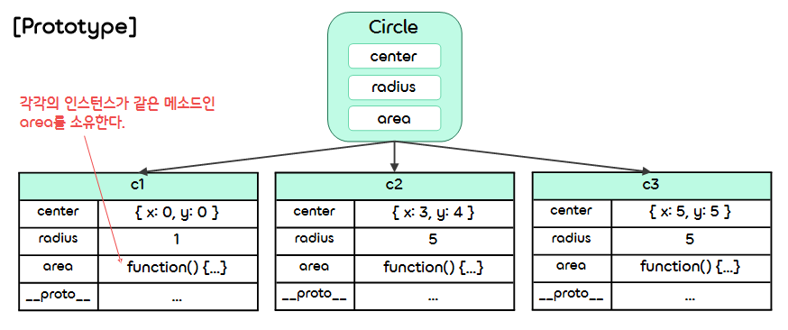
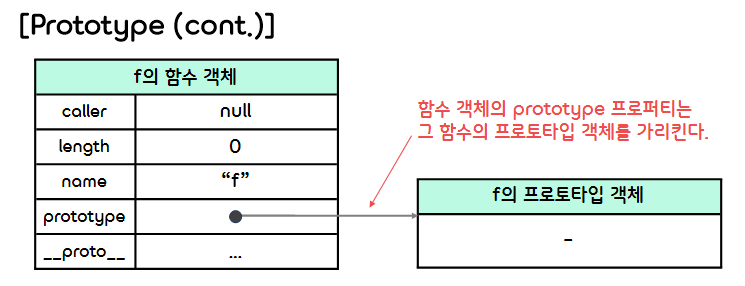
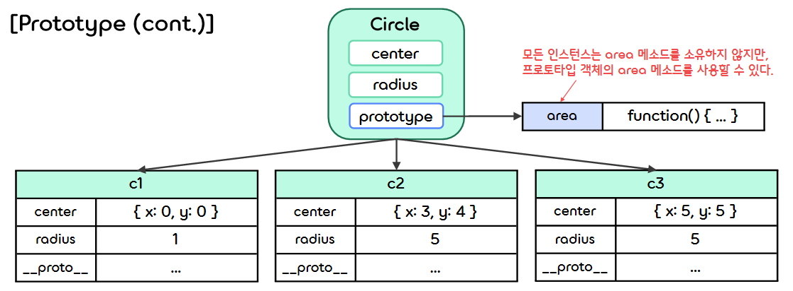
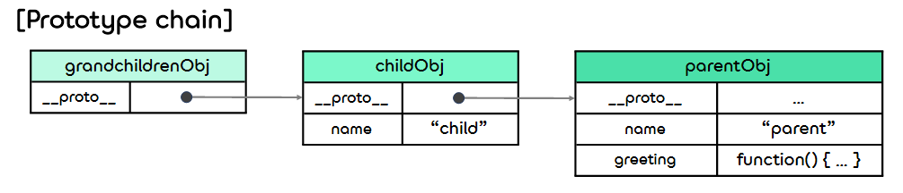
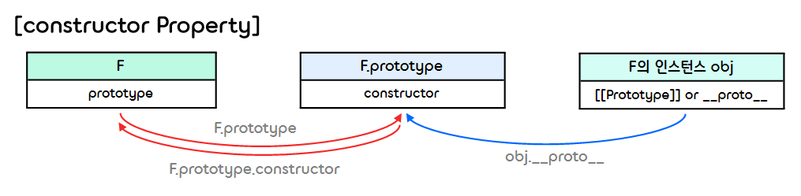
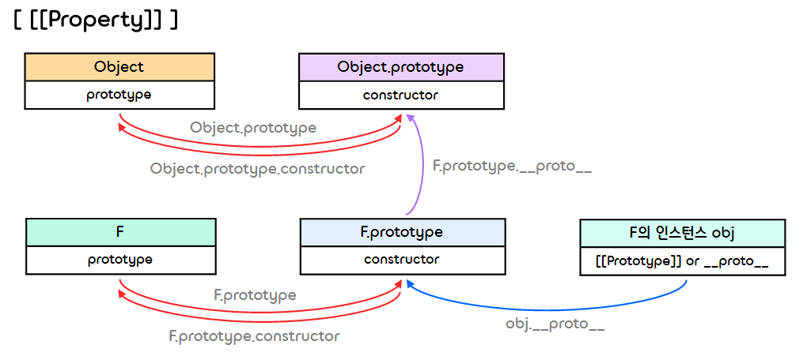
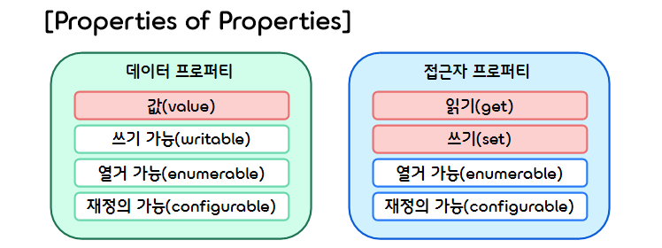

7.**Object**
===  

## < *Contents* >
- [1. About Object](#%EF%B8%8F-1-about-object)
- [2. About Prototype](#%EF%B8%8F-2-about-prototype)
- [3. Accessor Property](#%EF%B8%8F-3-accessor-property)
- [4. Properties of Properties](#%EF%B8%8F-4-properties-of-properties)
---

## ✔️ 1. **About Object** 

### 1) **Creation of an Object**
- 자바스크립트 **객체(Object)** 는 이름(name)과 값(value)으로 구성된 **프로퍼티(Property)** 의 정렬되지 않은 집합이다. 
- 프로퍼티의 이름은 프로퍼티 이름 또는 키(key)라고 하고, 프로퍼티 값으로는 모든 데이터 타입의 데이터(원시 값, 객체)를 저장할 수 있다.
- 이때 함수의 참조를 값으로 가진 프로퍼티는 **메소드(Method)** 라고 한다.
- 자바스크립트로 이러한 객체를 생성하려면 다음과 같은 3가지 방법을 사용한다.  

</br> 

- (1) **객체 리터럴로 생성하는 방법**
    ```javascript
    const tom = { name: "Tom", age: 20 };
    console.log(tom);  // → { name: 'Tom', age: 20 }
    ```  

</br>

- (2) **생성자로 생성하는 방법**
    ```javascript
    function Person(name, age) {
        this.name = name;
        this.age = age;
    }

    const tom = new Person("Tom", 20);
    console.log(tom);  // → Person { name: 'Tom', age: 20 }
    ```  

</br>

- (3) **Object.create 메소드로 생성하는 방법**
    ```javascript
    const tom = Object.create(Object.prototype, {
        name: {
            value: "Tom",
            writable: true,
            enumerate: true,
            configurable: true
        },
        age: {
            value: 20,
            writable: true,
            enumerate: true,
            configurable: true
        }
    });

    console.log(tom);       // → {}
    console.log(tom.name);  // → Tom
    console.log(tom.age);   // → 20
    ```  

</br>

### 2) **생성자 안에서 메소드를 정의하는 방식의 문제점**
- 생성자 안에서 this 뒤에 메소드를 정의하면 그 생성자로 생성한 모든 인스턴스에 똑같은 메소드가 추가된다.  
- 따라서 메소드를 포함한 생성자로 인스턴스를 여러 개 생성하면, 같은 작업을 하는 메소드가 인스턴스 개수만큼 생성된다.
- 이는 결과적으로 그만큼의 메모리 낭비를 일으킨다.
    ```javascript
    function Circle(center, radius) {
        this.center = center;
        this.radius = radius;
        this.area = function() {
            return Math.PI * this.radius * this.radius;
        };
    }
    const c1 = new Circle({x:0, y: 0}, 1);
    const c2 = new Circle({x:3, y: 4}, 5);
    const c3 = new Circle({x:5, y: 5}, 5);
    ```   
    <p></p>
- 이러한 문제는 프로토타입 객체에 메소드를 정의하는 방식으로 해결할 수 있다.

</br>  

### 3) **Prototype Object(프로토타입 객체)**
- 자바스크립트에서는 함수도 객체이므로, 기본적으로 prototype 프로퍼티를 갖고 있다.  
(자바스크립트의 모든 객체는 **프로토타입(prototype)** 이라는 객체를 갖는다.)  
- prototype 프로퍼티는 기본적으로 빈 객체를 가리킨다. 
    ```javascript
    function F() {};
    console.log(F.prototype);  // → {}
    ```  
    <p></p>  

</br>

- 프로토타입 객체의 프로퍼티는 생성자로 생성한 모든 인스턴스에서 그 인스턴스의 프로퍼티처럼 사용할 수 있다.  
- 이때 프로토타입 객체의 프로퍼티는 읽기만 가능하고 수정은 불가능하다.  
    ```javascript
    F.prototype.prop = "prototype value";
    const obj = new F();
    console.log(obj.prop);
    ```  

</br>

- 프로토타입 객체의 프로퍼티를 인스턴스에서 참조할 수 있는 상황을 가리켜 "인스턴그가 프로토타입 객체를 상속하고 있다"라고 하며, 이러한 상속 구조는 '프로토타입 체인'이라는 메커니즘을 바탕으로 구현되어 있다.  
- 생성자 안에서 this 뒤에 메소드를 정의할 때 생기는 문제는 생성자의 프로토타입 객체에 메소드를 추가하는 방식으로 해결할 수 있다.  
    ```javascript
    // Circle 생성자
    function Circle(center, radius) {
        this.center = center;
        this.radius = radius;
    }

    // Circle 생성자의 prototype 프로퍼티에 area 메소드를 추가
    Circle.prototype.area = function() {
        return Math.PI * this.radius * this.radius;
    };

    // Circle 생성자로 인스턴스 생성
    const c1 = new Circle({x:0, y: 0}, 1);
    const c2 = new Circle({x:3, y: 4}, 5);
    const c3 = new Circle({x:5, y: 5}, 5);
    console.log("Area : " + c1.area());  // → Area : 3.141592653589793
    ```  
    <p></p>  
- 이처럼 생성자의 프로토타입 객체에 메소드를 추가하면 인스턴스에 메소드를 추가하지 않아도 인스턴스가 프로토타입 객체의 메소드를 사용할 수 있으므로, 불필요한 메모리 낭비를 피할 수 있다. 

</br>

- ※ **메소드 체인(Method Chain)**
    - 메소드가 객체를 반환하면 반환한 객체의 메소드를 호출할 수 있다.
    - 이를 통해 메소드를 다음과 같이 마침표 연산자로 계속 연결하여 실행시킬 수 있는데, 이를 **메소드 체인(Method Chain)** 이라고 한다.
        ```javascript
        object.method1().method2().method3()...
        ```  

</br>

## ✔️ 2. **About Prototype**

### 1) **Inheritance(상속)**
- **상속(Inheritance)** 이란 일반적으로 특정 객체가 다른 객체로부터 기능을 이어 받는 것을 말한다.
- 자바스크립트에서는 클래스(Class)가 아닌 객체(Object)를 상속한다.
- 자바스크립트의 상속은 **프로토타입 체인(Prototype Chain)** 이라고 부르는 객체의 자료구조로 구현되어 있으며, 이를 **프로토타입 상속(Prototype Inheritance)** 이라고 한다.    
- 모든 객체는 그들의 프로토타입으로부터 프로퍼티와 메소드를 상속받는다.  

</br>

### 2) **Prototype Chain(프로토타입 체인)**  

- (1) **내부 프로퍼티(&#91;&#91;Property&#93;&#93;)**
    - 모든 객체는 **내부 프로퍼티 &#91;&#91;Prototype&#93;&#93;** 를 갖고 있다.
    - 이는 prototype 프로퍼티와는 다른 객체로, 	&#95;&#95;proto&#95;&#95; 프로퍼티에 &#91;&#91;Prototype&#93;&#93;의 값이 저장된다.  

</br>

- (2) **프로토타입 체인(Prototype Chain)**
    - 객체의 &#95;&#95;proto&#95;&#95; 프로퍼티는 그 객체에게 상속을 해 준 부모 객체를 가리킨다.
    - 따라서 객체는 &#95;&#95;proto&#95;&#95; 프로퍼티가 가리키는 부모 객체의 프로퍼티를 사용할 수 있다.  
    - 다음 코드에 등장한 객체 3개는 &#95;&#95;proto&#95;&#95; 프로퍼티를 사용한 연결 고리로 묶여있다.
        ```javascript
        const parentObj = {
            name: "parent",
            greeting: function() { console.log("I'm " + this.name); }
        };

        const childObj = {
            name: "child"
        };

        childObj.__proto__ = parentObj; 

        const grandchildrenObj = {};
        grandchildrenObj.__proto__ = childObj; 
        grandchildrenObj.greeting();
        ```  
        <p></p>  
    - 이처럼 자신이 갖고 있지 않은 프로퍼티는 &#95;&#95;proto&#95;&#95; 프로퍼티가 가리키는 객체를 차례대로 거슬러 올라가며 검색하는데, 이와 같은 객체의 연결 고리를 **프로토타입 체인(Prototype Chain)** 이라고 한다.  
    - 객체의 &#95;&#95;proto&#95;&#95; 프로퍼티가 가리키는 객체가 바로 상속을 해 준 객체이며, 이를 그 객체의 **프로토타입(Prototype)** 이라고 한다.
    - 객체는 자신이 갖고 있지 않은 프로퍼티나 메소드를 프로토타입 객체에 위임(Delegate)한다고 볼 수 있다.
    - 이와 같이 자바스크립트는 프로토타입 체인으로 객체의 프로퍼티를 다른 객체로 전파하는데, 이를 **프로토타입 상속(Prototype Inheritance)** 이라고 한다.  

    </br>

    - 객체의 프로토타입은 Object.getPrototypeOf 메소드로 가져올 수 있다.
        ```javascript
        function F() {}
        let obj = new F();
        console.log(typeof Object.getPrototypeOf(obj));  // object
        ```  
    
</br>

### 3) **new 연산자**  
- 생성자를 new 연산자로 호출해서 인스턴스를 생성할 때, 내부적으로는 다음과 같은 작업을 수행한다.
    ```javascript
    /* 예시 코드 */
    function Circle(center, radius) {
        this.center = center;
        this.radius = radius;
    }
    Circle.prototype.area = function() {
        return Math.PI * this.radius * this.radius;
    }
    ```  
    - ① 빈 객체를 생성한다.
        ```javascript
        const newObj = {};
        ```
    - ② Circle.prototype을 생성된 객체의 프로토타입으로 설정한다.
        ```javascript
        newObj.__proto__ = Circle.prototype;
        ```  
    - ③ Circle 생성자를 실행하고 newObj를 초기화한다.  
    (이때 this는 생성한 객체로 설정하고, 인수는 new 연산자와 함께 사용한 인수를 그대로 사용한다.)
        ```javascript
        Circle.apply(newObj, arguments);
        ```  
    - ④ 완성된 객체를 결괏값으로 반환한다.  
    (단, Circle 생성자가 객체를 반환하는 경우에는 그 객체를 반환한다.)
        ```javascript
        return newObj;
        ```  

</br>

- 위의 예시에서 생성자의 prototype프로퍼티 값을 인스턴스의 __proto__ 프로퍼티 값으로 대입하는 부분이 중요하다.
- 이를 이용해 인스턴스의 프로토타입 체인이 정의되며, 생성자로 생성한 모든 인스턴스가 생성자의 프로토타입 객체의 프로퍼티를 사용할 수 있게 된다. (prototype 프로퍼티의 역할)  

</br>

### 4) **프로토타입 객체의 Properties**
- 함수를 정의하면 함수 객체는 기본적으로 prototype 프로퍼티를 갖는다.
- 그리고 이 prototype 프로퍼티는 프로토타입 객체를 가리키며, 이 프로토타입 객체는 기본적으로 constructor 프로퍼티와 내부 프로퍼티 	&#91;&#91;Prototype&#93;&#93; (&#95;&#95;proto&#95;&#95;)을 갖는다.  

</br>

- (1) **constructor 프로퍼티**
    - constructor 프로퍼티는 함수 객체의 참조를 값으로 갖는다.
        ```javascript
        function F() {};
        console.log(F.prototype.constructor);  // → [Function: F]
        ```  
    - 생성자의 prototype 프로퍼티는 프로토타입 객체를 가리키며, 이 프로토타입 객체의 constructor 프로퍼티가 생성자를 가리키는 연결 고리로 묶여있다.
    - 반면 생성자로 생성한 인스턴스는 생성될 때의 프로토타입 객체의 참조만 가지고 있을 뿐, 생성자와는 직접적인 연결 고리가 없다.  
        <p></p>  

    </br>

    - 인스턴스가 어떤 생성자로 생성된 것인지 알아내는 방법으로 프로토타입의 constructor 프로퍼티 값을 확인하는 방법이 있다.  
    - 인스턴스는 포로토타입에서 constructor 프로퍼티를 상속받기 때문에, constructor를 인스턴스의 프로퍼티로 참조할 수 있다.
        ```javascript
        function F() {};
        obj = new F();
        console.log(obj.constructor);  // → [Function: F]
        ```  

</br>

- (2) **내부 프로퍼티 &#91;&#91;Prototype&#93;&#93;**
    - 함수 객체가 가진 프로토타입 객체의 내부 프로퍼티 &#91;&#91;Prototype&#93;&#93;는 기본적으로 Object.prototype을 가리킨다.
    - 즉, 프로토타입 객체의 프로토타입은 Object.prototype이다.  
        ```javascript
        function F() {};
        console.log(F.prototype.__proto__);  // → [Object: null prototype] {}
        ```  
    - 이 덕분에 생성자로 생성한 인스턴스가 Object.prototype의 프로퍼티를 사용할 수 있다.
    - 또한 Object.prototype의 프로토타입은 null을 가리킨다.  
    (즉, Object.prototype은 인스턴스에서 프로토타입 체인을 따라 거슬러 올라갈 수 있는 마지막 단계이다.)
        <p></p>  

</br>

- (3) **프로토타입 객체의 교체 및 constructor 프로퍼티**
    - 프로퍼티만 정의되어 있는 새로운 객체를 prototype 프로퍼티 값으로 대입하면 인스턴스와 생성자 사이의 연결고리가 끊어진다.
    - 그 이유는 해당 객체가 constructor 프로퍼티를 가지고 있지 않기 때문이다.
    - 이 경우, 인스턴스와 생성자 사이의 연결 고리를 유지하려면 prototype으로 사용할 객체에 constructor 프로퍼티를 정의하고, 그 프로퍼티에 생성자의 참조를 대입해야 한다.
    - 이때, 인스턴스가 생성된 후에는 생성자의 프로토타입을 바꾸어도, 교체한 객체로부터는 프로퍼티를 상속받지 않는다.
        ```javascript
        function Circle(center, radius) {
            this.center = center;
            this.radius = radius;
        }

        // 프로토타입 변경 이전에 생성된 객체
        const c1 = new Circle({x: 0, y: 0}, 1.0);

        console.log(c1.constructor);        // → [Function: Circle]
        console.log(c1 instanceof Object);  // → true
        console.log(c1 instanceof Circle);  // → true
        console.log(c1.__proto__);          // → {}
        console.log(c1.area());             // TypeError: c1.area is not a function

        // 생성자의 프로토타입(객체)을 변경한다.
        Circle.prototype = {
            constructor: Circle,  // 생성자를 constructor 프로퍼티 값으로 대입한다.
            area: function() { return Math.PI * this.radius * this.radius; }
        }

        // 프로토타입 변경 이후에 생성된 객체
        const c2 = new Circle({x: 0, y: 0}, 1.0);

        console.log(c2.constructor);        // → [Function: Circle]
        console.log(c2 instanceof Object);  // → true
        console.log(c2 instanceof Circle);  // → true
        console.log(c1.__proto__);          // → { constructor: [Function: Circle], area: [Function: area] }
        console.log(c2.area());             // → 3.141592653589793
        ```  
    - 하지만, 생성자가 기존에 가지고 있던 프로토타입 객체에 프로퍼티를 추가한 경우에는 생성자와 인스턴스 사이의 연결 고리가 끊기지 않는다.  

</br>

### 5) **프로토타입의 확인(Confirmation)**
- 특정 프로토타입 객체가 그 객체의 프로토타입 체인에 포함되어 있는지 확인하는 방법에는 다음과 같이 두 가지 방법이 있다.  

</br>

- (1) **instanceof 연산자**
    - **instanceof** 연산자는 지정한 객체의 프로토타입 체인에 지정한 생성자의 프로토타입 객체가 포함되어 있는지를 판정한다.
    - 이때 instanceof 연산자가 확인하는 것은 그 인스턴스가 해당 생성자로 생성되었는지에 대한 여부가 아니라, 생성자의 프로토타입 객체를 상속받았는지에 대한 여부이다.
        ```javascript
        function F() {};
        const obj = new F();
        console.log(obj instanceof F);       // → true
        console.log(obj instanceof Object);  // → true
        console.log(obj instanceof Date);    // → false
        ```  

- (2) **isPrototypeOf 메소드**  
    - isPrototypeOf 메소드는 특정 객체가 다른 객체의 프로토타입 체인에 포함되어 있는지를 판정한다.
        ```javascript
        function F() {};
        const obj = new F();
        console.log(F.prototype.isPrototypeOf(obj));       // → true 
        console.log(Object.prototype.isPrototypeOf(obj));  // → true
        console.log(Date.prototype.isPrototypeOf(obj));    // → false
        ```  

</br>

### 6) **Object 생성자와 Object.prototype**
- Object 생성자는 내장 생성자로 일반적인 객체를 생성한다.  
(Object 생성자는 new 없이 호출해도 new를 붙여서 호출했을 때와 같은 방식으로 동작한다.)  
- 인수에 값을 지정하면 그 값을 Object 객체로 변환한 인스턴스를 생성한다.
    ```javascript
    const strObj = new Object("ABC");
    const numObj = new Object(3);

    console.log(strObj, strObj.valueOf());  // → [String: 'ABC'] ABC
    console.log(numObj, numObj.valueOf());  // → [Number: 3] 3
    ```  
- Object 생성자는 객체를 생성하는 것보다는, 일반적인 객체를 조작하기 위한 메소드와 프로퍼티를 제공하고, Object.prototype으로 모든 내장 생성자 인스턴스에서 사용할 수 있는 메소드를 사용하는 것에 의의가 있다.  
- 여기서 Object.prototype의 메소드는 모든 내장 객체로 전파되며, 모든 인스턴스에서 사용할 수 있다.
    - Object 생성자는 assign, create, defineProperty, freeze, isFrozen, getPrototypeOf 등의 메소드를 갖는다.  
    - Object.prototype은 hasOwnProperty, isPrototypeOf, toString, valueOf 등의 메소드를 갖는다.  

</br>

### 7) **Object.create로 객체 생성**
- Object.create 메소드를 사용하면 명시적으로 프로토타입을 지정해서 객체를 생성할 수 있다.
- 첫 번째 인수는 생성할 객체의 프로토타입이고, 두 번째 인수를 지정하면 생성할 객체의 프로퍼티를 설정할 수 있다.  
(인수에 null을 넘기면 프로토타입이 없는(프로퍼티도 없는) 백지 상태의 객체를 생성할 수 있다.)
- 이와 같은 Object.create 메소드를 활용하면 가장 간단하게 상속을 구현할 수 있다.
    ```javascript
    const tom = {
        name: "Tom",
        greeting: function() { console.log(`Hi! I'm ${this.name}`)}
    }

    const becky = Object.create(tom);
    becky.name = "Becky";
    becky.greeting();  // → Hi! I'm Becky
    ```  

</br>

## ✔️ 3. **Accessor Property**  
- 접근자 프로퍼티(Accessor Property)를 사용하면 프로퍼티를 읽고 쓸 때 원하는 작업을 자동으로 처리할 수 있다.  

</br>

### 1) **Types of Properties**
- (1) **Data Property(데이터 프로퍼티)** : 값을 저장하기 위한 프로퍼티
- (2) **Accessor Property(접근자 프로퍼티)** : 프로퍼티를 읽거나 쓸 때 호출하는 함수를 값 대신에 지정할 수 있는 프로퍼티 (값 X)  

</br>

### 2) **Accessor Property**
- **접근자(Accessor)** 란 객체 지향 프로그래밍에서 객체가 가진 프로퍼티 값을 객체 바깥에서 읽거나 쓸 수 있도록 제공하는 메소드를 말한다.
- **접근자 프로퍼티(Accessor Property)** 를 사용하면 데이터를 부적절하게 변경하는 것을 막고, 특정 데이터를 외부로부터 숨길 수 있으며, 외부에서 데이터를 읽으려고 시도할 때 적절한 값으로 가공해서 넘길 수 있다.  

</br>

- 다음과 같이 function 키워드 대신 **get** , **set** 키워드를 사용하면 접근자 프로퍼티를 읽을 때의 처리를 담당하는 **게터(getter) 함수** 와 쓸 때의 처리를 담당하는 **세터(setter) 함수** 를 정의할 수 있다.  
- 접근자 프로퍼티의 값을 읽으려고 시도하면 getter가 호출되고, 값을 쓰려고 시도하면 setter가 호출된다.
- 그리고, 접근자 프로퍼티 또한 데이터 프로퍼티와 마찬가지로 delete 연산자로 삭제할 수 있다.
    ```javascript
    const person = {
        _name: "Tom",
        // getter 메소드
        get name() {        
            return this._name;
        },
        // setter 메소드
        set name(value) {   
            const str = value.charAt(0).toUpperCase() + value.substring(1);
            this._name = str;
        },
        get info() {
            return { name: this._name, age: 20 };
        }
    };

    person.name = "Jones";      // setter 함수 실행
    console.log(person.name);   // → Jones (getter 함수 실행)
    console.log(person.info);   // → { name: 'Jones', age: 20 } (getter 함수 실행)

    delete person.name;         // → _name을 읽고 쓸 수 있는 접근자 프로퍼티를 삭제한다.
    console.log(person.name);   // → undefined (더 이상 _name 프로퍼티에 접근할 수 없다.)
    console.log(person._name);  // → Jones (하지만 여전히 _name 프로퍼티에 접근할 수 있다.)
    ```  

</br>

### 3) **Data Encapsulation(데이터의 캡슐화)**
- 즉시 실행 함수로 클로저를 생성하면 데이터를 객체 외부에서 접근할 수 없도록 숨기고, 접근자 프로퍼티로만 읽고 쓰도록 만들 수 있다.  
    ```javascript
    const person = (function() {
        var _name = "Tom";  // private 변수
        return {
            get name() {
                return _name;
            },
            set name(value) {
                const str = value.charAt(0).toUpperCase() + value.substring(1);
                _name = str;
            }
        };
    })();

    console.log(person.name);   // → Tom
    person.name = "Jones";
    console.log(person.name);   // → Jones

    delete person.name;
    console.log(person.name);   // → undefined
    console.log(person._name);  // → undefined (이제 _name 프로퍼티에 접근 자체가 불가능하다.)
    ```  

</br>

## ✔️ 4. **Properties of Properties**

### 1) **Properties of Properties(프로퍼티의 속성)**  
- 프로퍼티는 다음과 같은 세 가지 내부 속성을 가지며, 속성 값으로는 논리값을 갖는다.
    - (1) **writable(쓰기 가능)** : 프로퍼티에 쓰기(값 수정)가 가능한지를 뜻하는 속성
    - (2) **enumerable(열거 가능)** : 프로퍼티가 반복문으로 찾을 수 있는 대상인지를 뜻하는 속성  
    - (3) **configurable(재정의 가능)** : 프로퍼티의 내부 속성을 수정할 수 있는지를 뜻하는 속성  
- 데이터 프로퍼티는 value, writable, enumerable, configurable 이라는 네 개의 속성을 갖는다.
- 접근자 프로퍼티는 get, set, enumerable, configurable 이라는 네 개의 속성을 갖는다.  
    <p></p>  

</br>

### 2) **Property Descriptor와 프로퍼티를 읽고 쓰는 메소드**
- 프로퍼티의 속성은 **프로퍼티 디스크립터(Property Descriptor, 프로퍼티 기술자)** 로 설정할 수 있다.
- 이 객체가 가진 프로퍼티 이름은 프로퍼티가 가진 속성 이름과 같다.  

</br>

- (1) **Data Property와 Accessor Property의 Descriptor**
    - 데이터 프로퍼티의 프로퍼티 디스크립터는 다음 네 개의 프로퍼티를 갖는 객체이다.
        ```javascript
        {
            value: 프로퍼티의 값,
            writable: 논리값,
            enumerable: 논리값,
            configurable: 논리값
        }
        ```  
    - 접근자 프로퍼티의 프로퍼티 디스크립터는 다음 네 개의 프로퍼티를 갖는 객체이다.
        ```javascript
        {
            get: getter 함수값,
            set: setter 함수값,
            enumerable: 논리값,
            configurable: 논리값
        }
        ```  

</br>

- (2) **Object.getOwnPropertyDescriptor**
    - **Object.getOwnPropertyDescriptor** 메소드는 객체 프로퍼티의 프로퍼티 디스크립터를 가져온다.  
    (프로토타입으로 상속받은 프로퍼티나, 없는 프로퍼티를 지정하면 undefined를 반환한다.)
    - 첫 번째 인수는 객체의 참조이고, 두 번째 인수는 프로퍼티 이름을 뜻하는 문자열이다.
        ```javascript
        const tom = {
            _name: "Tom",
            get name() {
                return this._name;
            },
            set name(value) {
                this._name = value;
            }
        };

        // 데이터 프로퍼티의 디스크립터를 출력한다.
        console.log(Object.getOwnPropertyDescriptor(tom, "_name"));
        // 접근자 프로퍼티의 디스크립터를 출력한다.
        console.log(Object.getOwnPropertyDescriptor(tom, "name"));
        ```
        ```
        { value: 'Tom', writable: true, enumerable: true, configurable: true }
        {
            get: [Function: get name],
            set: undefined,
            enumerable: true,
            configurable: true
        }
        ```  

</br>

- (3) **Object.defineProperty**
    - **Object.defineProperty** 메소드는 객체의 프로퍼티에 프로퍼티 디스크립터를 설정한다.
    - 첫 번째 인수는 객체의 참조, 두 번째 인수는 프로퍼티 이름(문자열), 세 번째 인수는 프로퍼티 디스크립터의 참조이다.
    - 이때 디스크립터의 일부 프로퍼티를 생략하여, 원하는 디스크립터 프로퍼티만 변경할 수도 있다.
    - 메소드를 실행한 후에는 수정된 객체의 참조를 반환한다.  
        ```javascript
        const person = { age: 20 };

        Object.defineProperty(person, "name", {
            value: "Tom",
            writable: true,
            enumerable: false,
            configurable: true
        });

        Object.defineProperty(person, "age", {
            value: 21
        });

        console.log(Object.getOwnPropertyDescriptor(person, "name"));
        console.log(Object.getOwnPropertyDescriptor(person, "age"));
        ```
        ```
        { value: 'Tom', writable: true, enumerable: false, configurable: true }
        { value: 21, writable: true, enumerable: true, configurable: true }
        ```  

</br>

- (4) **Object.defineProperties**
    - **Object.defineProperties** 메소드는 객체가 가진 프로퍼티 여러 개에 각각의 프로퍼티 디스크립터를 설정한다.  
    - 첫 번째 인수는 객체의 참조, 두 번째 인수는 새롭게 설정 또는 변경하고자 하는 프로퍼티 이름이 키로 지정된 프로퍼티 여러 개가 모인 객체이며, 각 키 값은 프로퍼티 디스크립터의 참조이다.  
    - 메소드를 실행한 후에는 수정된 객체의 참조를 반환한다.  
        ```javascript
        const person = Object.defineProperties({}, {
            _name: {
                value: "Kane",
                writable: true,
                enumerable: true,
                configurable: true
            },
            name: {
                get: function() { return this._name; },
                set: function(value) { this._name = value; },
                enumerable: true,
                configurable: true
            }
        });

        person.name = "John";
        console.log(person.name);
        console.log(Object.getOwnPropertyDescriptor(person, "name"));
        ```
        ```
        John
        {
            get: [Function: get],
            set: [Function: set],
            enumerable: true,
            configurable: true
        }
        ```  

</br>

### 3) **Object.create의 두 번째 인수**
- 다음과 같이 객체가 포함할 프로퍼티 목록을 Object.create 메소드의 두 번째 인수로 넘겨서 새로운 객체를 생성할 수 있다.
- 두 번째 인수로는 Object.defineProperties 메소드의 두 번째 인수와 마찬가지로 프로퍼티 디스크립터를 넘긴다.  
    ```javascript
    const group = {
        groupName: "GDSC",
        sayGroupName: function() { console.log("belong to " + this.groupName); }
    };

    const person = Object.create(group, {
        name: {
            value: "Jones",
            writable: true,
            enumerable: true,
            configurable: true
        },
        age: {
            value: 23,
            writable: true,
            enumerable: true,
            configurable: true
        },
        sayName: {
            value: function() { console.log("I'm " + this.name); },
            writable: true,
            enumerable: true,
            configurable: true
        },
    });

    console.log(person);    // → { name: 'Jones', age: 23, sayName: [Function: value] }
    person.sayName();       // → I'm Jones
    person.sayGroupName();  // → belong to GDSC
    ```  

</br>

