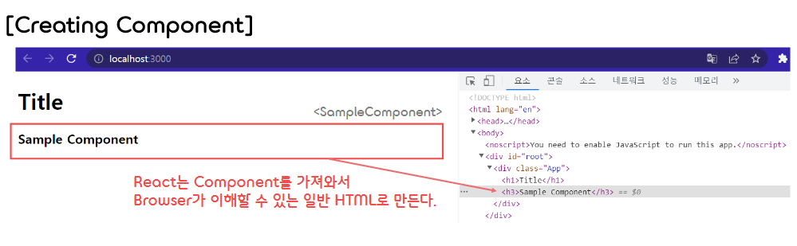
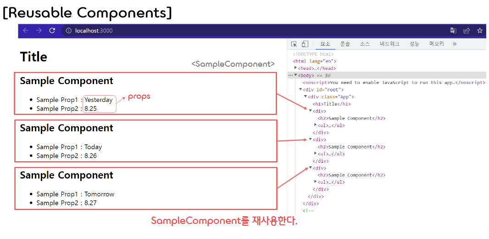
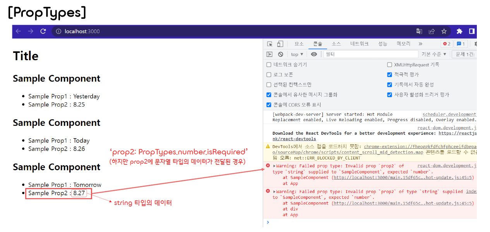
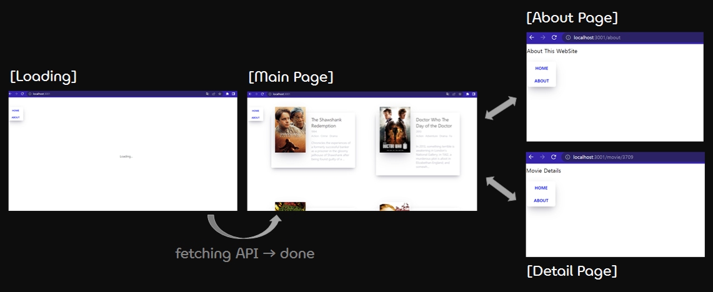

✍️ **React를 사용한 간단한 영화 웹 서비스 구현(TIL)**
===

</br>

### ✔️ **Requirements**
- ① Node.js 다운로드 (npm도 같이 다운로드된다.)
- ② npx 다운로드
    ```
    npm install npx -g
    ```  
    (이미 다운로드가 되어 있는지 확인하려면 명령어 "OOO -v"를 사용한다.)

</br>

### ✔️ **create-react-app**
- 브라우저는 리액트에서 사용하는 JSX라는 자바스크립트의 확장 문법을 이해하지 못하기 때문에, 과거에는 Webpack과 바벨(Babel) 등을 다운로드하고, 리액트 코드를 따로 컴파일하는 등 복잡한 과정을 거쳐 React 개발 환경을 구성해야 했다.
- 하지만 최근에는 **create-react-app** 이라는 명령어 하나만으로, 위와 같은 복잡한 설정 없이 React 개발 환경을 구성할 수 있게 되었다.  
- 우선 프로젝트를 진행할 폴더를 열고, 다음과 같이 명령어를 작성하면 React 개발 환경을 손쉽게 구성할 수 있다.  
    ```
    npx create-react-app my_app_name
    ```  
- 만든 리액트 앱을 실행하기 위해서는 다음 명령어를 작성하여 개발 서버를 열어주어야 한다. (package.json 파일에 적혀 있다.)
    ```
    npm start
    ```  
- ※ 참고 : [Create React App documentation](https://facebook.github.io/create-react-app/docs/getting-started)  

</br>

### ✔️ **React란?**
- React는 웹 프레임워크로, 자바스크립트 라이브러리의 하나로서 사용자 인터페이스를 만들기 위해 사용한다.
- React는 페이스북에서 제공하는 프론트엔드 라이브러리이다.
- React를 이용하면 사용자와 상호작용할 수 있는 동적인 UI를 쉽게 만들 수 있기 때문에 많이 이용한다.
    - React는 소스코드에 처음부터 HTML 요소들을 넣지 않고, 비어 있는 HTML이 브라우저에 의해 load된 이후에, 우리가 작성한 HTML 요소들을 넣어준다.
    - Virtual DOM을 사용한다. (DOM의 상태를 메모리에 저장하고, 변경 전과 변경 후의 상태를 비교한 뒤, 최소한의 내용만을 반영하여 프로그램의 성능을 향상시킬 수 있다.)  

</br>

### ✔️ **DOM이란?** 
- **DOM(Document Object Model)** 이란 HTML 태그들을 자바스크립트가 이용할 수 있게 브라우저가 트리구조로 만든 객체 모델을 말한다.  
- 이는 **문서 객체 모델** 이라고도 하는데, 문서 객체는 html, head, body 등의 태그들을 자바스크립트가 이용할 수 있는 객체를 의미한다.  
(즉, DOM은 HTML과 스크립팅 언어인 자바스크립트를 서로 이어주는 역할을 한다.)
- 큰 규모의 웹 애플리케이션에서 DOM에 직접 접근하여 변화를 주다 보면 성능 이슈가 발생하는데 (DOM에 변화가 일어났을 때 웹 브라우저가 CSS를 다시 연산해서 레이아웃을 구성하고, 페이지를 리렌더링하는 과정에서 속도가 느려진다.), 이러한 문제점을 개선하기 위해 '가상 DOM' 이 개발되었다.  
- **Virtual DOM(가상 DOM()** 은 실제 DOM에 접근하는 대신, 이를 추상화한 자바스크립트 객체를 구성하여 사용하는 방식이다.  
- 가상 DOM을 사용하면 DOM의 상태를 메모리에 저장해두고, 변경 전과 변경 후의 상태를 비교한 뒤, 최소한의 변경 사항만을 반영할 수 있다.
- 리액트가 가상 DOM을 반영하는 절차는 다음과 같다. (ex. 특정 페이지에서 데이터가 변경된 경우)  
    - ① 데이터가 업데이트되면, 전체 UI를 Virtual DOM에 리렌더링한다.
    - ② 이전 Virtual DOM에 있던 내용과 현재의 내용을 비교한다. (가상 DOM끼리 비교)
    - ③ 바뀐 부분만 실제 DOM에 적용된다. (컴포넌트가 업데이트될 때, 레이아웃 계산이 한 번만 이루어진다.)  

</br>

### ✔️ **Component(컴포넌트)** 
- **Component**는 HTML(Element)을 반환하는 함수이다.
    ```javascript
    /* App.js */
    import React from 'react';

    /* Component */
    function App() {
        return (
            <div className="App">
                <h1>Hello</h1>
            </div>
        );
    }

    export default App;
    ```  
- Component를 사용하고자 할 때는 아래의 '&#60;App &#47;&#62;'와 같은 형태로 작성한다.
    ```javascript
    root.render(
    <React.StrictMode>
        <App />
    </React.StrictMode>
    );
    ```  
- 이와 같이 하나의 파일에 자바스크립트와 HTML을 동시에 작성할 수 있게 해주는 자바스크립트의 확장 문법을 **JSX** 라고 한다.
- JSX는 브라우저에서 실행되기 이전에 바벨(Babel)을 통해 일반 자바스크립트 형태의 코드로 변환된다.  

</br>

- 새로운 컴포넌트는 기본적으로 다음과 같은 과정에 따라 작성되고, HTML에 추가되어 디스플레이에서 보여진다. 
    - ① SampleComponent 컴포넌트 작성
        ```javascript
        /* SampleComponent.js */
        import React from "react";  // React 17 version부터는 이 import문 필요 X

        // SampleComponent 컴포넌트를 생성한다
        function SampleComponent() {
            return <h3>Sample Component</h3>;
        }

        export default SampleComponent;
        ```  
    - ② App 컴포넌트에 SampleComponent 추가
        ```javascript
        import React from 'react';
        import SampleComponent from './SampleComponent';

        // App 컴포넌트 내부에 SampleComponent 추가
        function App() {
            return (
                <div className="App">
                    <h1>Title</h1>
                    <SampleComponent />
                </div>
            );
        }

        export default App;
        ```  
    - ③ App 컴포넌트를 렌더링
        ```javascript
        import React from 'react';
        import ReactDOM from 'react-dom/client';
        import App from './App';

        const root = ReactDOM.createRoot(document.getElementById('root'));
        root.render(
            <React.StrictMode>
                <App />
            </React.StrictMode>
        );
        ```
        <p></p>  

</br>

### ✔️ **Reusable Components with JSX + Props**
- React의 장점은 **재사용 가능한 컴포넌트** 를 만들 수 있다는 점이다.   
    ```javascript
    import React from 'react';

    function SampleComponent({prop1, prop2}) {
        return <div>
            <h2>Sample Component</h2>
            <ul>
                <li>Sample Prop1 : {prop1}</li>
                <li>Sample Prop2 : {prop2}</li>
            </ul>
        </div>;
    }

    function App() {
        return (
            <div className="App">
                <h1>Title</h1>
                {/* SampleComponent 컴포넌트를 재사용한다. */}
                <SampleComponent prop1="Yesterday" prop2={8.25} />
                <SampleComponent prop1="Today" prop2={8.26} prop3={true} />
                <SampleComponent prop1="Tomorrow" prop2={8.27} something={['b', 'a', 'd']} />
            </div>
        );
    }

    export default App;
    ```  
    <p></p>
- 이때 위와 같이 props를 전달하여 동적 데이터가 있는 Component를 사용할 수도 있다.  

</br>

- Component에 데이터 전달
    - SampleComponent에는 아래와 같은 값들을 갖는 prop1, prop2, prop3, something 등의 데이터(props)를 전달할 수 있다.  
    - sampleComponent로 정보를 보내려고 하면, React는 이 모든 속성(props)을 가져와 해당 컴포넌트의 arguments에 전달한다.
    - 이때 SampleComponent의 argument 자리에는 'props'라고 작성해도 되고 (이때의 각 property는 'props.prop1'과 같이 사용한다.), '{prop1, prop2, ...}'과 같이 작성하여 선택적으로 property를 받아와 사용해도 된다. (비구조화 할당)  

</br>

- Map 함수를 사용하여 다음과 같이 동적 데이터를 갖는 컴포넌트를 생성할 수도 있다. (웹 페이지 구성은 위와 동일하다.)
    ```javascript
    import React from 'react';

    // External Data
    const data = [
        { id: 1, prop1: "Yesterday", prop2: 8.25 },
        { id: 2, prop1: "Today", prop2: 8.26, prop3: true },
        { id: 3, prop1: "Tomorrow", prop2: 8.27, something: ['b', 'a', 'd'] }
    ];

    function SampleComponent(props) {
        return <div>
            <h2>Sample Component</h2>
            <ul>
                <li>Sample Prop1 : {props.prop1}</li>
                <li>Sample Prop2 : {props.prop2}</li>
            </ul>
        </div>;
    }

    function App() {
        return (
            <div className="App">
                <h1>Title</h1>
                {/* Map 함수를 활용하여 동적 데이터를 갖는 다수의 컴포넌트를 생성한다. */}
                {data.map(data => <SampleComponent key={data.id} prop1={data.prop1} prop2={data.prop2}/>)}
            </div>
        );
    }

    export default App;
    ```  
    - 위의 코드에서 data 배열의 객체들에 id 프로퍼티를 부여한 이유는, 이 id를 SampleComponent 컴포넌트의 **key** property로 전달하여 React가 해당 컴포넌트로 만든 element들을 구분할 수 있게 만들기 위함이다. 

</br>

### ✔️ **PropTypes**
- **PropTypes** 를 사용하면 컴포넌트로 전달받은 prop이 원하는 타입의 prop이 맞는지 확인할 수 있다.  
(prop의 타입에 대한 유효성 검사)
- PropTypes를 사용하기 위해서는 우선 아래와 같이 명령어를 작성하여 prop-types를 설치해야 한다.
    ```
    npm i prop-types
    ```  
- 다음과 같이 맞지 않는 타입의 prop이 컴포넌트에 전달될 경우 콘솔창에 에러메시지가 출력된다.  
    ```javascript
    import React from 'react';
    import PropTypes from 'prop-types';

    // External Data
    const data = [
        { id: 1, prop1: "Yesterday", prop2: 8.25 },
        { id: 2, prop1: "Today", prop2: 8.26, prop3: true },
        { id: 3, prop1: "Tomorrow", prop2: "8.27", something: ['b', 'a', 'd'] }  // Type Mismatch
    ];

    function SampleComponent({prop1, prop2}) {
        return <div>
            <h2>Sample Component</h2>
            <ul>
                <li>Sample Prop1 : {prop1}</li>
                <li>Sample Prop2 : {prop2}</li>
            </ul>
        </div>;
    }

    SampleComponent.propTypes = {
        prop1: PropTypes.string.isRequired,  // prop1에는 string 타입의 데이터가 전달되어야 한다.
        prop2: PropTypes.number.isRequired   // prop2에는 number 타입의 데이터가 전달되어야 한다.
    };

    ...
    ```  
    <p></p>  

### ✔️ **States**
- State는 보통 동적 데이터(변경되는 데이터)와 함께 작업할 때 만들어진다.  

</br>

- (1) **Class Component(클래스 컴포넌트)**
    - 우선 함수 컴포넌트에서 클래스 컴포넌트로 다음과 같이 변경해준다.  
        ```javascript
        class App extends React.Component {
            render() {
                return <h1>I'm a Class Component</h1>;
            }
        }
        ```  
    - 클래스 컴포넌트는 React 컴포넌트로부터 확장되며, render 메소드를 갖는다.
    - React는 자동적으로 클래스 컴포넌트가 갖고 있는 render 메소드를 자동으로 실행해준다.
    - 함수 컴포넌트 대신 클래스 컴포넌트를 사용하는 이유는, 클래스 컴포넌트에서 state를 사용할 수 있기 때문이다.

</br>

- (2) **States**
    - state는 객체(Object)이며, 컴포넌트의 동적 데이터를 저장할 공간을 갖는다.
        ```javascript
        class App extends React.Component {
            state = { count: 0 };  // State
            add = () => { this.state.count++; };
            minus = () => { this.state.count--; };
            render() {
                return (
                    <div>
                        <h1>The number is : {this.state.count}</h1>
                        <button onClick={this.add}>Add</button>
                        <button onClick={this.minus}>Minus</button>
                    </div>
                );
            }
        }
        ```  
    - 위와 같이 코드를 작성할 경우, React가 render 함수를 refresh하지 않으므로, state 변경이 정상적으로 반영되지 않는다.  
    - 즉, 매번 state의 상태를 변경할 때에는 React가 render 함수를 호출해주어야만 한다.  
    - 이를 위해선 state를 변경할 때 직접 state 값들을 변경하는 게 아니라, setState 함수를 사용하여 변경해야 한다.
    - setState 함수를 호출할 경우, React가 알아서 state를 업데이트하고, 또한 render 함수를 호출해준다.
    - setState 함수의 첫 번째 인자인 current를 사용하면 현재 state 값을 사용할 수 있다.  
        ```javascript
        class App extends React.Component {
            state = { count: 0 };  // state
            add = () => {
                this.setState(current => ({count: current.count + 1}));
            };
            minus = () => {
                this.setState(current => ({count: current.count - 1}));
            };
            render() {
                return (
                    <div>
                        <h1>The number is : {this.state.count}</h1>
                        <button onClick={this.add}>Add</button>
                        <button onClick={this.minus}>Minus</button>
                    </div>
                );
            }
        }
        ```  

</br>

- (3) **Component Life Cycle**
    - React 클래스 컴포넌트에는 render 함수 이외에도 여러 **Life Cycle Method** 가 존재한다.
    - React는 기본적으로 Life Cycle Method를 사용하여 React가 컴포넌트를 생성, 변경, 소멸할 때 원하는 작업을 수행한다.
    - 대표적인 Life Cycle Method는 아래와 같다.
        - ① **Mounting** (컴포넌트가 생성될 때(DOM에 추가될 때) 호출되는 함수의 집합)
            - **constructor()** : 생성자 (render 함수가 호출되기 이전에 실행되는 함수)
            - getDerivedStateFromProps()
            - **render()** : 렌더링(Rendering) 함수
            - **componentDidMount()** : 컴포넌트가 처음 render 되었을 때 호출되는 함수
        - ② **Updating** (컴포넌트(props나 state)가 변경될 때 호출되는 함수의 집합)  
            - getDerivedStateFromProps()  
            - shouldComponentUpdate()
            - **render()**
            - getSnapshotBeforeUpdate()
            - **ComponentDidUpdate()** : 컴포넌트가 업데이트 되었을 때 호출되는 함수
        - ② **Unmounting** (컴포넌트가 소멸될 때(DOM에 삭제될 때) 호출되는 함수의 집합)  
            - **componentWillUnmount()** : 컴포넌트가 소멸될 때 호출되는 함수  

</br>  

### ✔️ **Fetching API**
- API를 가져오기 위해서는 **fetch** 함수를 사용해도 되지만, **axios** 를 사용하는 방법도 있다.
- 우선 axios를 설치하기 위해 다음과 같이 명령어를 작성한다.
    ```
    npm i axios
    ```  
- 다음 API에서 영화에 대한 정보가 담긴 JSON을 가져온다. (https://yts-proxy.nomadcoders1.now.sh/list_movies.json)  
    ```javascript
    const movies = axios.get("https://yts-proxy.nomadcoders1.now.sh/list_movies.json");
    ```
- 이때 axios.get 메소드가 항상 빠르게 실행되지는 않기 때문에, 자바스크립트에게 해당 작업이 끝날 때까지 기다려달라고 말해야 하는데, 이때 **async** 와 **await** 키워드를 사용하여 자바스크립트에게 해당 함수가 끝날 때까지 기다려달라고 말할 수 있다.  
- 그리고, 다음과 같이 원하는 영화 데이터만 가져와서 state의 프로퍼티에 저장할 수 있다.
    ```javascript
    getMovies = async () => {
        // data 프로퍼티 안의 data 프로퍼티 안의 movies 프로퍼티를 가져온다.
        const {data: {data: {movies}}} = await axios.get("https://yts-proxy.nomadcoders1.now.sh/list_movies.json");
        this.setState({ movies, isLoading: false });
    }

    componentDidMount() {
        this.getMovies();
    }
    ```  

</br>

### ✔️ **react-router-dom**
- **react-router-dom** 패키지는 리액트를 사용할 때 페이지를 이동하기 위해 필요한 라이브러리이다.  
- 리액트에서는 웹 사이트의 전체 페이지를 하나의 페이지에 담아 동적으로 화면을 바꿔가면서 표현하는데, 이를 **SPA** 라고 한다.  
- react-router-dom 패키지를 사용하기 위해, 우선 react-router-dom을 설치해준다.
    ```
    npm i react-router-dom
    ```  
- 그 다음, react-router-dom에서 Router, Routes, Route를 import하고, 다음과 같이 Route를 사용하면 페이지 간의 이동을 구현할 수 있다.  
    ```javascript
    import React from 'react';
    import { BrowserRouter, Routes, Route } from 'react-router-dom';
    import Home from './routes/Home';
    import About from './routes/About';
    import Navigation from './components/Navigation';

    function App() {
        return ( 
            <BrowserRouter>
                <Navigation />
                <Routes>
                    <Route path="/" element={<Home />} />
                    <Route path="/about" element={<About />} />
                </Routes>
            </BrowserRouter>
        );
    }

    export default App;
    ```  
- 이때 path를 조작하여 페이지를 이동시키는 역할은 Navigation 컴포넌트가 수행하는데, 이는 다음과 같이 Link로 구현한다.  
    - Link는 웹 페이지를 이동할 때 새로고침 없이 페이지 간의 이동을 가능케 한다.  
    - Link는 Router 안에서만 사용할 수 있다.
        ```javascript
        import React from 'react-router-dom';
        import { Link } from 'react-router-dom';

        function Navigation() {
            return (
                <div>
                    <Link to="/">Home</Link>
                    <Link to="/about">About</Link>
                </div>
            );
        }

        export default Navigation;
        ```  

</br>


### ✒️ **Takeaway(느낀점)** 
- 리액트를 사용하니 확실히 데이터가 업데이트 될 때마다 렌더링을 효율적으로 할 수 있게 된 것 같다.
- 그리고 컴포넌트 단위로 HTML 요소들 구성하다보니, 코드의 재사용이 편리해진 것 같다.
- ~~다만, 위와 같은 장점이 있다하더라도 아직까진 리액트를 사용하지 않는 편이 더 편한 것 같ㄷ..~~ (공부 열심히 하자!)  
    
</br>  

<p align="center"></p>  

- 이 웹 페이지를 만들어보면서 느꼈던 아쉬운 점, 앞으로 보완해야할 점은 다음과 같다.
    - ① Github Pages를 사용해 실제로 웹 사이트를 배포(deploy)할 수 없었다.
        - 기존에 사용하던 레포지토리 내부 폴더에 해당 리액트 웹앱 프로젝트를 저장했었는데, 웹 사이트를 만들기 위해서는 프로젝트를 저장할 새로운 레포지토리를 만들어 조건에 맞게 이름을 작성해주어야 했었다.
    - ② 웹 페이지를 Modern한 리액트로 만들지 않았다.
        - 3년 전에 찍은 강의를 보면서 해당 웹 페이지를 클론 코딩했는데, 그 3년 동안 리액트가 버전 업되면서 더 이상 지원하지 않는 기능(ex. 컴포넌트(Route)간 Props 전달)이 많아졌다. 이러한 이유 때문에 몇몇 기능 및 웹 페이지를 구현하지 못한 점이 아쉬웠다.
        - React 버전 16.8부터 추가된 React Hook에 대한 추가적인 공부가 필요하다!
        - 이러한 업데이트들과 빠르게 변화하는 개발 트렌드에 익숙해져야 좋은 개발자가 될 수 있을 것 같다.
    - ③ CSS를 다루는 스킬이 부족한 것 같다.
        - 개념적으로는 알고 있지만, 실제로 UI를 구성할 때 어떠한 스킬들을 사용해야 할지 아직 감을 잡기가 어렵다..
        - 다른 웹 사이트들을 클론 코딩해보면서 CSS를 능숙하게 다룰 수 있게 꾸준히 연습해야겠다..!  

</br>

> 참조 : 노마드 코더 - 'ReactJS로 영화 웹 서비스 만들기' (https://nomadcoders.co/react-for-beginners)
