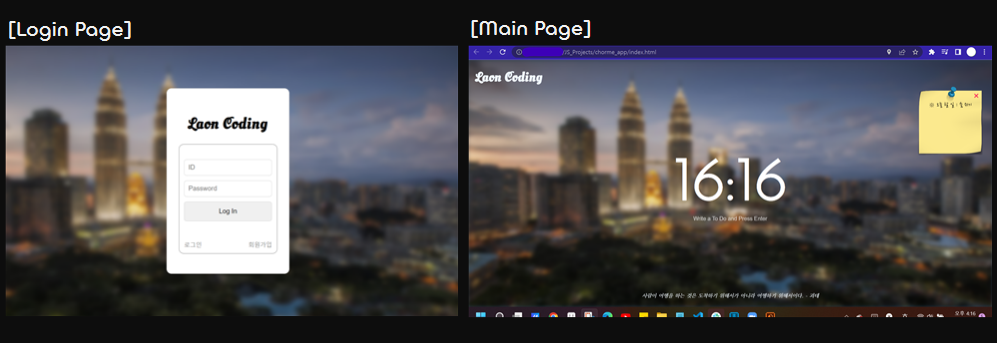

✍️ **HTML, CSS, JS로 간단한 웹페이지 제작 (TIL)**
===

</br>

### ✔️ **변수**
- 자바스크립트에서 변수를 선언할 땐 **let** 키워드를 사용한다. (동적 타입 언어)
- 초기화 후 값을 변경할 수 없는 상수로 정의하려면 **const** 키워드를 사용한다.
- 기존에는 변수를 선언할 때 var 키워드를 사용했지만, 현재는 다음과 같은 이유로 권장하지 않는다.
  - (1) 변수의 Hoisting(호이스팅)
  - (2) block 레벨이 아닌 function 레벨 범위(scope)에서 유효
  - (3) const와 같은 개념 사용 X  

</br>

### ✔️ **null vs undefined**
- **undefined** 는 변수를 선언하고 값을 할당하지 않은 상태이다. (자료형X)
- **null**은 변수를 선언하고 '빈 값(빈 객체)'을 할당한 상태이다.
- typeof를 통해 자료형을 확인해보면 null은 'object'가, undefined는 'undefined'가 출력된다.

</br>

### ✔️ **document 객체**
- 자바스크립트를 사용하는 이유는 html과 상호작용하기 위함이다.  
(html의 element들을 자바스크립트를 통해 읽고 변경할 수 있다.)
- 웹페이지에 존재하는 HTML 요소에 접근하고자 할 때는 document 객체를 사용한다.
  - document는 DOM 트리의 최상위 객체이다.
  - 브라우저는 HTML 문서를 로드하기 전에 document 객체를 먼저 만들고, 이를 루트로 하는 DOM 트리를 만든다.
  - document 객체는 HTML 요소와 관련된 작업을 도와주는 다양한 메소드를 제공한다.
  - 개발자 도구 콘솔 창에서 console.dir(document) 해보면 document 객체의 정보를 알 수 있다.
    ```javascript
    const title = document.getElementById("title");  // 'title' id를 갖는 HTML 요소를 가져온다.
    title.innerText = "Javascript";
    console.log(title.className);
    ```  

</br>

### ✔️ **document.querySelectorAll()**
- 제공한 선택자 또는 선택자 뭉치와 일치하는 문서 내 첫 번째 element를 반환한다.
- 특정 name, class, id에 국한되지 않고, css 선택자를 사용하여 HTML 요소를 찾을 수 있다.
- querySelectorAll()는 일치하는 모든 element들의 NodeList를 반환한다.
    ```javascript
    const title = document.querySelector("#title h1");
    const title = document.querySelectorAll(".wrapper h1");
    ```  

</br>

### ✔️ **이벤트 리스너(Event Listener)**
- 자바스크립트에서 대부분의 작업은 발생한 이벤트(event)를 listen하는 것에서 시작된다.  
(여기서 이벤트란 click, hovering, input, wifi connection 등을 말한다.)
- 이벤트 리스너(핸들러)란 이벤트가 발생했을 때 그 처리를 담당하는 함수를 말한다.
- 지정된 타입의 이벤트가 특정 요소에서 발생하면, 웹 브라우저는 그 요소에 등록된 이벤트 리스너를 실행한다.  
  ```javascript
  // click 이벤트 처리
  // user가 title을 click할 경우(이벤트 발생) 자바스크립트가 handleTitleClick 메소드를 실행한다.
  function handleTitleClick() {
    console.log("title was clicked!");
  }
  
  title.addEventListener("click", handleTitleClick);
  ```
- console.dir(Object)에서 'on'이 붙은 프로퍼티는 event에 해당한다.  

</br>

### ✔️ **클래스 이름 변경**
- 자바스크립트에서 클래스 이름은 다음과 같은 방법으로 변경할 수 있다.  
  ```html
  <!--예시-->
  <h1 class = "unClicked title">Blank</h1>
  ```

</br>

- (1) **className 사용**
  - 우선 문자열을 직접 사용하기 보다는 변수에 담아서 사용하는 편이 안전하다.
      ```javascript
      const clickedClass = "clicked";
      const unClickedClass = "unClicked";
      ```
  - h1 요소의 클래스가 clickedClass으로 설정되어 있으면 unClickedClass로 바꾸고, unClickedClass이면 clickedClass로 바꾼다.
    ```javascript
    if (h1.className = clickedClass;)
      h1.className = "";
    else
      h1.className = clickedClass;
    ```  
  - 이때, 위와 같이 className을 사용할 경우, 이미 설정되어 있던 다른 클래스들을 사용할 수 없게 되는 문제가 생긴다.
  - 예를 들어, 위의 h1 요소의 클래스에 해당하는 "unClicked title"이 "clicked"로 바뀌어 더 이상 "title" 클래스를 사용할 수 없게 된다.  

</br>

- (2) **classList 사용**
  - 이러한 문제를 방지하기 위해, 다음과 같이 classList를 사용하여 클래스를 변경할 수도 있다.
  - 어떤 요소가 클래스를 여러 개 갖고 있는 경우, className보다 classList를 사용하여 특정 클래스만 변경하는 것이 더 안전하다.
    ```javascript
    if (h1.classList.contains(clickedClass))
      h1.classList.remove(clickedClass);
      h1.classList.add(unClickedClass);
    else
      h1.classList.remove(unClickedClass);
      h1.classList.add(clickedClass);  
    ```  

</br>

- (3) **classList에서 toggle의 사용**
  - 위의 예시 코드에서 toggle 메소드를 사용하면 보다 간단하게 코드를 짤 수 있다.
  - toggle 메소드는 특정 클래스의 유무를 체크해서 없으면 add, 있으면 remove를 자동으로 시켜준다.
    ```javascript
    h1.classList.toggle("clicked");
    h1.classList.toggle("unClicked");
    ```  

</br>

### ✔️ **유효성 검사**
- 사용자로부터 입력값을 받을 때, 개발자는 항상 입력값의 유효성을 고려해야 한다.
- 브라우저가 제공하는 유효성 검사 기능(ex. 글자 수 제한, 필수 입력 등)을 사용하기 위해선, input이 form 안에 들어있어야 한다.  

</br>

### ✔️ **브라우저의 기본 동작**
- input 안에 있는 버튼을 누르거나, type이 submit인 input을 클릭하면 해당 입력값들이 제출(submit)된다.
  - form 안에서 엔터를 누르고 input이 더 존재하지 않으면 자동으로 submit된다.
  - form 안에서 버튼을 눌러도 자동으로 submit된다.
- 입력값이 submit되면 자동으로 새로고침이 일어난다.  
  - 이는 브라우저가 엔터키가 눌렸을 때 웹 페이지를 새로고침하고, form을 submit하도록 프로그래밍 되어 있기 때문이다. (default)
- submit 처럼 어떤 이벤트(event)가 발생할 때, 브라우저는 이벤트 리스너에 저장된 함수를 호출하는데, 이때 첫 번째 인수로 발생한 이벤트에 관한 추가적인 정보를 전달하여 호출한다.
  ```javascript
  function onLoginSubmit(event) {
    event.preventDefault();  // 브라우저의 기본 동작을 막는다. (ex. 새로고침)
    console.log(event);
  }

  loginForm.addEventListener("submit", onLoginSubmit);  // onLoginSubmit(SubmitEvent);
  ```  
- 위와 같이 추가적인 정보를 가진 이벤트 객체가 첫 번째 인수로 전달된다.
- 여기서 이벤트 객체가 갖고 있는 preventDefault 메소드를 호출하면, 브라우저의 기본 동작(ex. 새로 고침)을 막을 수 있다.  

</br>

### ✔️ **Element 생성**
- 다음과 같이 createElement 메소드를 사용하여 HTML 요소(element)를 만들 수 있다.
  ```javascript
  const bgImage = document.createElement("img");  // img 태그를 사용한 element를 만든다.
  bgImage.src = `img/${chosenImage}`;             // src 프로퍼티를 설정한다.
  document.body.appendChild(bgImage);             // body의 child 요소로 element를 추가한다.
  ```  

</br>

### ✔️ **로컬 스토리지(localStorage) 사용**
- **웹 스토리지(Web Storage)** 는 클라이언트, 즉 브라우저 상에 데이터를 저장할 수 있는 저장소이다.
- 웹 스토리지는 **로컬 스토리지(localStorage)** 와 **세션 스토리지(sessionStorage)** 로 나뉜다.
- 세션 스토리지는 웹 페이지의 세션이 끝날 때 저장된 데이터가 지워지는 반면, 로컬 스토리지는 세션이 끝나더라도 데이터가 지워지지 않는다.
- 다시 말해, 브라우저에서 같은 웹 사이트를 여러 탭이나 창에 띄우면 여러 개의 세션 스토리지에 데이터가 서로 격리되어 저장되며, 각 탭이나 창이 닫힐 때 저장해 둔 데이터도 함께 소멸된다.
- 반면, 로컬 스토리지의 경우 여러 탭이나 창 간에 데이터가 서로 공유되며, 탭이나 창을 닫아도 데이터는 브라우저에 그대로 남아있다.
- 하지만 이러한 로컬 스토리지의 데이터 영속성(persistence)는 어디까지나 동일한 컴퓨터에서 동일한 브라우저를 사용할 때만 해당한다.
- 다른 기기나 브라우저 간에 데이터가 공유되고, 영속되어야 한다면 클라우드(Cloud) 플랫폼이나 데이터베이스(DB) 서버를 사용해야 한다.  

</br> 

- 웹 스토리지는 기본적으로 **키(key)** 와 **값(value)** 의 쌍으로 이루어진 데이터를 저장할 수 있다.  
  ```javascript
  // 해당 키(key)를 갖는 데이터(value)를 저장한다.
  localStorage.setItem("key", value);

  // 해당 키를 갖는 데이터를 읽어온다.
  localStorage.getItem("key");

  // 해당 키를 갖는 데이터를 삭제한다.
  localStorage.removeItem("key");

  // 로컬 스토리지에 저장된 모든 데이터를 삭제한다.
  localStorage.clear();

  // 로컬 스토리지에 저장된 키/값 쌍의 개수를 반환한다.
  localStorage.length;
  ```  

</br>

- 이때 주의할 점 한 가지는 웹 스토리지는 문자열 데이터'만' 저장할 수 있기 때문에, 다른 타입의 데이터를 저장하려고 할 때 문자형으로 타입 변환을 시도한다는 것이다.
- 따라서 다음과 같이 객체형 데이터를 저장하고자 할 때는 JSON 형태로 데이터를 읽고 써야 한다.  
  ```javascript
  // 로컬 스토리지에 객체를 직렬화(Serialize)하여 저장한다.
  localStorage.setItem("tom", JSON.stringify({name: "Tom", age: 20}));
  
  // 로컬 스토리지에 저장된 객체를 역직렬화(Deserialize)하여 가져온다. 
  const tom = JSON.parse(localStorage.getItem("tom"));
  console.log(tom);  // → { age: 20, name: "Tom" } or { name: "Tom", age: 20 }
  ```  

</br>

### ✔️ **forEach() 메소드**
- 배열(Array 객체)에 forEach 메소드를 사용하면 배열의 요소(element)별로 콜백(Callback) 함수를 실행할 수 있다.
- forEach 메소드는 인수로 콜백 함수를 받고, 이 콜백 함수는 순서대로 각 배열의 요소, 각 요소의 인덱스, 배열 자체를 인수로 받는다.
- forEach 메소드는 내장 함수이기 때문에 일반적인 for문보다 배열의 요소들을 처리하는 속도가 더 빠르다. 
  ```javascript
  const arr = ['A', 'B', 'C', 'D'];

  arr.forEach(function(item,index,arr2){
      console.log(item,index,arr2[arr.length - (index + 1)]);
  });
  ```
  ```
  A 0 D
  B 1 C
  C 2 B
  D 3 A
  ```  

</br>

### ✔️ **filter() 메소드**
- 배열(Array 객체)에 filter() 메소드를 사용하면 각 요소별로 콜백함수를 실행하고, 콜백함수가 true를 리턴하는 요소들을 모아 새로운 배열을 만들 수 있다.
  ```javascript
  const words = ['spray', 'limit', 'elite', 'exuberant', 'destruction', 'present'];

  const result = words.filter(word => word.length > 6);

  console.log(result);  // → [ 'exuberant', 'destruction', 'present' ]
  ```  

</br>

### ✔️ **navigator.geolocation.getCurrentPosition()**
- navigator.geolocation.getCurrentPosition() 메소드를 실행하면 브라우저를 통해 현재 위치에 관한 정보를 가져올 수 있다.   
- getCurrentPosition() 메소드의 첫 번째 인자로는 위치 값을 받아오는데 성공했을 때 실행할 콜백함수를 받는다.
- 두 번째 인자로는 위치 값을 받아오지 못했을 때 실행할 콜백함수를 받는다.
(ex. 좌표, WiFi, GPS 등등)
- 세 번째 인자로는 옵션 객체를 받는다. (Optional)
  ```javascript
  navigator.geolocation.getCurrentPosition(success, error, options)
  ```  

</br>

### ✔️ **fetch() 함수**
- 브라우저에서 제공하는 fetch() 함수를 사용하면 클라이언트 단에서 원격 API를 간편하게 호출할 수 있다.
- fetch() 함수의 첫 번째 인자는 실행할 URL, 두 번째 인자는 옵션 객체를 받고, Promise 타입의 객체를 반환한다.
- API 호출이 성공했을 경우에는 응답(response) 객체를 resolve하고, 실패했을 경우에는 예외(error) 객체를 reject한다.
  ```javascript
  fetch(url, options)
    .then((response) => { console.log("response: ", response)})
    .then((error) => {console.log("error", error)});
  ```  
- fetch() 함수는 엄밀히 말하면 브라우저의 window 객체의 메소드이기 때문에 window.fetch()로 호출하기도 한다.  
  ```javascript
  window.fetch(url);
  ```  

</br>

### ✒️ **Takeaway(느낀점)** 
- 이번에는 노마드 코더의 '바닐라 JS로 크롬 앱 만들기' 강의를 수강하며 간단한 웹 페이지를 만들어 보았다. 
- 강의를 통해 로컬 스토리지, API 사용법 등을 배울 수 있었고, 이를 활용한 시계, ToDo 리스트, 현재 날씨 등의 기능을 구현해볼 수 있었다.
- 이렇게 만든 웹 페이지 초안에 추가적인 js 코드와 css 파일을 작성하여 다음과 같이 웹 페이지를 구성해보았다.
  <p></p>  

</br>

- 이 웹 페이지를 만들어보면서 느꼈던 아쉬운 점, 앞으로 보완해야할 점은 다음과 같다.
  - ① 로그인 기능의 일부분만을 구현하였다.  
  $\quad$→ 앞으로 웹 사이트 제작 프로젝트를 진행하며 완전하게 구현해볼 예정이다!
  - ② 페이지 간의 이동을 구현하지 않았다.  
  $\quad$→ 리액트를 배우면서 라우팅(Routing)에 대해 공부할 예정이다!
  - ③ 데이터를 클라이언트에만 저장한다.  
  $\quad$→ 앞으로 서버와 데이터 베이스(DB)에 대해 추가적으로 공부해봐야 할 것 같다!
  - ④ 웹 페이지의 구성이 보기 좋지 않다.   
  $\quad$→ 웹 페이지 레이아웃과 UI/UX 디자인에 대해 더 공부를 해야할 것 같다!  
  - ⑤ 날씨 기능을 구현하는 코드에서 API 키가 노출된다.  
  $\quad$→API 암호화에 대해 찾아봐야 할 것 같다!  

</br>

- 조금씩 이러한 부족한 부분들을 채워나가면서, 나날이 성장하는 개발자가 될 수 있도록 노력하자..!💪  

</br>

> 참조 )  
> 1. 노마드 코더 - '바닐라 JS로 크롬 앱 만들기' (https://nomadcoders.co/javascript-for-beginners)
