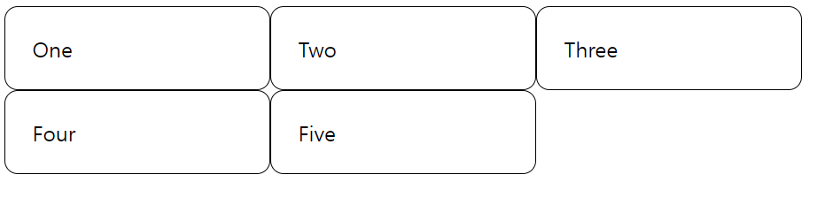
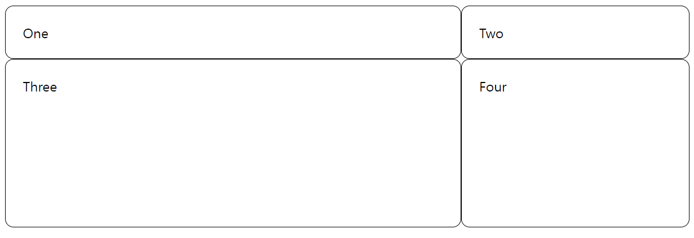
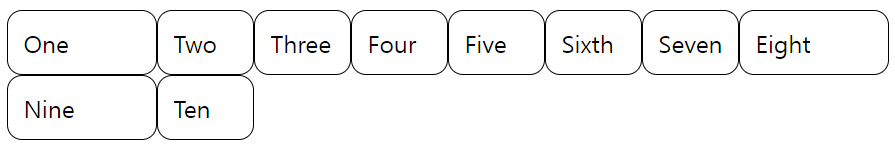
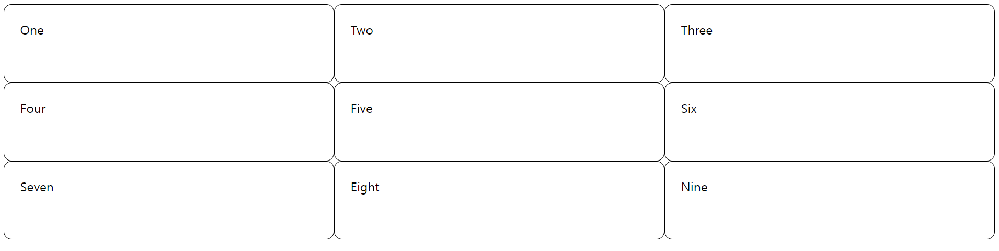
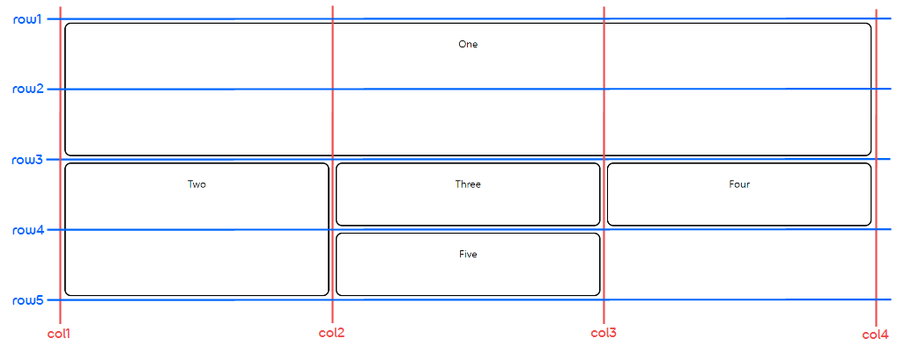
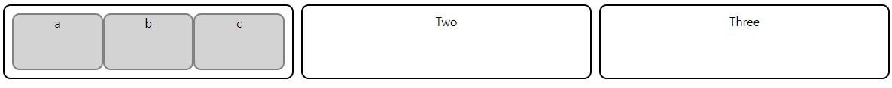

✍️ **계산기 레이아웃**
===

</br>

### ✔️ **그리드 레이아웃(Grid layout)**  

</br>

#### 1) **그리드 컨테이너, 그리드 트랙**
- **그리드(Grid)** 는 수평선(행)과 수직선(열)이 교차해서 이루어진 집합체이다.
- 각 요소는 이러한 열과 행으로 된 라인을 따라 생성된 그리드에 배치할 수 있다.
- **그리드 컨테이너(Grid container)** 는 요소에 display: grid 또는 display: inline-grid를 선언하여 만든다.
- 이렇게 하면 해당 요소 바로 밑에 있는 모든 자식 요소는 **그리드 아이템(Grid item)** 이 된다.
- 그리드의 행과 열은 **grid-templete-rows** 및 **grid-templete-columns** 속성으로 정의한다.
    - 이렇게 하면 **그리드 트랙(Grid track)** (각 라인 사이의 공간 → 행, 열)도 함께 정의된다.  
        ```css
        .wrapper {
            display: grid;
            grid-template-columns: 200px 200px 200px;
        }

        [class*="cell"] {
            box-sizing: border-box;
            border: 1px solid black;
            border-radius: 10px;
            padding: 20px;
        }
        ```  
        ```html
        <div class="wrapper">
            <div class="cell-a">One</div>
            <div class="cell-b">Two</div>
            <div class="cell-c">Three</div>
            <div class="cell-d">Four</div>
            <div class="cell-d">Five</div>
        </div>
        ```

        <p></p>   

</br>  

#### 2) **fr 단위**
- fr 단위는 그리드 컨테이너에 남아 있는 사용 가능한 공간의 일정 비율을 나타낸다.
- grid-templete-columns(, rows) 속성에 지정된 fr 단위의 합을 기반으로 비율을 지정한다고 볼 수 있다.  
    ```css
    .wrapper {
        display: grid;
        grid-template-columns: 2fr 1fr;
        grid-template-rows: 1fr 200px;  /* 200px 만큼의 사용 공간 제외 후 1fr 적용 */
    }
    ...
    ```  
    ```html
    <div class="wrapper">
        <div class="cell-a">One</div>
        <div class="cell-b">Two</div>
        <div class="cell-c">Three</div>
        <div class="cell-d">Four</div>
    </div>
    ```  
    <p></p>  

</br>  

#### 3) **repeat() 표기법으로 트랙 나열**
- 많은 트랙을 포함하는 그리드는 repeat 표기법을 사용하여 트랙의 전체 또는 일부분을 반복해서 나열해줄 수 있다.  
- repeat 함수의 두 번째 인자에 "1fr 2fr"과 같이 트랙의 목록을 나열해서 전달하면 트랙의 반복 패턴을 사용할 수 있다.
    ```css
    .wrapper {
        display: grid;
        /* 100px 트랙 생성 → 1fr 크기 트랙 6번 반복 생성 → 마지막에 다시 100px 트랙 생성 */
        grid-template-columns: 100px repeat(6, 1fr) 100px;
    }
    ...
    ```
    ```html
    <div class="wrapper">
        <div class="cell-a">One</div>
        <div class="cell-b">Two</div>
        ...
        <div class="cell-j">Ten</div>
    </div>
    ```  
    <p></p>  

</br>

#### 4) **잠재적 그리드와 명시적 그리드**
- grid-template-columns(, rows) 프로퍼티로 직접 정의한 행과 열로 이루어진 그리드를 **명시적 그리드** 라고 한다.
- 반면, 콘텐츠의 크기에 맞게 알아서 정의된 행과 열은 **잠재적 그리드** 안에서 생성된다.
- 잠재적 그리드를 통해 생성된 트랙은 크기가 자동으로 정해지고, 트랙 내부의 내용물에 따라 크기가 조정된다.  
- 잠재적 그리드에서 생성된 트랙의 크기는 **grid-auto-columns(, rows)** 프로퍼티를 사용해 지정할 수 있다.  

</br>

#### 5) **트랙 크기 조정과 minmax()**
- minmax() 함수를 사용하면 트랙의 최소, 최대 크기를 지정할 수 있다.  
    ```css
    .wrapper {
        display: grid;
        grid-template-columns: repeat(3, 1fr);
        grid-auto-rows: minmax(100px, auto);  /* 최소 : 100px, 최대 : 자동 */
    }
    ```
    ```html
    <div class="wrapper">
        <div class="cell-a">One</div>
        <div class="cell-b">Two</div>
        ...
        <div class="cell-i">Nine</div>
    </div>
    ```  
    <p></p>  

</br>

#### 6) **그리드 라인**
- 그리드를 정의할 땐 라인(line)이 아닌 그리드 트랙을 정의한다.
- 그러면 그리드는 아이템을 배치할 때 사용할 수 있게 번호가 매겨진 라인을 자동으로 제공한다.
    ```css
    .wrapper {
    display: grid;
    grid-template-columns: repeat(3, 1fr);
    grid-auto-rows: 100px;
    row-gap: 10px;
    column-gap: 10px;
    }

    [class*="box"] {
        border: 2px solid black;
        border-radius: 10px;
        text-align: center;
        padding-top: 20px;
    }
    .box1 {
    grid-column-start: 1;
    grid-column-end: 4;
    grid-row-start: 1;
    grid-row-end: 3;
    }

    .box2 {
    grid-column-start: 1;
    grid-row-start: 3;
    grid-row-end: 5;
    }
    ```
    ```html
    <div class="wrapper">
        <div class="box1">One</div>
        <div class="box2">Two</div>
        <div class="box3">Three</div>
        <div class="box4">Four</div>
        <div class="box5">Five</div>
    </div>
    ```  
    <p></p>  

</br>

#### 7) **그리드 셀, 그리드 영역**
- 그리드 셀(Grid cell)은 그리드 내부에 있는 가장 작은 구성원이다. (개념상 테이블의 셀과 비슷하다.)
- 그리드 영역은 그리드 라인(Grid line)으로 둘러싸인 사각형 영역으로, 그리드 셀의 집합이다.

</br>

#### 8) **경계 여백**
- 위의 예시 코드처럼 그리드 셀 사이의 경계 여백 혹은 간격은 **column-gap** 또는 **row-gap** 속성으로 설정한다.  

</br>

#### 9) **중첩 그리드**
- 그리드 아이템은 자기 자신이 그리드 컨테이너가 될 수 있다.
- 이때, 중첩된 그리드는 상위 부모 요소의 그리드와 아무런 관계도 갖지 않는다.  
    ```css
    .wrapper {
        display: grid;
        grid-template-columns: repeat(3, 1fr);
        grid-auto-rows: 100px;
        row-gap: 10px;
        column-gap: 10px;
    }
    
    .box1 {
        display: grid;
        grid-template-columns: repeat(3, 1fr);
    }

    .nested {
        border: 2px solid grey;
        border-radius: 10px;
    }

    [class*="box"] {
        border: 2px solid black;
        border-radius: 10px;
        text-align: center;
        padding: 10px;
    }
    ```
    ```html
    <div class="wrapper">
        <div class="box box1">
            <div class="nested">a</div>
            <div class="nested">b</div>
            <div class="nested">c</div>
        </div>
        <div class="box box2">Two</div>
        <div class="box box3">Three</div>
    </div>
    ```  
    <p></p> 

</br>

### ✔️ **계산기 레이아웃(Grid layout)**  
- 계산기를 웹페이지의 정중앙에 위치시키기 위해 body 요소를 **플렉스 컨테이너(Flex container)** 로 만들고, 다음 속성을 적용한다.  
    ```css
    body {
        display: flex;
        justify-content: center;    /* 메인(수평)축 방향 정렬 */
        align-items: center;        /* 수직축 방향 정렬 */
        ...
    }
    ```  
- 계산기 안의 버튼들은 격자 형태로 위치하고 있기 때문에, 그리드 레이아웃으로 구성한다.  
    ```css
    .calculator form {
        display: grid;
        grid-template-columns: repeat(4, 65px);
        grid-auto-rows : 65px;
        grid-gap: 5px;
    }
    ```
- 여러 개의 셀을 차지하는 아이템은 다음 속성을 적용하여 영역을 별도로 지정해준다.
    ```css
    .calculator form input[type = "text"] {
        ...
        grid-column: 1 / 5;       /* 1번 ~ 5번 column 라인 사이의 영역(4개의 셀) 사용 */
    }

    .calculator form .clear {
        grid-column: span 3;      /* 기존 위치에서 3개의 셀 사용 */
    }

    .calculator form .result {
        grid-column: 3 / span 2;  /* 3번 column 라인 뒤에 있는 2개의 셀 사용 */
    }
    ```  
- 수식 계산은 숫자와 연산자 모두 문자열로 입력받은 다음, eval() 함수를 사용하여 구현한다.  
(eval 함수는 성능, 보안, 디버깅 측면에서 문제가 될 수 있으므로 사용을 지양하자..!)

<br>

### ✒️ **Takeaway(느낀점)** 
- 격자 형태의 레이아웃을 구성할 땐 그리드 레이아웃을 사용해야 한다.
- 콘텐츠에 수평, 수직 정렬이 필요할 경우, flexbox를 사용하면 간단하게 구현할 수 있다.  

</br>

> 참조 )  
> 1. 수코딩 - [HTML+CSS+JS] 계산기(calculator) 만들기(with grid) / 웹 코딩 / HTML 코딩  
(https://www.youtube.com/watch?v=rWFAR1mql8Q)
> 2. mdn web docs_ - Basic concepts of grid layout  
(https://developer.mozilla.org/ko/docs/Web/CSS/CSS_Grid_Layout)
> 3. 1분 코딩 - 이번에야말로 CSS Flex를 익혀보자  
(https://studiomeal.com/archives/197) 


