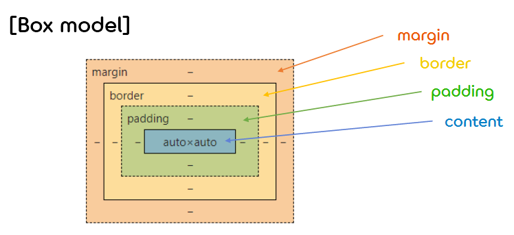

1.**CSS Basic**
===  

## < *Contents* >
- [1. About CSS](#%EF%B8%8F-1-about-css)
- [2. CSS 기본 속성](#%EF%B8%8F-2-css-기본-속성)
- [3. CSS 박스 모델(Box model)](#%EF%B8%8F-3-css-박스-모델box-model)  
- [4. CSS 선택자(Selector)](#%EF%B8%8F-4-css-선택자selector)  
- [5. @규칙(at-rule)](#%EF%B8%8F-5-규칙atrule)  
- [6. Other features](#%EF%B8%8F-6-other-features) 

---

## ✔️ 1. **About CSS**

### 1) **CSS란?**
- CSS는 Cascading Style Sheet의 약자로, HTML, XHTML, XML 같은 문서의 스타일을 꾸밀 때 사용하는 스타일 시트 언어이다.
- CSS를 통해 HTML 요소들의 색상, 크기, 위치 및 배치 등을 변경할 수 있다.
- CSS를 사용하면 문서의 내용(content)과 표현(representation)을 분리할 수 있게 되어, 이후 스타일의 변경 및 유지 보수가 용이해진다.  

</br>

### 2) **CSS 문법**
- CSS의 문법은 **선택자(Selector)** 와 **선언부(Declaratives)** 로 구성된다.
    ```css
    /* 선택자 { 선언부 } */
    a { background-color: blue; font-size: 16px; }
    ```
- 선택자는 CSS를 적용하고자 하는 HTML 요소(element)를 가리킨다.
- 선언부는 하나 이상의 선언들을 세미콜론(;)으로 구분하여 포함할 수 있으며, 중괄호({})를 사용하여 둘러싼다.
- 각 선언은 CSS 속성명(property)와 속성값(value)을 가지며, 콜론(:)으로 연결된다.  

</br>

### 3) **CSS 적용 방법**
- (1) **인라인 스타일(Inline style)**
    - HTML 요소 내부에 style 속성을 적용하는 방법이다.
    - 해당 요소에서만 스타일을 적용할 수 있다.
        ```html
        <body>
            <h1 style="color: blue; text-decoration: underline;">inline style</h1>
        </body>
        ```  
- (2) **내부 스타일 시트(Internal style sheet)**
    - HTML 문서 내의 head 태그에 style을 사용하여 CSS 스타일을 적용하는 방법이다.
    - 해당 HTML 문서에만 스타일을 적용할 수 있다.
        ```html
        <head>
            <style>
                h1 { color: blue; text-decoration: underline; }
            </style>
        </head>  
        ```
- (3) **외부 스타일 시트(External style sheet)**
    - 웹 사이트 전체의 스타일을 하나의 CSS 파일을 통해 변경하는 방법이다.
    - 웹 페이지의 head 태그에 link 태그를 사용하여 외부 스타일 시트를 포함해야만 스타일이 적용된다.
        ```css
        /* external.css */
        h1 { color: blue; text-decoration: underline; }
        ```
        ```html
        <head>
            <link rel="stylesheet" href="./external.css">
        </head>
        ```  
- ※ 스타일 적용의 우선 순위는 다음과 같다.
    - (1) 인라인 스타일
    - (2) 내부/외부 스타일 시트
    - (3) 웹 브라우저 기본 스타일  
    
</br>

## ✔️ 2. **CSS 기본 속성**

### 1) **CSS 색**
- CSS에서 색을 표현하는 방법은 대표적으로 색상 이름, RGB 색상값, 16진수 색상값 3가지가 있다.
- 이외에도 RGBA, HSL, HSLA 색생값으로 색을 표현하는 방법도 존재한다.
    ```html
    <style>
        .red { color: red; }               /* 색상 이름 */
        .blue { color: rgb(0, 0, 255); }   /* RGB 색상값 */
        .green { color: #008000; }         /* 16진수 색상값 */
    </style>
    ```  

</br>

### 2) **CSS 배경**
- CSS에서 사용할 수 있는 기본적인 background 속성은 다음과 같다.
    <table border="1">
        <tr>
            <th>속성 이름</th>
            <th colspan="2">설명</th>
        </tr>
        <tr>
            <td align="center">background-color</td>
            <td colspan="2">HTML 요소의 배경색을 설정한다.</td>
        </tr>
        <tr>
            <td align="center">background-image</td>
            <td colspan="2">HTML 요소의 배경 이미지를 설정한다.</td>
        </tr>
        <tr>
            <td align="center">background-repeat</td>
            <td colspan="2">배경 이미지를 수평이나 수직 방향으로만 반복되도록 설정한다.<br/>(속성값 : repeat-x, repeat-y, no-repeat)</td>
        </tr>
        <tr>
            <td align="center">background-position</td>
            <td colspan="2">반복되지 않는 배경의 상대 위치를 설정한다.</br>
            (속성값 : top, bottom, right, left, center 조합, %, px 등)</td>
        </tr>
        <tr>
            <td align="center">background-attachment</td>
            <td colspan="2">위치가 설정된 배경 이미지를 해당 위치에 고정시킨다.</br>
            (속성값 : scroll, fixed, local)</td>
        </tr>
    </table>  

</br>

### 3) **CSS 텍스트**
- CSS에서 사용할 수 있는 기본적인 text 속성은 다음과 같다.
    <table border="1">
        <tr>
            <th>속성 이름</th>
            <th colspan="2">설명</th>
        </tr>
        <tr>
            <td align="center">color</td>
            <td colspan="2">텍스트의 색상을 설정한다.</td>
        </tr>
        <tr>
            <td align="center">letter-spacing</td>
            <td colspan="2">텍스트 내의 글자 사이 간격을 설정한다.</td>
        </tr>
        <tr>
            <td align="center">word-spacing</td>
            <td colspan="2">텍스트 내의 단어 사이 간격을 설정한다.</td>
        </tr>
        <tr>
            <td align="center">text-indent</td>
            <td colspan="2">텍스트 단락의 첫 줄에 들여쓰기를 할지 안 할지를 설정한다.</td>
        </tr>
        <tr>
            <td align="center">text-align</td>
            <td colspan="2">텍스트의 수평 방향 정렬을 설정한다.<br/>
            (속성값 : left, right, center)</td>
        </tr>
        <tr>
            <td align="center">text-decoration</td>
            <td colspan="2">텍스트에 여러가지 효과를 설정하거나 제거하는데 사용한다.<br/>
            (속성값 : overline, line-through, underline, none)</td>
        </tr>
        <tr>
            <td align="center">text-transform</td>
            <td colspan="2">텍스트에 포함된 영문자에 대한 대소문자를 설정한다.<br/>
            (속성값 : uppercase, lowercase, capitalize)</td>
        </tr>
        <tr>
            <td align="center">line-height</td>
            <td colspan="2">텍스트의 줄 간격을 설정한다.</td>
        </tr>
        <tr>
            <td align="center">text-shadow</td>
            <td colspan="2">텍스트에 간단한 그림자 효과를 설정한다.</td>
        </tr>
    </table>  

</br>

### 4) **CSS 폰트**
- CSS에서 사용할 수 있는 기본적인 font 속성은 다음과 같다.
    <table border="1">
        <tr>
            <th>속성 이름</th>
            <th colspan="2">설명</th>
        </tr>
        <tr>
            <td align="center">font-family</td>
            <td colspan="2">하나 또는 여러 개의 폰트를 설정한다.</td>
        </tr>
        <tr>
            <td align="center">font-style</td>
            <td colspan="2">주로 텍스트를 이탤릭체로 작성하기 위해 사용한다.<br/>
            (속성값 : normal, italic, oblique)</td>
        </tr>
        <tr>
            <td align="center">font-weight</td>
            <td colspan="2">텍스트의 두께를 설정한다.<br/>
            (속성값 : lighter, normal, bold, bolder, 숫자)</td>
        </tr>
        <tr>
            <td align="center">font-size</td>
            <td colspan="2">텍스트의 크기를 설정한다.<br/>
            (속성값 : %, em, px)</td>
        </tr>
    </table>  

</br>

### 5) **이외의 CSS 속성**
- CSS 리스트 : list-style-type, list-style-image, list-style-position
- CSS 테이블 : border, border-collapse, border-spacing, caption-side, empty-cells, table-layout  

</br>

## ✔️ 3. **CSS 박스 모델(Box model)**

### 1) **CSS 크기**
- CSS에서 사용할 수 있는 기본적인 크기 속성은 다음과 같다.
    <table border="1">
        <tr>
            <th>속성 이름</th>
            <th colspan="2">설명</th>
        </tr>
        <tr>
            <td align="center">height, width</td>
            <td colspan="2">HTML 요소의 높이와 너비를 각각 설정한다.</td>
        </tr>
        <tr>
            <td align="center">max-width</td>
            <td colspan="2">HTML 요소가 가질 수 있는 최대 너비를 설정한다.<br/>
            (줄어드는 웹 브라우저의 크기에 맞춰 해당 HTML 요소의 너비도 자동으로 줄어든다.)</td>
        </tr>
        <tr>
            <td align="center">min-width</td>
            <td colspan="2">HTML 요소가 가질 수 있는 최소 너비를 설정한다.<br/>
            (최소 너비 이하로 HTML 요소의 너비가 줄어들지 않고 수평 스크롤바가 생성된다.)</td>
        </tr>
        <tr>
            <td align="center">max-height</td>
            <td colspan="2">HTML 요소가 가질 수 있는 최대 높이를 설정한다.<br/>
            (HTML 요소의 높이가 설정된 최대 높이보다 커질 경우 수직 스크롤바가 생성된다.)</td>
        </tr>
        <tr>
            <td align="center">min-height</td>
            <td colspan="2">HTML 요소가 가질 수 있는 최소 높이를 설정한다.</td>
        </tr>
    </table>  

</br>

### 2) **박스 모델(Box model)**  
- 모든 HTML 요소는 박스(box) 모양으로 구성되는데, 이를 **박스 모델(box model)** 이라고 한다.
- 박스 모델은 HTML 요소를 **패딩(padding)** , **테두리(border)** , **마진(margin)** , **내용(content)** 으로 구분한다.  
    - (1) 내용(content) : 텍스트나 이미지가 들어있는 박스의 실질적인 내용 부분이다.
    - (2) 패딩(padding) : 내용과 테두리 사이의 간격으로, 눈에 보이지 않는다.
    - (3) 테두리(border) : 내용과 패딩 주변을 감싸는 테두리이다.
    - (4) 마진(margin) : 테두리와 이웃하는 요소 사이의 간격으로, 눈에 보이지 않는다.  
        <p></p>   
- HTML의 height, width 속성으로 설정된 높이와 너비는 내용(content) 부분만을 대상으로 한다.
- HTML 요소의 전체 너비(width)와 높이(height)를 계산하는 공식은 다음과 같다.
    - (1) 전체 너비 : width + (right + left)(padding + border + margin)
    - (2) 전체 높이 : height + (top + bottom)(padding + border + margin)  

</br>

### 3) **CSS 위치 속성**
- (1) **display 속성**
    - display 속성은 HTML 요소를 웹 브라우저에 어떻게 보여줄지 레이아웃을 결정한다.
    - display 속성의 기본값으로는 크게 inline, block 2가지가 있다.  
    (HTML Basic에서 설명)
    - display 속성값을 변경할 수는 있지만, 실제로 해당 요소가 완전히 다른 타입의 요소로 바뀌지는 않는다.  
    (display 속성값을 inline에서 block으로 변경하더라도, 변경된 요소 내부에 다른 요소를 포함할 수 없다.)
    - **인라인-블록(inline-block)**
        - display 속성값이 인라인-블록으로 설정된 요소 자체는 인라인(inline) 요소처럼 동작한다.
        - 하지만 해당 요소 내부에서는 블록(block) 요소처럼 동작한다.
        - 인라인-블록 요소는 인라인 요소와 비슷하지만, 블록 요소처럼 너비와 높이를 설정할 수 있다.
        - 또한 블록 요소처럼 마진(margin)을 이용하여 여백을 지정할 수도 있다.
        - 이러한 특성 때문에 주로 웹 사이트의 메뉴나 내비게이션 바를 만들 때 자주 사용한다.  

</br> 

- (2) **visibility 속성**
    - visibility 속성은 HTML 요소를 웹 페이지에 보여줄지 아닐지를 결정한다.
    - 이 속성에 의해 HTML 요소가 웹 페이지에 보여지지 않더라도 레이아웃에는 여전히 존재하게 된다.  
    - visibility 속성에 사용할 수 있는 기본 속성값은 다음과 같다.
        <table border="1">
            <tr>
                <th>속성값</th>
                <th colspan="2">설명</th>
            </tr>
            <tr>
                <td align="center">visible</td>
                <td colspan="2">HTML 요소를 웹 페이지에 나타낸다.</td>
            </tr>
            <tr>
                <td align="center">hidden</td>
                <td colspan="2">HTML 요소를 웹 페이지에서 숨긴다.</td>
            </tr>
            <tr>
                <td align="center">collapse</td>
                <td colspan="2">동적 테이블에서 테두리를 한 줄만 보여준다.</td>
            </tr>
        </table>  

</br>

- (3) **position 속성**
    - position 속성은 HTML 요소의 위치를 결정하는 방식을 설정한다.
    - CSS에서 요소의 위치를 결정하는 방식은 다음과 같이 4가지 방식이 있다.
        <table border="1">
            <tr>
                <th>위치 결정 방식</th>
                <th colspan="2">설명</th>
            </tr>
            <tr>
                <td align="center">static</td>
                <td colspan="2">단순히 웹 페이지의 흐름에 따라 차례대로 요소들을 위치시키는 방식이다.<br/>top, right, bottom, left 속성값에 영향을 받지 않는다.</td>
            </tr>
            <tr>
                <td align="center">relative</td>
                <td colspan="2">해당 HTML 요소의 기본 위치를 기준으로 위치를 설정하는 방식이다.<br/>(기본 위치는 해당 요소가 정적(static) 위치 지정 방식일 때 결정되는 위치이다.)</td>
            </tr>
            <tr>
                <td align="center">fixed</td>
                <td colspan="2">뷰포트(viewport)를 기준으로 위치를 설정하는 방식이다.<br/>웹 페이지가 스크롤 되어도 fixed로 지정된 요소는 항상 같은 곳에 위치하게 된다.</td>
            </tr>
            <tr>
                <td align="center">absolute</td>
                <td colspan="2">위치가 설정된 조상(ancestor) 요소를 기준으로 위치를 설정한다.<br/>위치가 설정된 조상 요소를 가지지 않으면, body 요소를 기준으로 위치를 설정한다.<br/>(위치가 설정된 요소는 static 방식을 제외한 다른 방식으로 위치가 설정된 요소이다.)</td>
            </tr>
        </table>  

</br>

- (4) **z-index 속성**
    - z-index 속성은 HTML 요소가 서로 겹칠 때, 해당 요소들이 쌓이는 스택(stack)의 순서를 설정한다.
    - 스택의 순서는 양수, 음수 모두 설정이 가능하며, 크기가 클수록 해당 요소가 앞쪽에 위치하게 된다.  
        ```css
        .last {
            position: fixed;
            top: 60px;
            right: 0px;
            z-index: -1;
        }
        ```  

</br>

- (5) **float 속성**  
    - float 속성은 해당 HTML 요소를 주변 다른 요소들과 자연스럽게 어울리도록 만들어준다.
    - 원래는 이미지를 어떻게 띄워서 텍스트와 함께 배치할 것인지에 관한 속성이었지만, 현재는 웹 페이지의 레이아웃을 작성할 때 더 많이 사용한다.  
    (최근에는 flexbox나 grid를 사용해서 레이아웃을 작성하기도 한다.)  
    - 컨테이너 요소에 float 속성이 적용되면 그 이후에 등장하는 요소들의 정확한 위치를 설정하기가 힘들어진다.
    - 이 경우, **clear 속성**을 사용하여 이후에 등장하는 요소들이 float 속성에 영향을 받지 않게 설정해주어야 한다.  
        ```html
        <head>
            <meta charset="UTF-8">
            <title>CSS Float</title>
            <style>
                .left { width: 150px; height: 50px; float: left; }
                .right { width: 150px; height: 50px; float: right; }
                p { clear: both; }
            </style>
        </head>

        <body>
            <h1>float property</h1>
            <div>
                <div class="left">left element</div>
                <div class="right">right element</div>
            </div>
            <p>after float elements</p>

        </body>
        ```  

</br>

- (6) **overflow 속성**  
    - float 속성이 적용된 HTML 요소가 이를 감싸는 컨테이너 요소보다 커지면 해당 요소의 일부가 흘러넘치게 된다.
    - 이때 overflow 속성을 사용하여 흘러넘치는 요소들을 어떻게 표현할지를 설정할 수 있다.  
    (가로, 세로 overflow를 각각 제어하려면 overflow-x와 overflow-y 속성을 사용한다.)
        <table border="1">
            <tr>
                <th>속성값</th>
                <th colspan="2">설명</th>
            </tr>
            <tr>
                <td align="center">visible</td>
                <td colspan="2">넘치는 요소들을 컨테이너 밖으로 보여준다. (default)</td>
            </tr>
            <tr>
                <td align="center">hidden</td>
                <td colspan="2">넘치는 요소들을 컨테이너 밖으로 보여주지 않는다.</td>
            </tr>
            <tr>
                <td align="center">scroll</td>
                <td colspan="2">가로, 세로 스크롤바가 생성되어 넘치는 요소들을 스크롤 할 수 있게 된다.</td>
            </tr>
            <tr>
                <td align="center">auto</td>
                <td colspan="2">필요에 따라 가로, 세로 별도로 스크롤바가 생성된다.</td>
            </tr>
        </table>  

</br>

## ✔️ 4. **CSS 선택자(Selector)**
- CSS 선택자는 특정한 HTML 태그를 선택할 때 사용하는 기능이다.
- 선택자를 사용해 특정한 HTML 태그를 선택하면 해당 태그에 원하는 스타일 또는 기능을 적용할 수 있다.  

</br>

### 1) **전체 선택자**
- 전체 선택자는 HTML 문서 안에 있는 모든 태그를 선택할 때는 전체 선택자를 사용한다.
- 전체 선택자를 사용하면 html 태그를 포함해 head 태그, title 태그, style 태그까지 모두 선택된다.
    ```css
    * { color: red; }
    ```  

</br>

### 2) **태그 선택자**
- 태그 선택자는 HTML 페이지 내부에서 특정 종류의 태그를 모두 선택할 때 사용한다.
- 쉼표를 통해 여러 개의 선택자를 한꺼번에 선택해서 스타일 속성을 적용할 수 있다.
    ```css
    p, h1 { margin: 0; padding: 0; }
    ```  

</br>

### 3) **아이디 선택자**
- 아이디 선택자는 특정한 id 속성을 가지고 있는 태그를 선택할 때 사용한다.
- 중복된 id를 갖고 자바스크립트 작업을 하게 되면 오류가 발생하게 되므로, 하나의 웹 페이지에선 하나의 id만 사용해야 한다.  
(여러 개의 태그를 묶어 사용할 경우 클래스(class)를 사용한다.)
    ```css
    #heading { color: red; text-decoration: underline; }
    ```  
    ```html
    <h1 id="heading">Heading</h1>
    ```
</br>

### 4) **클래스 선택자**
- 클래스 선택자는 특정한 클래스 속성을 가지고 있는 태그를 선택할 때 사용한다.
- 클래스 속성은 중복해서 사용할 수 있다.
    ```css
    .item { color: white; }
    .header { background-color: black; }
    ```  
    ```html
    <h1 class="item header">Heading</h1>
    ```  

</br>

### 5) **속성 선택자**
- 속성 선택자는 특정 속성을 가지고 있는 HTML 태그를 선택하는데 사용한다.
    - (1) **기본 속성 선택자**
        <table border="1">
            <tr>
                <th>선택자 형태</th>
                <th colspan="2">설명</th>
            </tr>
            <tr>
                <td align="center">선택자[속성]</td>
                <td colspan="2">특정한 속성이 있는 태그를 선택한다.</td>
            </tr>
            <tr>
                <td align="center">선택자[속성=값][속성=값]</td>
                <td colspan="2">특정한 속성 안의 값이 특정 값과 같은 문서 객체를 선택한다.</td>
            </tr>
        </table>  

        ```css
        input[type=text] { background: red; }
        input[type=password] { background: blue; }
        ```  
        ```html
        <form>
            <input type="text" />
            <input type="password" />
        </form>
        ```  

    </br>

    - (2) **문자열 속성 선택자**
        <table border="1">
            <tr>
                <th>선택자 형태</th>
                <th colspan="2">설명</th>
            </tr>
            <tr>
                <td align="center">선택자[속성~=값]</td>
                <td colspan="2">속성 안의 값이 특정 값을 단어로 포함하는 태그를 선택한다.</td>
            </tr>
            <tr>
                <td align="center">선택자[속성|=값]</td>
                <td colspan="2">속성 안의 값이 특정 값을 단어로 포함하는 태그를 선택한다.</td>
            </tr>
            <tr>
                <td align="center">선택자[속성^=값]</td>
                <td colspan="2">속성 안의 값이 특정 값으로 시작하는 태그를 선택한다.</td>
            </tr>
            <tr>
                <td align="center">선택자[속성$=값]</td>
                <td colspan="2">속성 안의 값이 특정 값으로 끝나는 태그를 선택한다.</td>
            </tr>
            <tr>
                <td align="center">선택자[속성*=값]</td>
                <td colspan="2">속성 안의 값이 특정 값을 포함하는 태그를 선택한다.</td>
            </tr>
        </table>  

        ```css
        img[src$=png] { border: 1px solid grey; }
        ```  
        ```html
        
        
        ```  

</br>

### 6) **후손 선택자 / 자손 선택자**  
- 어떤 태그 바로 한 단계 아래에 위치한 태그를 자손이라고 하고, 아래의 모든 단계에 위치한 태그를 후손이라고 한다.
- 후손 선택자는 특정한 태그 아래에 있는 후손을 선택할 때 사용한다.
    ```css
    #header h1 { color: red; }  /* id가 header인 태그의 후손 h1 태그에 스타일을 적용한다. */
    ```  
- 자손 선택자는 특정 태그 아래에 있는 자손을 선택할 때 사용한다.
    ```css
    #header > h1 { color: red; }  /* id가 header인 태그의 자손 h1 태그에 스타일을 적용한다. */
    ```  

</br>

### 7) **동위 선택자**
- 동위 선택자는 동위 관계(같은 부모(parent) 요소를 갖는 관계)에서 뒤에 위치한 태그를 선택할 때 사용한다.  
    <table border="1">
        <tr>
            <th>선택자 형태</th>
            <th colspan="2">설명</th>
        </tr>
        <tr>
            <td align="center">선택자A + 선택자B</td>
            <td colspan="2">선택자A 바로 뒤에 위치하는 선택자B를 선택한다.</td>
        </tr>
        <tr>
            <td align="center">선택자A ~ 선택자B</td>
            <td colspan="2">선택자A 뒤에 위치하는 선택자B를 선택한다.</td>
        </tr>
    </table>
    
    ```html
    <head>
        <style>
            h1 + h2 { color: red; }              /* h1 태그 바로 뒤에 위치하는 h2 태그 하나의 스타일을 바꾼다. */
            h1 ~ h2 { background-color: blue; }  /* h1 태그 뒤에 위치하는 모든 h2 태그의 스타일을 바꾼다. */ 
        </style>
    </head>
    <body>
        <h1>sibling 1</h1>
        <h2>sibling 2</h2>
        <h2>sibling 3</h2>
        <h2>sibling 4</h2>
    </body>
    ```  

</br>

### 8) **반응 선택자**
- 반응 선택자는 사용자의 반응으로 생성되는 특정한 상태를 선택할 때 사용한다.
    <table border="1">
        <tr>
            <th>선택자 형태</th>
            <th colspan="2">설명</th>
        </tr>
        <tr>
            <td align="center">:active</td>
            <td colspan="2">사용자가 마우스로 클릭한 태그를 선택한다.</td>
        </tr>
        <tr>
            <td align="center">:hover</td>
            <td colspan="2">사용자가 마우스를 올린 태그를 선택한다.</td>
        </tr>
    </table>

    ```css
    h1:hover { color: red; }
    h1:active { color: blue; }
    ```  

</br>

### 9) **상태 선택자**
- 상태 선택자는 입력 양식의 상태를 선택할 때 사용한다.
    <table border="1">
        <tr>
            <th>선택자 형태</th>
            <th colspan="2">설명</th>
        </tr>
        <tr>
            <td align="center">:checked</td>
            <td colspan="2">체크 상태의 input 태그를 선택한다.</td>
        </tr>
        <tr>
            <td align="center">:focus</td>
            <td colspan="2">초점이 맞추어진 input 태그를 선택한다.</td>
        </tr>
        <tr>
            <td align="center">:enabled</td>
            <td colspan="2">사용 가능한 input 태그를 선택한다.</td>
        </tr>
        <tr>
            <td align="center">:disabled</td>
            <td colspan="2">사용 불가능한 input 태그를 선택한다.</td>
        </tr>
    </table>  
    
    ```css
    input:focus { background-color: orange; }
    ```  

</br>

### 10) **구조 선택자**
- 구조 선택자는 CSS3부터 지원하는 선택자로, 일반 구조 선택자와 형태 구조 선택자 2가지 종류가 있다.
    - (1) **일반 구조 선택자** : 특정 위치에 있는 태그를 선택한다.
        <table border="1">
            <tr>
                <th>선택자 형태</th>
                <th colspan="2">설명</th>
            </tr>
            <tr>
                <td align="center">:first-child</td>
                <td colspan="2">형제 관계 중에서 첫 번째에 위치하는 태그를 선택한다.</td>
            </tr>
            <tr>
                <td align="center">:last-child</td>
                <td colspan="2">형제 관계 중에서 마지막에 위치하는 태그를 선택한다.</td>
            </tr>
            <tr>
                <td align="center">:nth-child(수열)</td>
                <td colspan="2">형제 관계 중에서 앞에서 수열 번째에 위치한 태그를 선택한다.</td>
            </tr>
            <tr>
                <td align="center">:nth-last-child(수열)</td>
                <td colspan="2">형제 관계 중에서 뒤에서 수열 번째에 위치한 태그를 선택한다.</td>
            </tr>
        </table>  
    
        ```css
        li:first-child { color: red; }
        li:last-child { color: blue; }
        li:nth-child(2n) { background-color: white; }
        li:nth-child(2n+1) { background-color: black; }
        ```  
    
    </br>

    - (2) **형태 구조 선택자** : 일반 구조 선택자와 비슷하지만 태그 형태를 구분한다.
        <table border="1">
            <tr>
                <th>선택자 형태</th>
                <th colspan="2">설명</th>
            </tr>
            <tr>
                <td align="center">:first-of-type</td>
                <td colspan="2">형제 관계 중에서 첫 번째로 등장하는 특정 태그를 선택한다.</td>
            </tr>
            <tr>
                <td align="center">:last-of-type</td>
                <td colspan="2">형제 관계 중에서 마지막으로 등장하는 특정 태그를 선택한다.</td>
            </tr>
            <tr>
                <td align="center">:nth-of-type(수열)</td>
                <td colspan="2">형제 관계 중에서 앞에서 수열 번째로 등장하는 특정 태그를 선택한다.</td>
            </tr>
            <tr>
                <td align="center">:nth-last-of-type(수열)</td>
                <td colspan="2">형제 관계 중에서 뒤에서 수열 번째로 등장하는 특정 태그를 선택한다.</td>
            </tr>
        </table>  
    
        ```css
        li:first-of-type { color: red; }
        li:last-of-type { color: blue; }
        ```  
    
</br>

### 11) 기타 선택자
- 이외에도 **문자 선택자** , **링크 선택자** , **부정 선택자(:not)** 등의 선택자가 있다.  

</br>

## ✔️ 5. **@규칙(at-rule)**

### 1) **@import 규칙**
- import 규칙은 CSS 파일에서 다른 CSS 파일을 추가하는 방법이다.
    ```html
    <head>
        <title>@import 규칙</title>
        <link rel="stylesheet" href="styleSheetA.css">
        <link rel="stylesheet" href="styleSheetB.css">
    </head>
    ```
    ```css
    /* styleSheetA.css */
    @import url("subStyleSheetA.css");
    @import "subStyleSheetB.css";
    ...
    ```  

</br>

### 2) **@font-face 규칙**
- 웹 폰트(Web font)를 생성할 때 사용하는 규칙이다.
    ```html
    <style>
        @font-face {
            font-family: "font name";  /* 생성한 폰트의 이름을 적용한다. */
            src: local("NanumGothic"), url("NanumGothic.eot"), url("NanumGothic.ttf"), url("NanumGothic.woff");  
        }

        h1 { font-family: "font name"; }  /* 생성한 폰트의 이름을 넣어준다. */
    ```  

</br>

### 3) **@media 규칙**
- 다양한 장치에서 HTML 문서가 적절한 형태를 갖추게 만들어주는 규칙이다.
    ```html
    <style>
        body { background-color: darkorange; }

        @media screen {
            body { background-color: black; color: white; }
        }

        @media print {
            body { background-color: white; color: black; }
        }
    </style>
    ```  

</br>

- @media 규칙은 **미디어 쿼리** (화면 해상도, 기기 방향 등의 조건으로 스타일을 전환할 수 있는 CSS3의 속성 중 하나)와 자주 사용된다.
- 자주 사용되는 CSS3의 매체 유형(media type)은 다음과 같다.
    <table border="1">
        <tr>
            <th>메체 유형</th>
            <th colspan="2">설명</th>
        </tr>
        <tr>
            <td align="center">all</td>
            <td colspan="2">모든 매체에 사용한다.</td>
        </tr>
        <tr>
            <td align="center">print</td>
            <td colspan="2">프린터 기기에 사용한다.</td>
        </tr>
        <tr>
            <td align="center">screen</td>
            <td colspan="2">컴퓨터나 태블릿, 스마트폰 등 스크린이 있는 매체에 사용한다.</td>
        </tr>
        <tr>
            <td align="center">speech</td>
            <td colspan="2">웹 페이지를 읽어주는 스크린 리더에 사용한다.</td>
        </tr>
    </table>  

</br>

- 자주 사용되는 CSS3 미디어 쿼리(media query) 속성은 다음과 같다.  
- 아래 속성 중에서 orientation 속성을 제외한 모든 속성 앞에 min 또는 max 접두사를 사용할 수 있다.
    <table border="1">
        <tr>
            <th>속성</th>
            <th colspan="2">설명</th>
        </tr>
        <tr>
            <td align="center">width</td>
            <td colspan="2">화면의 너비</td>
        </tr>
        <tr>
            <td align="center">height</td>
            <td colspan="2">화면의 높이</td>
        </tr>
        <tr>
            <td align="center">device-width</td>
            <td colspan="2">매체 화면의 너비</td>
        </tr>
        <tr>
            <td align="center">device-height</td>
            <td colspan="2">매체 화면의 높이</td>
        </tr>
        <tr>
            <td align="center">device-aspect-ratio</td>
            <td colspan="2">매체 화면의 비율</td>
        </tr>
        <tr>
            <td align="center">orientation</td>
            <td colspan="2">매체 화면의 방향</td>
        </tr>
        <tr>
            <td align="center">color</td>
            <td colspan="2">매체의 색상 비트 수</td>
        </tr>
        <tr>
            <td align="center">color-index</td>
            <td colspan="2">매체에서 표현 가능한 색상 개수</td>
        </tr>
        <tr>
            <td align="center">monochrome</td>
            <td colspan="2">흑백 매체에서의 픽셀당 비트 수</td>
        </tr>
        <tr>
            <td align="center">resolution</td>
            <td colspan="2">매체의 해상도</td>
        </tr>
    </table>  

    ```html
    <style>
        /* 화면 너비 0px ~ 1536px */
        @media screen and (max-width: 1536px) {
            ...
        }

        /* 화면 너비 1536px ~ 1920px */
        @media screen and (min-width: 1536px) and (max-width: 1920px) {
            ...
        }

        /* 화면 너비 1920px ~ */
        @media screen and (min-width: 1920px) {
            ...
        }

        /* 수직 방향 */
        @media screen and (orientation: portrait) {
            ...
        }

        /* 수평 방향 */
        @media screen and (orientation: landscape) {
            ...
        }
    </style>
    ```  

</br>  

## ✔️ 6. **Other features**

### 1) **벤더 프리픽스(Vender Prefix)**
- 벤더 프리픽스란 주요 웹 브라우저 공급자(익스플로러, 크롬, 파이어폭스, 사파리, 오페라 등)가 새로운 실험적인 기능을 제공할 때 이전 버전의 웹 브라우저에 그 사실을 알려주기 위해 사용하는 접두사(prefix)를 의미한다.
- CSS 권고안에 포함되지 못한 기능이나, CSS 아직 완벽하게 제정된 상태가 아닌 기능을 사용하고자 할 때 사용한다.
    <table border="1">
        <tr>
            <th>벤더 프리픽스</th>
            <th colspan="2">브라우저</th>
        </tr>
        <tr>
            <td align="center">-ms-</td>
            <td colspan="2">익스플로러</td>
        </tr>
        <tr>
            <td align="center">-webkit-</td>
            <td colspan="2">크롬, 사파리</td>
        </tr>
        <tr>
            <td align="center">-moz-</td>
            <td colspan="2">파이어폭스</td>
        </tr>
        <tr>
            <td align="center">-o-</td>
            <td colspan="2">오페라</td>
        </tr>
    </table>  

    ```html
    <style>
        .button {
            background: red;               /* gradient 속성을 지원하지 않는 모든 브라우저를 위한 코드 */
            background: -webkit-linear-gradient(red, yellow);  /* 크롬과 사파리 4.0 이상을 위한 코드 */
            background: -moz-linear-gradient(red, yellow);     /* 파이어폭스 3.6 이상을 위한 코드 */
            background: -ms-linear-gradient(red, yellow);      /* 익스플로러 10.0 이상을 위한 코드 */
            background: -o-linear-gradient(red, yellow);       /* 오페라 10.0 이상을 위한 코드 */
            background: linear-gradient(red, yellow);          /* CSS 표준 문법 코드 */
      }
    </style>
    ```  

</br>

