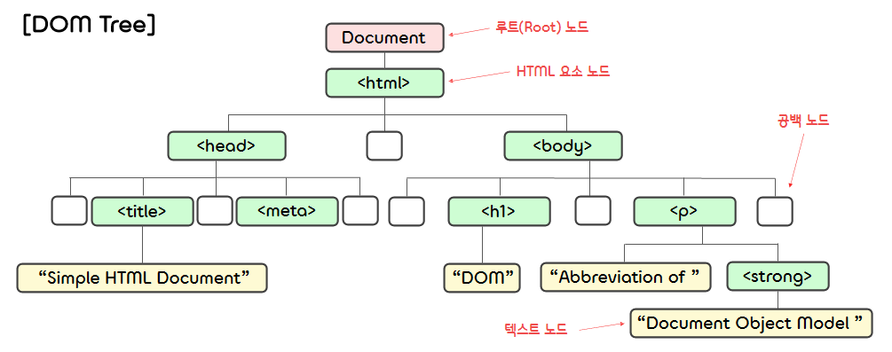

11.**Controlling Documents**
===  

## ✔️ **DOM 트리**  
- 웹 페이지의 내용은 **Document** 객체가 관리한다.  
- 웹 브라우저가 웹 페이지를 읽어 들이면 렌더링 엔진은 웹 페이지의 HTML 문서를 파싱(parsing)하고, Document 객체에서 문서 내용을 관리하는 **DOM 트리** 라고 하는 객체의 트리구조를 만든다.  
- DOM 트리를 구성하는 객체 하나를 노드(node)라고 한다.  
    - **문서 노드** : 전체 문서를 가리키는 Document 객체. document로 참조할 수 있다.
    - **HTML 요소 노드** : HTML 요소를 가리키는 객체
    - **텍스트 노드** : 텍스트를 가리키는 객체  
- 다음 HTML 문서는 아래와 같은 DOM 트리를 형성한다.  
    ```html
    <!DOCTYPE html>
    <html lang="ko">
        <head>
            <title>Simple HTML Document</title>
            <meta charset="UTF-8">
        </head>
        <body>
            <h1>DOM</h1>
            <p>Abbreviation of <strong>Document Object Model</strong>
        </body>
    </html>
    ```  
    <p></p>  

</br>

- 여기서 노드 객체의 프로퍼티는 다음과 같다.  
- 이들 중 parentNode ~ previousSibling 프로퍼티는 DOM 트리의 계층 구조를 정의한다.
    <table border="1">
        <tr>
            <th><center>parentNode</center></th>
            <th><center>이 노드의 부모 노드를 참조한다, Document 객체의 부모 노드는 null이 된다.</center></th>
        </tr>
        <tr>
            <td align="center">childNodes</td>
            <td>이 노드의 자식 노드의 참조를 저장한 유사 배열 객체(NodeList)</td>
        </tr>
        <tr>
            <td align="center">firstChild</td>
            <td>이 노드의 첫 번째 자식 노드. 자식 노드가 없을 땐 null이 된다.</td>
        </tr>
        <tr>
            <td align="center">lastChild</td>
            <td>이 노드의 마지막 자식 노드. 자식 노드가 없을 때는 null이 된다.</td>
        </tr>
        <tr>
            <td align="center">nextSibling</td>
            <td>이 노드와 같은 부모 노드를 가진 이 노드 다음의 형제 노드</td>
        </tr>
        <tr>
            <td align="center">previousSibling</td>
            <td>이 노드와 같은 부모 노드를 가진 이 노드 이전의 형제 노드</td>
        </tr>
        <tr>
            <td align="center">nodeType</td>
            <td>노드 유형을 뜻하는 숫자(1: 요소 노드, 3: 텍스트 노드, 9: Document)</td>
        </tr>
        <tr>
            <td align="center">nodeValue</td>
            <td>텍스트 노드의 텍스트 컨텐츠. 노드 요소에서는 null이 된다.</td>
        </tr>
        <tr>
            <td align="center">nodeName</td>
            <td>요소 노드는 대문자로 바뀐 요소 이름이 들어간다. 텍스트 노드는 "#text"가 들어간다.</td>
        </tr>
    </table>  

</br>

## ✔️ **노드 객체 가져오기**  
### 1) **id 속성으로 노드 가져오기**
- id 값으로 요소 객체를 가져올 때에는 **getElementById** 메소드를 사용한다.  
    ```javascript
    document.getElementById(id 값);
    // ex) document.getElementById("gnb");
    ```  

</br>

### 2) **요소의 이름으로 노드 가져오기**
- **getElementsByTagName** 메소드를 사용하면 인수로 넘긴 문자열과 같은 이름을 가진 태그 목록을 가져올 수 있다.  
- getElementsByTagName 메소드는 NodeList 객체(유사 배열 객체)를 반환한다.
- 여기서 NodeList 객체는 특정 시점의 정적인 상태를 표현하는 것이 아니라, HTML 문서의 변화에 따라 동적으로 바뀐다.  
    ```javascript
    document.getElementsByTagName(요소의 태그 이름);
    // ex) document.getElementsByTagName("div");
    ```  

</br>

### 3) **class 속성 값으로 노드 가져오기**  
- **getElementsByClassName** 메소드를 사용하면 특정 class 속성 값을 class 속성 값으로 갖는 요소 객체 목록(NodeList)을 가져올 수 있다.  
    ```javascript
    document.getElementsByClassName(class의 이름);
    // ex) document.getElementsByTagName("wrapper visible");
    ```  

</br>

### 4) **name 속성 값으로 노드 가져오기**
- **name** 속성은 그 요소 이름을 지정할 때 사용하며, 폼(form) 컨트롤 요소, iframe, img, map, object 요소 등에 지정할 수 있다.  
- **getElementsByName** 메소드를 사용하면 특정 문자열을 name 속성 값으로 갖는 요소 객체 목록(NodeList)을 가져올 수 있다.  
    ```javascript
    document.getElementByName(name 속성 값);
    // ex) document.getElementByName("name");
    ```  

</br>

### 5) **CSS 선택자로 노드 가져오기**
- **querySelectorAll** 메소드를 사용하면 인수로 넘긴 선택자와 일치하는 요소 객체가 담긴 NodeList를 가져올 수 있다.  
    ```javascript
    document.querySelectorAll("선택자");
    ```  
- **querySelector** 메소드는 지정한 선택자와 일치하는 요소 객체 중에서 문서 위치가 첫 번째인 요소 객체를 반환한다.
    ```javascript
    document.querySelector("선택자");
    // ex) document.querySelector("#wrapper > div");
    ```  

</br>

## ✔️ **속성 값 읽고 쓰기**  
- 요소 객체에는 요소의 일반적인 속성을 표현하기 위한 프로퍼티가 정의되어 있다.
- 해당 프로퍼티는 다음과 같이 가져올 수 있다.  
    ```javascript
    const naverBanner = document.getElementById("naver"); 
    console.log(naverBanner.href);  // → "https://www.naver.com/"
    ```  

</br>

- (1) 속성 값 가져오기
    ```javascript
    요소 객체.getAttribute(속성 이름);
    // ex) list[i].getAttribute("value");
    ```  

- (2) 속성 값 설정하기 
    ```javascript
    요소 객체.setAttribute(속성 이름, 속성 값);
    // ex) anchor.setAttribute("href", "https://github.com/LaonCoder");
    ```  

- (3) 속성이 있는지 확인하기
    ```javascript
    요소 객체.hasAttribute(속성 이름);
    ```  

- (4) 속성 삭제하기 
    ```javascript
    요소 객체.removeAttribute(속성 이름);
    ```  

- (5) 전체 속성 목록 가져오기 (유사 배열 객체)
    ```javascript
    요소 객체.attributes
    // ex) const list = control.attributes
    ```

</br>

## ✔️ **노드 생성/삽입 삭제**  
### 1) **노드 생성 및 삽입**
- 새로운 요소 노드를 생성할 때는 **createElement** 메소드를 사용한다.  
(이때 생성한 노드는 메모리에 생성되어 있을 뿐 문서의 DOM 트리와 아무런 관계도 없다.)
    ```javascript
    const element = document.createElement(요소 이름);
    ```  
- 생성한 노드 객체는 **appendChild** , **insertBefore** 메소드를 사용하여 DOM 트리에 삽입한다.  
    ```javascript
    요소 노드.appendChild(삽입할 노드);             // 해당 요소의 마지막 자식 노드로 삽입된다.
    요소 노드.insertBefore(삽입할 노드, 자식 노드)  // 지정한 노드의 바로 앞에 삽입된다.
    ```  
- 이미 있는 노드를 appendChild, insertBefore 메소드로 문서에 삽입하면 기존 위치에서 삭제되고 새로운 위치에 삽입된다.

</br>  

### 2) **노드 삭제**
- **removeChild** 메소드를 사용하면 노드의 자식 노드를 삭제할 수 있다.  
    ```javascript
    노드.removeChild(자식 노드);
    // ex) node.parentNode.removeChild(node);
    ```

### 3) **노드 치환**
- **replaceChild** 메소드는 인수로 받은 자식 노드를 제거하고 새로운 노드로 치환한다.
    ```javascript
    노드.replaceChild(새로운 노드, 자식 노드);
    ```

</br>

## ✔️ **CSS 제어**  
### 1) **인라인 스타일 제어**
- 요소 객체에는 **style** 프로퍼티가 정의되어 있고, 해당 프로퍼티의 값은 CSSStyleDeclaration 객체이다.  
- CSSStyleDeclaration 객체는 CSS의 스타일과 대응하는 프로퍼티를 가지고 있으며, 이 프로퍼티 값들을 바꿔 요소 스타일을 바꿀 수 있다.  
    ```javascript
    const element = document.getElementById("title");
    element.onclick = function() {
        element.style.backgroundColor = "blue";
    }
    ```  

</br>

### 2) **계산된 스타일 제어**
- 요소의 스타일은 스타일 시트 여러 개와 각 요소의 style 속성에 작성한 인라인 스타일에 의해 결정된다.  
(스타일 시트의 설정보다 style 속성에 작성된 값을 우선적으로 적용한다.)  
- 자바스크립트로 style 프로퍼티를 사용할 때, 계산된 스타일을 style 프로퍼티로 구할 수 없을 때가 생긴다.  
- 이러한 경우, 요소의 계산된 스타일은 Window 객체의 **getComputedStyle** 메소드로 가져올 수 있다.  
- 이 메소드를 통해 반환된 CSSStyleDeclaration 객체는 '살아 있는' 상태를 표현하지만, style 객체와 달리 읽기 전용이므로 주의해야 한다.  
    ```javascript
    const computedStyles = getComputedStyle(element);
    console.log(computedStyles.height)  // → 24px
    ```  

</br>

### 3) **클래스 제어로 스타일 변경**
- 요소의 인라인 스타일을 바꾸는 대신, 요소의 **class** 속성을 바꾸어 스타일을 제어하는 방법도 있다.  
- 이를 구현하려면 스타일 시트에 정의된 스타일을 요소의 class 속성으로 사용하도록 HTML 문서를 작성해야 한다.  
- 다음으로, 자바스크립트로 요소 객체의 className(class가 여러 개인 경우 ClassList 사용) 프로퍼티에 기록된 class 속성 값을 바꾼다.
- 요소의 class 속성 값이 바뀌면 그 요소에 적용되는 스타일도 바뀌게 된다.  
    ```html
    <!DOCTYPE html>
    <html lang="en">
    <head>
        <meta charset="UTF-8">
        <meta http-equiv="X-UA-Compatible" content="IE=edge">
        <meta name="viewport" content="width=device-width, initial-scale=1.0">
        <title>classList</title>
    </head>
    <body>
        <p class="note invisible" id="note1">I'm visible</p>
        <script>
            const element = document.getElementById("note1");
            // classList의 속성값은 DOMTokenList 객체이며, '살아 있는' 상태를 표현한다.
            const list = element.classList;  

            list.toggle("invisible");
            console.log(element.className);  // → note
            list.toggle("invisible");
            console.log(element.className);  // → note invisible
        </script>
    </body>
    </html>
    ```

