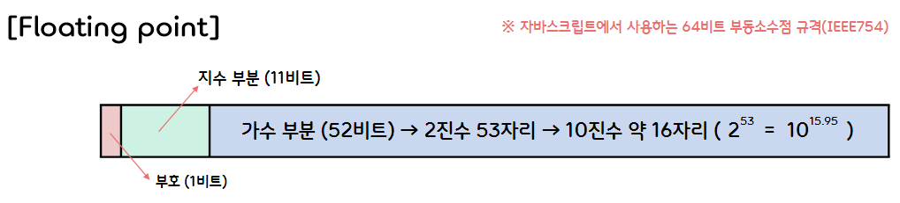

3.**Expressions and Operators**
===  

## < *Contents* >
- [1. Expressions(표현식)](#%EF%B8%8F-1-expressions표현식)
- [2. Operators(연산자)](#%EF%B8%8F-2-operators연산자)  

---

## ✔️ 1. **Expressions(표현식)**
- **표현식(Expression)** 이란 어떤 값으로 평가(evaluation)되는 것을 말한다.
- 표현식을 평가한다는 말은 표현식의 값, 변수, 함수 등의 값을 바탕으로 식을 계산하는 행위를 뜻한다.
- **연산자(Operator)** 를 사용하면 표현식을 조합하여 더욱 복잡한 표현식을 만들어낼 수 있다.  
- "x = y" 처럼 변수 값을 바꾸는 표현식은 일반적으로 **부수 효과가 있는 표현식** 이라고 한다.
    - 대입 연산자, 증가 연산자, 감소 연산자, delete 가 부수 효과가 있는 연산자에 해당한다. 

</br>

## ✔️ 2. **Operators(연산자)**  

### 1) **산술 연산자**
- **산술 연산자** 는 피연산자(Operand)가 숫자인 연산자이다.
- 피연산자가 숫자가 아닐 때는 연산자가 피연산자 타입을 숫자 타입으로 바꾸어 연산한다.
- 연산 결과로는 숫자 값이 나오지만, 피연산자가 숫자로 바꿀 수 없는 값이거나 계산할 수 없을 때는 **NaN** 이 나온다.  

</br>

- (1) **산술 이항 연산자** (주의할 점)
    - ① **정수끼리 나누어도 결과가 부동소수점이 된다.**
        ```javascript
        console.log(7 / 2);  // → 3.5
        ```
    - ② **나머지 연산자 %의 피연산자는 부동소수점이다.**  
        ```javascript
        15 % 4   // → 3
        -15 % 4  // → -3 (a % b를 계산한 결괏값은 a에서 b의 배수를 뺀 절댓값이며, 부호는 a와 같다.)
        15 % -4  // → 3
        5 % 1.5  // → 0.5
        ```  
    - ③ **+ 연산자는 피연산자 중 하나가 문자열이면 나머지 피연산자를 문자열로 만든다,**
        ```javascript
        1 + "1"  // → "11"
        ```
    - ④ **기타**
        - 계산할 수 없는 경우 NaN으로 평가한다.
        - 산술 연산자의 피연산자가 true면 1, false와 null이면 0으로 평가한다.
        - undefined면 NaN으로 평가한다.
        ```javascript
        console.log(0/0);            // → NaN
        console.log("one" * 1);      // → NaN    
        console.log(true + true);    // → NaN
        console.log(1 + null);       // → NaN
        console.log(1 + undefined);  // → NaN
        ```  

</br>

- (2) **산술 단항 연산자**
    - ++(증가 연산자), --(감소 연산자), +(아무것도 처리하지 않음), -(부호 반전)
    - 증가 연산자와 감소 연산자는 전위 표기법과 후위 표기법을 사용할 수 있다.

</br>

- (3) **산술 대입 연산자**
    - +=, -=, *=, /=, %=  

<br>

### 2) **Math 객체의 프로퍼티**
- 자바스크립트는 **Math** 객체의 프로퍼티와 메소드를 통해 기본적인 산술 연산과 복잡한 수학적 연산을 지원한다.
- 대표적인 Math 객체 프로퍼티 : Math.PI, Math.E, Math.LN10, Math.SQRT2 ...
- 대표적인 Math 객체 메소드 : Math.abs(x), Math.cos(x), Math.exp(x), Math.log(x), Math.max(x, y), Math.pow(x, p) ...  

</br>

### 3) **부동소수점과 정확도 문제**
- 산술 연산을 할 때는 유효 숫자가 있으므로 계산할 때 오차가 발생한다는 점을 항상 염두에 두어야 한다.
- 자바스크립트 숫자는 64비트 부동소수점이며, 다음과 같은 64자릿수의 2진수 부동소수점을 표현한다.
    <p></p> 
- 이 규격에서 가수 부분은 1.ddd...d라고 표현하며, ddd...d 부분이 52비트를 차지한다.
- 즉, 가수 부분의 유효한 자릿수가 2진수 53자리이므로, 10진수의 자릿수는 약 16자리가 된다.
- 이처럼 숫자를 자릿수가 정해진 부동소수점으로 표현하여 계산하면 오차가 발생하는데, 이를 **정확도 문제** 라고 한다.
    ```javascript
    console.log(Math.sqrt(100001) - Math.sqrt(100000));
    // → 0.001581134877255863 (수학적으로 정확히 계산한 값은 0.00158113487725"6878"이다.)
    ```  
- 일반적으로 값이 가까운 두 수를 뺄셈할 때 정확도 문제가 발생한다.
- 이것을 **정밀도 손실** 이라고 한다.
- 정밀도 손실을 피하기 위해선 계산 과정을 검토하여 크기가 비슷한 수의 뺄셈을 피하도록 해야한다.
- 위의 예시를 다음과 같이 계산하면 정밀도 손실을 피할 수 있다.
    ```javascript
    console.log(1 / (Math.sqrt(100001) - Math.sqrt(100000)));
    ```
- 산술 연산을 내부적으로는 2진수로 연산하기 때문에, 10진수로 딱 떨어지는 값도 계산 결과가 조금씩 어긋난다.
- 따라서 숫자를 비교할 때는 오차가 있다는 걸 항상 고려해야 한다.  
    ```javascript
    console.log(0.16 / 0.2 == 0.8);           // → false
    console.log((0.16 / 0.2 - 0.8) < 1e-10);  // → true 
    ```  

</br>  

### 4) **논리 연산자와 관계 연산자**
- **관계 연산자** 는 두 개의 피연산자를 비교한 결과를 논리값(true/false)으로 반환하는 연산자이다.
- 관계 연산자는 주로 제어 구조(if/else문, while문 등)에서 조건식을 만들 때 사용한다.  

</br>

- (1) **동일 연산자**
    - **동일(==) 연산자** 는 좌변과 우변의 피연산자가 같은지를 비교한다.
    - 내부적으로는 좌우 피연산자의 타입을 변환한 다음에 좌변과 우변이 같은지를 느슨하게 비교한다.
    - ① 좌우 피연산자의 타입이 같을 때, 값이 같으면 true, 다르면 false로 판정한다.
    - ② 좌우 피연산자의 타입이 다를 때, 두 피연산자가 같은 타입이 되도록 변환한 다음 값을 비교한다.  
        - undefined와 null은 같은 것으로 친다.
        - 한쪽이 숫자고 다른 한쪽이 문자열이면 문자열을 숫자로 변환해서 비교한다.
        - 둘 중 한쪽이 논리값이면 true는 1, false는 0으로 변환해서 비교한다.
        - 한쪽이 객체고 다른 한쪽이 숫자 또는 문자열이면 객체를 toString이나 valueOf 메소드를 사용해서 원시 타입으로 변환한 다음에 비교한다.
        - 앞의 규칙에서 벗어나면 모두 '같지 않음'으로 판정한다.
        ```javascript  
        null == undefined         // → true
        1 == "1"                  // → true
        "0xff" == 255             // → true
        true == 1                 // → true
        true == "1"               // → true
        (new String("a")) == "a"  // → true
        (new Number(2)) == 2      // → true
        [2] = 2                   // → true
        ```  

</br>

- (2) **일치 연산자**
    - **일치(===) 연산자** 는 피연산자를 평가한 후 타입을 변환하지 않은 상태의 두 값을 엄격하게 비교한다.
    - 타입과 값이 모두 같으면 같다고 판정하고, 그렇지 않으면 같지 않다고 판정한다.
    - 단, NaN만큼은 NaN을 포함한 모든 값과 같지 않다고 판정한다.
        ```javascript
        1 === 1      // → true
        1 === "1"    // → false
        NaN === NaN  // → false
        ```  

</br>

- **논리 연산자** 는 관계 연산자를 사용하여 만든 논리식과 결합하여 더욱 복잡한 논리를 정의한다.
- 논리 연산자의 종류로는 **&&(논리곱)** , **||(논리합)** , **!(부정)** 등이 있다.
- 논리곱(&&) 연산자와 논리합(||) 연산자는 **단락 평가(Short-circuit evaluation)를 한다.** 
    - 단락 평가란 첫 번째 피연산 값이 표현식을 결정하면 두 번째 피연산자를 평가하지 않는 것을 말한다.
    - 논리곱 연산자와 논리합 연산자는 논리값(true, false) 대신 마지막으로 평가한 피연산자의 값을 반환한다.
    - && 연산자는 객체의 프로퍼티를 이용할 때 객체가 null인지 아닌지 확인하고자 할 때 유용하게 사용된다.
        ```javascript
        p && p.name  // p가 false로 평가되면 p를 반환하고, 우변은 평가하지 않는다.
        ```
    - || 연산자는 여러 개의 값 후보 중에서 null 또는 undefined가 아닌 값을 선택하고자 할 때 유용하게 사용된다.  
        ```javascript
        let time = time_interval || animationSettings.time || 60;
        ```
    - 그리고 || 연산자는 함수에서 인수의 초깃값을 설정할 때 유용하게 사용할 수 있다.  
        ```javascript
        function(x) {
            // 인수 없이 함수 호출 시 x가 false(undefined)로 평가되어 10이 x에 담기게 된다.
            let x = x || 10;  // → 10 
        }
        ```  
    - 그러나 위 방법은 x에 false로 평가되는 값을 넘기면, 그 값이 아닌 초깃값(10)을 사용한다는 단점이 있다.
- 논리 연산자의 피연산자가 논리값이 아닐 경우, 필요에 따라 타입을 변환한다.
    - 0, -0, 빈 문자열(""), NaN, null, undefined → false
    - 0을 제외한 숫자, 빈 문자열을 제외한 문자열, 모든 객체, 심벌 → true   

</br>

### 5) **비트 연산자**
- **비트 연산** 이란 2진수 숫자의 자리별 값(비트 값)을 다루는 연산이다.
- **비트 연산자** 는 피연산자를 부호 있는 32비트 정수로 변환해서 처리한다.
- 비트 연산자에는 **비트 논리 연산자** 와 **비트 시프트(shift) 연산자** 가 있다.  
    - 비트 논리 연산자는 비트 값이 0이면 false, 비트 값이 1이면 true로 평가하는 연산자이다.
    - 비트 논리 연산자에는 **&(AND)** , **|(OR)** , **^(XOR)** , **~(NOT)** 이 있다.
    - 비트 시프트 연산자는 정수를 2진수 비트 단위로 오른쪽 또는 왼쪽으로 이동(shift)시키는 연산자이다.
    - 비트 시프트 연산자에는 **<<(왼쪽 시프트)**, **>>(오른쪽 시프트)**, ***>>>(부호 없는 오른쪽 시프트)** 가 있다.
- 산술 연산자와 마찬가지로 비트 연산의 대입 연산자(&=, |=, ^=, <<=, >>=, >>>=)를 사용할 수 있다.

</br>  

### 6) **기타 연산**
- 자바스크립트에는 다음과 같은 연산자와 함수를 사용할 수 있다.
    <table border="1">
        <tr>
            <th>연산자</th>
            <th colspan="2">설명</th>
        </tr>
        <tr>
            <td align="center">typeof</td>
            <td colspan="2">피연산자의 데이터 타입을 뜻하는 문자열을 반환한다.</td>
        </tr>
        <tr>
            <td align="center">?:</td>
            <td colspan="2">조건 연산자. 주어진 조건의 참과 거짓에 따라 값을 선택한다.</td>
        </tr>
        <tr>
            <td align="center">void</td>
            <td colspan="2">정의되지 않은 값을 반환한다.</td>
        </tr>
        <tr>
            <td align="center">,</td>
            <td colspan="2">왼쪽에서 오른쪽 순서대로 피연산자를 연속해서 실행한다.</td>
        </tr>
        <tr>
            <td align="center">delete</td>
            <td colspan="2">객체의 프로퍼티나 배열 요소를 제거한다.</td>
        </tr>
        <tr>
            <td align="center">new</td>
            <td colspan="2">새로운 객체를 생성한다.</td>
        </tr>
        <tr>
            <td align="center">in</td>
            <td colspan="2">객체의 프로퍼티 포함 여부를 확인한다.</td>
        </tr>
        <tr>
            <td align="center">instanceof</td>
            <td colspan="2">객체의 종류를 확인한다.</td>
        </tr>
            <td align="center">eval()</td>
            <td colspan="2">인수로 받은 문자열을 자바스크립트 코드로 실행한다.</td>
        </tr>
    </table>  

</br>

### 7) **문자열 제어**

- (1) **문자열 연결(Concatenation)**
    - **+ 연산자** 는 피연산자가 모두 문자열이면 문자열로 연결한다.
    - 피연산자 중 하나가 문자열 또는 문자열로 변환할 수 있는 객체라면 다른 피연산자의 타입을 문자열로 바꾼 다음 연결한다.
        ```javascript
        "hello" + " world!"  // → "hello world!"
        10 + " years"         // → "10 years"
        ```  

</br>

- (2) **문자열 조작 메소드**
    - 문자열을 처리하기 위한 객체로 **String** 객체가 마련되어 있다.
    - 문자열을 String 객체로 변환하려면 String 생성자를 사용한다.
        ```javascript
        let strObj = new String("What a wonderful world!");
        ```
    - 이처럼 원시 값을 객체로 변환하는 행위를 가리켜 원시 값을 객체로 **래핑(Wrapping)** 한다고 한다.
    - String 객체에는 문자열을 처리하기 위한 다양한 프로퍼티와 메소드가 마련되어 있다. 
    - 다음은 String 객체에 정의되어 있는 대표적인 메소드 예시들이다.
        <table border="1">
            <tr>
                <th>메소드</th>
                <th colspan="2">설명</th>
            </tr>
            <tr>
                <td align="center">charAt(n)</td>
                <td colspan="2">대상 문자열의 n번째 문자를 반환한다.</td>
            </tr>
            <tr>
                <td align="center">endsWith(s [, n])</td>
                <td colspan="2">대상 문자열의 n번째 문자부터 문자열 s로 끝나는지를 판별한 논리값을 반환한다.</td>
            </tr>
            <tr>
                <td align="center">includes(s [, n])</td>
                <td colspan="2">대상 문자열의 n번째 문자부터 문자열 s를 포함하는지를 판별한 논리값을 반환한다.</td>
            </tr>
            <tr>
                <td align="center">indexOf(s)</td>
                <td colspan="2">대상 문자열에서 s가 처음 나오는 위치를 반환한다.</td>
            </tr>
            <tr>
                <td align="center">lastIndexOf(s)</td>
                <td colspan="2">대상 문자열에서 s가 마지막으로 나오는 위치를 반환한다.</td>
            </tr>
            <tr>
                <td align="center">concat([s1, s2, ...])</td>
                <td colspan="2">대상 문자열과 인수의 문자열을 연결해서 반환한다.</td>
            </tr>
            <tr>
                <td align="center">replace(s1, s2)</td>
                <td colspan="2">대상 문자열에 포함된 문자열 s1을 문자열 s2로 치환한 결괏값을 반환한다.</td>
            </tr>
            <tr>
                <td align="center">repeat(n)</td>
                <td colspan="2">대상 문자열을 n개 연결한 문자열을 반환한다.</td>
            </tr>
                <td align="center">search(r)</td>
                <td colspan="2">대상 문자열에서 정규식 r이 일치한 위치의 인덱스 값을 반환한다.</td>
            </tr>
            </tr>
                <td align="center">slice(m, n)</td>
                <td colspan="2">대상 문자열의 m번째 이후 n번째 미만의 부분 문자열을 자른 문자열을 반환한다.</td>
            </tr>
            </tr>
                <td align="center">split(s [, n])</td>
                <td colspan="2">대상 문자열을 문자열 s로 분할한 문자열 배열을 반환한다.</td>
            </tr>
            </tr>
                <td align="center">substring(m, n)</td>
                <td colspan="2">대상 문자열의 m번째 이후 n번째 미만의 부분 문자열을 반환한다.</td>
            </tr>
            </tr>
                <td align="center">toLowerCase()</td>
                <td colspan="2">대상 문자열을 소문자로 변환한다.</td>
            </tr>
            </tr>
                <td align="center">toUpperCase()</td>
                <td colspan="2">대상 문자열을 대문자로 변환한다.</td>
            </tr>
            </tr>
                <td align="center">trim()</td>
                <td colspan="2">대상 문자열에서 앞뒤 공백을 제거한다..</td>
            </tr>
            </tr>
                <td align="center">valueOf()</td>
                <td colspan="2">String 객체를 문자열 값으로 변환한다.</td>
            </tr>
        </table>  
    - 위와 같은 String 객체의 프로퍼티와 메소드는 문자열에서도 사용할 수 있다.
    - 이는 문자열에서 프로퍼티를 사용하려고 하면 문자열이 자동으로 String 객체로 변환되기 때문이다.
    - 이때 변환된 객체를 **래퍼 객체(Wrapper Object)** 라고 한다.
    - 자바스크립트에서는 원시 값을 처리할 때 원시 값을 래퍼 객체로 자동으로 변환한다.
    - 래퍼 객체의 기능을 활용해 작업을 수행하고, 작업이 끝나면 래퍼 객체는 곧바로 메모리에서 삭제된다.
    - 그리고 자바스크립트의 문자열은 **불변(immutable)** 이라는 점도 기억하자.
        - replace와 toUpperCase 메소드 등은 새로운 문자열을 반환하며, 메소드를 호출한 문자열은 수정되지 않는다.  

</br>

- (3) **문자열을 배열로 읽고 쓰기**
    - 문자열을 읽을 때는 charAt 메소드 대신 대괄호 연산자를 사용할 수 있다.
        ```javascript
        let str = "love";
        console.log(str[3]);  // → "e"
        ```
    - 그러나 배열처럼 값을 대입해서 문자열을 수정할 수는 없다.
        - 문자열은 불변이기 때문이다.
        - 배열처럼 값을 대입해도 이는 무시된다.  

</br>

### 8) **명시적 타입 변환(Explicit Type Conversion)**
- **명시적 타입 변환** 이란 사용자가 
**타입 캐스트(Type case) 연산자** 등을 사용하여 강제적으로 수행하는 타입 변환을 말한다.  

</br>

- (1) **숫자를 문자열로 변환**
    - ① 숫자 + 문자열
        ```javascript
        10 + " years"  // → "10 years"
        ```  
    - ② Number 객체의 메소드를 활용하는 방법
        ```javascript
        let n = 10;
        n.toString();     // → "10"
        (20).toString();  // → "20" (숫자에서 바로 메소드를 사용하려면 소괄호로 묶는다.)

        let m = 1234.567;
        m.toFixed(2);     // → "1234.57" (소수점 아래 자릿수를 지정한 문자열로 변환한다.)
        ```  
    - ③ String 함수를 사용하는 방법
        ```javascript
        String(30);  // → "30"
        ```  

</br>

- (2) **문자열을 숫자로 변환**
    - ① 수식 안에서 묵시적으로 변환하는 방법
        ```javascript
        let n = "10";
        n - 0  // → 10
        +n     // → 10
        ```
    - ② parseInt와 parseFloat 함수를 사용하는 방법
        ```javascript
        parseInt("3.14")      // → 3
        parseInt("10 years later")  // → 10 (숫자 다음에 등장하는 문자열은 무시한다.)
        parseFloat("3.14")    // → 3.14
        ```
    - ③ Number 함수를 사용하는 방법
        ```javascript
        Number("3.14");       // → 3.14
        ```  

</br>

- (3) **논리값으로 변환**
    - 모든 값을 논리 값으로 변환하는 방법은 다음과 같이 2가지가 있다.
        ```javascript
        !!x         // 방법1
        Boolean(x)  // 방법2
        ```  

</br>