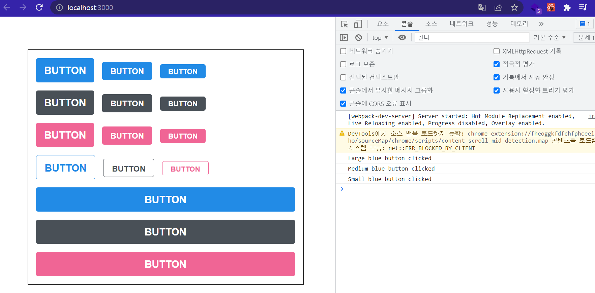

✍️ **TIL - 2022년 9월 4일**  
===

</br>

## ✔️ **Sass**  
- 대규모 프로젝트를 진행할 때, CSS 파일은 쉽게 복잡해지고, 유지 보수가 어려워진다.
- 이때, 코드의 재활용성을 높여주고, 코드의 가독성을 높여 유지 보수를 쉽게 만들어주는 **Sass(Syntactically Awesome Style Sheets)** 라는 CSS Pre-processor를 사용해 이러한 CSS의 단점을 어느 정도 극복할 수 있다.  
- Sass에서는 두 가지의 확장자 (.scss/.sass)를 지원하는데, 보통 scss 문법을 더 많이 사용한다.  

</br>

- 리액트 프로젝트에서 Sass를 사용하려면 우선 node-sass 라이브러리를 설치한다.  
    ```
    $ yarn add node-sass
    ```  

</br>

- Sass를 사용하면 다음과 같이 버튼을 스타일링 할 수 있다.  
    <p></p>  

    ```javascript
    /* App.js */

    import React from 'react';
    import './App.scss';
    import Button from './components/Button';

    function App() {
        return (
            <div className="App">
                <div className="buttons">
                    <Button size="large" onClick={() => console.log('Large blue button clicked')}>BUTTON</Button>
                    <Button onClick={() => console.log('Medium blue button clicked')}>BUTTON</Button>
                    <Button size="small" onClick={() => console.log('Small blue button clicked')}>BUTTON</Button>
                </div>
                <div className="buttons">
                    <Button size="large" color="gray">BUTTON</Button>
                    <Button color="gray">BUTTON</Button>
                    <Button size="small" color="gray">BUTTON</Button>
                </div>
                <div className="buttons">
                    <Button size="large" color="pink">BUTTON</Button>
                    <Button color="pink">BUTTON</Button>
                    <Button size="small" color="pink">BUTTON</Button>
                </div>
                <div className="buttons">
                    <Button size="large" color="blue" outline>BUTTON</Button>
                    <Button color="gray" outline>BUTTON</Button>
                    <Button size="small" color="pink" outline>BUTTON</Button>
                </div>
                <div className="buttons">
                    <Button size="large" fullWidth>
                    BUTTON
                    </Button>
                    <Button size="large" fullWidth color="gray">
                    BUTTON
                    </Button>
                    <Button size="large" fullWidth color="pink">
                    BUTTON
                    </Button>
                </div>
            </div>
        );
    }

    export default App;
    ```  
    ```scss
    /* App.scss */

    .App {
        width: 512px;
        margin: 0 auto;
        margin-top: 4rem;
        border: 1px solid black;
        padding: 1rem;
        .buttons + .buttons {
            margin-top: 1rem;
        }
    }
    ```  
    ```javascript
    /* components/Button.js */

    import React from 'react';
    import classNames from 'classnames';
    import './Button.scss';

    function Button({ children, size, color, outline, fullWidth, ...rest}) {
        return (
            // outline을 객체 안에 넣어 classNames 안에 포함시켜주면, outline 값이 true일 때만 해당 CSS 클래스가 적용된다.
            <button 
                className={classNames('Button', size, color, {outline, fullWidth})}
                {...rest}  // 지정한 props를 제외한 나머지 props를 spread하여 설정한다.
            >
                {children}
            </button>
        );
    }

    Button.defaultProps = {
        size: 'medium',
        color: 'blue'
    };

    export default Button;
    ```  

</br>

- 조건부로 CSS 클래스를 넣어주고 싶을 땐 위와 같이 **classnames** 라는 라이브러리를 사용한다.  
- classNames를 사용하면 조건부 스타일링을 할 때 함수의 인자에 문자열, 배열, 객체 등을 전달하여 손쉽게 문자열을 조합할 수 있다.  
    ```javascript
    classNames('foo', 'bar'); // => 'foo bar'
    classNames('foo', { bar: true }); // => 'foo bar'
    classNames({ 'foo-bar': false }); // => ''
    classNames({ foo: true }, { bar: true }); // => 'foo bar'
    classNames({ foo: true, bar: true }); // => 'foo bar'
    classNames(['foo', 'bar']); // => 'foo bar'
    classNames('foo', { bar: true, duck: false }, 'baz', { quux: true }); // => 'foo bar baz quux'
    ```  
- classNames를 사용하지 않고 className에 CSS 클래스 이름을 동적으로 넣어주려면 다음과 같이 작성해준다.  
    ```javascript
    className={['Button', size].join(' ')}
    className={`Button ${size}`}
    ```  

</br>

- 이어서 Button에 적용할 scss 파일은 다음과 같다.  
    ```scss
    /* components/Button.scss */

    $blue: #228be6;  // 변수 선언 및 주석 처리
    $gray: #495057;
    $pink: #f06595;

    // 믹스 인(Mix-in)
    @mixin button-color($color) {
        background: $color;

        &:hover {
            background: lighten($color, 10%);
        }
        &:active {
            background: darken($color, 10%);
        }
        &.outline {
            color: $color;
            background: none;
            border: 1px solid $color;
            &:hover {
            background: $color;
            color: white;
            }
        }
    }

    .Button {
        display: inline-flex;
        color: white;
        font-weight: bold;
        outline: none;
        border-radius: 4px;
        border: none;
        cursor: pointer;  

        // ".Button.large" 와 동일한 의미이다.
        &.large {
            line-height: 3rem;
            height: 3rem;
            padding-left: 1rem;
            padding-right: 1rem;
            font-size: 1.25rem;
        }

        &.medium {
            line-height: 2.25rem;
            height: 2.25rem;
            padding-left: 1rem;
            padding-right: 1rem;
            font-size: 1rem;
        }

        &.small {
            line-height: 1.75rem;
            height: 1.75rem;
            padding-left: 1rem;
            padding-right: 1rem;
            font-size: 0.875rem;
        }

        // 색상 관리 (Mix-in 사용)
        &.blue {
            @include button-color($blue);
        }

        &.gray {
            @include button-color($gray);
        }

        &.pink {
            @include button-color($pink);
        }

        // ".Button + .Button" 와 동일한 의미이다.
        & + & {
            margin-left: 1rem;
        }

        &.fullWidth {
            width: 100%;
            justify-content: center;
            & + & {
            margin-left: 0;
            margin-top: 1rem;
            }
        }
    }
    ```  
- 반복되는 코드는 위와 같이 Sass의 **mixin** 이라는 기능을 사용하여 쉽게 재사용할 수 있다.  
- Sass에 대한 스타일 가이드는 다음 사이트를 참고한다. (https://sass-guidelin.es/ko/)  

</br>

## ✔️ **CSS Module**  
- 리액트 프로젝트에서 컴포넌트를 스타일링 할 때 **CSS Module** 이라는 기술을 사용하면, CSS 클래스가 중첩되는 것을 완벽히 방지할 수 있다.  
- CRA로 만든 프로젝트에서 CSS Module을 사용할 때에는 CSS 파일의 확장자를 .module.css로 설정하면 된다.  
- 리액트 컴포넌트 파일에서 해당 CSS 파일을 불러올 때, CSS 파일에 선언한 클래스 이름들은 모두 고유해진다.  
- 고유 CSS 클래스 이름이 만들어지는 과정에서는 파일 경로, 파일 이름, 클래스 이름, 해쉬값 등이 사용 될 수 있다.  

</br>

- CSS Module은 다음과 같이 사용할 수 있다.  
    ```javascript
    /* App.js */

    import React, { useState } from 'react';
    import CheckBox from './components/CheckBox';

    function App() {
        const [check, setCheck] = useState(false);
        
        const onChange = e => {
            setCheck(e.target.checked);
        }

        return (
            <div>
                <CheckBox onChange={onChange} checked={check} />
                <p>
                    <b>check: </b>
                    {check ? 'true' : 'false'}
                </p>
            </div>
        );
    }

    export default App;
    ```  

</br>

- CSS 스타일링을 하기 전에 다음과 같이 react-icons 라는 라이브러리를 설치해주어야 한다.  
    ```
    $ yarn add react-icons
    ```
- 이 라이브러리를 사용하면 Font Awesome, Ionicons, Material Design Icons 등의 아이콘들을 컴포넌트 형태로 쉽게 사용할 수 있다.  
- CheckBox 컴포넌트는 다음과 같이 작성한다.  
    ```javascript
    /* components/CheckBox.js */

    import React from "react";
    import { MdCheckBox, MdCheckBoxOutlineBlank } from 'react-icons/md';
    import styles from './CheckBox.module.css';
    import classNames from 'classnames/bind';

    // CSS Module을 사용할 때에는 styles.icon과 같이 객체 내부의 값을 지정해 주어야 한다.
    // 이때, classnames의 bind 기능을 사용하면, 
    // CSS 클래스 이름을 지정해 줄 때 cx('클래스이름')과 같은 형식으로 쉽게 지정할 수 있다.
    const cx = classNames.bind(styles);

    function CheckBox({ children, checked, ...rest }) {
        return (
            <div className={cx('checkbox')}>
                <label>
                    <input type="checkbox" checked={checked} {...rest} />
                    <div className={cx('icon')}>{checked ? <MdCheckBox /> : <MdCheckBoxOutlineBlank />}</div>
                </label>
                <span>{children}</span>
            </div>
        );
    }

    export default CheckBox;
    ```  
    ```css  
    /* components/CheckBox.module.css */

    .checkbox {
        display: flex;
        align-items: center;
    }

    .checkbox label {
        cursor: pointer;
    }

    /* 실제 input을 숨기기 위한 코드 */
    .checkbox input {
        width: 0;
        height: 0;
        position: absolute;
        opacity: 0;
    }

    .checkbox span {
        font-size: 1.125rem;
        font-weight: bold;
    }

    .icon {
        display: flex;
        align-items: center;
        /* 아이콘의 크기는 폰트 사이즈로 조정이 가능하다. */
        font-size: 2rem;
        margin-right: 0.25rem;
        color: #adb5bd;
    }

    .checked {
        color: #339af0;
    }
    ```  

</br>

- CSS Module을 Sass에서 사용하려면 확장자를 .module.scss로 바꿔주면 된다.  
- 그리고, CSS Module을 사용하고 있는 파일에서 클래스 이름을 고유화 하지 않고 전역적 클래스 이름을 사용하고 싶다면 다음과 같이 작성한다.  
    ```
    :global .my-global-name {

    }
    ```
- 반대로, CSS Module을 사용하지 않는 곳에서 특정 클래스에서만 고유 이름을 만들어서 사용하고 싶다면 다음과 같이 작성한다.  
    ```
    :local .make-this-local {

    }
    ```  
- CSS Module은 레거시 프로젝트에 리액트를 도입하거나, 클래스 이름을 짓는 규칙을 정하기 어려운 상황에서 용이하게 사용될 수 있다.  

</br>  

## ✔️ **styled-components**  
- **styled-components** 란 자바스크립트 파일 내에서 CSS를 사용할 수 있게 해주는 대표적인 CSS-in-JS 라이브러리로, React 프레임워크를 주요 대상으로 한 라이브러리이다.
- styled-components를 사용하면 css나 scss 파일을 밖에 두고, 태그나 id, class 이름 등으로 가져와 쓰는 것이 아니라, 동일한 컴포넌트에서 컴포넌트 이름을 쓰듯 스타일을 지정할 수 있다.  

</br>

- 아래의 Circle 컴포넌트는 styled-components를 사용하여, color props 값을 설정해줬으면 해당 값을 배경색으로 설정하고, huge props 값을 설정해줬으면 크기를 더 키워서 보여준다.
- 이때, 여러 줄의 CSS 코드를 조건부로 보여주고 싶다면 **css** 를 사용해야 한다.  
- css를 불러와서 사용해야 해당 스타일 내부에서도 다른 props를 조회할 수 있다.
    ```javascript
    import React from 'react';
    import styled, { css } from 'styled-components';

    // props 
    const Circle = styled.div`
        width: 5rem;
        height: 5rem;
        background: ${props => props.color || 'black'};
        border-radius: 50%;
        ${props => props.huge &&
            css`
            width: 10rem;
            height: 10rem;
            `}
    `;

    function App() {
        return <Circle color="red" huge />;
    }

    export default App;
    ```  

</br>

- Button 컴포넌트를 styled-components로 구현하면 다음과 같다.  
    ```javascript
    /* App.js */

    import React from 'react';
    import styled from 'styled-components';
    import Button from './components/Button';

    const AppBlock = styled.div`
        width: 512px;
        margin: 0 auto;
        margin-top: 4rem;
        border: 1px solid black;
        padding: 1rem;
    `;

    function App() {
        return (
            <AppBlock>
                <Button>BUTTON</Button>
            </AppBlock>
        );
    }

    export default App;
    ```  
    ```javascript
    /* components/Button.js */

    import React from 'react';
    import styled from 'styled-components';

    const StyledButton = styled.button`
        /* 공통 스타일 */
        display: inline-flex;
        outline: none;
        border: none;
        border-radius: 4px;
        color: white;
        font-weight: bold;
        cursor: pointer;
        padding-left: 1rem;
        padding-right: 1rem;
        line-height: 2.25rem;

        /* 크기 */
        height: 2.25rem;
        font-size: 1rem;

        /* 색상 */
        background: #228be6;
        &:hover {
            background: #339af0;
        }
        &:active {
            background: #1c7ed6;
        }

        /* 기타 */
        & + & {
            margin-left: 1rem;
        }
    `;

    function Button({ children, ...rest }) {
    return <StyledButton {...rest}>{children}</StyledButton>;
    }

    export default Button;
    ```  

</br>

- Sass로 작성할 때 사용한 lighten(), darken()과 비슷한 유틸 함수를 CSS in JS에서 사용하기 위해선 **polished** 라이브러리를 사용하면 된다.  
- 우선 다음과 같이 패키지를 설치한다.  
    ```
    $ yarn add polished
    ```  
- polished의 유틸 함수를 사용하여 위의 Button 컴포넌트를 다음과 같이 재구성할 수 있다.
    ```javascript
    /* components/Button.js */

    import React from 'react';
    import styled, { css } from 'styled-components';
    import { darken, lighten } from 'polished';

    const colorStyles = css`
        ${({ theme, color }) => {
            const selected = theme.palette[color];

            return css`
                background: ${selected};
                &:hover {
                    background: ${lighten(0.1, selected)};
                }
                &:active {
                    background: ${darken(0.1, selected)};
                }
                ${props =>
                    props.outline &&
                    css`
                        color: ${selected};
                        background: none;
                        border: 1px solid ${selected};
                        &:hover {
                            background: ${selected};
                            color: white;
                        }
                    `}
            `;
        }}
    `;

    const sizes = {
        large: {
            height: '3rem',
            fontSize: '1.25rem'
        },
        medium: {
            height: '2.25rem',
            fontSize: '1rem'
        },
        small: {
            height: '1.75rem',
            fontSize: '0.875rem'
        }
    };

    const sizeStyles = css`
        ${({ size }) => css`
            height: ${sizes[size].height};
            font-size: ${sizes[size].fontSize};
        `}
    `;

    const fullWidthStyle = css`
        ${props =>
            props.fullWidth &&
            css`
                width: 100%;
                justify-content: center;
                & + & {
                    margin-left: 0;
                    margin-top: 1rem;
                }
            `}
    `;

    const StyledButton = styled.button`
        /* 공통 스타일 */
        display: inline-flex;
        outline: none;
        border: none;
        border-radius: 4px;
        color: white;
        font-weight: bold;
        cursor: pointer;
        padding-left: 1rem;
        padding-right: 1rem;

        /* 크기 */
        ${sizeStyles}

        /* 색상 */
        ${colorStyles}

        /* 기타 */
        & + & {
            margin-left: 1rem;
        }

        ${fullWidthStyle}
    `;

    function Button({ children, color, size, outline, fullWidth, ...rest }) {
        return (
            <StyledButton
                color={color}
                size={size}
                outline={outline}
                fullWidth={fullWidth}
                {...rest}
            >
                {children}
            </StyledButton>
        );
    }

    Button.defaultProps = {
        color: 'blue',
        size: 'medium'
    };

    export default Button;
    ```  

> 참조 : [벨로퍼트와 함께하는 모던 리액트](https://react.vlpt.us/)s